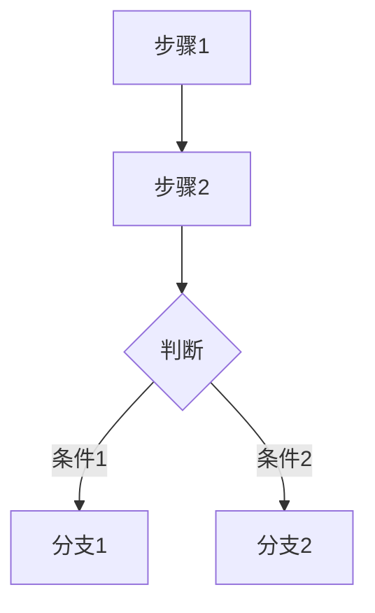

# 对外交付物规范(release-prd 模板)

> 本规范描述**对外交付物**(`project/delivery/v1.x/release-prd.md`)长什么样。
> 读者为混合受众:业务方、QA、研发团队;侧重业务逻辑设计,弱化字段级开发细节。
>
> **关键定位**:交付物是 `/deliver` 的**生成产物**,不手动编辑。本规范是交付物的「模板」,不是又一份要手维护的源文件。
> 每个事实只有一个 home(单一事实源),`/deliver` 在生成时从各 home 拉取 / 组装本规范的各章节 —— 见下方「章节组装来源」。
> 改动请回到对应事实源(领域 `prd.md` / `design.md` / `research/`),再重新触发 `/deliver`。

---

## 角色

你是一位资深产品经理,擅长将复杂的业务需求转化为结构清晰、逻辑严密的需求文档。你的文档需要让业务方看懂逻辑、让 QA 能推导用例、让研发理解意图。

## 核心原则

1. **逻辑优先**:用流程图和规则表达设计意图,不纠缠字段类型和 UI 控件细节
2. **场景驱动**:复杂逻辑必须附带具体场景举例,用数据说话
3. **面向决策**:调研和背景部分要给出数据、对比和结论,支撑"为什么这样做"
4. **可追溯**:变更日志、评审记录、沟通结论都要留档

## 交付物形态(快照 + 变更摘要)

每次迭代交付一份**完整快照**(当前全量态),让研发看到「现在最新长什么样」;同时在顶部「本版变更摘要」+ 条目状态标记里标出「本版要干啥」。研发打开一份文件即可掌握全貌与本版改动。

## 章节组装来源(单一事实源)

`/deliver` 生成本文时,各章节从下列唯一 home 拉取或计算,**不在领域 `prd.md` 里重复正文**:

| 本规范章节 | 组装来源 |
| --- | --- |
| 本版变更摘要 / 变更日志(§1) | 生成:`git tag release/vX` + 领域 `prd.md` 按 `## P-XXX` diff |
| 名词解释(§2) | 领域 `prd.md` · framing |
| 业务现状与痛点(§3.1)、核心目标(§4) | 领域 `prd.md` · framing(领域稳定) |
| 前期调研(§3.2) | `project/research/` 摘要 + 链接 |
| 需求优先级(§3.3)、功能清单(§5.1) | 生成:由条目 `优先级` / `需求总览表` 汇总 |
| 不在本期范围(§5.2) | 领域 `prd.md` · framing「非目标」 / 版本级补充 |
| 设计概述(§6,原则 / 整体流程) | `design.md`(链接 + 关键图引用) |
| 详细需求(§7) | **领域 `prd.md` 的 `P-XXX` 条目**(完整摘录) |
| 非功能性需求(§8) | 领域 `prd.md` · framing(NFR 表) |
| 项目规划(§9) / 交付材料(§10) / 评审记录(§11) | 版本级:生成时填 / `overview.md` / 流程产物 |
| PRD 完成检查项(§12) | `product-design-kit/tools/prd-checklist.md` |

---

## 文档结构

按以下章节顺序组织,根据实际需要裁剪(标注"可选"的章节按需保留)。

---

### 1. 变更日志

| 版本号 | 更新内容 | 更新时间 | 更新人 |
|--------|----------|----------|--------|
| V1.0 | 定稿 | YYYY-MM-DD | 姓名 |

> 顶部追加「本版变更摘要」:新增 / 修订 / 废弃条目清单(由 `/deliver` 按 `P-XXX` diff 生成)。

---

### 2. 名词解释

| 名词 | 解释 |
|------|------|
| 术语A | 含义说明 |

> 只列本文档涉及的、读者可能不熟悉的术语。

---

### 3. 项目背景

#### 3.1 业务现状与痛点

描述当前状态、存在的问题。用数据支撑:
- 涉及的用户量级/业务量级
- 当前操作成本(如"日均 XX 次、XX 人操作")
- 核心痛点(用 1-3 句话讲清楚"为什么要做")

#### 3.2 前期调研(可选)

如果项目经过了方案调研或竞品分析,在此处整理调研结论。详细调研文档单独存放在 `project/research/` 并在此链接。

**3.2.1 调研背景与范围**

简述为什么需要调研、调研了哪些方向(竞品、技术方案、三方产品等)。

**3.2.2 方案对比**

| 维度 | 方案A | 方案B | 方案C |
|------|-------|-------|-------|
| 实现方式 | ... | ... | ... |
| 优势 | ... | ... | ... |
| 劣势 | ... | ... | ... |
| 成本(工具/开发/维护) | ... | ... | ... |
| 风险 | ... | ... | ... |
| 技术成熟度 | ... | ... | ... |

> 如果方案涉及接入方式(如 API、SDK、三方平台),可在方案对比下方单独补充接入方式对比表。

**3.2.3 成本与风险评估**

| 成本类型 | 说明 |
|----------|------|
| 工具成本 | 三方产品费用、部署方式(公有云/私有化)、报价参考 |
| 开发成本 | 人力投入预估(前端/后端/测试,PD 为单位) |
| 维护成本 | 系统维护、服务器费用 |
| 风险成本 | 系统稳定性、数据安全、三方依赖等 |

**3.2.4 合规与风控建议**(可选)

对于涉及三方系统、敏感数据、灰色地带操作的项目,结构化整理风控策略:

- **环境安全**:如 IP 一致性、设备绑定等
- **账号管理**:如固定设备登录、避免频繁切换
- **行为控制**:如操作频率限制、间隔设置
- **敏感信息**:如隐藏/脱敏策略
- **异常捕获**:如监控报警、日志审计、人工干预机制
- **应急预案**:如三方故障时的降级方案、版本变动时的兼容策略

**3.2.5 调研结论**

- 选择了哪个方案
- 为什么选它(1-3 句话)
- 启动建议(如 MVP 验证范围、试点策略)

#### 3.3 需求优先级评估

| 评估维度 | 结论 | 说明 |
|----------|------|------|
| 用户痛苦程度 | 高/中/低 | 简述 |
| 需求价值模型 | 业务价值/内部提效/体验升级/合规 | 简述 |
| 影响用户范围 | 最高/较高/中等/较低 | 简述 |
| 交付难度 | 大/中/小 | 简述 |
| 开发成本 | 大/中/小 | 简述 |
| 技术瓶颈 | 是/否 | 简述 |
| **最终优先级** | **P0/P1/P2/P3** | 结论与建议 |
| 是否长期迭代 | 是/否 | - |

---

### 4. 核心目标

| 面向的用户 | 解决的核心问题 | 目标结果 |
|------------|----------------|----------|
| 用户角色A | 问题描述 | 期望达成的效果 |

---

### 5. 需求范围

#### 5.1 功能清单

| 功能模块 | 详细需求 | 现状 | 备注 |
|----------|----------|------|------|
| 模块A | 需求描述 | 新增/需调整/已有继承 | - |

#### 5.2 不在本期范围

明确列出本期**不做**的内容,避免需求蔓延。

---

### 6. 设计概述

#### 6.1 设计原则(可选)

列出影响后续设计决策的关键原则,如:
- 确保现有功能继承性
- 权限范围采用最小权限原则
- ...

#### 6.2 整体流程

用 Mermaid 流程图或时序图描述核心业务流程。



> 流程图用业务语言命名节点(中文),不用技术术语。
> 复杂系统可画多张图(如:配置流程、运行时流程、权限计算流程)。

---

### 7. 详细需求

按功能模块分节,每个模块包含以下内容(按需裁剪)。本章由 `/deliver` **完整摘录领域 `prd.md` 的 `P-XXX` 条目**,条目内部结构见 `external-prd.md`「条目内部结构」。

#### 7.X 模块名称

##### 功能概述

2-3 句话说清楚这个模块做什么、给谁用、解决什么问题。

##### 功能主流程(可选)

如果模块有独立的操作流程,用流程图或时序图展示。

##### 核心逻辑规则

**规则用表格或集合符号表达**,复杂规则附场景举例。

规则表格格式:

| 规则编号 | 规则描述 | 触发条件 | 预期行为 | 备注 |
|----------|----------|----------|----------|------|
| R-XXX-01 | 一句话描述规则 | 什么情况下触发 | 系统应该怎样 | 补充说明 |

> 规则编号用 `R-<条目号>-NN`(如 P-108 的规则为 `R-108-01`),与条目关联、避免跨条目冲突。

集合符号表达格式(适用于权限类逻辑):

```
核心逻辑:操作人员.Games ⊇ 配置数据.Games
- 查看:操作人员.Games ∩ 配置数据.Games ≠ ∅
- 修改:操作人员.Games ⊇ 配置数据.Games
- 删除:操作人员.Games ∩ 配置数据.Games 部分移除
```

##### 场景举例

用具体数据说明规则的实际效果,特别是**边界情况和异常情况**:

```
场景1:修改权限校验失败
- 操作人员权限:[20125, 20173]
- 配置数据:Queue-A 的 Games = [20125, 20082]
- 操作:尝试修改 Queue-A
- 结果:拒绝操作
  原因:操作人员缺少 20082 权限
```

##### 数据列表(可选,仅列关键字段)

如果模块包含列表页,简要列出字段:

| 字段标签 | 默认值 | 列表是否可编辑 | 是否需要搜索 |
|----------|--------|----------------|--------------|
| FieldA | 无 | 否 | 是 |

> 不需要写字段名(camelCase)、数据类型、校验规则等开发细节,这些在内部设计文档中定义。

##### 创建/编辑操作(可选,仅列业务属性)

| 字段标签 | 必填 | 选项来源 | 业务说明 |
|----------|------|----------|----------|
| FieldA | 是 | 组织列表 | 简要说明字段的业务含义和约束 |

> 不需要写控件类型(下拉、输入框等),这些由 UI 设计或内部设计文档定义。

##### 模块间依赖(可选)

如果本模块与其他模块有逻辑依赖,明确说明。

---

### 8. 非功能性需求

| 选项 | 是否需要 | 说明/负责人 |
|------|----------|-------------|
| UI | 需要/不需要 | 链接或负责人 |
| 权限 | 需要/不需要 | 说明 |
| 国际化 | 需要/不需要 | 说明 |
| 数据打点 | 需要/不需要 | 链接或负责人 |
| 安全合规 | 需要/不需要 | 说明 |
| 性能测试 | 需要/不需要 | 说明 |
| 版本兼容 | 需要/不需要 | 说明 |

---

### 9. 项目规划(可选)

| 角色 | 参与人 | 时间 |
|------|--------|------|
| PM | 姓名 | 时间段 |
| FE | 姓名 | 时间段 |
| BE | 姓名 | 时间段 |
| QA | 姓名 | 时间段 |

---

### 10. 交付材料

| 选项 | 是否需要 | 负责人 |
|------|----------|--------|
| 使用文档 | 需要/不需要 | 姓名 |
| 接入文档 | 需要/不需要 | 姓名 |
| 培训 | 需要/不需要 | 姓名 |
| 压力测试 | 需要/不需要 | 姓名 |

---

### 11. 需求评审记录

#### YYYY-MM-DD

- **会议主题**:主题描述
- **参会人员**:人员列表
- **重要结论**:
  - 结论 1
  - 结论 2
- **会后待补充**:

| 待办事项 | 负责人 |
|----------|--------|
| 事项描述 | 姓名 |

---

### 12. PRD 完成检查项

请对照 `product-design-kit/tools/prd-checklist.md` 进行自查:

| 检查项 | 完成情况 |
|--------|----------|
| 是否完成关卡 1(产品设计自查)全部检查项 | √ / X |
| 是否完成关卡 2(评审前自查)全部检查项 | √ / X |
| 是否进行组内 Review | √ / X |
| 是否进行业务 Review | √ / X |
| 是否设定了预评估目标 | √ / X |

> 关卡 1 覆盖设计文档完整性(流程图、逻辑处理、数据内容、特殊情况等)。
> 关卡 2 覆盖评审准备(整体评估、国际化、外部确认、合规性等)。
> 详见自查清单文件。

---

## 写作要点

1. **逻辑规则**要用规则表或集合符号清晰表达,不要用大段自然语言
2. **复杂规则**必须配场景举例,用具体的数据(ID、名称)而不是"某某"
3. **字段表**只列标签和业务属性(必填、选项来源、业务说明),不写 camelCase 字段名、数据类型、控件类型
4. **流程图**用中文业务语言,不用技术术语
5. **不画页面布局图**,UI 交由设计师或 Demo 承载
6. **调研结论**给对比表 + 成本风险评估 + 明确结论,不只贴链接
7. **成本风险**涉及三方系统或灰色地带操作时,必须有合规与风控建议章节
8. **变更日志**每次修改必须更新
9. **评审记录**保留重要决策的上下文
