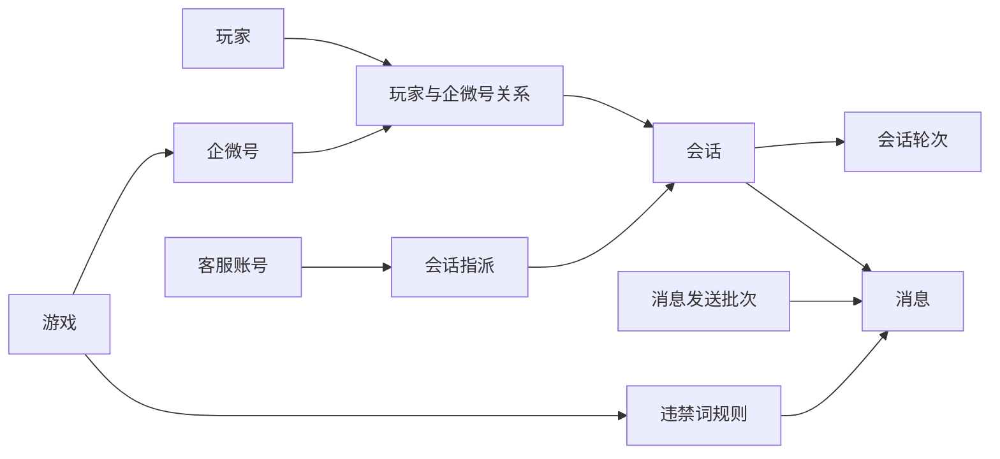
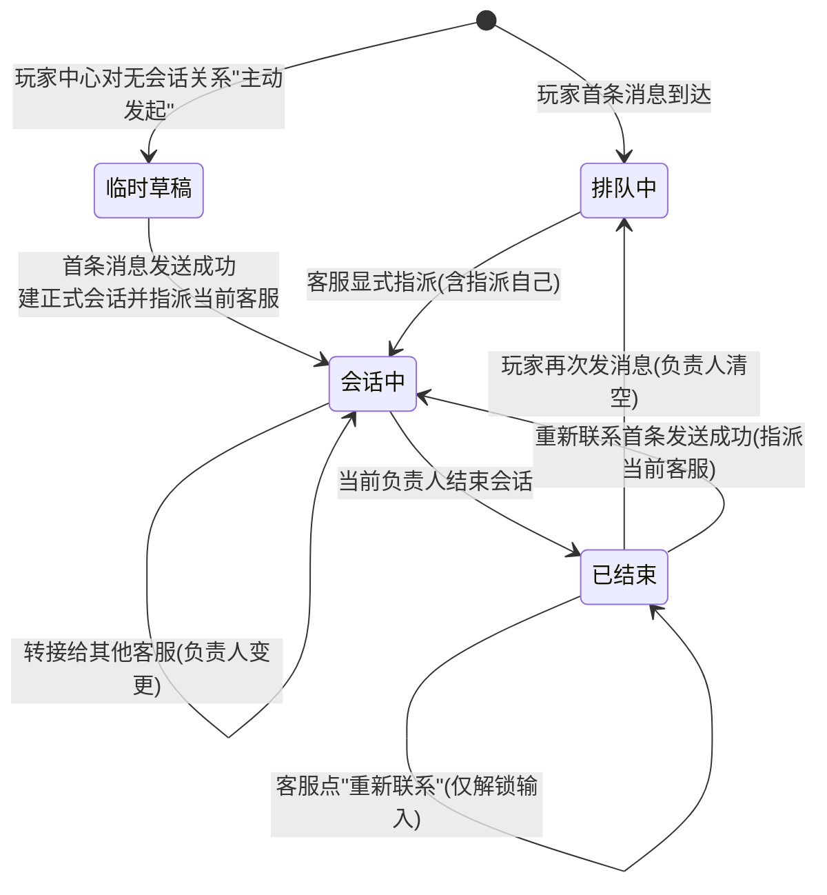
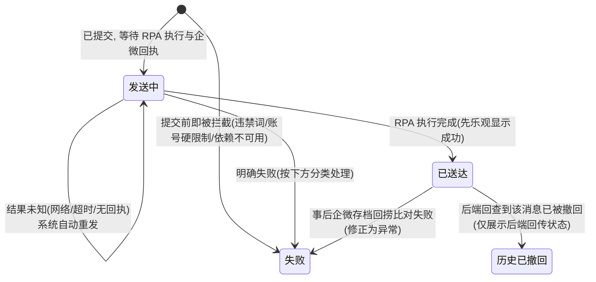
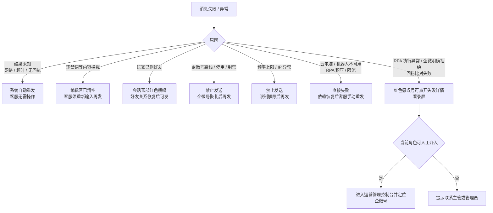
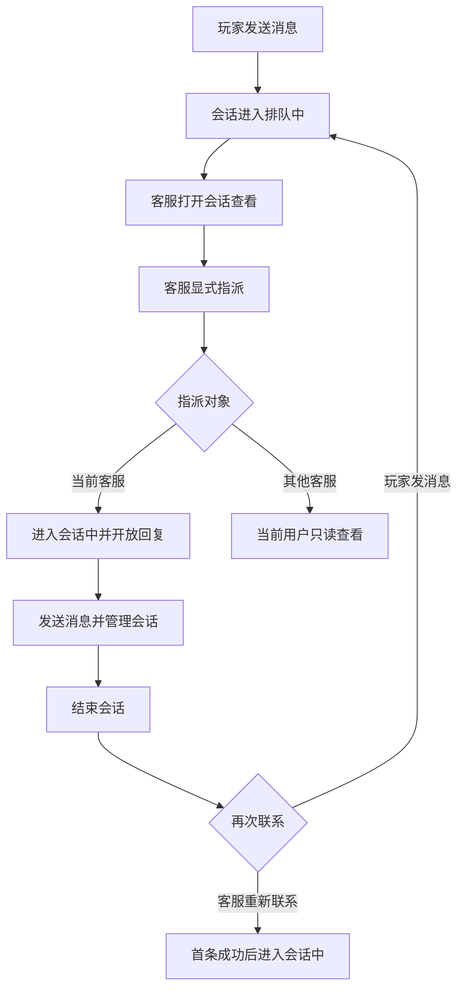
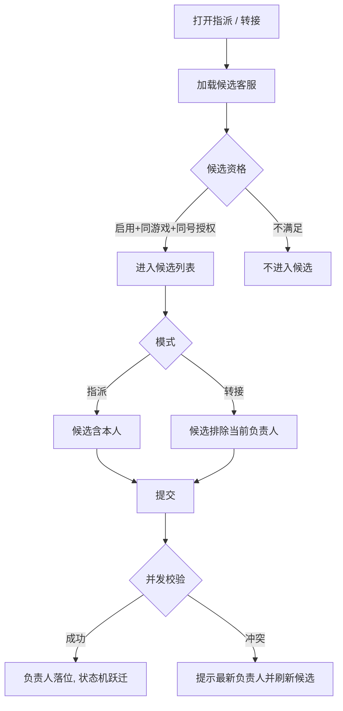
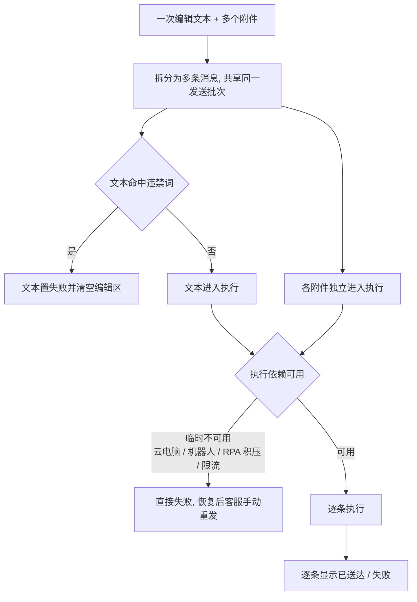
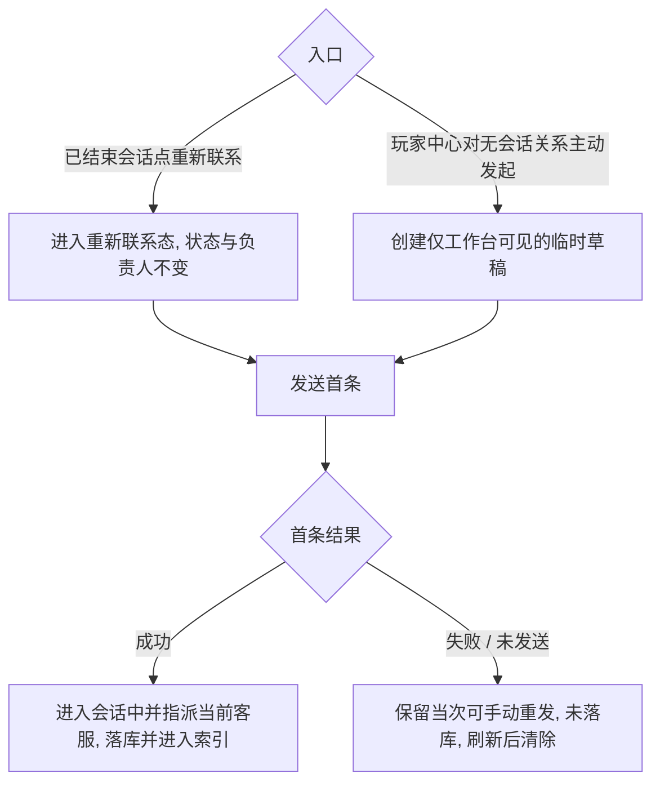

# ChatFlow 客服工作台长期对外交付 PRD

> **生成产物，请勿直接编辑。**
>
> 当前业务事实源为 [`../design.md`](../design.md)。本文由该设计文档去除工程实现、原型状态与视觉细节后，以业务语言生成，面向业务、研发与测试持续提供最新有效需求。历史编号与变更原因参考 [`../decisions.md`](../decisions.md)，但历史记录不覆盖当前设计。

## 1. 文档说明及来源

| 项目 | 内容 |
| --- | --- |
| 领域 | 客服工作台 |
| 维护状态 | Active，始终反映当前有效设计 |
| 面向读者 | 业务、产品、研发、测试 |
| 需求编号段 | P-101～P-199 |
| 当前事实源 | [`../design.md`](../design.md) |
| 历史追溯 | [`../decisions.md`](../decisions.md) |
| 视觉规范 | [`../../../ui-brand.md`](../../../ui-brand.md) |
| 生成规则 | [`../../../../product-design-kit/design/external-prd.md`](../../../../product-design-kit/design/external-prd.md) |

本文只描述可观察、可验证的产品行为。页面布局、控件样式和完整视觉细节以设计文档为准；版本范围、变更摘要、交付排期和评审记录由版本快照补充。术语约定：**账号级硬限制**指企微号离线 / 停用 / 封禁；**全局硬限制**指 IP 异常、频率上限、违禁词；**临时执行依赖不可用**指云电脑 / 机器人不可用或 RPA 任务积压 / 限流（不等于账号离线）。

## 2. 业务背景与核心目标

VIP 客服需要同时维护多个企微号上的玩家会话。依赖多台设备和多个客户端进行接待，会导致消息分散、负责人不清晰、跨班协作困难，以及发送异常难以定位。

客服工作台需要让客服在统一入口完成：

- 聚合当前有权查看的企微号会话。
- 通过显式指派明确每个会话的当前负责人。
- 接收、发送和追踪不同类型的消息。
- 处理未读、转接、标记、置顶、结束和重新联系。
- 感知企微号、机器人和好友关系状态。
- 在发送失败时查看原因，并按权限进入运营管理控制台处理。

| 面向用户 | 核心问题 | 目标结果 |
| --- | --- | --- |
| 客服 | 多企微号消息分散、容易漏回或重复回复 | 在一个工作台完成授权范围内的会话接待 |
| 运营主管 | 难以协调会话负责人和处理运行异常 | 可在授权范围调度会话并进入人工介入流程 |
| 系统管理员 | 需要跨范围排障但不能影响正常接待 | 可查看全平台会话并从失败详情进入受控运维流程 |

## 3. 角色与权限差异

| 角色 | 可查看范围 | 主要操作 | 明确限制 |
| --- | --- | --- | --- |
| 客服 | 自身获授权企微号下的会话 | 指派给自己、接待本人会话、转接本人会话 | 无控制台入口，不能调度他人会话 |
| 运营主管 | 自身获授权企微号下的会话 | 接待、指派和转接范围内会话、从失败详情发起人工介入 | 不能管理账号、角色或授权 |
| 系统管理员 | 全部有效企微号下的会话 | 全平台会话调度、从失败详情发起人工介入 | 不能绕过封禁、IP 异常、违禁词和频率限制 |

- 所有列表、搜索、深链和操作都必须应用同一权限范围。权限发生变化后，应立即关闭已失去权限的内容并移除相应结果。

## 4. 领域范围及跨领域边界

### 4.1 本领域负责

- 会话聚合、分组、查看、指派、转接和结束。
- 消息接收、发送、逐条结果和失败处理。
- 未读数量、通知、综合搜索和消息记录展示。
- 企微号状态提示、发送限制和失败诊断。
- 已结束会话的重新联系与无历史会话的主动发起临时草稿。

### 4.2 本领域不负责

- 企微号配置、启停、资源绑定和运行状态来源。
- 云电脑投屏、人工接管、扫码登录、退出和重启。
- 客服账号、角色、游戏关联和企微号授权配置。
- 玩家档案、好友关系、备注、描述和标签的维护。
- 智能路由、自动转接、快捷回复、知识库、质检和运营报表。

### 4.3 跨领域协作

| 协作领域 | 向工作台提供 | 工作台的消费方式 | 不可用或异常时 |
| --- | --- | --- | --- |
| 运营管理 | 企微号、机器人、云电脑和风控状态；人工介入能力 | 展示状态、限制发送、跳转并定位对应企微号 | 状态不明确时采用保守限制 |
| 权限管理 | 当前身份、角色、可见企微号和可指派客服 | 过滤会话、搜索结果和操作入口 | 关闭受限内容，不泄露其他数据 |
| 玩家中心 | 玩家档案和好友关系状态 | 展示玩家信息，决定是否允许主动联系 | 好友关系不明确时禁止主动发送 |
| 企业微信消息记录能力 | 玩家消息和历史会话 | 更新消息流、未读和搜索内容 | 显示同步中断，恢复后补齐期间消息 |
| RPA 机器人 | 执行发送并返回逐条结果 | 展示发送中、已送达或失败 | 暂时不可用（含积压 / 限流）直接失败、手动重发；硬性风险直接拒绝 |

## 5. 业务对象与数据关系

| 对象 | 业务关系 | 关键约束 |
| --- | --- | --- |
| 玩家与企微号关系 | 一个玩家可以关联多个企微号 | 每条关系独立维护好友状态和玩家资料 |
| 会话 | 一条玩家与企微号关系对应一个持续会话 | 结束或重新开启时沿用同一会话身份 |
| 会话轮次 | 一个会话可以包含多个接待轮次 | 每次结束形成轮次边界 |
| 指派 | 一个会话在同一时刻最多一个当前负责人 | 未指派的排队会话不能直接回复 |
| 消息 | 一个会话包含多条收发消息 | 每条消息独立记录方向、发送人、时间和结果 |
| 消息发送批次 | 一次提交可包含文本和多个附件 | 每项分别形成消息并独立产生结果 |
| 违禁词规则 | 一个游戏维护一套出站文本规则 | 只影响该游戏所属企微号发出的文本 |

## 6. 核心业务流程与状态机

### 6.1 会话状态机

正式状态只有**排队中 / 会话中 / 已结束**三种，同一时刻只属其一。**临时草稿**与**重新联系态**是仅工作台可见的临时业务态；**"他人接待中"是展示分组**（会话中且负责人非当前用户），不是状态。

> **隐式指派**：临时草稿与重新联系态无需先显式指派即可解锁输入；在首条消息发送成功那一刻，隐式把负责人落定为当前客服。这是 P-109"排队会话须先显式指派"的例外，仅适用于这两条入口。

### 6.2 会话状态转换矩阵

| 原状态       | 触发事件           | 目标状态                         | 负责人变化           | 输入 / 操作资格         | 失败结果                                       | 恢复方式              |
| --------- | -------------- | ---------------------------- | --------------- | ----------------- | ------------------------------------------ | ----------------- |
| （无）       | 玩家首条消息         | 排队中                          | 保持为空            | 需先指派后回复           | —                                          | —                 |
| （无）       | 玩家中心对无会话关系主动发起 | 临时草稿（仅工作台可见，不入 3 态模型 / 外部索引） | 不写入（延迟到首条成功才指派） | 可编辑首条             | —                                          | —                 |
| 临时草稿      | 首条成功           | 会话中                          | 指派当前客服          | 开放回复              | 首条失败 / 未发送→未落库、刷新清除                        | 失败在草稿内手动重发       |
| 排队中       | 客服显式指派（含自己）    | 会话中                          | 落位所选客服          | 指派给自己后开放回复        | 并发冲突以最终一个为准                                | 刷新候选后重指派          |
| 会话中       | 转接             | 会话中（不变）                      | 由 A 变 B         | 原负责人失去、新负责人获得     | 无合格候选禁止提交                                  | 重新选择候选            |
| 会话中       | 当前负责人结束        | 已结束                          | 保留历史负责人         | 默认只读              | 结束失败保持原状态                                  | 重试结束              |
| 已结束       | 玩家再次发消息        | 排队中                          | 清空              | 需重新指派             | —                                          | —                 |
| 已结束       | 客服点"重新联系"      | 已结束（不变）                      | 不写入             | 解锁输入，等待首条         | 账号 / 全局硬限制或关系异常时禁用入口                       | 限制解除后重试           |
| 已结束       | 重新联系首条成功       | 会话中                          | 指派当前客服          | 开放回复              | 首条失败仍停留已结束                                 | 在重新联系态内手动重发      |
| **不发生跃迁** | 仅点击查看会话        | 原状态                          | 不变              | 依原状态判定            | —                                          | —                 |
| **不发生跃迁** | 消息发送失败         | 原状态                          | 不变              | 不变                | 失败项单独标红                                    | 重发或人工介入           |
| **不发生跃迁** | 好友关系异常（删好友）    | 原状态                          | 不变              | 锁定发送、清空草稿、取消临时联系态 | —                                          | 关系恢复后解锁           |
| **不发生跃迁** | 账号离线 / 停用 / 封禁 | 原状态                          | 不变              | 禁止发送与重新联系         | —                                          | —                 |

### 6.3 消息结果状态与失败处理

一条消息发出后，客服会在消息角标上看到它的结果状态；失败时按原因决定“系统会不会自动重发、客服要不要重发”。

#### (1) 消息结果状态（客服在每条消息上看到的角标）

| 状态 | 客服看到 | 含义 | 客服要做什么 |
| --- | --- | --- | --- |
| 发送中 | 发送中角标 | 已提交，等待 RPA 执行结果（结果未知时系统自动重发同一条） | 无需操作 |
| 已送达 | 已送达角标 | RPA 执行完成，先乐观显示成功（随后经企微存档回捞比对核实） | 无需操作 |
| 失败 | 红色感叹号 | 发送失败，原因见下方分类 | 视原因处理（见下） |
| 历史已撤回 | “消息已撤回”占位 | 后端回查到该历史消息已撤回（V1 仅展示，不提供撤回操作） | 无需操作 |

> **RPA 执行完成先乐观显示「已送达」，再回捞比对核实**：RPA 在云桌面完成发送动作后消息**立即标为「已送达」**；系统随后从**企微会话存档回捞**该消息与本次发送内容比对，**只有回捞不到 / 比对不一致（超时窗内）才把「已送达」修正为失败**（见下方「回捞比对失败」），比对通过则维持已送达。
> **没有“待发送”状态**：发送前的临时执行依赖不可用（云电脑 / 机器人 / RPA 积压 / 限流）等价于“没发出去”，直接置**失败**，由客服在依赖恢复后手动重发；系统不排队自动重发。
> 系统只在“结果未知”（网络异常 / 超时 / 无回执，消息已提交但没拿到回执）时自动重发同一条消息，并保证**不会重复发给玩家**；客服手动重发则是**新发一条消息**，不是让失败的这条“复活”。

#### (2) 失败与异常按原因分类 → 客服如何处理与人工介入

- **回捞比对失败**（消息已乐观显示「已送达」，但企微会话存档在超时窗内回捞不到该消息或内容比对不一致）时，把该消息**从「已送达」修正为失败**并提示异常：可点开失败详情核对（含录屏），**不自动重发**（RPA 已执行，重发有重复送达风险），交由客服判断或有权限者人工介入。
- **有明确原因的失败不会自动重发**，需按上图分类处理；客服手动重发算新发一条，系统保证不会重复送达。
- **可诊断类失败（RPA / 客户端 / 云电脑异常、企微明确拒绝、回捞比对失败）** 可打开失败详情查看录屏；系统管理员 / 运营主管可据此进入运营管理控制台并定位企微号，其余角色提示联系主管或管理员。**好友关系异常**在会话展示关系警示并锁定发送；违禁词 / 频率等业务限制仅展示业务原因。
- 违禁词等内容拦截在提交时就失败。
- 一次提交里部分成功、部分失败时，成功的不受影响；任何重发都不改变会话的状态和负责人。

### 6.4 会话接入流程

### 6.5 指派与转接流程

### 6.6 混合消息逐条发送流程

### 6.7 已结束重新联系与无历史主动发起流程

## 7. 需求总览

| ID | 需求 | 模块 | 优先级 | 状态 |
| --- | --- | --- | --- | --- |
| P-102 | 工作台按企微号筛选 | 会话接待 | P1 | 有效，修订@v1.0 |
| P-103 | 企微号状态感知与告警 | 状态与告警 | P0 | 有效，修订@v1.0 |
| P-104 | 消息接收 | 消息接收 | P0 | 有效，修订@v1.0 |
| P-105 | 未读消息数量 | 消息接收 | P1 | 有效，修订@v1.0 |
| P-106 | 未读消息通知 | 消息接收 | P2 | 有效，修订@v1.0 |
| P-107 | 多号会话聚合视图 | 会话接待 | P0 | 有效，修订@v1.0 |
| P-108 | 会话分组与状态机 | 会话接待 | P0 | 有效，修订@v1.0 |
| P-109 | 显式会话指派 | 会话协作 | P0 | 有效，修订@v1.0 |
| P-110 | 会话标记 | 会话协作 | P2 | 有效，修订@v1.0 |
| P-111 | 会话置顶 | 会话协作 | P2 | 有效 |
| P-112 | 会话转接 | 会话协作 | P1 | 有效，修订@v1.0 |
| P-113 | 结束会话 | 会话协作 | P1 | 有效，修订@v1.0 |
| P-114 | 消息编辑与发送 | 消息发送 | P0 | 有效，修订@v1.0 |
| P-115 | 发送结果与失败处理 | 消息发送 | P0 | 有效，修订@v1.0 |
| P-116 | 发送失败诊断与介入 | 失败处理 | P0 | 有效，修订@v1.0 |
| P-118 | 违禁词拦截 | 合规 | P0 | 有效，修订@v1.0 |
| P-119 | 综合搜索 | 会话辅助 | P1 | 有效，修订@v1.0 |
| P-120 | 已结束会话重新联系与主动发起 | 会话协作 | P0 | 有效，修订@v1.0 |
| P-122 | 消息记录展示口径 | 消息展示 | P1 | 有效，修订@v1.0 |

## 8. 按稳定 P 编号组织的详细需求

---

## P-102 工作台按企微号筛选

**状态**：有效，新增@v1.0；修订@v1.0
**模块**：会话接待
**优先级**：P1
**来源**：R019、R024

### 业务目的与适用角色

所有接待角色可在自身可见范围内按一个或多个企微号筛选会话，以便在聚合接待和单号处理之间切换。默认聚合全部有权企微号（等同不筛选）。

### 核心业务规则

| 规则编号     | 触发条件             | 预期行为                          | 备注         |
| -------- | ---------------- | ----------------------------- | ---------- |
| R-102-02 | 用户调整工作台企微号筛选     | 只展示选中且有权访问的企微号会话              | 支持多选       |
| R-102-03 | 用户首次进入或选择全部企微号   | 聚合展示全部有权企微号会话                 | 全选等同于不筛选   |
| R-102-04 | 取消当前打开会话所属企微号的勾选 | 关闭当前会话内容并返回未选择状态              | 不弹二次确认     |
| R-102-05 | 全部取消勾选           | 会话列表为空并给出明确空态                 | 提示当前未勾选任何号 |

### 动作—反馈—结果

| 用户动作 | 即时反馈 / 处理中 | 成功结果 | 失败结果 |
| --- | --- | --- | --- |
| 打开号筛选面板 | 展示各号勾选态与在线 / 离线 / 封禁标识 | 面板可多选 | — |
| 勾选 / 取消部分号 | 筛选按钮高亮并显示已选数量角标 | 列表按所选号收敛 | — |
| 全选 / 全不选 | 全选恢复默认无角标；全不选列表空 | 见 R-102-03 / R-102-05 | — |

### 页面元素与状态

见第 9 章号筛选相关行与判定矩阵。

### 跨领域依赖

- 权限管理提供 `可见企微号集合`；运营管理提供各号在线状态。

### 验收矩阵

| 场景         | 期望结果                 |
| ---------- | -------------------- |
| 权限外企微号     | 不出现在筛选候选、列表、搜索或定位结果中 |
| 取消一个号      | 不影响其他已选号会话           |
| 当前会话所属号被取消 | 立即关闭当前会话内容，回到未选择态    |

---

## P-103 企微号状态感知与告警

**状态**：有效，新增@v1.0；修订@v1.0
**模块**：状态与告警
**优先级**：P0
**来源**：R020

### 业务目的与适用角色

让全部接待角色随时感知所依赖的企微号能否正常收发。工作台只**消费**运营管理推送的企微号运行状态：把状态呈现给客服，并据此在前端拦截或直接置失败发送；工作台本身不管理状态，也不提供企微号的登录、退出、投屏、接管或重启（这些归运营管理 / ops-admin）。

### 状态口径

企微号运行状态取值统一为 **在线 / 离线 / 停用 / 封禁**。状态由运营管理提供并实时推送（≤10 秒可见），工作台只读消费、不修改。

### 状态如何呈现（三处）

- **全局告警（顶栏）**：任一可见企微号异常时，顶栏通知铃出现红点，hover 查看最近若干条，点击展开通知中心；封禁 / 离线等强告警在顶部横幅持续显示，直到运营管理处理。
- **号筛选面板**：每个企微号旁显示状态点与离线 / 封禁标识。
- **当前会话**：打开的会话所属企微号异常时，输入区禁用并在会话内说明原因与下一步（文案见 9.4）。

### 状态如何影响发送

- **离线 / 停用 / 封禁 = 账号级硬限制**：禁止该号下所有会话的普通发送，也禁止已结束会话的"重新联系"；前端拦在按钮并直接置失败，任何角色不能绕过。账号恢复在线后重新判断资格，但不自动指派或重开会话。
- **临时执行依赖不可用**（云电脑 / 机器人不可用或 RPA 积压 / 限流，≠ 账号离线）：合规消息直接置失败，依赖恢复后由客服手动重发，系统不排队自动重试。
- **状态未知**：采用保守限制，不把未知状态显示为正常。

### 核心业务规则

| 规则编号     | 触发条件                      | 预期行为                                                       | 备注              |
| -------- | ------------------------- | ---------------------------------------------------------- | --------------- |
| R-103-01 | 企微号状态变为在线 / 离线 / 停用 / 封禁  | 更新顶栏告警、号筛选标识与该号所有会话的发送可用性                                  | 状态来源归运营管理       |
| R-103-02 | 任一可见企微号出现异常               | 顶栏出现全局告警（红点 + 通知中心；封禁 / 离线类顶部横幅持续显示）；当前会话展示与本次接待直接相关的状态与影响 | 详细监控与处置归运营管理    |
| R-103-03 | 账号离线 / 停用 / 封禁            | 该号下所有会话禁止普通发送与已结束会话"重新联系"，前端拦截直接失败                         | 账号级硬限制，任何角色不能绕过 |
| R-103-04 | 云电脑 / 机器人不可用或 RPA 积压 / 限流 | 合规消息直接失败（不视为账号离线），依赖恢复后客服手动重发                              | 系统不自动排队重试       |
| R-103-05 | 账号从异常恢复在线                 | 重新判断该号发送与重新联系资格                                            | 不自动改变会话负责人或重开会话 |
| R-103-06 | 状态来源不明确 / 暂时无法确认          | 采用保守限制并提示未确认，不显示为正常                                        | 文案见 9.4         |

### 页面与交互

- 状态异常时在对应位置说明影响和可采取的下一步（见 9.4 文案族）。
- 系统管理员或运营主管可从符合条件的失败详情进入运营管理控制台并定位对应企微号；客服只查看状态及失败原因。
- 工作台不提供企微号的登录、退出、投屏、接管或重启操作。

### 边界与异常

- 状态来源不明确时采用保守限制，不把未知状态显示为正常（文案：`当前状态暂时无法确认，操作已被限制`）。

### 跨领域依赖

- 运营管理：企微号运行状态、机器人 / 云电脑可用性、风控结果，以及企微号的详细监控与处置。

### 验收矩阵

| 场景 | 期望结果 |
| --- | --- |
| 企微号离线 / 停用 / 封禁 | 该号所有会话发送与重新联系禁用、提示原因、直接失败；顶栏告警出现 |
| 机器人 / 云电脑暂时不可用（含积压 / 限流） | 合规消息直接失败，恢复后客服手动重发，不排队 |
| 账号从异常恢复在线 | 重新开放该号发送 / 重新联系资格，会话负责人不变 |
| 状态未知 | 采用保守限制并提示状态未确认 |
| 状态变更 | 顶栏告警、号筛选标识与会话发送可用性在 10 秒内更新 |

---

## P-104 消息接收

**状态**：有效，新增@v1.0；修订@v1.0
**模块**：消息接收
**优先级**：P0
**来源**：R021

### 业务目的与适用角色

接待角色需要持续收到授权范围内的玩家消息，并在会话中查看完整上下文。

### 核心业务规则

| 规则编号     | 触发条件     | 预期行为                                          |
| -------- | -------- | --------------------------------------------- |
| R-104-01 | 玩家消息到达   | 归入正确企微号、玩家关系和会话，并对有权限用户可见                     |
| R-104-02 | 玩家发送文本内容 | 完整展示原文，不做出站违禁词拦截                              |
| R-104-03 | 收到不同消息类型 | 正常展示文本、图片、视频、文件、链接和系统表情；*【类型待定，需要调研其他消息类型做回显】 |

### 页面与交互

- 首次加载失败时保留页面上下文并提供重试。

### 边界与异常

- 网络异常/API接口异常等导致消息中断时顶部提示重连（`实时消息暂时不可用，正在重连…`），期间已加载内容继续可读，恢复后顺序正确。

### 跨领域依赖

- 企业微信消息记录能力提供玩家消息与历史。

### 验收矩阵

| 场景      | 期望结果            |
| ------- | --------------- |
| 权限外消息   | 不出现在会话、通知或搜索结果中 |
| 重复推送同一条 | 不重复展示           |
| 消息中断后恢复 | 期间消息补齐且顺序正确     |
| 各类型消息   | 均可正常显示          |

---

## P-105 未读消息数量

**状态**：有效，新增@v1.0；修订@v1.0
**模块**：消息接收
**优先级**：P1
**来源**：R022

### 业务目的与适用角色

按当前客服的个人视角展示会话未读数量，帮助客服不漏回。已读 / 未读从两个维度定义：**权限维度**——已读是当前客服维护的个人视角，各客服相互独立，不影响他人未读；**展示维度**——未读徽章只在与当前客服接待相关的会话卡上出现（见 R-105-05）。

### 核心业务规则

| 规则编号 | 触发条件 | 预期行为 | 备注 |
| --- | --- | --- | --- |
| R-105-01 | 会话存在当前客服未读的玩家消息 | 会话卡展示该会话未读数量 | 只统计当前客服未读，不影响其他客服 |
| R-105-03 | 未读数量超过 99 | 显示"99+" | 实际数量仍需正确维护 |
| R-105-04 | 玩家消息在前台、目标会话已打开且该消息实际可见 | 才对当前客服标记已读并扣减未读 | 仅打开但消息在未加载 / 未滚动到的历史轮次中不算已读 |
| R-105-05 | 判断是否在会话卡展示未读徽章 | 仅在 **排队中** 与 **当前客服负责（会话中本人 / 重新联系态）** 的会话卡展示；**他人接待中不展示** | 已结束会话收到新消息会回落排队中，故已结束卡不承载未读 |

### 页面与交互

- 置顶、筛选和分组变化不得丢失未读数量。
- **权限维度**：已读为当前客服维护的个人视角，不影响其他客服未读。
- **展示维度**：未读徽章仅出现在排队中与本人负责的会话卡；他人接待中的会话不展示未读，以减少干扰。

### 边界与验收

| 场景              | 期望结果         |
| --------------- | ------------ |
| 打开会话但消息在未展开历史轮次 | 该消息不标已读      |
| 消息滚动到可见         | 标已读并扣减未读     |
| 他人接待中的会话        | 不展示未读徽章      |
| 同一客服多页面打开同账号     | 未读状态保持一致     |
| 权限撤销            | 不再展示对应会话未读信息 |

---

## P-106 未读消息通知

**状态**：有效，新增@v1.0；修订@v1.0
**模块**：消息接收
**优先级**：P2
**来源**：R023

### 核心业务规则

| 规则编号     | 触发条件        | 预期行为         | 备注  |
| -------- | ----------- | ------------ | --- |
| R-106-01 | 排队中或当前客服负责的可见会话收到新玩家消息 | 通过页面红点提醒当前客服 | 与未读徽章展示范围一致（见 R-105-05）；他人接待中不提醒 |

### 边界与验收

| 场景    | 期望结果         |
| ----- | ------------ |
| 同一条消息 | 不造成重复系统通知    |

---

## P-107 多号会话聚合视图

**状态**：有效，新增@v1.0；修订@v1.0
**模块**：会话接待
**优先级**：P0
**来源**：R024

### 核心业务规则

| 规则编号 | 触发条件 | 预期行为 | 备注 |
| --- | --- | --- | --- |
| R-107-01 | 用户进入工作台 | 默认聚合全部有权企微号会话 | 不强制先选择企微号 |
| R-107-02 | 用户需要缩小范围 | 通过P-102按企微号筛选 | 会话卡保持简洁 |
| R-107-03 | 任何会话进入列表或搜索结果 | 必须属于当前用户可见范围 | 直接定位同样适用 |

### 页面与交互

- 一个会话对应一条「玩家↔企微号关系」，本就归属单一企微号；**每个会话在聚合视图中只渲染一次，重复推送不重复展示**。同一玩家若关联多个企微号，则是多个相互独立的会话，各自作为独立卡片展示。

### 边界与验收

| 场景 | 期望结果 |
| --- | --- |
| 无会话 | 展示等待玩家消息的空态 |
| 权限变化 | 当前列表、搜索和打开内容同步收敛 |
| 同一玩家关联多个企微号 | 显示为多个相互独立的会话，各自出现一次 |
| 同一会话被重复推送 | 聚合视图不重复渲染，只保留一条 |

---

## P-108 会话分组与状态机

**状态**：有效，新增@v1.0；修订@v1.0
**模块**：会话接待
**优先级**：P0
**来源**：R028

### 业务目的与适用角色

以稳定的状态机与展示分组，保证同一会话同一时刻只有一个负责人，避免多人同回。状态机与转换见第 6 章。

### 核心业务规则

| 规则编号 | 触发条件 | 预期行为 | 备注 |
| --- | --- | --- | --- |
| R-108-01 | 任意时刻 | 会话只处于排队中、会话中或已结束之一 | "他人接待中"是展示分组 |
| R-108-02 | 展示分组 | 顺序固定为排队中、会话中、他人接待中、已结束 | 后两组默认折叠 |
| R-108-03 | 玩家首次发消息 | 会话进入排队中，当前负责人为空 | 等待显式指派 |
| R-108-04 | 排队会话指派成功 | 会话进入会话中 | 指派给当前客服后可回复 |
| R-108-05 | 会话转接 | 会话保持会话中，只变更负责人 | 玩家无感 |
| R-108-06 | 当前负责人结束会话 | 会话进入已结束 | 保留历史负责人 |
| R-108-07 | 已结束后玩家再次发消息 | 会话返回排队中并清空负责人 | 需要重新指派 |
| R-108-08 | 已结束会话重新联系首条成功 | 会话进入会话中并指派当前客服 | 失败不跃迁 |
| R-108-09 | 同一企微号与玩家再次开启接待 | 沿用同一会话身份并形成新轮次 | 历史持续可查 |
| R-108-10 | 会话被查看但未发生业务动作 | 不改变状态和负责人 | 不按时间自动结束 |
| R-108-11 | 展示进行中会话 | 指派给当前客服的进入"会话中"；指派给他人的进入"他人接待中" | 他人会话默认只读 |

### 场景举例

玩家首次发消息后，会话进入排队中。客服甲只打开查看时状态不变；客服甲指派给自己后进入会话中。会话结束后，玩家再次发消息，会话回到排队中并等待新的指派。

### 边界与验收

| 场景 | 期望结果 |
| --- | --- |
| 消息发送失败 | 不改变会话状态或负责人 |
| 好友关系异常 | 锁定发送但不伪造新会话状态 |
| 多人同时操作 | 只接受一个最终状态，其他用户看到最新结果 |

---

## P-109 显式会话指派

**状态**：有效，新增@v1.0；修订@v1.0
**模块**：会话协作
**优先级**：P0
**来源**：领域闭环追加

### 业务目的与适用角色

禁止隐式指派：排队会话必须先显式指派（可指派给自己）才能回复。**例外**：已结束会话的"重新联系"、以及从玩家中心对无历史关系的"主动发起"，无需先显式指派即可解锁输入框，其首条消息**发送成功后隐式指派给当前客服**（见 P-120）。

### 核心业务规则

| 规则编号     | 触发条件       | 预期行为               | 备注           |
| -------- | ---------- | ------------------ | ------------ |
| R-109-01 | 排队会话选择目标客服 | 更新负责人并进入会话中        | 可以选择当前客服     |
| R-109-02 | 打开未指派会话    | 只读查看并提示先指派，不展示回复区  |              |
| R-109-03 | 任意时刻       | 一个会话最多一个当前负责人      | 负责人为空即排队中    |
| R-109-04 | 当前用户不是负责人  | 只读查看，不能发送、标记、置顶或结束 | 主管和管理员仍可重新调度 |
| R-109-05 | 仅点击会话卡     | 打开内容，不改变负责人或分组     | 查看不是接入       |
| R-109-06 | 已指派会话发送失败  | 保持负责人和会话状态不变       | 失败单独处理       |

### 页面与交互

- 指派模式：指派给自己后开放回复。
- 指派按钮在会话排队中即可点开；无候选时在弹窗内展示空态（`暂无可指派的客服`）并使确认不可用，但**不禁用 / 隐藏指派按钮本身**。

### 边界与验收

| 场景 | 期望结果 |
| --- | --- |
| 多人同时指派 | 只能有一个结果成功，冲突方看到最新负责人并刷新候选 |
| 候选人提交前失去资格 | 拒绝操作并刷新候选 |
| 未指派会话 | 不能通过任何发送入口直接回复 |

---

## P-110 会话标记

**状态**：有效，新增@v1.0；修订@v1.0
**模块**：会话协作
**优先级**：P2
**来源**：R033

### 核心业务规则

| 规则编号 | 触发条件 | 预期行为 | 备注 |
| --- | --- | --- | --- |
| R-110-01 | 当前负责人设置或取消标记 | 立即更新其个人工作视图 | 标记用于接待提醒 |
| R-110-02 | 非当前负责人尝试修改 | 不提供修改能力 | 只读查看 |
| R-110-03 | 标记取值 | 个人单选，固定"跟进中 / 重要 / 待回访"三值；选新值替换旧值，可清除 | 卡片第三行展示单个标记图标 |

### 验收标准

| 场景 | 期望结果 |
| --- | --- |
| 选择新标记 | 替换旧标记，仅保留一个 |
| 清除标记 | 卡片第三行不再展示标记 |
| 切换筛选或分组 | 标记保持一致，不改变会话状态、负责人和消息 |

---

## P-111 会话置顶

**状态**：有效，新增@v1.0
**模块**：会话协作
**优先级**：P2
**来源**：R034

### 核心业务规则

| 规则编号     | 触发条件         | 预期行为         | 备注        |
| -------- | ------------ | ------------ | --------- |
| R-111-01 | 当前负责人置顶会话    | 会话在所属分组内优先展示 | 同级按最近消息排序 |
| R-111-02 | 非当前负责人尝试修改   | 不提供置顶能力      | 只读查看      |
| R-111-03 | 当前用户已置顶20个会话 | 拒绝新增置顶并提示上限  | 可先取消其他置顶  |

### 验收标准

| 场景    | 期望结果                         |
| ----- | ---------------------------- |
| 置顶    | 只影响当前用户排序，不改变其他用户视图          |
| 超过20个 | 拒绝并提示 `最多置顶 20 个会话，请先取消其他置顶` |
| 取消置顶  | 恢复正常排序                       |

---

## P-112 会话转接

**状态**：有效，新增@v1.0；修订@v1.0
**模块**：会话协作
**优先级**：P1
**来源**：R031

### 核心业务规则

| 规则编号 | 触发条件 | 预期行为 | 备注 |
| --- | --- | --- | --- |
| R-112-01 | 有权用户选择新的负责人 | 会话保持会话中并更新负责人 | 玩家无感 |
| R-112-02 | 展示转接候选 | 候选排除会话当前负责人 | 主管 / 管理员调度他人会话时，操作者本人（非当前负责人）可作候选、选择自己接管 |
| R-112-03 | 计算候选资格 | 仅展示启用、同游戏且拥有同一企微号权限的客服 | 与指派规则一致 |
| R-112-04 | 打开转接弹窗 | 顶部只读标注「当前负责人：{客服姓名}」作上下文，不作候选、不默认选中任何人 | 提交前须显式选择目标客服 |

### 角色与交互

- 普通客服只能转接本人负责的会话。
- 运营主管和系统管理员可在授权范围重新调度他人会话。
- 弹窗顶部只读展示当前负责人；候选列表不含当前负责人，也不默认选中，须显式选择目标客服后才能提交。
- 转接成功后原负责人立即失去发送资格，新负责人获得接待资格。

### 边界与验收

| 场景 | 期望结果 |
| --- | --- |
| 无合格候选 | 弹窗内确认不可用并提示 `暂无其他可转接的客服`；不禁用 / 隐藏转接按钮本身 |
| 并发转接冲突 | 保留最新负责人并提示用户 |
| 已结束会话 / 重新联系临时态 | 不能直接转接 |

---

## P-113 结束会话

**状态**：有效，新增@v1.0；修订@v1.0
**模块**：会话协作
**优先级**：P1
**来源**：R036

### 核心业务规则

| 规则编号 | 触发条件 | 预期行为 | 备注 |
| --- | --- | --- | --- |
| R-113-01 | 当前负责人确认结束 | 会话进入已结束并形成轮次边界 | 保留历史负责人 |
| R-113-02 | 已结束后玩家再次发消息 | 会话回到排队中并清空负责人 | 形成新轮次 |

### 页面与交互

- 结束前必须二次确认（`确认结束该会话？结束后可通过"重新联系"继续`）。
- 已结束会话默认只读，仅可通过P-120重新联系。

### 边界与验收

| 场景 | 期望结果 |
| --- | --- |
| 非当前负责人 | 不能结束会话 |
| 结束失败 | 保持原状态和负责人 |
| 长时间沉默 | 不自动结束会话 |

---

## P-114 消息编辑与发送

**状态**：有效，新增@v1.0；修订@v1.0
**模块**：消息发送
**优先级**：P0
**来源**：R040

### 业务目的与前置条件

当前负责人（会话中）或已结束会话的重新联系态可编辑并发送消息；排队中和他人会话不展示输入区。

### 核心业务规则

| 规则编号     | 触发条件        | 预期行为                                                | 备注                 |
| -------- | ----------- | --------------------------------------------------- | ------------------ |
| R-114-01 | 客服选择消息内容    | 支持文本、图片、视频、文件、链接和系统表情；附件按白名单格式与大小校验（见"附件类型与大小规格"） | 图片≤20MB；视频 / 文件≤50MB |
| R-114-02 | 当前负责人提交消息   | 先完成业务限制校验，再交由RPA执行发送                                | 排队或他人会话不能发送        |
| R-114-03 | 正常发送        | 反馈已送达                                               | 最终结果以实际反馈为准        |
| R-114-04 | 企微号达到频率上限   | 禁止继续提交并说明原因                                         | 直接失败，不排队           |
| R-114-05 | 一次提交文本和多个附件 | 每项分别形成消息并独立产生结果                                     | 允许部分成功             |
| R-114-06 | 选择或粘贴附件     | 先进入草稿预览，可查看和逐项删除                                    | 未提交前不发送            |
| R-114-07 | 进入可回复会话     | 自动聚焦文本输入；Enter发送，Shift+Enter换行                      | 只读会话不展示输入区         |
| R-114-08 | 提交后         | 编辑区统一清空：通过校验的内容转为消息气泡；命中违禁词的文本生成失败气泡（见P-118）不保留在编辑区 | 不提供重新编辑恢复原文        |
| R-114-09 | 选择 / 粘贴的附件不在白名单格式内 | 提交前拒绝并提示支持的格式，不进入草稿区 | 白名单见"附件类型与大小规格" |

### 附件类型与大小规格

工作台仅允许发送以下白名单格式的附件；不在白名单的文件在选择 / 提交前即被拒绝并提示。

| 类别 | 支持格式 | 大小上限 |
| --- | --- | --- |
| 图片 | jpg、jpeg、png、gif | 单图 ≤20MB |
| 视频 | mp4、mov | 单文件 ≤50MB |
| 文档 | pdf、doc、docx、xls、xlsx、ppt、pptx、txt | 单文件 ≤50MB |
| 压缩包 | zip、rar | 单文件 ≤50MB |

- **不支持发送**：自定义表情包、语音、公众号 / 小程序卡片、红包、位置、名片——这些仅在接收侧展示占位 / 只读，客服不能发送（表情包可改用图片替代）。
- 链接（URL）随文本发送，V1 不做链接白名单。

### 动作—反馈—结果

| 用户动作 | 即时反馈 / 处理中 | 成功结果 | 失败结果 |
| --- | --- | --- | --- |
| 点击发送 | 编辑区清空，消息进入发送中 | 逐条标已送达 | 逐条标失败并展示原因；违禁词文本、依赖不可用直接失败 |
| 附件超限 / 格式不支持 | 提交前拒绝并说明限制 | — | 超限提示单图≤20MB / 单文件≤50MB；格式不支持提示白名单格式 |

### 边界与验收

| 场景 | 期望结果 |
| --- | --- |
| 一条文本 + 两图 + 一文件 | 形成四条独立消息，各自结果 |
| 好友关系异常 / 账号停用 / 封禁 / 硬性风控 | 禁止发送 |
| 不支持发送类型（自定义表情包 / 语音 / 卡片 / 红包 / 位置 / 名片）或非白名单文件格式 | 不能发送，选择 / 提交前即被拒绝并提示 |

---

## P-115 发送结果与失败处理

**状态**：有效，新增@v1.0；修订@v1.0
**模块**：消息发送
**优先级**：P0
**来源**：R041及跨域一致性决定

### 核心业务规则

| 规则编号 | 触发条件 | 预期行为 | 备注 |
| --- | --- | --- | --- |
| R-115-02 | 获得明确失败结果 | 标记为失败并展示原因 | 超时先显示延迟，不擅自标记成功 |
| R-115-03 | 单条结果变化 | 更新该消息状态并驱动相应失败处理 | 不改变会话负责人 |

### 场景举例

一次提交包含文本和两个附件。文本送达、一个附件失败、另一个因机器人暂时不可用直接失败时，三条消息分别展示各自结果；依赖恢复后由客服对失败的附件手动重发。

### 边界与验收

| 场景 | 期望结果 |
| --- | --- |
| 违禁词 / 频率上限 / 封禁 / IP 异常 / 依赖不可用 | 直接失败，不排队 |
| 批次部分失败 | 已成功消息不回退 |
| 重复点击或结果未知自动重发 | 不造成重复送达 |

---

## P-116 发送失败诊断与介入

**状态**：有效，新增@v1.0；修订@v1.0
**模块**：失败处理
**优先级**：P0
**来源**：R042、R007

### 核心业务规则

| 规则编号 | 触发条件 | 预期行为 | 备注 |
| --- | --- | --- | --- |
| R-116-01 | 任意消息发送失败 | 显示失败标识，悬停可查看具体原因 | 会话状态和负责人不变 |
| R-116-02 | RPA、企微客户端或云电脑异常，或回捞比对失败 | 可打开失败详情查看原因和录屏；有权限者可进入运营管理控制台 | 控制台内重新校验权限和状态 |
| R-116-03 | 玩家或管家删除好友关系 | 不打开运行故障详情；会话展示关系警示并禁止继续发送 | 清除未发送草稿 |
| R-116-04 | 违禁词、频率或其他业务限制 | 只展示业务原因，不提供人工介入 | 硬性限制不能绕过 |

### 页面与交互

- 失败详情展示失败类型、时间、企微号、原因和可用录屏。
- 录屏默认保留30天*【待定】；过期（`录屏已过期`）或加载失败（`录屏加载失败`）时保留其他诊断信息。
- 普通客服只查看原因并提示 `请联系运营主管或系统管理员协助处理`。

### 边界与验收

| 场景 | 期望结果 |
| --- | --- |
| 不同失败类型 | 进入正确处理路径（详情 / 关系警示 / 仅原因） |
| 进入控制台 | 定位正确企微号，不直接开始投屏或接管 |
| 失败诊断 | 不修改消息、会话或负责人 |

---

## P-118 违禁词拦截

**状态**：有效，新增@v1.0；修订@v1.0
**模块**：合规
**优先级**：P0
**来源**：R065

### 核心业务规则

| 规则编号 | 触发条件 | 预期行为 | 备注 |
| --- | --- | --- | --- |
| R-118-01 | 客服向玩家发送文本 | 按当前企微号所属游戏检查违禁词 | 玩家发来的消息不检查 |
| R-118-02 | 文本命中违禁词 | 该文本项拒绝，生成失败气泡并清空编辑区 | 不保留草稿，不提供重新编辑恢复原文 |
| R-118-03 | 运营管理调整规则 | 后续发送使用最新有效规则 | 历史消息不重新计算 |
| R-118-04 | 命中失败气泡 | 悬停显示命中原因（游戏 + 命中词），如需重发须重新输入 | 附件继续独立评估发送 |

### 场景举例

一次提交包含命中违禁词的文本和两个合规附件。文本被拒绝、生成失败气泡并清空编辑区，两个附件继续独立评估和发送。

### 边界与验收

| 场景 | 期望结果 |
| --- | --- |
| 任意角色发送命中文本 | 均不能绕过，文本失败 |
| 玩家入站消息 | 完整展示，不拦截 |
| 规则不可用或结果不明确 | 采用保守限制 |

---

## P-119 综合搜索

**状态**：有效，新增@v1.0；修订@v1.0
**模块**：会话辅助
**优先级**：P1
**来源**：R039

### 核心业务规则

| 规则编号     | 触发条件       | 预期行为                           | 备注        |
| -------- | ---------- | ------------------------------ | --------- |
| R-119-01 | 用户输入关键词    | 搜索联系人、聊天记录和玩家标签                | 仅限当前可见范围  |
| R-119-02 | 任意非空中英文关键词 | 自动更新匹配结果                       | 支持单字查询    |
| R-119-03 | 用户选择结果     | 联系人定位会话；消息展开目标轮次并高亮；标签进入对应玩家筛选 | 已结束会话保持只读 |
| R-119-04 | 单类结果多于首批 | 向下滚动 / 查看更多时每次懒加载追加 50 条，直至加载完全部匹配结果，不设硬上限截断 | 全部视图每类首批 50 条 |

### 页面与交互

- 全部视图三类并列，每类首批展示 50 条；单类查看更多或向下滚动时，每次懒加载追加 50 条，**不设硬上限**，直至加载完全部匹配结果。
- 支持方向键选择、Enter确认、Tab切分类和Esc关闭。

### 边界与验收

| 场景 | 期望结果 |
| --- | --- |
| 无结果 / 超时 / 失败 | 分别给出明确反馈 |
| 结果很多 | 每批 50 条懒加载逐步加载，不截断 |
| 权限外内容 | 不暴露玩家、标签或消息摘要 |
| 选择历史消息 | 定位到目标内容并高亮 |
| 权限中途变化 | 重新按最新范围返回结果 |

---

## P-120 已结束会话重新联系与主动发起

**状态**：有效，新增@v1.0；修订@v1.0
**模块**：会话协作
**优先级**：P0
**来源**：领域闭环追加、玩家中心联动

### 业务目的与适用角色

已结束会话只读；客服需显式"重新联系"才能继续。玩家中心可对无历史会话的关系发起主动联系，在工作台建立临时草稿。两条入口都**无需先显式指派**即可解锁输入框，首条消息**发送成功后隐式指派给当前客服**——这是对 P-109"排队会话须先显式指派"的明确例外（解锁输入不等于指派，只有首条成功才落定负责人）。

### 核心业务规则

| 规则编号 | 触发条件 | 预期行为 | 备注 |
| --- | --- | --- | --- |
| R-120-01 | 已结束会话点击"重新联系" | 解锁输入框，进入临时编辑态，暂不改变状态和负责人 | 必须显式触发；解锁输入 ≠ 指派 |
| R-120-02 | 重新联系首条消息成功 | 会话进入会话中并**隐式指派当前客服** | 无需先显式指派，形成新的会话轮次 |
| R-120-03 | 首条消息失败 | 保持已结束和临时编辑态，可继续重试 | 不写负责人 |
| R-120-04 | 用户取消重新联系 | 清除临时编辑态并恢复只读 | 已发送成功后不能取消 |
| R-120-05 | 好友关系异常、账号停用或封禁、存在硬性风控 | 禁止进入重新联系并说明原因 | 暂时执行不可用不阻止进入 |
| R-120-06 | 从玩家中心打开已有会话 | 定位并展示该会话；已结束时仍需用户显式点击重新联系 | 不自动解锁输入 |
| R-120-07 | 从玩家中心对无历史会话发起联系 | 在工作台建立仅当前接待可见的临时会话 | 首条成功后才形成正式会话 |
| R-120-08 | 临时会话首条成功 | 转为正式会话并进入其他业务索引 | 进入会话中 |
| R-120-09 | 临时会话首条失败或尚未发送 | 保留当前临时会话供重试 | 不对其他领域公开 |
| R-120-10 | 判断临时会话是否正式成立 | 至少有一条客服消息成功送达 | 失败不视为成功 |
| R-120-11 | 关系恢复正常 | 解除好友关系限制后重新判断其他条件 | 不自动重新联系或指派 |
| R-120-12 | 临时会话刷新保留 | 首条成功→落库保留；首条失败或未发送→不落库、刷新后清除 | 失败首条不跨刷新保留 |

### 场景举例

客服打开一个已结束会话并点击"重新联系"。首条消息因机器人暂时不可用直接失败时，会话仍保持已结束；客服在依赖恢复后手动重发，消息送达后会话才进入会话中并指派当前客服。

### 边界与验收

| 场景 | 期望结果 |
| --- | --- |
| 搜索 / 玩家详情 / 直接定位打开已结束会话 | 始终只读，需显式重新联系 |
| 首条失败 / 取消 | 不提前改变会话状态 |
| 首条失败或未发送后刷新 | 临时会话清除 |
| 关系恢复 | 不自动重开会话 |

---

## P-122 消息记录展示口径

**状态**：有效，新增@v1.0；修订@v1.0
**模块**：消息展示
**优先级**：P1
**来源**：跨领域一致性追加

### 核心业务规则

| 规则编号     | 触发条件        | 预期行为                             | 备注            |
| -------- | ----------- | -------------------------------- | ------------- |
| R-122-01 | 展示客服发送的消息   | 展示实际发送该条消息的客服，而不是会话当前负责人         | 转接后仍可追溯       |
| R-122-02 | 展示单会话消息流    | 企微号在会话标题统一展示，不在每条消息重复            | 聚合列表必须逐行显示企微号 |
| R-122-03 | 展示消息时间      | 默认显示时分，用户查看该条消息时可看到完整日期时间        | 聚合列表直接显示完整时间  |
| R-122-04 | 消息跨自然日      | 插入日期提示                           | 与会话轮次边界区分层级   |
| R-122-05 | 会话结束或重新开启   | 展示明确轮次分割信息                       | 结束与紧邻重开可合并表达  |
| R-122-06 | 查看历史轮次      | 默认展示最新轮次；向上浏览时逐轮加载更早历史，并可收起回最新轮次 | 加载后保持当前阅读位置   |
| R-122-07 | 后端回传历史已撤回消息 | 在原位展示"消息已撤回"占位，不展示原文             | 仅展示，不提供撤回操作   |

### 页面与交互

- 消息按时间正序展示，默认定位最新消息；浏览历史时新消息到达不强制滚动，提供返回新消息的入口。
- 已送达、发送中、失败和历史已撤回必须有可区分状态。

### 边界与验收

| 场景 | 期望结果 |
| --- | --- |
| 相邻轮次边界 | 不堆叠重复日期和重复说明 |
| 跨页查看同一条消息 | 实际发送人、企微号和时间口径一致 |
| 展开历史 | 不改变会话状态、未读或负责人，且保持阅读位置 |

## 9. 页面元素、状态与提示文案规格

本章覆盖工作台全部功能元素的显示 / 隐藏 / 启用 / 禁用 / 反馈 / 文案；纯装饰性视觉细节以设计文档与视觉规范为准。

### 9.1 页面元素清单

| 页面区域 | 功能元素 | 适用角色 | 关联 P/R |
| --- | --- | --- | --- |
| 顶栏 | 工作台 / 控制台 Tab、全局搜索入口、通知铃与告警、个人菜单（含关闭提示音、退出） | 全部；控制台 Tab 仅管理员 / 主管 | P-103、P-106、P-119 |
| 左列底部 | 企微号筛选器（多选，含已选数量角标）、综合搜索按钮 | 全部 | P-102、P-119 |
| 左列列表 | 分组标题与折叠（排队中 / 会话中 / 他人接待中 / 已结束）、会话卡片 | 全部 | P-107、P-108 |
| 会话卡片 | 玩家昵称、最近消息、时间、未读徽章、单个标记图标、置顶标记 | 全部 | P-105、P-107、P-110、P-111 |
| 会话标题栏 | 指派、转接、标记（单选）、置顶、结束、重新联系 / 取消重新联系、会话 ID 复制 | 负责人 / 有调度权限者 | P-109~P-113、P-120 |
| 消息流 | 消息气泡（收 / 发）、状态图标、日期与轮次分割、历史轮次上滑加载与收起、新消息入口、历史已撤回占位 | 全部 | P-104、P-115、P-116、P-122 |
| 输入区 | 文本框、图片 / 文件 / Emoji、草稿附件预览、发送按钮 | 负责人 / 重新联系态 | P-114、P-118 |
| 指派 / 转接弹窗 | 会话信息、当前负责人（转接模式顶部只读）、候选搜索、候选列表、确认 / 取消 | 负责人 / 有调度权限者 | P-109、P-112 |
| 失败详情抽屉 | 失败类型 / 原因 / 时间 / 企微号、录屏播放器、关闭、人工介入（条件显示） | 全部可查看；介入仅管理员 / 主管 | P-116 |
| 综合搜索面板 | 关键词输入、分类 Tab、三类结果、查看更多 | 全部 | P-119 |
| 全局反馈 | 加载 / 空态 / 错误横幅、断线重连横幅、网络离线横幅、权限变化 | 全部 | P-103、P-104 |
| 右列 | 玩家档案挂载位（仅展开 / 折叠 / 联动，内容由玩家中心渲染） | 全部 | 跨领域 |

### 9.2 关键元素判定矩阵

#### 9.2.1 会话标题栏按钮

| 按钮     | 显示条件             | 启用条件               | 禁用 / 隐藏                        | 结果           |
| ------ | ---------------- | ------------------ | ------------------------------ | ------------ |
| 指派     | 会话排队中            | 会话排队中即可点开          | 无候选时弹窗内确认不可用，不禁用 / 隐藏按钮        | 指派成功进入会话中    |
| 转接     | 会话中且（本人负责或有调度权限） | 满足显示条件即可点开         | 无候选时弹窗内确认不可用，不禁用 / 隐藏按钮        | 负责人变更        |
| 标记     | 会话中且本人负责         | 同左                 | 非负责人只读                         | 单选替换 / 清除    |
| 置顶     | 会话中且本人负责         | 未超20个              | 超上限提示                          | 分组内置顶        |
| 结束     | 会话中且本人负责         | 同左                 | 非负责人 / 已结束禁用                   | 二次确认后进入已结束   |
| 重新联系   | 会话已结束（默认态）       | 账号在线、无全局硬限制、好友关系正常 | 账号离线 / 停用 / 封禁、IP / 频率、关系异常时禁用 | 解锁输入，首条成功才跃迁 |
| 取消重新联系 | 已结束且处于重新联系态      | 首条未成功送达            | 首条成功后不可取消                      | 恢复只读         |

#### 9.2.2 输入区渲染态

| 情形 | 渲染 | 提示文案 |
| --- | --- | --- |
| 排队中（未指派） | 不渲染，提示先指派 | `此会话尚未指派，请先指派后回复` |
| 非本人负责 | 不渲染，只读 | `此会话已由{客服姓名}接待，你只能查看` |
| 会话中且本人负责 | 正常渲染并自动聚焦 | — |
| 已结束默认 | 不渲染 | `会话已结束，如需继续沟通请点击"重新联系"` |
| 已结束重新联系态 | 正常渲染 | 首条成功后进入会话中 |
| 关系异常 | 不渲染并清草稿 | `玩家已删除该企微号，请重新添加好友后再联系` |

#### 9.2.3 发送按钮

| 条件维度       | 可发送                 | 阻断（主原因，见 9.3）      |
| ---------- | ------------------- | ------------------ |
| 内容         | 文本非空或有草稿附件          | 全空不可点              |
| 负责人 / 会话状态 | 本人负责的会话中或重新联系态      | 其他状态不渲染输入区         |
| 好友关系       | 正常                  | 异常锁定输入             |
| 账号状态       | 在线                  | 离线 / 停用 / 封禁禁止     |
| 网络         | 在线                  | 断开禁止               |
| 风控         | 未达频率 / 无 IP 异常      | 达上限 / IP 异常禁止且直接失败 |
| 附件格式 / 大小 | 白名单格式且 图≤20MB、文件 / 视频≤50MB | 非白名单格式或超限，提交前拒绝 |

#### 9.2.4 消息气泡

| 方向 / 类型 | 状态 | 失败原因 | 可用动作 |
| --- | --- | --- | --- |
| 客服（文本 / 媒体） | 发送中 / 已送达 / 失败 | RPA 异常、删好友、违禁词、频率、IP、依赖不可用、其他 | 失败可 hover 原因；RPA 异常类可点开失败详情 |
| 玩家（各类型） | 已接收 | — | 只读 |
| 系统消息 | 轮次 / 日期分割 | — | 只读，不入搜索 |
| 历史已撤回 | 展示"消息已撤回" | — | 只读，不提供撤回操作 |

#### 9.2.5 会话卡片

| 元素 | 展示条件 | 说明 |
| --- | --- | --- |
| 未读徽章 | 存在当前客服未读，且会话为排队中或本人负责（他人接待中不展示） | 个人视角；超99显示"99+" |
| 标记图标 | 已设标记 | 单个，三值之一 |
| 置顶标记 | 已置顶 | 分组内优先 |
| 最近消息 / 时间 | 恒展示 | 所属企微号不在卡片展示 |
| 分组归属 | 由 status + 负责人派生 | 会话中 / 他人接待中区分 |

#### 9.2.6 指派 / 转接候选

| 维度 | 候选纳入条件 |
| --- | --- |
| 角色 / 权限 | 启用（active）、拥有目标企微号权限 |
| 所属游戏 | 与会话所属游戏一致 |
| 当前负责人 | 指派模式含本人；转接模式排除当前负责人（弹窗顶部只读展示当前负责人，不作候选、不默认选中） |
| 排序 | 指派：本人置顶标推荐 + 会话量少在前；转接：会话量少在前 |

#### 9.2.7 搜索结果

| 分类 | 字段 | 点击结果 | 异常状态 |
| --- | --- | --- | --- |
| 联系人 | 头像、昵称（命中高亮）、所属企微号 | 定位会话 | 无结果提示 |
| 消息 | 发送方、命中上下文、时间、所属会话 | 展开目标轮次并高亮 | 超时 / 失败提示 |
| 标签 | 标签名、关联玩家数 | 进入玩家筛选 | 权限变化后重查 |

#### 9.2.8 失败详情

| 失败类型              | 打开详情抽屉        | 展示录屏        | 允许进入控制台       |
| ----------------- | ------------- | ----------- | ------------- |
| RPA / 客户端 / 云电脑异常 | 是             | 是（30天，过期占位） | 仅管理员 / 主管且号可见 |
| 玩家删好友             | 否（会话顶部横幅）     | 否           | 否             |
| 违禁词 / 频率 / 其他业务   | 否（仅 hover 原因） | 否           | 否             |

### 9.3 多条件提示优先级

多个限制同时命中时，只展示一个主原因，并允许查看其他原因。同一元素不因判断顺序不同而展示不同主提示。优先级：

1. 权限或数据可见范围失效：隐藏入口或关闭当前内容。
2. 好友关系异常。
3. 企微号停用、封禁或离线。
4. IP 异常、频率上限等全局硬限制。
5. 会话状态或负责人不满足操作条件。
6. 网络断开或实时同步异常。
7. 云电脑、机器人等临时执行依赖不可用。
8. 当前内容自身的格式、大小或违禁词问题。

### 9.4 最终提示文案字典

动态内容用 `{}` 占位符；占位符缺失时按"降级"列取值。不向用户展示内部错误码或原始技术错误。

| 文案族 | 场景 | 文案 | 占位符与降级 |
| --- | --- | --- | --- |
| 空态 | 会话列表为空 | `暂无会话，等待玩家上门` | — |
| 空态 | 中列未选择会话 | `选择左侧会话开始工作` | — |
| 会话状态 | 排队中未指派 | `此会话尚未指派，请先指派后回复` | — |
| 会话状态 | 他人接待中 | `此会话已由{客服姓名}接待，你只能查看` | `{客服姓名}` 缺失→"其他客服" |
| 会话状态 | 已结束 | `会话已结束，如需继续沟通请点击"重新联系"` | — |
| 账号 | 离线 | `企微号已离线，暂时无法发送消息` | — |
| 账号 | 停用 | `企微号已停用，暂时无法发送消息` | — |
| 账号 | 封禁 | `企微号已被封禁，暂时无法发送消息` | — |
| 账号 | 离线时重新联系 | `企微号已离线，暂时无法重新联系` | — |
| 风控 | IP 异常 | `网络环境异常，消息暂时无法发送` | — |
| 风控 | 频率上限 | `当前企微号发送已达上限，请稍后再试` | — |
| 关系 | 玩家 / 管家删好友 | `玩家已删除该企微号，请重新添加好友后再联系` | — |
| 关系 | 恢复 | `好友关系已恢复，可以继续联系` | — |
| 网络 | 断开 | `网络连接已断开，暂时无法发送消息` | — |
| 网络 | 实时重连 | `实时消息暂时不可用，正在重连…` | — |
| 状态 | 未知 | `当前状态暂时无法确认，操作已被限制` | — |
| 发送 | 依赖不可用失败 | `发送失败：执行环境暂不可用，恢复后请重新发送` | — |
| 发送 | 违禁词失败 | `消息命中游戏「{游戏ID-游戏名}」的违禁词 {命中词}，未发送` | `{游戏}` 缺失→"当前游戏" |
| 指派 | 无候选 | `暂无可指派的客服` | — |
| 转接 | 无候选 | `暂无其他可转接的客服` | — |
| 指派 / 转接 | 并发冲突 | `会话已由{客服姓名}处理，请刷新后重试` | `{客服姓名}` 缺失→"其他人" |
| 置顶 | 超上限 | `最多置顶 20 个会话，请先取消其他置顶` | — |
| 权限 | 变化 | `你对该内容的访问权限已变更` | — |
| 通用 | 操作失败 | `操作失败，请稍后重试` | — |
| 搜索 | 输入前 | `输入关键词开始搜索` | — |
| 搜索 | 无结果 | `未找到与"{关键词}"相关的结果` | `{关键词}` 缺失→省略引号短语 |
| 搜索 | 加载更多 / 已加载完 | `加载更多中…` / `已加载全部结果` | 每批 50 条懒加载，不设硬上限截断 |
| 搜索 | 超时 / 失败 | `搜索超时，请重试` / `搜索失败，请重试` | — |
| 录屏 | 加载 / 过期 / 无权限介入 | `录屏加载中…` / `录屏已过期` / `请联系运营主管或系统管理员协助处理` | — |
| 通用 | 加载 / 重试 / 结束确认 / 取消 | `加载中…` / `重试` / `确认结束该会话？结束后可通过"重新联系"继续` / `取消` | — |
| 筛选 | 未勾选任何号 | `当前未勾选任何号，会话列表为空` | — |
| 标记 | 清除 | `清除标记` | — |

## 10. 全局交互与非功能性要求

| 类别     | 要求                                                           |
| ------ | ------------------------------------------------------------ |
| 权限     | 列表、搜索、详情、通知和操作使用同一可见范围；权限变化后关闭受限内容                           |
| 实时性    | 玩家新消息和企微号状态变化后10秒内可见                                         |
| 发送反馈   | 正常情况下5秒内反馈送达                                                 |
| 多页面一致性 | 同一账号在多个页面打开时，未读、会话状态和负责人保持一致                                 |
| 异常恢复   | 同步中断时保留已加载内容，恢复后补齐期间变化；不得重复发送或重复展示                           |
| 安全合规   | 权限失效、好友关系异常、账号停用 / 封禁 / 离线、IP 异常、违禁词和频率限制优先于普通发送权限（优先级见 9.3） |
| 键盘操作   | Ctrl+K打开综合搜索；有控制台权限时Ctrl+\在工作台与控制台间切换；Enter发送，Shift+Enter换行  |
| 可访问性   | 所有重要操作必须有可理解名称、键盘焦点和禁用原因                                     |
| 视觉     | 遵循项目品牌规范；失败、封禁等强告警必须具有清晰语义，不仅依赖颜色                            |
