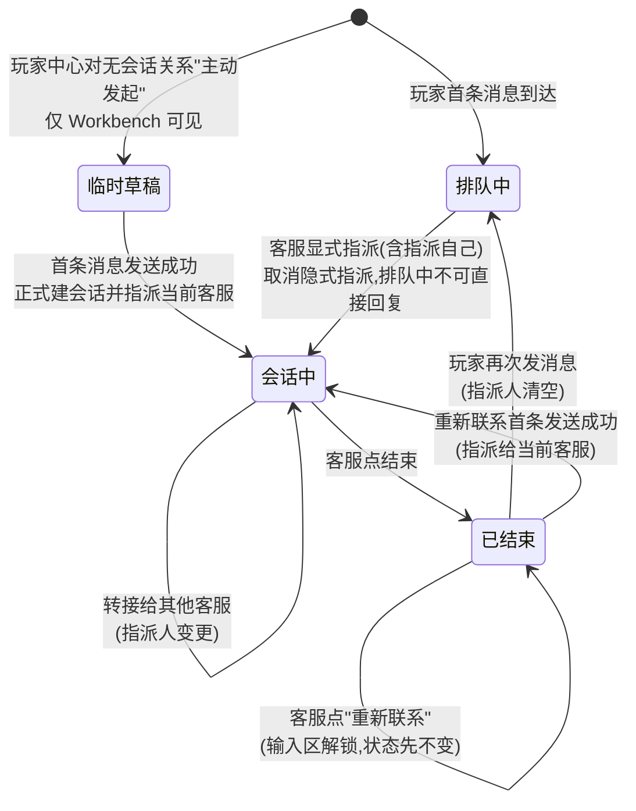
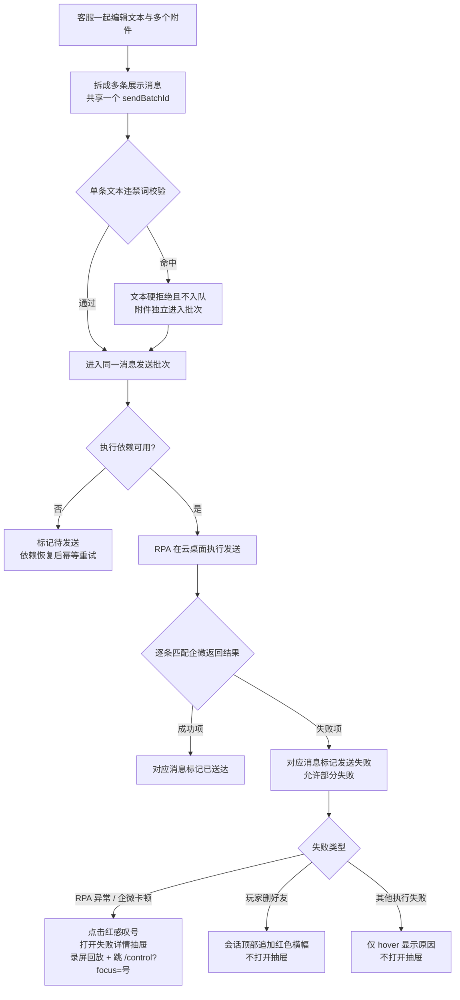
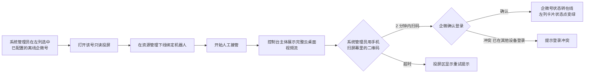
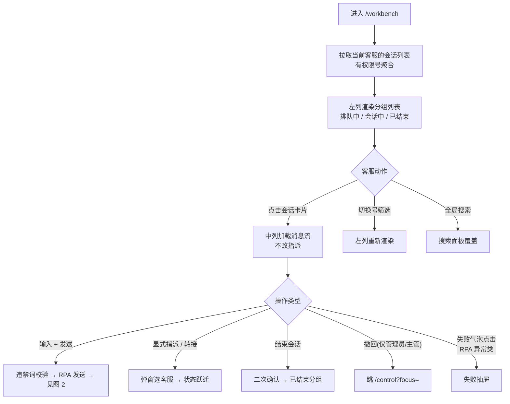
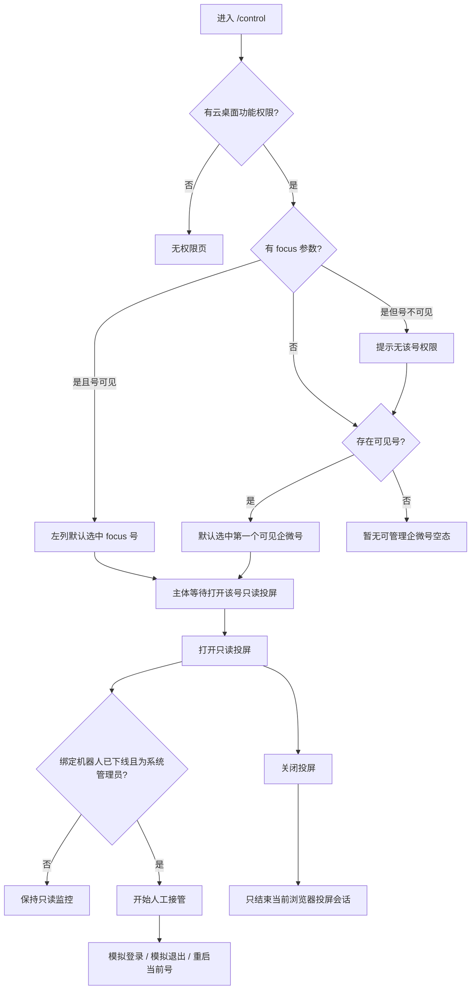
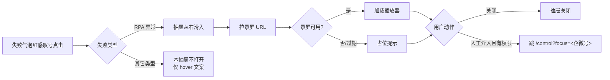
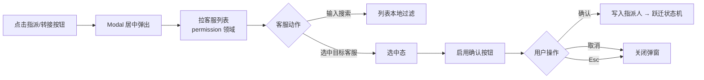
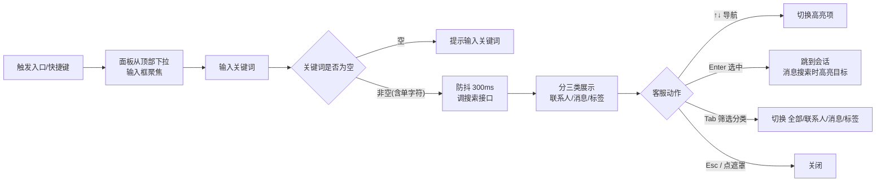

> **章节索引** — 先读这里定位,再按需跳读对应小节(用 grep `^#` 或 Read offset/limit,不必全文读)。决策/迭代史见 [decisions.md](decisions.md)。
>
> - 需求业务背景 / 业务诉求 / 概念说明
> - 现有业务与数据来源:线下业务现状、真实链路数据源、外部数据依赖
> - 功能梳理:实现思路(页面分层 / 关键取舍 / 核心流程)、事项拆解、跨领域接口约定
> - 功能详细描述:领域结构与模块关系、页面清单、业务流程图(图1 状态机 / 图2 发送流程 / 图3 扫码登录)、共享规则与状态边界、设计例外
> - 页面 1 `/workbench` 客服工作台(§1.1–1.8)
> - 页面 2 `/control` 企微号控制台(§2.1–2.8)
> - 模块 3 失败详情抽屉(§3.x)
> - 模块 4 转接 / 指派弹窗(§4.x)
> - 模块 5 综合搜索面板(§5.x)
> - 关键交互与边界场景(全局)

# 需求业务背景

## 业务诉求

**一句话目标**:让客服在一个自建后台里,同时管理 N 个企微号的 VIP 玩家会话,实现消息聚合、统一回复、操作可追溯。

具体诉求:

1. 运营侧能在一个工作台里看到所有负责的企微号消息,无需在多台手机 / 多台电脑之间切换。
2. 通过 RPA + 无影云绕开企微"无消息发送 API"的限制,让客服在 Web 后台直接输入即可发送消息,并能识别发送成功 / 失败。
3. 消息发送出问题(封号、卡顿、玩家删好友)时能立即告警、回放 RPA 录屏、人工介入,保证玩家体验与风控合规。

## 概念说明

| 概念 | 定义 |
| --- | --- |
| 客服(坐席) | 登录 ChatFlow 的运营同事,一人可同时负责多个企微号。 |
| 企微号 | 一个企业微信账号,固定绑定一台无影云桌面,长期在同一 IP 登录以规避封号。 |
| 云桌面(无影) | 运行企业微信客户端的远程 Windows 桌面,由阿里云 RPA 在其上模拟人工操作。 |
| 玩家 | 被 VIP 运营添加的企微好友,一个玩家可能被多个企微号添加(一对多)。 |
| 会话 | 一个企微号 × 一个玩家的对话单元;状态机见本设计的“图 1:会话状态机”。 |
| 指派人 | 会话当前负责的客服;默认为空,指派后会话进入"会话中"分组。一个会话同一时刻只有一个指派人。 |
| 消息 | 会话中的一条文本 / 图片 / 视频 / 附件 / 链接;由 RPA 发送或会话存档 API 回拉。 |
| 会话存档 API | 企微官方合规能力,可在开通后拿到聊天记录;本领域消息接收的唯一数据源。 |
| RPA 发送 | 业务后台把发送请求下发到阿里云 RPA,由 RPA 在云桌面中模拟人工点击与输入,把消息发出去。 |
| 企微号控制台 | 独立路由 `/control` 的企微号运维页面；承载企微号扫码登录、状态详细监控和人工介入云桌面。仅系统管理员和运营主管可进入。 |
| 撤回能力 | ChatFlow 内直接提交撤回请求；普通客服只能撤回本人已送达消息，运营主管和系统管理员可撤回授权范围内团队消息。 |

# 现有业务与数据来源

## 线下业务现状

**全新领域,无历史页面。**

现状(线下)的痛点即是本领域要替代的工作方式:

- 客服用企微官方后台 / 企微 PC 客户端 + 手机 AB 双开方式接待玩家;
- 7×24 轮班,搭档需要远程控制对方电脑回复,协作成本高;
- 工作量只能按"维护人数 + 回复条数"粗估,无法按客服粒度精准核算。

## 权威数据来源

### 数据源(真实链路)

| 类型 | 来源 | 用途 |
| --- | --- | --- |
| 消息收 | 企微会话存档 API | 拉取玩家↔客服的聊天记录 |
| 消息发 | 阿里云 RPA(SDK 代码开发模式) | 在无影云上模拟人工点击发送 |
| 账号/好友关系 | 企业微信 API | 获取企微号成员、好友列表、标签、备注 |
| 无影云状态 | 无影云 API | 企微号登录 / 在线 / 掉线 / 封禁监控 |

### 外部数据依赖

- 企微会话存档 API 的数据拉取频率与延迟契约未定 → 影响"未读消息"的更新节奏
- 无影云 API 配额与超时契约未定 → 影响企微号状态轮询节奏
- SCRM 数据互通接口(标签、玩家档案)未定 → 影响跨领域(player-center)的字段同步

权限模型已由 [permission](../permission/design.md) 锁定；Mock 实现状态与阶段性数据策略迁入 [decisions.md](decisions.md)。其余外部依赖在 [`project/research/v1.0-qiwei-rpa.md`](../../research/v1.0-qiwei-rpa.md) 的「待确认问题」里跟踪。

# 功能梳理

## 功能实现思路

### 页面分层

本领域包含 `/workbench`（会话工作台）和 `/control`（企微号控制台）两个路由；全局顶栏还按权限提供玩家、消息、运营管理和权限说明入口。

#### `/workbench` 三列布局(左窄 / 中宽 / 右弹)

1. **左列 — 会话分组与搜索**
   - 顶部：**会话分组列表（默认聚合所有有权限的号）**；每条会话卡片显示玩家昵称 + 最近消息预览，按 `排队中 / 会话中 / 他人接待中 / 已结束` 四组展示（默认后两组折叠）。卡片里**不展示所属企微号**，需要切到具体号时通过底部筛选按钮处理；打开会话后中列标题栏显示所属号
   - 底部:左侧"按号筛选"图标按钮(`FilterOutlined`,**多选**,默认勾选全部号 = 不筛选;非全选时按钮高亮并在右上角显示数字角标,代表当前已勾选数量)+ 右侧综合搜索入口(`Ctrl+K`)
2. **中列 — 会话主视图**
   - 顶部:会话标题栏(玩家昵称、所属企微号徽标、当前指派人,操作条:**指派 / 转接** / 置顶 / 标记 / 结束 / 撤回入口)
   - 主体：消息流按时间正序展示（旧消息在上、新消息在下并默认滚到底），带待发 / 发送中 / 已送达 / 失败状态；展示口径见「消息记录展示口径」
   - 底部:输入区(文本 + 图片/视频/附件上传 + 发送按钮,发送前走违禁词拦截)
3. **右列 — 玩家档案抽屉**
   - 由 `player-center` 领域承载,chat-workbench 只做挂载位与触发时机

#### `/control` 双区布局(参考飞书 EWAP 控制台样式)

1. **左列 — 企微号选择器**
   - 当前客服有权限、且已在 ops-admin 配置的企微号卡片列表(头像、号名、企微在线 / 离线 / 封禁状态)
   - 左列是企微号配置的消费结果，不提供新增、删除或独立“登录企微号”入口；登录动作始终针对当前选中的号
   - 支持 URL query `?focus=<企微号 id>` 默认选中
2. **主体 — 云桌面投屏**(仅系统管理员 / 运营主管)
   - 完整云桌面视频流(无影云 API 提供,占据主体大部分空间)
   - 控制台先打开只读投屏；系统管理员或运营主管在机器人已下线后可人工接管，并在云桌面内模拟登录、模拟退出或重启；消息撤回走 ChatFlow 独立业务请求
   - “关闭投屏”只关闭当前浏览器画面会话，绝不移除左侧企微号，也不修改企微在线状态或 RPA 状态
   - 有云桌面权限的角色在工作台 ↔ 控制台间通过顶栏一级 tab 或 `Ctrl+\` 切换;客服不显示控制台入口,也不响应该快捷键

#### 消息记录展示口径(共享 MessageBubble)

所有承载消息记录的地方,每条消息都要能追溯到「谁、以哪个企微号身份、在什么时间」回复。字段口径统一如下,并由共享组件 `MessageBubble` 承载,`player-center` 会话只读 Drawer 与玩家详情页反查会话直接继承同一口径:

- **实际回复的客服**:outgoing 消息气泡展示**实际发送该条消息的客服姓名**(取 `message.senderId` → 客服,非会话当前指派人;跨转接后每条消息仍归属其真实发送者);incoming 展示玩家昵称 / 备注。
- **回复的企微号名称**:单会话消息流(工作台主视图 / 只读 Drawer)里企微号是**会话级固定值**,统一在会话标题栏 / Drawer 头部展示,**气泡不再逐条重复**,避免冗余。跨会话的聚合列表(如 `/messages` 消息管理)因每行会话所属号不同,必须**在行内显式展示企微号名称**(承载于「对话管家」列)。
- **日期与时间**:消息流按**自然日插入日期分割线**(纯居中灰字,最轻一档,视觉见下「分隔线两档层级」);气泡时间戳默认显示 `HH:MM`,**鼠标悬停在该条消息上时,时间原地展开为完整日期时间**(`YYYY-MM-DD HH:MM:SS`,不用 Tooltip 浮层;热区为整条消息而非仅时间文本)。聚合列表行内直接展示完整 `YYYY-MM-DD HH:MM`(无悬停场景)。

### 关键取舍

- **登录管理做得简单**:V1 不引入客服状态机(在线/小休/离线),登录即在岗、关闭即走人。
- **会话分配靠显式指派(取消隐式指派)**:V1 不上智能路由,会话是否"进入会话中"以**指派人**为准。
  - **排队中会话不显示输入框,必须先"指派"(可指派给自己)才解锁回复**;取消原"发消息即自动指派给自己"的隐式路径。理由:排队中会话人人可见,若都能直接回,容易多人同时回复导致消息串;先显式接入可保证同一会话同一时刻只有一个负责人。
  - 指派入口:客服点击中列顶部的"指派"按钮 → 选择自己或其他同事(指派模式自己默认排首并标"推荐",一步即可接入)。
  - 仅点击会话卡片只是"打开查看",不改变指派状态,也不改变分组。
- **消息发送先只走 SDK**:不做"可视化组件"路径;错误处理依赖"发送后匹配 + 录屏回放"。
- **企微号管理与会话工作分离**:V1 把"管号"(扫码、状态详细、补救)和"接待"(收发消息)拆成两个独立路由 — `/workbench` 专注接待,`/control` 专注管号。`/control` 只对系统管理员 / 运营主管开放;客服不因接待企微号而获得云桌面操作权。
- **人工介入统一去 `/control`**：RPA 故障介入需要看完整云桌面。系统管理员或运营主管可带企微号 query 跳 `/control` 默认聚焦，并在机器人下线后接管客户端；撤回不依赖控制台。客服仅查看失败原因和录屏，需要人工介入时联系主管或管理员。

### 核心流程(文字概述)

- **查看会话**:新消息 → 会话进入"排队中"分组(指派人为空) → 客服点击会话卡片 → 中列加载消息流(仅查看,不改变分组和指派;**排队中会话输入区不渲染**,提示先指派)。
- **指派会话**(仅显式一条路径):客服在中列顶部点击"指派"按钮 → 选择自己或其他客服 → 会话从"排队中"跃迁到"会话中",指派人字段落位。指派给自己后输入区解锁即可回复。
- **发送消息**：客服在**指派给自己**的会话（或已结束会话的重新联系态）可一起编辑文本与多个附件 → 点击一次生成一个消息发送批次 → 文本和每个附件分别形成消息并独立记录结果。硬风控命中时直接拒绝对应内容，任何角色都不能绕过；账号、桌面或机器人暂不可用时进入可见待发队列，依赖恢复后用同一幂等键自动重试。允许部分成功、部分失败，失败项分别标红。
- **失败处理**:匹配失败或 RPA 报错 → 消息条右上角红色感叹号 → hover 显示失败原因 → 打开失败详情抽屉查看录屏。系统管理员 / 运营主管可选择"人工介入"跳 `/control?focus=<企微号>`;客服只显示"请联系运营主管协助处理"提示。
- **结束会话**:客服点右上角"结束会话" → 二次确认 → 会话移入"已结束"分组,指派人保留作历史记录;本次不做自动结束。
- **企微登录与退出 Mock**:系统管理员或运营主管在 `/control` 左侧选中已配置且已授权的离线企微号 → 打开该号只读投屏 → 绑定机器人已由系统管理员下线 → 开始人工接管 → 在当前投屏执行“模拟登录企微”并扫码 → 状态变在线。在线号则在同一接管态执行“模拟退出企微”变为离线；两项都不关闭投屏或改变 RPA。
- **客服重新联系已结束会话**：搜索、详情和深链打开已结束会话时只读。客服显式点“重新联系”后输入区解锁；首条消息成功才切到“会话中”并指派当前客服。失败或待发时仍保持已结束和重新联系态，可继续重试。

## 事项拆解

按"能独立落地的最小颗粒"拆。共 19 条:18 条对应 roadmap 里本领域的 V1 覆盖条目(R007 与 R042 在本领域合并建模为一条事项),1 条为本领域追加的"会话指派"(V1 闭环必需,roadmap 同步跟进)。
下列 `来源 R*` 是飞书《ChatFlow》规划表的行号,方便回溯源头;未标 `R*` 的是本领域追加项。

### 企微号管理(3 条,承载于 `/control`)

| 事项 | 来源 R* | 说明 | 阻塞后续 |
| --- | --- | --- | --- |
| 企微号登录状态 Mock | R018 | 系统管理员仅可在当前选中、已配置且已授权的企微号投屏内模拟登录或模拟退出；不创建配置，且需先下线绑定机器人 | 阻塞多号切换、状态监控和所有消息事项 |
| 多号同窗口切换 | R019 | 双向切换:`/control` 左列切号(看哪个号的云桌面),`/workbench` 左列筛选条切号(看哪个号的会话) | 无 |
| 企微号状态监控 | R020 | 工作台顶栏告警徽章 + 控制台主体的详细监控,两层并存:在线 / 掉线 / 封禁 + 异常通知 | 无 |

### 会话中心(10 条)

| 事项 | 来源 R* | 说明 | 阻塞 |
| --- | --- | --- | --- |
| 消息接收 | R021 | 从会话存档 API 拉消息,入库后在 UI 实时刷新 | 阻塞未读、聚合视图、分组、发送相关事项 |
| 未读消息数量 | R022 | 按会话、按企微号聚合 | 无 |
| 未读消息通知 | R023 | 浏览器通知 / 页面红点 / 音效 | 无 |
| 多号会话聚合视图 | R024 | 左列按号或按玩家聚合 | 无 |
| 会话分组 | R028 | 排队中(指派人为空)/ 会话中(**仅指派给自己**)/ 他人接待中(进行中但指派人是他人，消息只读；管理员或主管可重新转接)/ 已结束;分组跃迁由指派动作和结束动作驱动,不由点击会话驱动 | 依赖会话指派事项 |
| 会话指派 | 追加 | 中列顶部"指派"按钮 → 选择客服(默认自己);**取消隐式指派**,排队中会话须先指派(可指派给自己)接入才解锁输入;仅查看会话不改变指派 | 阻塞分组跃迁、会话转接 |
| 会话标记 | R033 | 打自定义标记(如"跟进中""重要") | 无 |
| 会话置顶 | R034 | 置顶的会话排左列最上 | 无 |
| 会话转接(基础版) | R031 | 把当前指派人变更为其他在线客服，玩家无感；普通客服仅能转接自己负责的会话，系统管理员与运营主管可重新调度授权范围内由他人接待的会话 | 依赖会话指派事项 |
| 结束会话 | R036 | 人工点击结束,二次确认;保留指派人历史记录 | 无 |

### 消息发送与合规(5 条)

| 事项 | 来源 R* | 说明 | 阻塞 |
| --- | --- | --- | --- |
| 发送消息 | R040 | 文本 / 图片 / 视频 / 附件 / 链接 / emoji | 阻塞发送校验、失败回放、违禁词拦截 |
| 发送结果校验 | R041 | RPA 发出后根据企微返回内容匹配 | 无 |
| 发送失败展示与介入 | R042 + R007 | 所有失败类型 → 消息气泡右上角红色感叹号 + hover 显示具体失败原因 + 会话状态/指派人**不变更**。点击红感叹号的行为按失败类型差异化:**RPA 异常 / 企微卡顿** → 打开失败详情抽屉(原因 / 录屏回放;仅系统管理员 / 运营主管显示跳 `/control?focus=<企微号>` 的介入按钮);**玩家已删好友**(R007 合并)→ 不打开抽屉,但会话顶部追加红色横幅"此玩家已删好友,后续消息无法送达";**违禁词兜底 / 速率上限 / 其他** → 不打开抽屉,只用 hover 提示 | 无 |
| 消息撤回 | R045 | 本人已送达消息可由普通客服直接申请撤回；运营主管 / 系统管理员可撤回授权号内团队消息。提交后由服务端校验时间窗、归属与幂等并返回结果 | 无 |
| 违禁词拦截 | R065 | **仅校验客服 → 玩家方向的单条文本消息**（按当前企微号所属游戏发送校验 + 服务端兜底）；命中是硬拦截，仅文本项拒绝且保留草稿，批次内附件继续评估。玩家入站消息不拦截 | 依赖 ops-admin 维护按游戏的违禁词库 |

### 会话辅助(1 条)

| 事项 | 来源 R* | 说明 | 阻塞 |
| --- | --- | --- | --- |
| 综合搜索 | R039 | 联系人 / 聊天记录 / 玩家标签 | 无 |

### V1 刻意不做(在本领域登记,避免混淆)

| 不做 | 原因 | 去向 |
| --- | --- | --- |
| R032 会话挂起(小休) | 无状态机;客服登录即在岗 | v1.1 与智能路由同批 |
| R035 插入快捷回复 | 减少 V1 表面积 | v1.1 知识库一起 |
| R048-R050 客服状态 / 接待上限 / 状态日志 | V1 无状态机 | v1.1 配合路由 |
| 智能路由 / 自动转接 | 降低 V1 复杂度 | v1.1 automation 领域 |

## 跨领域接口约定(初稿)

- 右侧玩家档案挂载位:由 chat-workbench 提供 slot,由 `player-center` 渲染。
- 玩家标签 / 备注:展示层由 `player-center` 负责;消息里"@某玩家"的身份识别由 chat-workbench 传参(玩家 open_id / 企微号 open_id)。
- 违禁词库:由 `ops-admin` 按游戏维护;chat-workbench 在**客服发送给玩家**时按当前企微号所属游戏校验，命中后沿用统一发送失败图标，hover 展示原因。**玩家发给客服的消息不做任何拦截**,避免遗漏真实情报。
- 权限与客服账号:由 [`permission`](../permission/design.md) 领域统一承担。chat-workbench 拿到的是"当前身份 + 功能动作判断 + 我有权限的企微号集合 + 我能转接给的客服列表";控制台、云桌面和人工接管须额外校验运维功能权限,客服不直接管理角色或鉴权细节。
- 企微号 ↔ 云桌面绑定关系:由 `ops-admin` 维护(企微号注册、与无影云桌面机器的对应);chat-workbench 控制台读取展示与切换。
- 视频流接入:控制台主体的云桌面投屏由无影云 API 提供视频流(协议待研发对齐);chat-workbench 仅做容器与控制条。

# 功能详细描述

> D1–D3 稳定设计已补齐；后续规则变更直接更新对应章节，并在 `decisions.md` 记录覆盖关系。

## 领域结构与模块关系

### 模块职责表

| 模块 / 页面 | 主要目标 | 入口 | 依赖对象 | 关联关系 | 备注 |
| --- | --- | --- | --- | --- | --- |
| 客服工作台主页 | 承载消息收发、会话管理 | 顶栏"工作台"tab,登录后默认落点 | 企微会话存档 API / 阿里云 RPA / ops-admin 违禁词库 / permission 权限授权 / player-center 玩家档案 | 三列模块在这里内嵌 | 路由 `/workbench` |
| 企微号控制台页 | 承载已配置企微号的状态监控、只读投屏和人工接管 | 仅系统管理员 / 运营主管的控制台入口;失败介入入口跳转 | ops-admin 企微号-资源绑定 / permission 授权 / 无影云 API + 视频流 | 接收 `?focus=<企微号 id>` query 默认聚焦 | 路由 `/control`;客服无入口且直访为无权限页 |
| 会话列表模块 | 按分组展示**所有有权限的号**的会话卡片(排队中/会话中/已结束) | 工作台左列中部 | 企微会话存档 | 点击会话 → 刷新"会话主视图";顶部筛选条切单号视图 | 置顶标记在这里体现 |
| 会话主视图模块 | 展示单个会话的消息流、顶部操作条、底部输入区 | 点击会话列表里任一会话 | 企微会话存档 / 阿里云 RPA | 顶部操作条 → 指派/转接/标记/置顶/结束/撤回入口;底部 → 发送消息;右侧挂 PlayerAside | V1 最大模块 |
| 玩家档案挂载位 | 在会话主视图右侧展示玩家信息 | 会话打开时自动挂载 | player-center 领域 | 只提供 slot,内容由 player-center 渲染 | 跨领域接口 |
| 企微号选择器列(控制台内) | 在控制台左列展示有权限的已配置企微号卡片，点击切换当前投屏目标 | 控制台默认渲染 | permission 授权 + ops-admin 企微号-资源绑定 + 企微在线状态 | 切换仅改变当前选中号，不新增或删除号配置 | 号卡片在关闭投屏后仍保留 |
| 云桌面投屏区(控制台内) | 完整云桌面视频流 + 只读监控 / 人工接管控制条 | 控制台主体 | 无影云 API 视频流、RPA 资源状态 | 同一桌面只允许一个浏览器投屏；关闭只释放浏览器会话 | V1 最重 RPA 依赖,Mock 阶段用静态截图占位 |
| 转接/指派弹窗 | 选择会话的目标客服(指派或转接) | 会话主视图顶部"指派"/"转接"按钮 | permission 客服列表 | 成功后会话状态机跃迁 | 二级 Modal |
| 失败详情抽屉 | 展示 RPA 异常类失败的原因、录屏回放、人工介入入口 | **仅 RPA 异常类**失败气泡红感叹号点击触发 | 阿里云 RPA 录屏 | 有云桌面权限时显示"人工介入"按钮并跳 `/control?focus=<企微号>` | 客服只看原因与录屏;玩家删好友 / 违禁词兜底 / 速率上限等不触发本抽屉 |
| 综合搜索面板 | 搜索联系人 / 聊天记录 / 玩家标签 | 工作台左列底部搜索框 / 键盘 `Ctrl+K` | 会话存档索引 + player-center 标签 | 点击结果 → 跳会话并高亮 | 覆盖在左列上方的 Popover 或独立面板 |
| 全局告警区 | 企微号掉线 / 封禁等风控告警 | 顶栏通知铃铛 + 浏览器通知 | 无影云状态监控 + 后端推送 | 工作台和控制台都能看到 | 全局级,跨页面 |

### 依赖关系(文字版)

- **数据依赖**:所有消息来自企微会话存档 API;所有发送经阿里云 RPA;企微号共享生命周期、所属游戏与云桌面绑定由 ops-admin 编排无影云 API 管理。控制台只从已初始化号源选择离线号登录。三者目前都未定接口契约,记入 `待确认问题`。
- **跨领域依赖**:
  - 玩家档案 / 标签 / 备注 → `player-center`(右侧挂载位,不嵌字段,按 slot 协议)
  - 违禁词库 / 企微号-云桌面绑定 / 初始化配置 → `ops-admin`
  - 客服账号 / 角色 / 企微号授权 / 鉴权 → `permission`
- **内部依赖**:会话主视图依赖企微号池的"当前号"状态;会话列表也依赖;三列布局通过全局 context 共享"当前企微号"和"当前会话"。

## 页面清单

### 页面清单表

| 页面 / 模块 | 路径 | 主要角色 | 页面目标 | 主要功能区 | 备注 |
| --- | --- | --- | --- | --- | --- |
| 客服工作台主页 | `/workbench` | 客服 | 完成会话接待全流程 | 左列(会话列表 + 搜索)/ 中列(会话主视图)/ 右列(玩家档案) | V1 默认落点 |
| 企微号控制台页 | `/control` | 系统管理员 / 运营主管 | 监控已授权企微号的投屏和状态；两种角色均可在机器人已下线后接管、登录和重启 | 左列（已配置企微号选择器）/ 主体（云桌面投屏 + 控制条） | 撤回不依赖控制台；客服直访为无权限页；非法 `focus` 明确显示 403 / 404 |
| 失败详情抽屉 | `/workbench` 内触发 | 所有接待角色 | 诊断发送失败;有权限者可发起人工介入 | 原因 + 录屏回放 + 条件展示的跳 `/control` 介入按钮 | 客服仅能关闭抽屉并联系运营主管 / 管理员 |
| 转接/指派弹窗 | `/workbench` 内触发 | 客服 | 指派会话或转接给他人 | 搜索并选择目标客服 | Modal |
| 综合搜索面板 | `/workbench` 内触发 | 客服 | 快速定位联系人/消息/标签 | 搜索框 + 分类结果 | Popover / 面板 |

### 路由与导航

- 本领域有 `/workbench`（默认落点）和 `/control` 两个业务路由；全局还包含 `/players`、`/players/:id`、`/messages`、`/ops-admin/*`、`/permission/agents`，并提供 404。
- 顶栏入口由能力判定：所有已认证角色看到工作台、玩家与消息；系统管理员 / 运营主管看到控制台和相应运营入口；三角色都可进入角色说明，但只有系统管理员可管理账号。
- 路由切换会卸载页面组件；会话、消息和待发队列由共享运行态保存。页面局部滚动位和未提交草稿不承诺跨路由保留。
- 登录成功后默认落到 `/workbench`;只有具备云桌面功能权限且目标号在 `visibleAccountIds` 内时,失败介入可跳 `/control?focus=<企微号 id>`。控制台内的模拟登录 / 退出均针对当前选中号；客服无跳转入口。
- 抽屉、弹窗、面板都在所属路由内部通过状态切换控制开启,不占独立 URL。

## 业务流程图

### 图 1:会话状态机



**要点**:

- 状态机是**完整的 3 态**:排队中 / 会话中 / 已结束,同一时刻只属其一。
- **「他人接待中」不是状态**:它是 `会话中`(active)状态在**当前登录客服视角**下的左列展示分组(`active && assigneeId !== 当前客服`)。同一会话换个客服登录可能显示在"会话中",状态本身不变;分组完全由 `status + assigneeId` 派生,不进状态机节点。
- 所有状态跃迁都有**明确的驱动事件**(玩家消息 / 客服动作),不会"自己走"。
- "已结束 → 排队中"时,指派人清空,需要重新指派。
- "会话中 → 会话中"的自循环代表转接动作(指派人变更,状态不变;转接后原客服视角下该会话落入"他人接待中")。
- “已结束 → 会话中”仅在客服点“重新联系”且**首条消息发送成功**时跃迁；待发或失败仍停留在“已结束”，输入区保持解锁。
- `[*] → 临时草稿 → 会话中`：玩家中心对**无任何会话**的关系点“主动发起”时，只在 Workbench 创建临时草稿。首条消息发送成功后才正式建会话并指派当前客服；失败或待发不进入玩家中心、消息管理和搜索索引。
- 玩家长时间沉默不自动变更状态,会话仍留在"会话中";是否要沉睡 / 清理逻辑留给 v1.1+ 讨论。

### 图 2:消息发送完整流程

> 前提：能进入输入区的既有会话必然是已指派给自己的会话中，或已结束会话的“重新联系”态。排队中不可直接回复。



> 重新联系例外：已结束会话首条**成功**才跃迁“会话中”并指派当前客服；待发或失败保持已结束。

### 图 3:企微号扫码登录流程



**要点**:拥有云桌面功能权限的系统管理员 / 运营主管看到的是**完整云桌面视频流**(不是单独的二维码图)。两者均可在 RPA 下线后接管并直接操作，客服不加载或查看该视频流。

## 共享规则与状态边界

### 1. 会话状态机规则

- 三个状态:**排队中 / 会话中 / 已结束**,同时刻只属一个。
- **会话 ID 跨轮次保持不变**:同一个企微号 × 同一个玩家的会话,无论"已结束 → 排队中"或"已结束 → 会话中(重新联系)"重开多少次,都复用同一个 `conversationId`,**不**生成新会话;消息流也累积在同一个会话里、跨轮次按时间顺序展示。
  - 注:player-center 的 `/messages` 在**展示层**按 system「本次会话已结束」边界把一条会话切成"轮次"(`roundId = conversationId#N`)、以轮次为最小展示单位,其会话只读 Drawer 可只看某一轮 —— 这是消费侧的展示派生,**不改变本领域 `conversationId` 跨轮次不变的会话模型**。
- 指派人字段:
  - `null` → 会话必定在"排队中"
  - 非 null 且会话未结束 → 会话必定在"会话中"
  - `已结束` 保留历史指派人,用于统计,但不能对会话执行操作
- "已结束"状态下玩家再次发消息 → 会话重新进入"排队中",指派人清空,需要重新指派。
- V1 不做基于时间的自动状态流转(如"长时间沉默 → 离线");是否引入在 v1.1+ 结合运营反馈再评估。
- **排队中不可直接回复(取消隐式指派)**:排队中会话(指派人为空)输入区不渲染,客服必须先显式"指派"(可指派给自己)接入,才跃迁"会话中"并解锁回复。**已彻底取消**原"发首条消息即隐式指派给自己"的路径,以及随之而来的"隐式指派首条失败 → 回滚排队中"逻辑。
- **消息发送失败不改状态机**：进入“会话中”或已结束“重新联系”态后，失败都不改变会话状态和指派人。
- **好友关系状态联动**：玩家 × 企微号关系以 player-center 的 `relationStatus` 为权威源。`removed_by_agent` 或 `removed_by_player` 时，同一 `(playerId, accountId)` 下所有会话展示对应警示、清空草稿与附件、锁定输入，并取消尚未发送的重新联系态。关系恢复 `normal` 后解除这一限制，但**不会**自动指派、重开会话或改变账号状态。
- **重新联系成功才跃迁**：点击“重新联系”只解锁输入。首条成功后才置为“会话中”并指派当前客服；待发或失败保持已结束，可继续重试。
- 已结束会话的重新联系态属于临时 UI 状态；无历史会话的临时草稿及其待发消息需要在本机持久化，以便依赖恢复后自动重试，但对外部索引保持不可见。
- **从玩家中心"主动发起"跳入(`?playerId=&accountId=`)**(2026-05-30 补,占位语义 2026-05-30 二次调整):玩家中心(player-center)在某条(玩家×企微号)关系**无任何会话**时提供"主动发起"入口,跳 `/workbench?playerId=<pid>&accountId=<aid>`。工作台收到后:
  - 若该组合**已存在会话** → 只定位并展示历史；已结束时不得自动进入重新联系态，必须由客服显式点击“重新联系”。
  - 若**完全无会话** → 创建一个仅 Workbench 可见的临时会话草稿，立即选中但不进入其他领域索引。客服随后直接发送首条消息：
    - 发送**成功** → 消息标已送达(会话即正式接待中),**落库**:该会话 + 其消息写入本地持久化(mock 用 localStorage),**刷新页面仍保留**。
    - 发送**失败** → **消息按普通失败处理**(气泡红色感叹号、hover 原因、可重发),**会话保留不撤销**;客服可在该会话内重发。该会话尚未落库(无成功消息),**刷新后消失**。
    - **占位未发送任何消息** → 同样未落库,刷新后消失。
    - 落库判定 = 至少有一条客服消息成功送达；成功后设置 `status='active'`、写指派历史并进入正式索引。待发或失败保留临时态以便重试。
  - `removed_by_agent` 或 `removed_by_player` 的关系在玩家中心侧即禁用“主动发起”，不会跳入工作台。
  - 工作台内对**已结束会话**点“重新联系”同样遵守“首条成功才跃迁 active”，但历史会话本身始终保留并只读可查。

### 2. 指派规则

- 显式指派(V1 唯一常规指派路径):通过"指派"按钮选择任意在线客服(含自己);转接是"指派人从 A 变 B"。**已取消隐式指派**(发首条消息自动指派)。
- **排队中先接入才回复**:排队中会话输入区不渲染;客服要接待须先点"指派"(可指派给自己),跃迁"会话中"后才解锁输入区。
- **重新联系（已结束会话）**：当前客服显式开启，语义等价于延迟到首条成功才落地的自指派；重新联系中不能转接给他人。
- 同一时刻一个会话**只有一个指派人**;不允许多客服并行接待。
- 客服对**非自己指派**的会话只能**只读查看**,不能发消息、不能结束、不能改标记和置顶。
- **左列分组按"是否指派给我"拆分**:进行中会话里,只有**指派给当前客服**的落入"会话中"(能回复);指派给其他客服的落入独立的"**他人接待中**"分组(默认折叠、消息只读；管理员或主管可重新转接)。目的:避免自己无法处理的会话堆在"会话中"里干扰,导致真正该我回的会话被漏掉。
- 点击左列会话卡片 = 打开查看,不改变指派,不改变分组。
- **重新联系的“成功才指派”规则**：点“重新联系”不立即写指派人；首条成功才跃迁，待发或失败可在原状态重试。

### 3. 权限边界

- 客服可见的企微号 = 该客服在 [`permission`](../permission/design.md) 领域被授权的号集合。
- **V1 授权粒度到企微号级**(每个企微号单独授权给某客服/某客服组),由 permission 领域定义具体角色与授权语义。
- 客服账号体系:**ChatFlow 自身领域承担** — 客服账号、密码/登录、角色、授权关系全部在 permission 领域;不依赖外部身份/权限平台(后续如要接外部 SSO 由 permission 领域内做兼容)。
- chat-workbench 拿到的是"当前客服身份 + 我有权限的企微号集合 + 我能转接给的客服列表",不直接参与权限决策。
- 超出权限的会话在任何视图(左列、搜索、聚合)都不展示。
- 权限由后端(permission 领域接口)决定,chat-workbench 前端只做展示层守卫(假设后端为准)。

### 4. 风控与合规规则(继承 `project/research/v1.0-qiwei-rpa.md`)

- **发送频率上限**:单号 N 条/小时(默认 1000,可后端配置);前端超过阈值时按钮禁用 + 提示"已达上限"。
- **IP 一致性**:企微号绑定云桌面固定 IP,客户端无感知,后端保证。
- **违禁词拦截方向**：规则只作用于客服 → 玩家的单条文本。命中后该文本硬拒绝、不入队并保留草稿；同一发送批次的附件独立评估。**玩家 → 客服的入站消息不过滤、完整展示**。
- **敏感信息脱敏**:**V1 不做脱敏**,客服在所有视图(消息流、搜索结果、通知 preview)均看到完整原文;脱敏字段清单和规则待运营侧确认后,v1.1+ 再加入渲染层。
- **操作留痕**:生产链路中,所有接待与运维角色的登录、发送、转接、结束和撤回入口点击均由后续服务端记录操作日志,前端不提供查看入口(`v1.3 operate-log` 再开)。当前 V1 前端 Mock 不生成真实审计日志。

### 5. 消息类型支持清单

| 类型 | V1 支持 | 发送(客服 → 玩家) | 接收(玩家 → 客服) | 备注 |
| --- | --- | --- | --- | --- |
| 文本 | ✅ | ✅ | ✅ | 长度上限由企微规定,前端不限 |
| 图片 | ✅ | ✅ | ✅ | 单图 ≤ 20MB |
| 视频 | ✅ | ✅ | ✅ | 单文件 ≤ 50MB |
| 文件(其他类型) | ✅ | ✅ | ✅ | 单文件 ≤ 50MB |
| 链接 | ✅ | ✅ | ✅ | V1 不做链接白名单 |
| Emoji | ✅ | ✅ | ✅ | 系统 emoji,不做自定义 |
| 表情包 | 部分 | ❌(V1 无法 RPA 实现) | ✅(展示) | 客服发图片替代 |
| 语音 | ❌ | ❌ | 展示占位 | V1 不解析语音 |
| 公众号卡片 / 小程序卡片 | 部分 | ❌ | ✅(展示) | 只展示不能转发 |
| 红包 / 位置 / 名片 | ❌ | ❌ | 展示占位 | 不在 V1 范围 |

> **混合编辑、单批次、逐条结果**：客服可一次编辑文本与多个 `attachments[]`，点击发送只创建一个消息发送批次；文本和每个附件分别形成消息，拥有独立状态。临时依赖不可用显示“待发送”，企微返回后逐条匹配结果；硬风控不进入待发队列。

### 6. 实时性与 SLA(V1 锁定值)

- **玩家消息到达 → 前端可见:≤ 10s**(通过会话存档 API → 后端长连推送 WebSocket / SSE → 前端)。
- **客服点发送 → 消息标已送达:≤ 5s**(含 RPA 执行 + 企微返回匹配)。
- **企微号状态变更 → 前端可见:≤ 10s**(无影云状态事件,同样走长连推送)。
- 超过 2× 目标时间即视为"数据延迟",UI 顶部横幅告警。
- 数据推送通道:**后端长连(WebSocket 或 SSE)是唯一通道**,V1 前端不做轮询兜底(长连断开 → 自动重连 + 重连期间顶部"重连中..."状态)。

### 7. 空态 / 加载 / 错误态规则

- 空会话:中列展示欢迎插图 + "选择左侧会话开始工作"(不点击不做任何动作)。
- 加载态:列表骨架屏 3s 超时后降级为 spinner;消息流首次拉取 loading 盖整个中列;后续增量拉取无 loading。
- 错误态:顶部横幅 + "刷新"按钮;不清空已加载数据。
- 权限受限:不展示"无权限"空页,直接从列表过滤掉。

### 8. 键盘与可访问性

- `Ctrl+K`:打开综合搜索。
- `Ctrl+\`:在工作台 / 控制台之间切换顶栏 tab。
- `Enter`:发送;`Shift+Enter`:换行。
- 焦点态使用主色深阶 `#06A052` 2px outline。
- 所有操作按钮有 `title` 属性,悬停显示完整名称。

## 设计例外说明(领域级)

### 1. 会话气泡圆角

- 继承品牌规范:全局圆角 6px → **会话气泡使用 8px**(在 `ui-brand.md` 已预留例外口径,本领域确认采纳)。
- 原因:IM 气泡是会话领域的核心视觉元素,更大圆角更符合聊天工具的视觉认知;6px 会显得过于"表单化"。
- 影响范围:仅会话主视图消息流;其他按钮、卡片、输入框仍用 6px。

### 2. 强告警的色彩面积

- 继承品牌规范:强调信息"小面积用主色" → **风控告警允许更大色块**:
  - 封号事件:顶部横幅整条用错误色 `#FF4D4F` 浅背景 `#FFF1F0`
  - 删好友:会话顶部横幅用橙色 `#FAAD14` 浅背景 `#FFF7E6`
- 原因:客服轮班 7×24,告警容易被忽略;大面积色彩是唯一能"强制注意"的手段。
- 影响范围:仅风控相关告警横幅,普通信息提示仍遵守小面积原则。

### 3. 消息流密度

- 继承品牌规范:正文 13px,行高 1.5 → **消息正文 13px,行高 1.55**。
- 原因:消息是大段连续阅读,行高稍松可降低疲劳;差距微小但累计影响显著。
- 影响范围:仅消息气泡正文;其他文本仍遵守 1.5。

## 页面详细设计与模块展开

> `/workbench`、`/control` 与三个辅助模块的稳定设计均已展开。

### 待展开清单

- [x] D2 客服工作台主页(`/workbench`) — 含会话列表(全号聚合)、会话主视图、玩家档案挂载位
- [x] D2 企微号控制台页(`/control`) — 含企微号选择器列、云桌面投屏区、扫码登录与人工介入
- [x] D3 失败详情抽屉
- [x] D3 转接/指派弹窗
- [x] D3 综合搜索面板

---

## 页面 1:`/workbench` 客服工作台

### 1.1 页面概述

- **页面目标**:客服在一个屏幕里完成多企微号会话的查看、接待、消息收发和会话管理。**V1 工作台只承载"接待动作",不承载"管号动作"**(管号在 `/control`)。
- **主要角色**:客服(坐席)
- **页面入口**:登录后默认落点;顶栏"工作台"tab。
- **页面出口**:
  - 具备云桌面权限时,顶栏切到"控制台"tab
  - 具备云桌面权限且目标号可见时,失败气泡点"人工介入"→ 跳 `/control?focus=<企微号>`
  - 消息悬停的撤回图标按“本人消息 / 授权范围团队消息”能力直接提交撤回，不跳控制台
- **本页负责**:消息接收 / 发送、会话状态机、指派、违禁词出站校验、综合搜索入口、玩家档案挂载位
- **本页不负责**:扫码登录、企微号添加 / 删除、云桌面投屏、客服账号管理

### 1.2 页面功能流程



### 1.3 数据流说明

- **输入**:
  - 当前客服身份(从 `permission` 领域)
  - 有权限的企微号集合(从 `permission` 领域)
  - 会话列表(后端长连推送,初次进入用 REST 拉一次,后续增量推送)
  - 消息流(选中会话后按需拉取 + 长连推送增量)
  - 玩家档案(由 `player-center` 领域提供,挂在右列)
  - 违禁词库(由 `ops-admin` 按游戏维护,发送时读取)
- **处理**:
  - 状态机:消息到达 / 客服指派 / 结束 等事件驱动状态跃迁
  - 输入区渲染守卫：排队中（未指派）/ 非自己指派 / 已结束非重新联系态 → 输入区不渲染
  - 违禁词出站拦截:本地校验 + 后端兜底
  - 发送失败处理:仅标红 + hover 原因,不改状态机 / 指派人(已取消隐式指派回滚)
- **输出**:
  - 消息发送(向后端发起 RPA 调用)
  - 会话状态变更(向后端持久化)
  - RPA 故障介入且有云桌面权限时跳 `/control?focus=<id>`；撤回不走该路由
  - 玩家档案右列展开 / 折叠(向 `player-center` 传递当前会话玩家 id)

### 1.4 页面布局设计详情

```text
┌──────────────────────────────────────────────────────────────────┐
│ TopBar (48px)                                                     │
│  Logo  | 工作台▼ [控制台*] | (spacer)      🔔  搜索⌘K  👤客服头像  │
├───────────┬────────────────────────────────┬─────────────────────┤
│ 左列 280  │ 中列  flex                      │ 右列 360 可折叠      │
│           │ ┌────────────────────────────┐ │                     │
│ 排队中(3) │ │ 会话标题栏 + 操作条 (52px)  │ │ 玩家档案挂载位       │
│ ┌───────┐│ ├────────────────────────────┤ │ (player-center 领域) │
│ │卡片   ││ │ 消息流                      │ │                     │
│ │卡片   ││ │ ↑ 历史                      │ │  - 玩家头像/昵称     │
│ └───────┘│ │ ↓ 最新                      │ │  - 备注/标签         │
│           │ │                              │ │  - 自定义字段       │
│ 会话中(8) │ │                              │ │  - 企微关系          │
│ ┌───────┐│ ├────────────────────────────┤ │  - 会话历史          │
│ │卡片📌 ││ │ 输入区 (96px 含工具条)     │ │                     │
│ │卡片   ││ │  [📷📁😀] 文本框      [发送]│ │                     │
│ └───────┘│ └────────────────────────────┘ │                     │
│           │                                  │ ▶ 折叠按钮           │
│ 已结束(15)│                                  │                     │
│ ▼ (折叠)  │                                  │                     │
│           │                                  │                     │
│ ──────  │                                  │                     │
│[⛛筛选号][🔍 综合搜索 ⌘K]                  │                     │
└───────────┴──────────────────────────────────┴─────────────────────┘
```

`*` 控制台仅系统管理员 / 运营主管可见;客服只显示工作台。

| 区域 | 宽度 | 内容 | 备注 |
| --- | --- | --- | --- |
| TopBar | 100% × 48px | Logo / Tab 切换 / 搜索入口 / 通知铃 / 客服菜单 | 跨页面共享 |
| 左列 | 280px 固定 | 筛选条 + 会话分组 + 搜索按钮 | 会话数量多时虚拟滚动 |
| 中列 | flex(自适应) | 会话标题栏 + 消息流 + 输入区 | 未选中会话时显示欢迎插图 |
| 右列 | 360px,可折叠到 0 | 玩家档案(player-center 渲染) | 折叠状态用窄边按钮 |

### 1.5 功能区详情

#### 1.5.1 TopBar

| 元素 | 行为 |
| --- | --- |
| Logo | 点击回到 `/workbench` 默认状态 |
| Tab(工作台 / 控制台) | 所有人可见工作台;仅系统管理员 / 运营主管显示控制台,且 `Ctrl+\` 才在两者间切换 |
| 全局搜索入口(⌘K) | 点击 / 快捷键打开搜索面板 |
| 通知铃 | 红点指示企微号告警(掉线/封禁等);hover 看最近 5 条;点击展开通知中心 |
| 客服头像菜单 | 显示当前客服昵称;下拉:个人偏好(关闭提示音)/ 退出登录 |

#### 1.5.2 左列 — 底部工具条(筛选 + 搜索)

放在左列最底部,横向并列两个按钮(占一行高 36~40px):

| 控件 | 行为 | 视觉 |
| --- | --- | --- |
| 号筛选(`FilterOutlined` 图标按钮) | 点击弹出 Popover(向上展开),**多选**:顶部"全部号"半选 / 全选 checkbox + 各号 checkbox(状态点 + 名称 + 离线/封禁标识)。**默认勾选全部号 = 等价于不筛选**。切换不保留滚动位 | 默认描边图标按钮;**非全选**时按钮主色边框 + 主色文字 + **右上角红色数字角标**(显示已选数量);**全选**时按钮回归默认态、不带角标 |
| 综合搜索按钮 | 点击 / `Ctrl+K` 打开搜索面板 | 占满底部条剩余宽度,按钮文字"综合搜索 ⌘K" |

筛选面板交互细节:

- 顶部"全部号":点击切换"全选 ↔ 全不选";中间状态(部分选中)显示半选样式
- 当前选中会话所属的号被取消勾选 → 直接关闭中列,不弹二次确认
- 全部取消勾选 → 会话列表为空,Tooltip 提示"当前未勾选任何号,会话列表为空"

#### 1.5.3 左列 — 会话分组列表

分组顺序固定:**排队中 → 会话中 → 他人接待中 → 已结束**。每个分组可独立折叠(默认:排队中 / 会话中展开,**他人接待中 / 已结束折叠**)。

- **会话中**:只放**指派给当前客服**的进行中会话(即"只有我能发消息的会话")。
- **他人接待中**:进行中但指派人是**其他客服**的会话,从"会话中"独立出来,默认折叠、点开只读查看,不能回复。避免"挂着一堆处理不了的会话"干扰,防止真正该自己回的会话被漏掉。
- 分组归属完全由 `status + assigneeId` 派生:`active && assigneeId===当前客服` → 会话中;`active && assigneeId!==当前客服` → 他人接待中。

会话卡片字段:

| 字段 | 含义 | 视觉 |
| --- | --- | --- |
| 玩家头像 | 圆形 36×36 | 左侧 |
| 玩家昵称 | 优先备注 → 否则原昵称 | 第一行加粗 |
| 最近消息预览 | 最新一条消息文本(20 字内) | 第二行,次文本色 |
| 时间戳 | 最近消息时间 | 右上,12px 辅助色 |
| 未读气泡 | 数字红色徽章 | 右下,99+ 截断 |
| 置顶图标 📌 | 已置顶时显示 | 卡片左侧金色边 + 第三行小图标 |
| 标记图标 | 跟进中 / 重要 / 待回访 等 | 第三行小图标排列(无图标时该行不渲染) |
| **所属企微号** | 卡片**不展示**,故意省略以保持密度;打开会话后中列标题栏可见;需要按号筛选时使用左列底部漏斗按钮 | — |

会话卡片**不提供右键菜单**;置顶 / 标记等操作统一走中列标题栏操作条(见 1.5.4)。不提供"复制玩家昵称"能力。

#### 1.5.4 中列 — 会话标题栏

| 区域 | 内容 |
| --- | --- |
| 左侧 | 玩家头像 + 昵称 + 企微号徽标 + 当前指派人(无 → "未指派"灰色)+ **会话 ID**(等宽小字 + 复制图标,点击即复制并 toast 反馈) |
| 右侧操作条(进行中) | 指派 / 转接 / 标记 / 置顶 / 结束会话 |
| 右侧操作条(已结束 + 默认) | **重新联系**（主色幽灵按钮）/ 标记 / 置顶 / 结束会话（后三者禁用） |
| 右侧操作条(已结束 + 重新联系态) | **取消重新联系** / 标记 / 置顶 / 结束会话（后三者禁用） |

按钮启用规则:

- 当前会话指派人 ≠ 当前客服 → 输入、标记、置顶、结束均禁用；系统管理员 / 运营主管显示"转接"，普通客服只读
- 指派人为空(排队中)→ 显示"指派"按钮,且**输入区不渲染**(必须先指派接入才能回复,详见 1.5.6);已有指派人时，仅当前负责人或具备跨客服调度权限的角色显示"转接"
- 已结束分组默认仅可查看历史；唯一可解锁输入的动作是“重新联系”，并需满足下列条件
- “重新联系”按钮的 disable 条件（任一命中即禁用）：
  - 该会话所属的企微号 **离线 / 封禁**(发起后大概率发不出去,直接拦在按钮)
  - 该关系状态不是 `normal`（无论由管家还是玩家删除）
- “重新联系”按钮提示“首条成功后会话进入会话中”，避免和新建会话的“主动发起”混淆

#### 1.5.5 中列 — 消息流

- 时间正序（老消息在上、新消息在下），默认自动滚到底
- 用户向上手动滚 → 不强制下滚,新消息到达时显示"↓ 新消息"小气泡引导
- 消息气泡:
  - 客服消息靠右,主色浅阶背景 `#E8F8EE`
  - 玩家消息靠左,白底 + 1px 边框
  - 圆角 8px(领域例外)
  - 状态图标:发送中(loading)/ 已送达(✓ 灰)/ 失败(❗红)
  - 失败状态:hover 气泡显示原因;点击红感叹号(仅 RPA 异常类)打开失败抽屉
  - **悬停操作条**：鼠标悬停在可撤回的已送达消息上时显示“撤回”。普通客服只对本人消息显示；运营主管 / 系统管理员可对授权范围内团队消息显示。点击后直接提交撤回请求并展示结果，不跳控制台。
- 媒体消息:图片缩略,点击放大;视频带播放按钮缩略图;文件显示文件名 + 大小 + 下载图标
- **混发拆分展示**：客服一次提交的文本、图片、视频和文件分别显示为单条气泡，每条独立展示待发 / 发送中 / 已送达 / 失败状态；多条消息共享同一 `sendBatchId`。旧记录可继续读取兼容字段 `rpaTaskId`，新逻辑不再用它表达常驻任务。
- 系统消息:居中**全宽分割线**(两侧细横线夹居中文案),无气泡;不参与综合搜索结果;不提供撤回按钮。
- **分隔线两档层级**(避免多枚同款分隔条在边界处互相竞争):① **自然日日期** = 最轻,纯居中灰字,不加底不加线,退到背景;② **会话生命周期边界**(结束 / 重开 / 主动发起) = 全宽分割线,会话在此断开,给最强的视觉分隔;③ **视图态控件**(收起 / 上滑提示 / 加载)为可点药丸,略深底以示可交互。
- **跨轮次会话分割条**:同一会话多轮重开时,在消息流中按时间顺序插入系统消息作分割,跨轮次的历史消息**仍然保留**(同一 conversationId,见状态机规则)。具体三类分割条:
  - 客服点"结束会话"或玩家删好友导致结束 → `本次会话已结束 · YYYY-MM-DD HH:mm`
  - 玩家在已结束会话里重新发消息(`已结束 → 排队中`)→ `玩家于 YYYY-MM-DD HH:mm 重新发起会话`
  - 客服在已结束会话点“重新联系”且首条成功 → `客服于 YYYY-MM-DD HH:mm 重新联系`
  - **相邻边界合并展示(展示层口径,不改数据模型)**:当「本次会话已结束」与紧随的「玩家重新发起 / 客服重新联系」两条系统条相邻出现(展开历史跨越轮次边界时),合并为**一条**分割线:`会话已于MM-DD HH:mm结束 · 玩家MM-DD HH:mm重新发起 / 客服MM-DD HH:mm重新联系`。**结束与重开两端都带日期**(避免"结束于几点、哪天"读不出)。合并条已内联新一轮日期,其后同自然日的消息**不再重复插日期分割线**;未展开历史、最新一轮仅剩单独一条重开条时,该重开条同样内联完整日期并抑制紧随的冗余日期线。目的是避免"日期线 + 结束条 + 重开条 + 日期线"多枚分隔条在边界处堆叠。
- **历史轮次:默认只渲染最新一轮,上滚自动展开 + sticky 收起按钮**:
  - **进入会话默认状态**:消息流只渲染最新一轮(live 轮或最近一次结束的轮)的消息,过往已结束轮次完全不渲染、也不留任何折叠胶囊或入口。`scrollTop` 初始化为 `scrollHeight`,最新消息直接可见。
  - **轮次切分规则**:以 `本次会话已结束` 系统分割条作为轮次边界,该分割条本身归属上一轮的尾;`玩家于...重新发起` / `客服于...重新联系` 分割条归属下一轮的开头(因为它们描述的是新一轮的来源)。
  - **上滚自动展开**:消息流的 `onScroll` 监听 `scrollTop ≤ 40` 时,先进入 ~350ms `loading` 占位态(顶部居中胶囊 `LoadingOutlined + 加载历史会话…`,客服明确感知到"在加载"),然后把"已展开历史轮数"+1,并在新内容渲染完成后通过 `scrollTop = newScrollHeight - oldScrollHeight + 8` 把视图锚回原本可见的内容上,避免视觉跳动。每次仅多展开一轮,展开期间用 ref 锁防止抖动重复触发,且额外延迟 50ms 释放锁以避免我们自己的 `setScrollTop` 又触发一次。已经全部展开则不再触发。
  - **wheel 兜底**:当最新一轮消息很少、不足以撑出滚动条时(`scrollHeight ≤ clientHeight`),`onScroll` 不会触发;此时用 `onWheel` 兜底:`deltaY < 0` 且 `scrollTop === 0` 即触发同样的展开逻辑(含 loading 占位)。展开后内容长度增加、自然进入正常的 `onScroll` 路径。
  - **顶部上滑提示**:`expandedHistoryCount < totalHistoryRounds` 且 `totalHistoryRounds > 0` 时,消息流顶部居中浮一个轻量灰胶囊 `↑ 上滑查看更早历史`,告诉客服"还能继续往上加载";加载中或全部展开后该提示自动隐藏。
  - **收起按钮(消息流内 sticky 顶部居中胶囊)**:展开数 > 0 时在 `cf-conv-view__stream` 内部以 `position: sticky; top: var(--cf-spacing-2); align-self: center` 浮一个胶囊 `已展开历史 {N/M} · 收起`。**视觉跟现有 hint / loading 胶囊完全统一**:`rgba(0,0,0,0.04)` 浅灰底、无边框、无阴影、`color: var(--cf-text-tertiary)`,只有"收起"两字用品牌色 `var(--cf-brand)` + 字重 500 标识可点击。不再用白底 + 阴影 + border:那种"独立浮卡"风格在覆盖到分割条/气泡时显得突兀;统一进 hint/loading 的视觉语言后,即便短暂滑过分割条文字,也只是浅灰底叠在文字上,客服一眼能识别它是"会话流的辅助提示"而非"独立组件"。**位置**居中而不是右上:同一会话流里出现三种顶部居中胶囊(hint / loading / collapse)互斥渲染、共用同一通道,视觉一致;偏右上反而会让客服误以为是另一类操作。**不**挂进会话 header:header 表达的是"会话本身的信息"(玩家/账号/指派/会话级动作),展开/收起是消息流的视图态,层级与 header action 不一致。点击 → 展开数清零、平滑滚回底部 live 轮 + 复用展开锁 + 400ms 缓冲压住伴生 scroll 事件;展开数 = 0 时整个胶囊不渲染、不占空间。
  - **收起防误触**:收起按钮点击后会复用展开锁 + 400ms 缓冲,覆盖"`scrollTop` 被浏览器 clamp 到 0"和平滑滚动这两类伴生 scroll 事件,避免刚收起又立刻被识别为"上滑加载"。缓冲过后客服正常上滑仍可重新加载。
  - **设计取舍**:**展开靠滚动**(自然手势,跟微信/iMessage 翻历史一致,带 loading 反馈让"加载"这件事被感知),**收起靠点击**(显式动作,避免误触);不再保留任何折叠胶囊作为入口,客服只通过"系统分割条 + 上滑提示 + sticky 收起"感知与控制历史。

#### 1.5.6 中列 — 输入区

```text
┌─────────────────────────────────────────────────┐
│ [图片📷] [文件📁] [Emoji😀]                       │  ← 工具条
├─────────────────────────────────────────────────┤
│ [🖼缩略][🖼缩略][📄文件卡][▶视频块]  ×             │  ← 草稿附件预览条(有附件才出现)
├─────────────────────────────────────────────────┤
│  文本输入(多行,自适应高度,默认 5 行,最大 18 行) │
├─────────────────────────────────────────────────┤
│                                        [发送 ▷]   │
└─────────────────────────────────────────────────┘
违禁词命中:沿用统一消息失败状态，hover 红色失败图标查看“命中游戏违禁词、未发送”的失败原因。
```

**混合编辑 + 拆分展示**：图片 / 视频 / 文件先进入草稿附件预览；点击发送创建一个消息发送批次。文本和附件分别形成消息，各自展示待发 / 发送中 / 已送达 / 失败；允许部分失败。硬风控命中时保留输入草稿供修改，临时执行依赖不可用时进入待发队列并清空已接受的编辑区。

| 元素 | 行为 |
| --- | --- |
| 文本框 | Enter 发送 / Shift+Enter 换行;**默认 5 行、自适应到最大 18 行后滚动**;**切换到可输入会话时自动聚焦**,无需再点一次;粘贴图片 → 进草稿附件区(不直接发) |
| 图片按钮 | 选择图片(jpg/png/gif),≤ 20MB → 进草稿附件区 |
| 文件按钮 | 选择任意文件 / 视频,≤ 50MB → 进草稿附件区 |
| 草稿附件预览条 | 图片 64px 缩略图(点击开灯箱放大)/ 视频 64px 封面 + ▶(点击弹窗播放预览)/ 文件卡片显示图标+文件名+大小(点击新标签页打开);每个附件右上角 `×` 移除 |
| Emoji 面板 | 系统 emoji,不含自定义表情包 |
| 发送按钮 | 主色；**文字非空或有草稿附件时可点**；一次点击创建一个消息发送批次并为每条内容生成稳定 `clientRequestId`。硬风控拒绝不入队；临时依赖不可用时进入待发队列并自动重试 |

会话在**排队中(指派人为空)**时,**整个输入区不渲染**(替换成提示条:"此会话在排队中,点击右上角「指派」接入(可指派给自己)后即可回复")。取消隐式指派后,这是唯一进入会话中的入口。

会话指派人 ≠ 当前客服时,**整个输入区不渲染**(替换成提示条:"此会话已指派给 XX,你只能查看")。

关系状态为 `removed_by_agent` 或 `removed_by_player` 时，**整个输入区不渲染**，展示对应的“请先重新添加好友”提示并清空草稿 / 附件；恢复 `normal` 后解除关系锁定，但是否可输入仍由指派、会话和硬风控条件决定。

会话已结束时:

- **默认**：输入区不渲染，提示“会话已结束，如需继续沟通请点击右上角「重新联系」”
- **重新联系态**：输入区正常渲染，说明首条成功后才重新进入会话中；待发或失败保持已结束并可重试
- 账号禁用 / 封禁或存在硬风控时“重新联系”禁用；仅机器人 / 桌面暂不可用不阻止进入，提交后进入待发队列

#### 1.5.7 右列 — 玩家档案挂载位

- chat-workbench 仅提供 slot 容器(width 360px,可折叠)
- 渲染由 `player-center` 领域负责,通过 `playerId + accountId` 上下文传参
- 折叠按钮:位置在左侧中部,折叠后宽度 0(给中列腾空间)

### 1.6 关键交互说明

| 场景 | 触发 | 系统处理 | 成功结果 | 失败 / 异常 |
| --- | --- | --- | --- | --- |
| 打开会话 | 点击左列卡片 | 拉消息流 + 加载玩家档案 | 中列渲染;不改指派;**排队中会话输入区不渲染**(提示先指派) | 拉取失败 → 中列空态 + 重试按钮 |
| 显式指派(排队中接入) | 点指派按钮 → 选客服(可选自己) | 写入指派人 | 会话进"会话中",指派给自己时输入区解锁可回复 | 网络错误 → 弹 toast,状态不变 |
| 转接 | 当前负责人，或系统管理员 / 运营主管点转接 → 选在线客服 | 修改指派人 | 玩家无感；原负责人视角转入"他人接待中"，新负责人视角转入"会话中" | 当前负责人不进入候选；无其他在线候选时禁止提交 |
| 结束会话 | 点结束 → 二次确认 | 状态设为已结束 | 移入已结束分组 | 玩家如再来消息 → 重新进排队 |
| 标记 / 置顶 | 中列标题栏操作条(仅自己指派的进行中会话) | 个人视图操作 | 立即生效 | 置顶超 10 → 提示 |
| 失败 hover | 鼠标悬停红感叹号 | 读 message.failureReason | Tooltip 显示原因 | — |
| 失败点击(RPA异常) | 点击红感叹号 | 拉录屏 URL | 打开失败抽屉 | 录屏过期 → 抽屉里提示 |
| 撤回 | 普通客服操作本人消息，或主管 / 管理员操作授权范围内团队消息 | 以原消息 ID + 幂等键提交撤回 | 成功后气泡显示“消息已撤回” | 超时窗、已撤回或越权时保留原状态并提示原因 |
| 重新联系 | 已结束会话标题栏点“重新联系” | 进入临时重新联系态并解锁输入 | 状态 / 指派不变，等待首条成功 | 账号硬拦截或关系非 normal 时禁用 |
| 重新联系首条成功 | 企微返回成功 | 状态切到会话中、指派当前客服并清临时态 | 会话进入“会话中” | — |
| 重新联系首条待发 / 失败 | 首条未送达 | 不改状态和指派，保留重新联系态 | 可自动或手动重试 | 执行异常可打开失败详情 |
| 取消重新联系 | 点“取消重新联系” | 清掉临时态 | 回到已结束只读态 | — |
| 玩家好友关系变更 | 企微事件将关系设为 `removed_by_agent` / `removed_by_player` / `normal` | 将状态投影到同组合全部会话；非 normal 时清草稿、锁输入并取消未发送的重新联系态 | 恢复后按会话归属、状态和风控重新判定 | 不自动指派、不自动重开会话 |
| 复制会话 ID | 点标题栏 ID 徽标 | navigator.clipboard 写入 | toast "会话 ID 已复制" | 浏览器不支持 → 静默不报错 |
| 切号筛选 | 左列下拉 | 重渲染会话列表;当前打开的会话若属其他号直接关闭(不弹二次确认) | 中列回到默认欢迎态 | — |
| 分组折叠 | 点击左列分组标题 | 折叠/展开该分组卡片列表 | 折叠态隐藏卡片,标题保留计数 | — |
| 历史轮次上滚展开 | 中列消息流上滚到 `scrollTop ≤ 40`,或最新一轮内容不溢出时滚轮/触控板继续上滑 | 进入 ~350ms `加载历史会话…` loading 占位 → 已展开历史轮数 +1 → 新内容渲染后 `scrollTop = delta + 8` 锚回原可见位置 | 顶部 loading 胶囊先出现 ~350ms,随后被新一轮消息替代 | 全部展开后不再触发;展开期间用 ref 锁防抖,额外延迟 50ms 防自触发;`onScroll` + `onWheel` 双通道,前者管溢出场景、后者管短内容场景 |
| 顶部上滑提示 | 进入会话(且 `totalHistoryRounds > 0` 且未全部展开) | 消息流顶部居中渲染轻量灰胶囊 `↑ 上滑查看更早历史` | 客服一眼看到"还能继续往上拉" | 加载中 / 全部展开后自动隐藏 |
| 全部收起 | 点击消息流内 sticky 顶部居中的 `已展开历史 N/M · 收起` 浅灰胶囊 | 把展开计数清零,平滑滚回底部 live 轮;同时复用展开锁 + 400ms 缓冲压住伴生 scroll 事件 | 回到默认只渲染最新一轮的状态 | 展开计数 = 0 时胶囊不渲染、不占空间;视觉跟 hint / loading 胶囊统一(浅灰底/无边框/无阴影,只"收起"用品牌色),即便偶尔覆盖系统分割条文字也最低干扰;胶囊属于消息流的视图态,刻意不挂进会话 header |
| 切到控制台 tab | 系统管理员 / 运营主管点 tab 或 `Ctrl+\` | 路由切换,状态保留 | `/control` 渲染 | 客服不展示 tab;直访 `/control` 显示无权限页 |

### 1.7 边界场景

| 场景 | 表现 |
| --- | --- |
| 会话列表为空 | 左列展示"暂无会话,等待玩家上门"插图 |
| 中列未选中会话 | 中列居中欢迎插图 + "选择左侧会话开始工作" |
| 消息流首次加载 | 整个中列骨架屏,3s 超时降级为 spinner |
| 打开排队中会话 | 输入区不渲染,提示"此会话在排队中,点击右上角「指派」接入后即可回复";点"指派"选自己 → 进入会话中并解锁输入 |
| 打开他人接待中的会话 | 落在"他人接待中"分组;可只读浏览消息,输入区不渲染("已指派给 XX,你只能查看") |
| 长连断开 | 顶部黄色横幅"实时消息暂时不可用,正在重连..." + 按钮"立即重试";期间消息不丢,重连后增量补齐 |
| 网络离线 | 顶部红色横幅 + 输入区禁用 |
| RPA / 桌面暂不可用 | 仍允许提交；消息显示“待发送”，依赖恢复后自动重试，同一请求不会重复发送 |
| 企微号禁用 / 封禁 | 该号下所有会话显示硬拦截并禁止提交，顶部告警持续显示直到管理员处理 |
| IP 漂移 / 违禁词 / 频率硬上限 | 服务层硬拦截；任何角色都不能绕过，不进入待发队列并保留可修正草稿 |
| 消息发送失败 | 仅红感叹号 + hover 原因,会话状态 / 指派人不变(取消隐式指派后不再有首条失败回滚) |
| 重新联系首条待发 / 失败 | 状态保持已结束、不写指派；重新联系态保留 |
| 重新联系首条成功 | 状态切会话中、指派当前客服；自动清掉重新联系态 |
| 已结束 + 企微号禁用 / 封禁 / 硬风控 | “重新联系”按钮禁用 + tooltip 说明原因 |
| 已结束 + 好友关系非 normal | “重新联系”按钮禁用；会话顶部展示需重新添加好友的对应横幅 |
| 任一方删除好友 | 失败 + 会话顶部追加警示横幅，清空未发送草稿与附件并锁定输入；已结束会话的“重新联系”按钮禁用 |
| 重新添加好友 | 企微事件将关系恢复为 `normal`；移除删好友警示与锁定，按其他既有条件重新判定可输入 / 可重新联系；不自动重开或指派 |
| 速率上限 | 输入框失焦时如已达号上限 → 发送按钮禁用 + tooltip 提示 |
| 多 Tab 同账号 | 状态以后端推送为准,< 2s 延迟同步 |
| 切换号导致会话被关 | 直接关闭中列(不弹二次确认),回到默认欢迎态 |

### 1.8 设计例外说明(本页面级)

无新增,继承"领域级设计例外"中的 3 条(气泡圆角 8px / 强告警大色块 / 消息流行高 1.55)。

---

## 页面 2:`/control` 企微号控制台

### 2.1 页面概述

- **页面目标**:系统管理员或运营主管在控制台监控**已配置企微号**的云桌面投屏与企微在线状态；系统管理员可在 RPA 下线后接管并操作当前号。
- **主要角色**:系统管理员、运营主管
- **页面入口**:
  - 有云桌面功能权限时显示的顶栏"控制台"tab
  - 有云桌面功能权限且目标号在 `visibleAccountIds` 内时,`/workbench` 失败抽屉的"人工介入"按钮 → `/control?focus=<企微号>`
  - RPA 故障详情可在具备云桌面权限且目标号可见时跳 `/control?focus=<企微号>`；撤回不依赖控制台
  - 直接访问 URL `/control?focus=<企微号>`:客服或其他无云桌面权限角色进入无权限页
- **页面出口**:顶栏切回"工作台"(`Ctrl+\` 或点击顶栏 tab);本页不再单独提供"返回工作台"按钮。
- **本页负责**：按授权范围展示企微号、只读投屏、系统管理员 / 运营主管人工接管、模拟登录 / 模拟退出 / 重启，以及关闭当前浏览器投屏；不承担消息撤回。
- **本页不负责**:企微号新增、删除、游戏或资源绑定（均在 ops-admin）、消息收发、玩家档案、综合搜索。

### 2.2 页面功能流程



### 2.3 数据流说明

- **输入**:
  - 当前身份 + 云桌面功能权限 + `visibleAccountIds`(`permission` 领域)
  - 企微号 ↔ 云桌面机器绑定关系(`ops-admin` 领域)
  - 各号在线状态(无影云 API 长连推送)
  - 视频流 URL(无影云 API,Mock 阶段降级为静态截图或循环录屏 mp4)
  - URL query `?focus=<企微号 id>`
- **处理**:
  - 先校验云桌面功能权限;无权限不加载号列表、绑定关系或视频流
  - 仅将 `visibleAccountIds` 内的企微号与其云桌面绑定关系送入页面;列表为空时直接显示空态,不回退展示其他默认号
  - 左侧只展示 `visibleAccountIds` 中、且已在 ops-admin 配置资源绑定的企微号；它是配置结果，不是登录候选列表
  - 打开投屏创建临时 `ProjectionSession`；同一 `desktopId` 的新浏览器会话会挤出旧会话，不影响其他桌面
  - 离线号“模拟登录企微”或在线号“模拟退出企微”均针对当前选中号，需系统管理员或运营主管、RPA 已下线和已进入人工接管；扫码登录或退出只更新企微在线状态
  - 关闭投屏只释放当前浏览器会话，不影响企微号配置、左侧列表、企微登录、RPA 或风控
  - 重启允许系统管理员或运营主管在人工接管中执行
- **输出**:
  - 启动 / 关闭浏览器投屏会话
  - 在人工接管中触发扫码登录或重启流程

### 2.4 页面布局设计详情

```text
┌──────────────────────────────────────────────────────────────────┐
│ TopBar (48px)                                                     │
│  Logo  | 工作台 控制台▼ | (spacer)         🔔  搜索⌘K  👤        │
├──────────┬───────────────────────────────────────────────────────┤
│ 左列 240 │ 主体 flex                                               │
│          │ ┌──────────────────────────────────────────────────┐ │
│ 号卡片   │ │                                                    │ │
│ ┌──────┐ │ │                                                    │ │
│ │👤 ●在 │ │ │            云桌面视频流(自适应)                    │ │
│ │小琴号 │ │ │                                                    │ │
│ │ 12未读│ │ │            (Mock 阶段:静态截图)                    │ │
│ └──────┘ │ │                                                    │ │
│ ┌──────┐ │ │                                                    │ │
│ │👤 ●离 │ │ │                                                    │ │
│ │小贝号 │ │ │                                                    │ │
│ └──────┘ │ │                                                    │ │
│ ┌──────┐ │ │                                                    │ │
│ │👤 ●封 │ │ │                                                    │ │
│ │小娟号 │ │ │                                                    │ │
│ └──────┘ │ │                                                    │ │
│          │ │                                                    │ │
│          │ └──────────────────────────────────────────────────┘ │
│          │ 控制条: [开始人工接管] [重启] [模拟登录/模拟退出] [关闭投屏] │
└──────────┴───────────────────────────────────────────────────────┘
```

| 区域 | 宽度 / 高度 | 内容 |
| --- | --- | --- |
| TopBar | 100% × 48px | 与工作台共享(同一组件) |
| 左列 | 240px | 当前人有数据权限的已配置企微号卡片列表；不提供配置或登录入口 |
| 主体 | flex | 视频流投屏 + 底部控制条 |
| 控制条 | 100% × 40px | 只读监控状态；系统管理员或运营主管在 RPA 下线后可人工接管、重启、模拟登录 / 模拟退出和关闭投屏 |

### 2.5 功能区详情

#### 2.5.1 TopBar(继承)

与 `/workbench` 完全共享,见 1.5.1。

#### 2.5.2 左列 — 号选择器

号卡片字段:

| 字段 | 含义 | 视觉 |
| --- | --- | --- |
| 头像 | 企微号头像 | 圆形 36×36 |
| 号简称 / 名称 | 由 ops-admin 维护 | 第一行加粗 |
| 状态点 | ●绿在线 / ●灰离线 / ●红封禁 | 头像右下角 |
| 未读小气泡 | 该号下所有会话未读总和 | 右上角徽章 |
| 上次活跃时间 | 12px 辅助色 | 第二行 |

交互:

- 点击切换主体投屏号
- 当前选中卡片左边主色实线条 + 浅背景
- 离线号的“模拟登录企微”和在线号的“模拟退出企微”均走主体底部控制条，号卡片不提供右键菜单或独立操作
- 关闭投屏后号卡片继续留在左列；左列只随配置删除或权限变化刷新
- 不在 `visibleAccountIds` 内的号不在列表中;不存在控制台默认可见号

#### 2.5.3 主体 — 云桌面投屏区

- 真实链路:无影云 API 提供视频流(WebRTC / 自研协议待定)
- Mock 阶段:展示一张企微 PC 客户端截图 + 静态光标 + 闪烁的"录制中 ●"标识(模拟视频感)
- 视频流尺寸:自适应主体可用空间,保持 16:9
- 加载态:占位骨架 + "云桌面连接中..." + spinner
- 视频流上方默认透明无遮罩;扫码登录态会有半透明遮罩 + 引导文案"请用手机企业微信扫描屏幕中的二维码"

#### 2.5.4 控制条

| 按钮 | 行为 | 启用条件 |
| --- | --- | --- |
| 打开投屏（只读） | 为当前选中号创建当前浏览器的只读投屏会话 | 当前号有绑定资源；RPA 运行中仍允许 |
| 开始人工接管 | 将当前浏览器会话从只读升级为可操作 | 系统管理员或运营主管、当前号有绑定资源且 RPA 已下线 |
| 模拟登录企微 | 离线号进入扫码登录 Mock，成功后更新为在线 | 系统管理员或运营主管、已人工接管、未封禁 |
| 模拟退出企微 | 模拟在当前云桌面退出企业微信，更新为离线 | 系统管理员或运营主管、已人工接管、当前号在线 |
| 重启 | 重启当前选中号的企微客户端,二次确认 | 系统管理员或运营主管、已人工接管 |
| 关闭投屏 | 结束当前浏览器的投屏与输入会话 | 系统管理员或运营主管；不改变企微、RPA、风控或左侧列表 |

### 2.6 关键交互说明

| 场景 | 触发 | 系统处理 | 成功结果 | 失败 / 异常 |
| --- | --- | --- | --- | --- |
| URL 直访带 focus | `/control?focus=A` | 先校验云桌面功能权限与 A 是否可见 | 均通过才选中 A，等待用户打开投屏 | 功能权限不足 → 403 无权限页；A 不可见 / 不存在 → 明确错误页，不自动回退到其他账号 |
| 打开投屏 | 点击“打开投屏（只读）” | 为当前号绑定资源创建浏览器投屏会话 | 显示只读画面 | 同一桌面已有其他浏览器会话时，旧浏览器被挤出；其他桌面不受影响 |
| 模拟登录企微 | 系统管理员或运营主管在接管中点击离线号的“模拟登录企微” | 校验 RPA 已下线与当前会话已接管，再进入扫码遮罩 | 扫码成功 → 当前既有号变在线 | 封禁、RPA 运行、未接管或无资源时拒绝；不创建号配置 |
| 模拟退出企微 | 系统管理员在接管中点击在线号的“模拟退出企微” | 二次确认后模拟云桌面内退出企业微信 | 当前既有号变离线，投屏与 RPA 不变 | 未接管或号非在线时不展示入口 |
| 重启 | 控制条“重启”按钮 | 系统管理员或运营主管在接管中二次确认 → 重启企微客户端 | 不修改企微号配置、RPA 或投屏归属 | 重启失败 → toast |
| 关闭投屏 | 系统管理员或运营主管点击“关闭投屏” | 删除当前浏览器 `ProjectionSession` | 返回未打开投屏状态，左列号卡仍保留 | 不改变企微登录、RPA、风控或资源绑定 |
| 长连断开(状态推送) | 后端断流 | 顶部黄色横幅 | 自动重连 | — |
| 投屏断开 | 视频流中断 | 主体显示"投屏已断开" | 自动重连 | 多次重连失败 → 提示"联系运维" |

### 2.7 边界场景

| 场景 | 表现 |
| --- | --- |
| 管理员 / 主管无可管理号 | 左列空态 + 主体居中插图 + "暂无可管理企微号,请联系管理员配置授权";不展示任何默认号 |
| 客服直访 `/control` | 显示无权限页;不加载号列表、云桌面或控制台操作 |
| 列表里只有离线号 | 默认可选中号；先打开只读投屏，系统管理员在 RPA 下线后可接管并登录 |
| 选中号封禁中 | 左列卡片状态点红色 + “封禁中”；仍可只读监控，模拟登录 / 模拟退出操作不展示 |
| 同一桌面被其他浏览器打开 | 当前浏览器立即失去画面与输入能力，显示“已在另一浏览器打开”；重新打开会挤出对方会话 |
| 视频流性能不足 | 自动降码率;Mock 阶段用静态图不涉及 |
| 关闭投屏后 | 当前浏览器不再有画面与输入能力；企微号继续留在左列，企微在线状态与 RPA 状态保持原值 |
| 删除当前选中号 | 二次确认后从列表移除,主体自动切到剩余第一个号(若无号则进入空态) |
| 切到工作台 tab 后再回来 | 视频流保持(状态保留);若超过 30s 未操作可降级为静态画面节省带宽 |

### 2.8 设计例外说明(本页面级)

- **主体几乎全是视频流**:不遵守"小面积主色"规则,视频流是页面唯一主视觉,**周围 UI 极简**(左列 / 控制条都用最低密度)。
- **视频区允许深色背景** `#1F1F1F`:与品牌规范的"卡片白底"冲突,但视频流上叠浅色 UI 反光严重,需要黑底反衬。仅本页主体视频区生效。

---

## 模块 3:失败详情抽屉(D3-1)

### 3.1 概述

- **目标**:展示**仅 RPA 异常类**失败的详细原因 + 录屏回放;所有接待角色可诊断问题,仅有云桌面权限者可人工介入。
- **角色**:所有接待角色;系统管理员 / 运营主管可跳转控制台并在满足前置条件时人工接管
- **入口**:`/workbench` 消息流里 RPA 异常类失败气泡的红感叹号点击。
- **出口**:关闭抽屉(× / Esc / 点击遮罩);有云桌面权限时显示"人工介入"按钮 → 跳 `/control?focus=<企微号>`。
- **本模块负责**:展示原因码与原文、播放 RPA 录屏,并按功能权限决定是否提供控制台介入。
- **本模块不负责**:玩家删好友 / 违禁词兜底 / 速率上限的失败展示(那些不打开本抽屉);消息重发(由会话主视图承担)。

### 3.2 流程



### 3.3 数据流

- **输入**:`messageId` / `failureCode`(枚举原因码)/ `failureMessage`(原文)/ `recordingUrl`(可能为空 / 过期)/ `accountId` / `executedAt`(RPA 执行时间) / 当前用户云桌面功能权限
- **处理**:抽屉打开时按需拉取录屏 URL(若懒加载);处理 URL 过期(超 30 天);仅在有云桌面功能权限且 `accountId ∈ visibleAccountIds` 时渲染人工介入按钮
- **输出**:有权限者点击介入 → 路由跳转携带 `accountId`;客服只可关闭抽屉并联系运营主管 / 管理员

### 3.4 布局

```text
                                        ┌────────────────────────────────┐
                                        │ 发送失败详情               × Esc│ ← 头部 56px
                                        ├────────────────────────────────┤
                                        │ 失败类型徽章: RPA 异常          │
                                        │ 原因码: RPA_TIMEOUT             │ ← 摘要区
                                        │ 时间: 2026-05-18 15:42          │
                                        │ 企微号: 小琴号                  │
                                        ├────────────────────────────────┤
                                        │ 失败原文(后端原始消息):         │
                                        │ ┌────────────────────────────┐ │
                                        │ │ "RPA 操作超时,云桌面 30s   │ │
                                        │ │  内未响应。建议重试或人工" │ │
                                        │ └────────────────────────────┘ │
                                        ├────────────────────────────────┤
                                        │ 操作录屏:                      │
                                        │ ┌────────────────────────────┐ │
                                        │ │                            │ │
                                        │ │   ▶  视频播放器(420×236) │ │
                                        │ │                            │ │
                                        │ └────────────────────────────┘ │
                                        │ 录屏保留 30 天 / 大小: 4.2 MB   │
                                        ├────────────────────────────────┤
                                        │            [ 关闭 ]  [人工介入*]│ ← 底部按钮区 64px
                                        └────────────────────────────────┘
                                        宽度 480px,从右滑入,半透明遮罩
```

| 区域 | 高度 | 内容 |
| --- | --- | --- |
| 头部 | 56px | 标题 + 关闭按钮 |
| 摘要区 | 自适应 | 失败类型徽章 + 原因码 + 时间 + 企微号 |
| 原文区 | 自适应 | 后端原始错误消息(等宽字体灰底框) |
| 录屏区 | ~280px | 视频播放器 + 元数据 |
| 按钮区 | 64px | 关闭(默认);系统管理员 / 运营主管额外显示“查看控制台”(主色,图中 `*`)；实际接管权限在控制台内再次校验 |

### 3.5 字段详情

#### 摘要区字段

| 字段 | 控件 | 来源 | 备注 |
| --- | --- | --- | --- |
| 失败类型徽章 | Tag | `failureCategory` | 红底白字,本抽屉始终显示"RPA 异常" |
| 原因码 | 等宽文字 | `failureCode` | 例:`RPA_TIMEOUT` / `WECHAT_FREEZE` / `DESKTOP_DISCONNECT` |
| 时间 | 文本 | `executedAt` | 显示为本地时区,精确到秒 |
| 企微号 | 文本 + 状态点 | `accountId` 关联号 | 状态点反映实时状态 |

#### 录屏播放器

| 元素 | 行为 |
| --- | --- |
| 播放控件 | 标准 HTML5 video,自动加载首帧 |
| 时长显示 | 当前 / 总时长 |
| 全屏按钮 | 进入浏览器全屏 |
| 元数据 | 录屏保留期(默认 30 天)+ 文件大小 |
| 加载失败占位 | "录屏不可用或已过期" + 重试按钮(若失败原因是网络) |

#### 按钮区

| 按钮 | 类型 | 行为 |
| --- | --- | --- |
| 关闭 | 次按钮 | 关抽屉,不改任何状态 |
| 人工介入 | 主按钮,仅系统管理员 / 运营主管可见 | 跳 `/control?focus=<accountId>`;同时关闭抽屉 |

### 3.6 交互说明

| 场景 | 触发 | 系统处理 | 成功结果 | 失败 / 异常 |
| --- | --- | --- | --- | --- |
| 打开抽屉 | 点击 RPA 异常类红感叹号 | 取本地 message 元数据 + 异步拉录屏 URL | 滑入 + 内容渲染 | 录屏 URL 拉取失败 → 占位 |
| 关闭抽屉 | × / Esc / 点遮罩 | 卸载播放器停止下载 | 抽屉消失 | — |
| 切换其它失败气泡 | 抽屉打开时点击别的失败气泡 | 复用抽屉,刷新内容 | 平滑替换内容 | — |
| 录屏播放 | 点 ▶ | 标准视频播放 | — | 视频文件 404 → 占位 + 联系运维 |
| 人工介入 | 系统管理员 / 运营主管点按钮 | 路由跳转 + 关抽屉 | `/control` 默认聚焦该号 | 客服不渲染此按钮,提示联系运营主管 / 管理员 |

### 3.7 边界场景

| 场景 | 表现 |
| --- | --- |
| 录屏过期(> 30 天) | 录屏区域显示灰色占位 + "录屏已过期";有云桌面权限者仍可人工介入 |
| 录屏 URL 网络错 | 显示"录屏加载失败" + 重试按钮 |
| 同一会话连续 RPA 异常 | 所有接待角色可在抽屉打开期间点其它失败气泡,抽屉内容平滑切换 |
| 浏览器宽度 < 768px | 抽屉占满屏宽,变成全屏 Drawer |
| 抽屉打开时网络断 | 顶层显示重连横幅,抽屉内容保留;录屏播放暂停 |
| 抽屉打开时长连推送了新消息 | 不影响抽屉,后台正常更新会话流 |

### 3.8 设计例外

- 录屏播放器是嵌入式视频,继承 `/control` 视频区的深色背景例外(`#1F1F1F`),但仅限于播放器内部,抽屉其它区域仍是白底。

---

## 模块 4:转接 / 指派弹窗(D3-2)

### 4.1 概述

- **目标**:让客服把会话指派给人(包括自己)或转接给其他客服。
- **角色**:客服
- **入口**:`/workbench` 会话标题栏的"指派"按钮(指派人为空)/ "转接"按钮(当前负责人，或具备跨客服调度权限的系统管理员 / 运营主管)。
- **出口**:确认 → 写入指派人后关闭;取消 → 关闭不改状态。
- **场景区分**:
  - **指派模式**:当前指派人为空 → 标题"指派会话",可选包含自己
  - **转接模式**:已有当前指派人 → 标题"转接会话",候选排除当前指派人；管理员或主管调度他人会话时可选择自己接管

### 4.2 流程



### 4.3 数据流

- **输入**:`conversationId` / `currentAssigneeId`(可能为空)/ 当前客服 id / 可指派客服列表(由 permission 领域提供)
- **处理**:列表过滤(**仅保留在线客服**——离线客服不支持指派 / 转接;指派模式可含操作人,转接模式排除会话当前指派人)
- **输出**:`POST /assignments {conversationId, assigneeId}`;成功后通知会话状态机

### 4.4 布局

```text
              ┌──────────────────────────────────────┐
              │  指派会话                          ×  │ ← 头部 56px
              ├──────────────────────────────────────┤
              │  会话信息(只读):                     │
              │  玩家:小琪    所属企微号:小琴号      │
              ├──────────────────────────────────────┤
              │  目标客服 *                          │
              │  ┌───────────────────────────────┐   │
              │  │ 🔍 搜索姓名 / 工号             │   │
              │  └───────────────────────────────┘   │
              │  ┌───────────────────────────────┐   │
              │  │ ○ 我自己 (推荐)                │   │
              │  │ ○ 张三  /会话量 5  ●在线       │   │
              │  │ ○ 李四  /会话量 12 ●在线       │   │
              │  └───────────────────────────────┘   │
              │  (离线客服不进列表,如"王五")          │
              ├──────────────────────────────────────┤
              │              [ 取消 ]  [ 确认指派 ]   │ ← 底部 64px
              └──────────────────────────────────────┘
              宽度 480px,居中弹出,半透明遮罩
```

| 区域 | 内容 |
| --- | --- |
| 头部 | 标题(模式不同显示不同)+ 关闭 |
| 会话信息 | 只读展示玩家昵称 + 企微号 |
| 目标客服 | 搜索框 + 客服列表(单选) |
| 底部按钮 | 取消(次)/ 确认(主) |

### 4.5 字段详情

#### 客服列表字段

| 字段 | 含义 | 视觉 |
| --- | --- | --- |
| 单选圆 | 当前选中标记 | 主色实心 |
| 头像 | 客服头像 | 圆形 28×28 |
| 姓名 / 工号 | 必填 | 加粗 |
| 当前会话量 | 数字徽章 | 次文本色 |
| 在线状态点 | 列表仅在线客服,恒 ●绿 | 头像右下 |
| "推荐"标识 | 指派模式且自己时 | 主色 Tag,标在自己一行 |

列表**仅含在线客服**(离线客服已在数据流过滤阶段剔除)。排序规则:**指派模式** = 自己最前 + 会话量少在前;**转接模式** = 会话量少在前(排除会话当前指派人)。

#### 按钮规则

| 按钮 | 启用条件 |
| --- | --- |
| 取消 | 始终启用 |
| 确认 | 必须选中目标客服后启用 |

### 4.6 交互说明

| 场景 | 触发 | 系统处理 | 成功结果 | 失败 / 异常 |
| --- | --- | --- | --- | --- |
| 打开指派弹窗 | 标题栏"指派"按钮 | 拉客服列表 | 列表渲染,自己排首并标"推荐" | 列表拉取失败 → 占位 + 重试 |
| 打开转接弹窗 | 标题栏"转接"按钮 | 拉列表 + 排除自己 | 列表渲染 | 同上 |
| 搜索 | 输入框输入 | 本地按姓名 / 工号模糊匹配 | 实时过滤 | 关键词为空显示全列表 |
| 选中客服 | 点列表项 | 单选切换 + 启用确认 | 高亮 | — |
| 提交 | 点确认 | `POST /assignments` | 状态机跃迁 / 关闭弹窗 / 工作台刷新 | 网络/权限错误 → 弹窗内 toast,状态不变 |
| 取消 | 点取消 / Esc / 点遮罩 | 关闭 | 不改任何状态 | — |

### 4.7 边界场景

| 场景 | 表现 |
| --- | --- |
| 列表为空(无在线客服可指派) | 显示"暂无可用客服"插图;确认按钮禁用 |
| 转接模式下无其他在线客服 | 显示"暂无其他客服可转接";确认按钮禁用 |
| 目标客服刚变离线 | 离线客服不在列表中;若打开后有客服掉线,下次拉取列表时剔除(V1 简化:不做弹窗内实时移除) |
| 网络中断 | 提交时 toast 报错;客服列表保留(已加载) |
| 同时另一客服在抢这个会话 | 后端冲突错误 → 弹窗内显示"会话已被 XX 指派",建议重新评估;关闭按钮 |
| 弹窗打开时玩家发新消息 | 不影响弹窗;新消息走全局推送,工作台后台更新 |

### 4.8 设计例外

无,继承品牌规范。

---

## 模块 5:综合搜索面板(D3-3)

### 5.1 概述

- **目标**:全局快速定位**联系人 / 聊天记录 / 玩家标签**,直接跳到对应会话。
- **角色**:客服
- **入口**:工作台左列底部"🔍 搜索"按钮 / TopBar "搜索⌘K" / 快捷键 `Ctrl+K`(任何路由内可触发)。
- **出口**:Esc 关闭 / 点击结果跳到对应会话(自动选中并高亮目标消息)。
- **范围**:**当前客服有权限的数据**;权限外的不展示。
- **本模块负责**:跨号搜索 + 结果分类展示 + 跳转。
- **本模块不负责**:玩家档案搜索(由 player-center 自己提供)/ 企微号搜索(`/control` 左列直接看)。

### 5.2 流程



### 5.3 数据流

- **输入**:关键词 / 当前客服 id / 权限范围
- **处理**:防抖 300ms 后调后端搜索接口,Mock 阶段用本地索引
- **输出**:跳路由 `/workbench?conversationId=&messageId=`,工作台收到 query 后定位

### 5.4 布局

```text
   ┌───────────────────────────────────────────────────┐
   │ 🔍 输入关键词搜索联系人 / 聊天记录 / 标签   Esc 关闭│ ← 输入区 56px
   ├───────────────────────────────────────────────────┤
   │ [全部] [联系人] [消息] [标签]                      │ ← 分类筛选 40px
   ├───────────────────────────────────────────────────┤
   │ 联系人 (3)                          查看更多 ▶     │
   │ ┌───────────────────────────────────────────────┐ │
   │ │ 👤 小琪 (备注: VIP_001)  / 小琴号             │ │
   │ │ 👤 小白 / 小贝号                              │ │
   │ │ 👤 小琴 / 小琴号                              │ │
   │ └───────────────────────────────────────────────┘ │
   │                                                    │
   │ 消息 (5)                            查看更多 ▶     │
   │ ┌───────────────────────────────────────────────┐ │
   │ │ 小琪: "...这个**优惠券**怎么用?" 1天前         │ │
   │ │ 小白: "**优惠券**已发,请查收" 3天前           │ │
   │ │ ...                                           │ │
   │ └───────────────────────────────────────────────┘ │
   │                                                    │
   │ 标签 (2)                                          │
   │ ┌───────────────────────────────────────────────┐ │
   │ │ #VIP-A  关联 28 个玩家                         │ │
   │ │ #高消费 关联 15 个玩家                         │ │
   │ └───────────────────────────────────────────────┘ │
   └───────────────────────────────────────────────────┘
   宽度 720px,居中靠上(距顶 64px),半透明遮罩
```

| 区域 | 高度 | 内容 |
| --- | --- | --- |
| 输入区 | 56px | 搜索框(自动聚焦)+ Esc 提示 |
| 分类筛选 | 40px | Tab 风格按钮组,默认"全部" |
| 结果区 | 自适应,最大 600px | 三段(联系人 / 消息 / 标签),每段 5 条 + 查看更多 |

### 5.5 字段详情

#### 输入框

| 字段 | prop | 控件 | 行为 |
| --- | --- | --- | --- |
| 关键词 | `query` | 单行 Input | 自动聚焦;`Cmd/Ctrl+A` 全选;支持中英文 |

#### 联系人结果项

| 字段 | 含义 | 备注 |
| --- | --- | --- |
| 头像 | 玩家头像 | 圆形 32×32 |
| 玩家昵称 | 命中关键词时高亮 | 优先备注 → 否则原昵称 |
| 所属企微号 | 小色块徽标 | 搜索结果跨号需要消歧,这里保留(左列卡片不展示是为了密度) |
| Tag(若按标签命中) | 显示命中的标签 | 主色浅阶 |

#### 消息结果项

| 字段 | 含义 | 备注 |
| --- | --- | --- |
| 发送方 | 客服 / 玩家昵称 | 加粗 |
| 消息预览 | 命中关键词高亮 + 上下文 ±10 字 | **加粗**显示命中词 |
| 时间 | 相对时间(1 天前 / 3 小时前) | 12px 辅助色 |
| 所属会话徽章 | 玩家昵称 + 企微号简称 | 跳转目标 |

#### 标签结果项

| 字段 | 含义 | 备注 |
| --- | --- | --- |
| 标签名 | 命中关键词时高亮 | 形如 `#VIP-A` |
| 关联玩家数 | 数字徽章 | 点击展开列表(暂不实现,V1 跳到玩家筛选页面 — `player-center` 领域承接) |

#### 分类筛选 Tab

| Tab | 行为 |
| --- | --- |
| 全部 | 显示三段,每段最多 5 条 |
| 联系人 | 仅联系人,显示最多 50 条 |
| 消息 | 仅消息,显示最多 100 条 |
| 标签 | 仅标签,显示最多 50 条 |

### 5.6 交互说明

| 场景 | 触发 | 系统处理 | 成功结果 | 失败 / 异常 |
| --- | --- | --- | --- | --- |
| 触发面板 | 入口按钮 / `Ctrl+K` | 渲染 + 输入框聚焦 | 面板下拉 | — |
| 输入关键词 | 键入 | 防抖 300ms → 调搜索接口 | 实时更新结果 | 接口超时 → 顶部进度条 |
| 关键词为空 | 输入区下方提示 | 不调接口 | "输入关键词开始搜索"(非空即查,支持单字符) | — |
| 切换分类 Tab | 点击 / `Tab` 键 | 重新调接口 | 该类结果展开 | — |
| 键盘上下 | `↑` / `↓` | 移动高亮选中项 | 当前项主色背景 | — |
| 选中跳转 | `Enter` / 点击 | 关闭面板 + 路由跳转 | 工作台定位会话 | 会话已结束 → 仍跳转,工作台显示历史 |
| 点查看更多 | 段头按钮 | 切换到对应分类 Tab | 单类全量展示 | — |
| 关闭 | `Esc` / 点遮罩 / 点 × | 关闭面板 | 不改路由 | — |

### 5.7 边界场景

| 场景 | 表现 |
| --- | --- |
| 无结果 | 各段显示"无匹配项"+ 插图;整体最少展示输入框和"换个关键词试试" |
| 关键词命中量超 100 | 单类 Tab 下显示"仅展示前 100 条,请缩小范围" |
| 搜索接口慢(> 1s) | 输入框右侧 spinner |
| 搜索接口失败 | 顶部红字 "搜索失败,请重试" + 重试按钮 |
| 客服权限变更(列表中途) | 重新调接口拿最新权限范围内结果 |
| 跳转目标会话已被结束 | 跳工作台后,中列正常加载历史 |
| Mock 阶段 | 本地 JSON 索引 + 简单 includes 匹配,展示一致 UI |

### 5.8 设计例外

无,继承品牌规范。

---

## 关键交互与边界场景

> 留到 D2 / D3 页面详设时按页面分别写,此处仅列全局级别的关键边界,避免页面重复:

- 企微号掉线/封禁 → 全局告警区立即展示 + 该号下所有会话输入区禁用。
- 违禁词库后端更新 → 前端通过长连推送接收增量变更,命中规则实时切换,不刷新页面。
- 工作台筛选条切单号视图 → 中列若正在打开某个会话且该会话属于其他号,直接关闭中列回到默认欢迎态(V1 不再弹二次确认,避免打断节奏)。
- 工作台 ↔ 控制台切换：仅系统管理员 / 运营主管可见控制台入口。路由切换会卸载页面组件；共享运行态保留会话、消息与待发队列，页面局部草稿和滚动位不作跨路由承诺。
- 从工作台跳到控制台聚焦某号(失败介入 / 撤回):仅系统管理员 / 运营主管且目标号在 `visibleAccountIds` 内时可跳转;控制台主体直接是该号云桌面。客服没有该入口。
- 浏览器多 Tab:同一客服在不同标签页打开 → 未读计数、会话状态、指派人字段要一致(靠后端推送实现),V1 允许 < 2s 延迟。
- 网络离线 → 中列顶部横幅 + 输入区禁用 + 状态保持最后一次同步值,恢复后自动重连。

## D1 决策记录 · 继续跟进的外部对齐项

> 已迁移到 [decisions.md](decisions.md):D1 阶段外部依赖决定(**V1 锁值** / **V1 临时决策** / **V1 明确不做**)+ 继续跟进的外部对齐项。需要时按需查阅,不在此重复维护。
