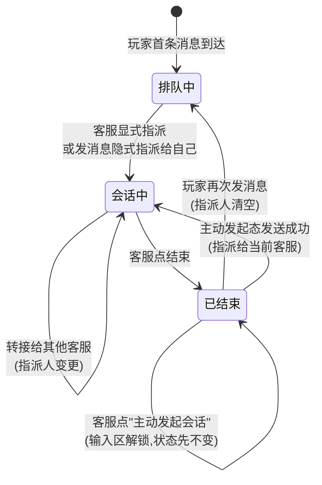
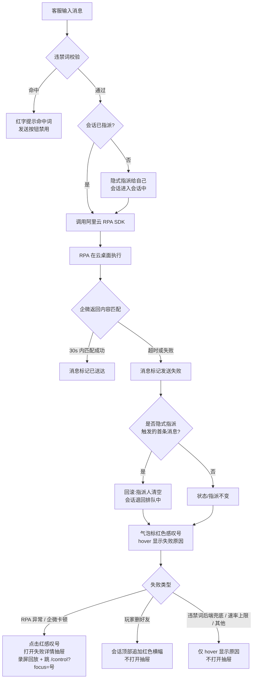
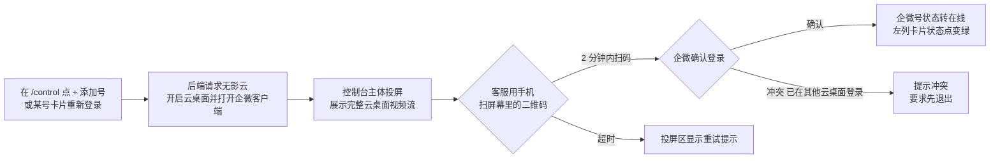
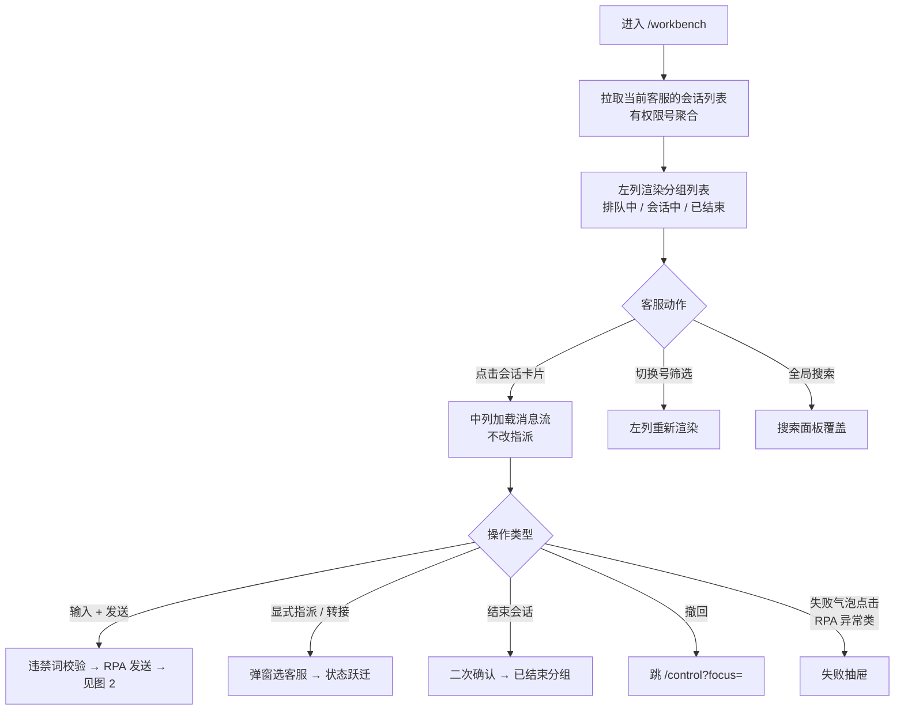
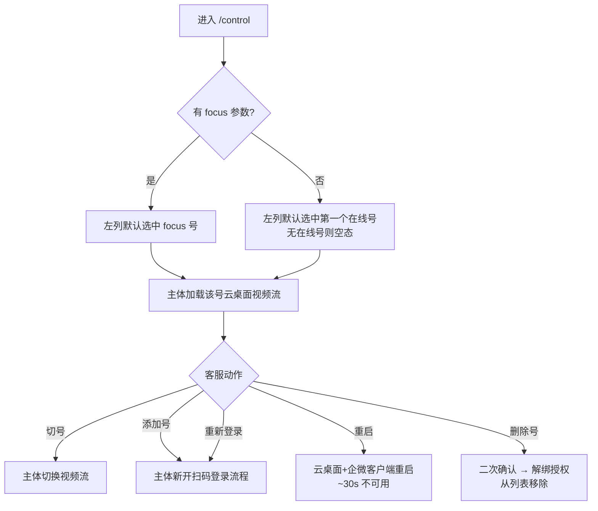
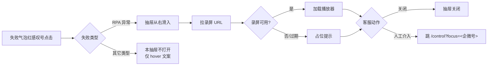
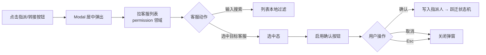
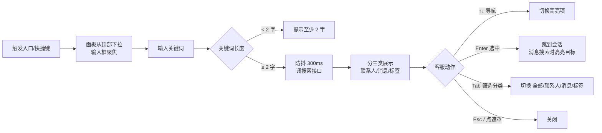

# 需求业务背景

## 业务诉求

**一句话目标**:让客服在一个自建后台里,同时管理 N 个企微号的 VIP 玩家会话,实现消息聚合、统一回复、操作可追溯。

具体诉求:

1. 运营侧能在一个工作台里看到所有负责的企微号消息,无需在多台手机 / 多台电脑之间切换。
2. 通过 RPA + 无影云绕开企微"无消息发送 API"的限制,让客服在 Web 后台直接输入即可发送消息,并能识别发送成功 / 失败。
3. 消息发送出问题(封号、卡顿、玩家删好友)时能立即告警、回放 RPA 录屏、人工介入,保证玩家体验与风控合规。

## 概念说明

| 概念 | 定义 |
| --- | --- |
| 客服(坐席) | 登录 ChatFlow 的运营同事,一人可同时负责多个企微号。 |
| 企微号 | 一个企业微信账号,固定绑定一台无影云桌面,长期在同一 IP 登录以规避封号。 |
| 云桌面(无影) | 运行企业微信客户端的远程 Windows 桌面,由阿里云 RPA 在其上模拟人工操作。 |
| 玩家 | 被 VIP 运营添加的企微好友,一个玩家可能被多个企微号添加(一对多)。 |
| 会话 | 一个企微号 × 一个玩家的对话单元;状态机见 `delivery/prd.md`。 |
| 指派人 | 会话当前负责的客服;默认为空,指派后会话进入"会话中"分组。一个会话同一时刻只有一个指派人。 |
| 消息 | 会话中的一条文本 / 图片 / 视频 / 附件 / 链接;由 RPA 发送或会话存档 API 回拉。 |
| 会话存档 API | 企微官方合规能力,可在开通后拿到聊天记录;本领域消息接收的唯一数据源。 |
| RPA 发送 | 业务后台把发送请求下发到阿里云 RPA,由 RPA 在云桌面中模拟人工点击与输入,把消息发出去。 |
| 企微号控制台 | 独立路由 `/control` 的页面;承载企微号扫码登录、状态详细监控、人工介入云桌面、人工撤回消息;与 `/workbench` 并列在顶栏。 |
| 撤回入口 | V1 不具备自动撤回能力;客服点撤回菜单跳转 `/control` 在企微客户端手动完成。 |

# 功能现状

## 功能当前状态

**全新领域,无历史页面。**

现状(线下)的痛点即是本领域要替代的工作方式:

- 客服用企微官方后台 / 企微 PC 客户端 + 手机 AB 双开方式接待玩家;
- 7×24 轮班,搭档需要远程控制对方电脑回复,协作成本高;
- 工作量只能按"维护人数 + 回复条数"粗估,无法按客服粒度精准核算。

## 数据当前状态

### 数据源(真实链路)

| 类型 | 来源 | 用途 |
| --- | --- | --- |
| 消息收 | 企微会话存档 API | 拉取玩家↔客服的聊天记录 |
| 消息发 | 阿里云 RPA(SDK 代码开发模式) | 在无影云上模拟人工点击发送 |
| 账号/好友关系 | 企业微信 API | 获取企微号成员、好友列表、标签、备注 |
| 无影云状态 | 无影云 API | 企微号登录 / 在线 / 掉线 / 封禁监控 |

### 本领域 V1 的数据策略

- Mock 数据为主,真实链路留接入契约(写进 `project/tech/` 后续版本)。
- Mock 规模参照调研《企业微信 RPA 方案调研》的 GOF 单号均值 ≈ 50 条/小时,以 2 个企微号 + 2 个客服做演示基线。

### 已知数据缺口与外部依赖

- 客服权限模型未定 → 影响客服 ↔ 企微号 ↔ 角色的字段设计(由 [permission](../permission/design.md) 领域承担)
- 企微会话存档 API 的数据拉取频率与延迟契约未定 → 影响"未读消息"的更新节奏
- 无影云 API 配额与超时契约未定 → 影响企微号状态轮询节奏
- SCRM 数据互通接口(标签、玩家档案)未定 → 影响跨领域(player-center)的字段同步

这些均记录在 [`project/research/v1.0-qiwei-rpa.md`](../../research/v1.0-qiwei-rpa.md) 的「待确认问题」里跟踪。

# 功能梳理

## 功能实现思路

### 页面分层

V1 包含**两个并列的顶栏一级 tab**:`/workbench`(会话工作台)和 `/control`(企微号控制台)。

#### `/workbench` 三列布局(左窄 / 中宽 / 右弹)

1. **左列 — 会话分组与搜索**
   - 顶部:**会话分组列表(默认聚合所有有权限的号)**;每条会话卡片显示玩家昵称 + 最近消息预览,按 `排队中 / 会话中 / 已结束` 折叠(默认"已结束"折叠)。卡片里**不展示所属企微号**,需要切到具体号时通过底部筛选按钮处理;打开会话后中列标题栏会显示所属号
   - 底部:左侧"按号筛选"图标按钮(`FilterOutlined`,**多选**,默认勾选全部号 = 不筛选;非全选时按钮高亮并在右上角显示数字角标,代表当前已勾选数量)+ 右侧综合搜索入口(`Ctrl+K`)
2. **中列 — 会话主视图**
   - 顶部:会话标题栏(玩家昵称、所属企微号徽标、当前指派人,操作条:**指派 / 转接** / 置顶 / 标记 / 结束 / 撤回入口)
   - 主体:消息流(按时间倒序,带发送状态标识:已送达 / 失败)
   - 底部:输入区(文本 + 图片/视频/附件上传 + 发送按钮,发送前走违禁词拦截)
3. **右列 — 玩家档案抽屉**
   - 由 `player-center` 领域承载,chat-workbench 只做挂载位与触发时机

#### `/control` 双区布局(参考飞书 EWAP 控制台样式)

1. **左列 — 企微号选择器**
   - 当前客服有权限的企微号卡片列表(头像、号名、状态点、未读小气泡)
   - 卡片右键菜单:重新登录 / 删除号
   - 底部 `+ 添加号` 主按钮入口
   - 支持 URL query `?focus=<企微号 id>` 默认选中
2. **主体 — 云桌面投屏**
   - 完整云桌面视频流(无影云 API 提供,占据主体大部分空间)
   - 控制条(主体底部):重启 / 重新登录 / 删除号
   - 默认覆盖整个视图,客服直接在该区域看二维码、操作云桌面客户端、手动撤回消息等
   - 工作台 ↔ 控制台切换走顶栏一级 tab 或 `Ctrl+\`,本页不再单独提供"返回工作台"按钮(避免和顶栏冗余)

### 关键取舍

- **登录管理做得简单**:V1 不引入客服状态机(在线/小休/离线),登录即在岗、关闭即走人。
- **会话分配靠显式指派**:V1 不上智能路由,会话是否"进入会话中"以**指派人**为准。指派有两条路径:
  - 客服手动点击中列顶部的"指派"按钮 → 选择自己或其他同事;
  - 客服在当前会话发送消息时,如果当前还没有指派人,系统**自动指派给该客服自己**(兜底,避免漏指派)。
  - 仅点击会话卡片只是"打开查看",不改变指派状态,也不改变分组。
- **消息发送先只走 SDK**:不做"可视化组件"路径;错误处理依赖"发送后匹配 + 录屏回放"。
- **企微号管理与会话工作分离**:V1 把"管号"(扫码、状态详细、补救)和"接待"(收发消息)拆成两个独立路由 — `/workbench` 专注接待,`/control` 专注管号;失败兜底 / 撤回 / 重新登录都集中到 `/control`,降低工作台中列上下文打断。
- **撤回与人工介入统一去 `/control`**:RPA 无法自动撤回;失败介入也需要看完整云桌面。两者带着企微号 query 跳 `/control` 默认聚焦,在控制台主体的云桌面投屏里手动操作。

### 核心流程(文字概述)

- **查看会话**:新消息 → 会话进入"排队中"分组(指派人为空) → 客服点击会话卡片 → 中列加载消息流(仅查看,不改变分组和指派)。
- **指派会话**(两条路径):
  - **显式指派**:客服在中列顶部点击"指派"按钮 → 选择自己或其他客服 → 会话从"排队中"跃迁到"会话中",指派人字段落位。
  - **发消息隐式指派**:客服在输入区发送首条消息时,如指派人为空,系统自动把指派人置为该客服,再走发送流程,会话跃迁到"会话中"。
- **发送消息**:客服在输入区输入 → 违禁词客户端校验 → 发送按钮点击 →(若未指派,先隐式指派给自己)→ 后端调用 RPA SDK → RPA 在云桌面执行 → 拿到企微返回内容后,将消息标为"已送达"或"发送失败"。
- **失败处理**:匹配失败或 RPA 报错 → 消息条右上角红色感叹号 → hover 显示失败原因 → 客服点"回放录屏"查看,或选择"人工介入" → 跳 `/control?focus=<企微号>`,主体直接是该号云桌面。
- **结束会话**:客服点右上角"结束会话" → 二次确认 → 会话移入"已结束"分组,指派人保留作历史记录;本次不做自动结束。
- **消息撤回**:客服在消息条上右键 / 点菜单 → 选"撤回" → V1 弹文字提示"将跳转控制台手动撤回" → 跳 `/control?focus=<企微号>` 在云桌面手动操作。
- **登录企微号**:客服在 `/control` 点 `+ 添加号` 或某个号卡片的"重新登录" → 主体投屏开启云桌面并打开企微客户端 → 客服用手机扫屏幕里的二维码 → 状态变在线。
- **客服主动发起已结束会话**:客服在已结束会话标题栏点"主动发起会话" → 输入区解锁(状态机和指派人**先不变**) → 客服输入并发送首条消息 → 调 RPA → 若返回**成功**:会话切到"会话中"、指派人写为该客服、清掉主动发起态;若**失败**:状态保持已结束、不写指派、主动发起态保留可继续重试。

## 事项拆解

按"能独立落地的最小颗粒"拆。共 19 条:18 条对应 roadmap 里本领域的 V1 覆盖条目(R007 与 R042 在本领域合并建模为一条事项),1 条为本领域追加的"会话指派"(V1 闭环必需,roadmap 同步跟进)。
下列 `来源 R*` 是飞书《ChatFlow》规划表的行号,方便回溯源头;未标 `R*` 的是本领域追加项。

### 企微号管理(3 条,承载于 `/control`)

| 事项 | 来源 R* | 说明 | 阻塞后续 |
| --- | --- | --- | --- |
| 企微号扫码登录 | R018 | 在 `/control` 主体的云桌面投屏里扫码登录企微;UI 提供"+添加号"和"重新登录"两个入口 | 阻塞多号切换、状态监控和所有消息事项 |
| 多号同窗口切换 | R019 | 双向切换:`/control` 左列切号(看哪个号的云桌面),`/workbench` 左列筛选条切号(看哪个号的会话) | 无 |
| 企微号状态监控 | R020 | 工作台顶栏告警徽章 + 控制台主体的详细监控,两层并存:在线 / 掉线 / 封禁 + 异常通知 | 无 |

### 会话中心(10 条)

| 事项 | 来源 R* | 说明 | 阻塞 |
| --- | --- | --- | --- |
| 消息接收 | R021 | 从会话存档 API 拉消息,入库后在 UI 实时刷新 | 阻塞未读、聚合视图、分组、发送相关事项 |
| 未读消息数量 | R022 | 按会话、按企微号聚合 | 无 |
| 未读消息通知 | R023 | 浏览器通知 / 页面红点 / 音效 | 无 |
| 多号会话聚合视图 | R024 | 左列按号或按玩家聚合 | 无 |
| 会话分组 | R028 | 排队中(指派人为空)/ 会话中(已指派)/ 已结束;分组跃迁由指派动作和结束动作驱动,不由点击会话驱动 | 依赖会话指派事项 |
| 会话指派 | 追加 | 中列顶部"指派"按钮 → 选择客服(默认自己);发送消息时如未指派自动指派给自己;仅查看会话不改变指派 | 阻塞分组跃迁、会话转接 |
| 会话标记 | R033 | 打自定义标记(如"跟进中""重要") | 无 |
| 会话置顶 | R034 | 置顶的会话排左列最上 | 无 |
| 会话转接(基础版) | R031 | 把指派人从自己变更到其他客服,玩家无感;等价于"重新指派" | 依赖会话指派事项 |
| 结束会话 | R036 | 人工点击结束,二次确认;保留指派人历史记录 | 无 |

### 消息发送与合规(5 条)

| 事项 | 来源 R* | 说明 | 阻塞 |
| --- | --- | --- | --- |
| 发送消息 | R040 | 文本 / 图片 / 视频 / 附件 / 链接 / emoji | 阻塞发送校验、失败回放、违禁词拦截 |
| 发送结果校验 | R041 | RPA 发出后根据企微返回内容匹配 | 无 |
| 发送失败展示与介入 | R042 + R007 | 所有失败类型 → 消息气泡右上角红色感叹号 + hover 显示具体失败原因 + 会话状态/指派人**不变更**。点击红感叹号的行为按失败类型差异化:**RPA 异常 / 企微卡顿** → 打开失败详情抽屉(原因 / 录屏回放 / 跳 `/control?focus=<企微号>` 介入按钮);**玩家已删好友**(R007 合并)→ 不打开抽屉,但会话顶部追加红色横幅"此玩家已删好友,后续消息无法送达";**违禁词兜底 / 速率上限 / 其他** → 不打开抽屉,只用 hover 提示 | 无 |
| 消息撤回入口 | R045 | 右键菜单选"撤回" → 弹文字提示 → 跳 `/control?focus=<企微号>` 在云桌面手动操作 | 无 |
| 违禁词拦截 | R065 | **仅拦截客服 → 玩家方向的消息**(发送前本地校验 + 后端兜底);词库从 ops-admin 同步。玩家发来的消息不做任何拦截,完整展示 | 依赖 ops-admin 维护违禁词库 |

### 会话辅助(1 条)

| 事项 | 来源 R* | 说明 | 阻塞 |
| --- | --- | --- | --- |
| 综合搜索 | R039 | 联系人 / 聊天记录 / 玩家标签 | 无 |

### V1 刻意不做(在本领域登记,避免混淆)

| 不做 | 原因 | 去向 |
| --- | --- | --- |
| R032 会话挂起(小休) | 无状态机;客服登录即在岗 | v1.1 与智能路由同批 |
| R035 插入快捷回复 | 减少 V1 表面积 | v1.1 知识库一起 |
| R048-R050 客服状态 / 接待上限 / 状态日志 | V1 无状态机 | v1.1 配合路由 |
| 智能路由 / 自动转接 | 降低 V1 复杂度 | v1.1 automation 领域 |

## 跨领域接口约定(初稿)

- 右侧玩家档案挂载位:由 chat-workbench 提供 slot,由 `player-center` 渲染。
- 玩家标签 / 备注:展示层由 `player-center` 负责;消息里"@某玩家"的身份识别由 chat-workbench 传参(玩家 open_id / 企微号 open_id)。
- 违禁词库:由 `ops-admin` 维护;chat-workbench 前端订阅词库变化,在**客服发送给玩家**的消息上做本地校验并阻止发送。**玩家发给客服的消息不做任何拦截**,避免遗漏真实情报。
- 权限与客服账号:由 [`permission`](../permission/design.md) 领域统一承担。chat-workbench 拿到的是"当前客服身份 + 我有权限的企微号集合 + 我能转接给的客服列表",不直接管理角色或鉴权细节。
- 企微号 ↔ 云桌面绑定关系:由 `ops-admin` 维护(企微号注册、与无影云桌面机器的对应);chat-workbench 控制台读取展示与切换。
- 视频流接入:控制台主体的云桌面投屏由无影云 API 提供视频流(协议待研发对齐);chat-workbench 仅做容器与控制条。

# 功能详细描述

> 当前阶段:`design`。本章节按 `product-design-kit/design/product-design.md` 规范补齐。
> D1(骨架)已落:领域结构 / 页面清单 / 业务流程图 / 共享规则。
> D2(主页面详设)与 D3(辅助页面详设)待补。

## 领域结构与模块关系

### 模块职责表

| 模块 / 页面 | 主要目标 | 入口 | 依赖对象 | 关联关系 | 备注 |
| --- | --- | --- | --- | --- | --- |
| 客服工作台主页 | 承载消息收发、会话管理 | 顶栏"工作台"tab,登录后默认落点 | 企微会话存档 API / 阿里云 RPA / ops-admin 违禁词库 / permission 权限授权 / player-center 玩家档案 | 三列模块在这里内嵌 | 路由 `/workbench` |
| 企微号控制台页 | 承载企微号扫码登录、状态详细监控、人工介入云桌面、人工撤回 | 顶栏"控制台"tab;失败介入和撤回入口跳转 | ops-admin 企微号-云桌面绑定 / permission 授权 / 无影云 API + 视频流 | 接收 `?focus=<企微号 id>` query 默认聚焦 | 路由 `/control`(参考飞书 EWAP 控制台) |
| 会话列表模块 | 按分组展示**所有有权限的号**的会话卡片(排队中/会话中/已结束) | 工作台左列中部 | 企微会话存档 | 点击会话 → 刷新"会话主视图";顶部筛选条切单号视图 | 置顶标记在这里体现 |
| 会话主视图模块 | 展示单个会话的消息流、顶部操作条、底部输入区 | 点击会话列表里任一会话 | 企微会话存档 / 阿里云 RPA | 顶部操作条 → 指派/转接/标记/置顶/结束/撤回入口;底部 → 发送消息;右侧挂 PlayerAside | V1 最大模块 |
| 玩家档案挂载位 | 在会话主视图右侧展示玩家信息 | 会话打开时自动挂载 | player-center 领域 | 只提供 slot,内容由 player-center 渲染 | 跨领域接口 |
| 企微号选择器列(控制台内) | 在控制台左列展示有权限的企微号卡片,点击切换主体投屏的号 | 控制台默认渲染 | permission 授权 + ops-admin 企微号-云桌面绑定 + 无影云状态 | 切换会刷新主体云桌面投屏 | 含底部 `+ 添加号` 入口 |
| 云桌面投屏区(控制台内) | 完整云桌面视频流 + 控制条(全屏 / 刷新 / 重新登录 / 跳回工作台) | 控制台主体 | 无影云 API 视频流 | 切换号 / 接收 query 时刷新视频源 | V1 最重 RPA 依赖,Mock 阶段用静态截图占位 |
| 转接/指派弹窗 | 选择会话的目标客服(指派或转接) | 会话主视图顶部"指派"/"转接"按钮 | permission 客服列表 | 成功后会话状态机跃迁 | 二级 Modal |
| 失败详情抽屉 | 展示 RPA 异常类失败的原因、录屏回放、人工介入入口 | **仅 RPA 异常类**失败气泡红感叹号点击触发 | 阿里云 RPA 录屏 | "人工介入"按钮跳 `/control?focus=<企微号>` | 从右侧 Drawer 打开;玩家删好友 / 违禁词兜底 / 速率上限等不触发本抽屉 |
| 综合搜索面板 | 搜索联系人 / 聊天记录 / 玩家标签 | 工作台左列底部搜索框 / 键盘 `Ctrl+K` | 会话存档索引 + player-center 标签 | 点击结果 → 跳会话并高亮 | 覆盖在左列上方的 Popover 或独立面板 |
| 全局告警区 | 企微号掉线 / 封禁等风控告警 | 顶栏通知铃铛 + 浏览器通知 | 无影云状态监控 + 后端推送 | 工作台和控制台都能看到 | 全局级,跨页面 |

### 依赖关系(文字版)

- **数据依赖**:所有消息来自企微会话存档 API;所有发送经阿里云 RPA;企微号生命周期由无影云 API 管理。三者目前都未定接口契约,记入 `待确认问题`。
- **跨领域依赖**:
  - 玩家档案 / 标签 / 备注 → `player-center`(右侧挂载位,不嵌字段,按 slot 协议)
  - 违禁词库 / 企微号-云桌面绑定 / 初始化配置 → `ops-admin`
  - 客服账号 / 角色 / 企微号授权 / 鉴权 → `permission`
- **内部依赖**:会话主视图依赖企微号池的"当前号"状态;会话列表也依赖;三列布局通过全局 context 共享"当前企微号"和"当前会话"。

## 页面清单

### 页面清单表

| 页面 / 模块 | 路径 | 主要角色 | 页面目标 | 主要功能区 | 备注 |
| --- | --- | --- | --- | --- | --- |
| 客服工作台主页 | `/workbench` | 客服 | 完成会话接待全流程 | 左列(会话列表 + 搜索)/ 中列(会话主视图)/ 右列(玩家档案) | V1 默认落点 |
| 企微号控制台页 | `/control` | 客服 | 管理企微号:扫码登录 / 状态监控 / 云桌面人工介入 / 重启 / 删号 | 左列(企微号选择器 + `+ 添加号`)/ 主体(云桌面投屏 + 控制条) | 顶栏一级 tab,与 `/workbench` 并列;支持 `?focus=<企微号 id>` |
| 失败详情抽屉 | `/workbench` 内触发 | 客服 | 诊断发送失败 + 发起人工介入 | 原因 + 录屏回放 + 跳 `/control` 介入按钮 | 抽屉 |
| 转接/指派弹窗 | `/workbench` 内触发 | 客服 | 指派会话或转接给他人 | 客服选择 + 可选备注 | Modal |
| 综合搜索面板 | `/workbench` 内触发 | 客服 | 快速定位联系人/消息/标签 | 搜索框 + 分类结果 | Popover / 面板 |

### 路由与导航

- V1 有 **2 个业务路由**:`/workbench`(默认落点)和 `/control`,通过顶栏一级 tab 切换。
- 顶栏一级 tab 顺序:**工作台 / 控制台**(未来 player-center / ops-admin / permission 启用时再追加)。
- Tab 间切换不卸载对方页面状态(保留滚动位、未发送的输入草稿)。
- 登录成功后默认落到 `/workbench`;失败介入 / 撤回 / 重新登录从 `/workbench` 跳 `/control` 时携带 `?focus=<企微号 id>` query。
- 抽屉、弹窗、面板都在所属路由内部通过状态切换控制开启,不占独立 URL。

## 业务流程图

### 图 1:会话状态机



**要点**:

- 所有状态跃迁都有**明确的驱动事件**(玩家消息 / 客服动作),不会"自己走"。
- "已结束 → 排队中"时,指派人清空,需要重新指派。
- "会话中 → 会话中"的自循环代表转接动作(指派人变更,状态不变)。
- "已结束 → 会话中" 仅在客服点"主动发起会话"且**首条消息发送成功**时跃迁,指派给当前客服;失败时停留在"已结束",输入区保持解锁可继续重试。
- 玩家长时间沉默不自动变更状态,会话仍留在"会话中";是否要沉睡 / 清理逻辑留给 v1.1+ 讨论。

### 图 2:消息发送完整流程



### 图 3:企微号扫码登录流程



**要点**:客服看到的是**完整云桌面视频流**(不是单独的二维码图),控制台主体一直保留这个视频流,这样后续如果有安全弹窗、绑定提示、人工撤回都能在同一个区域里实时看到并操作。

## 共享规则与状态边界

### 1. 会话状态机规则

- 三个状态:**排队中 / 会话中 / 已结束**,同时刻只属一个。
- 指派人字段:
  - `null` → 会话必定在"排队中"
  - 非 null 且会话未结束 → 会话必定在"会话中"
  - `已结束` 保留历史指派人,用于统计,但不能对会话执行操作
- "已结束"状态下玩家再次发消息 → 会话重新进入"排队中",指派人清空,需要重新指派。
- V1 不做基于时间的自动状态流转(如"长时间沉默 → 离线");是否引入在 v1.1+ 结合运营反馈再评估。
- **隐式指派首条消息失败 → 回滚**:如果消息发送是"隐式指派(原指派人为空)同步触发"的,且这条消息发送失败,则回滚指派人为空、会话退回"排队中"。等价于"这次指派没有真正成立"。
- **后续消息失败不回滚**:会话已经在"会话中"且指派人已稳定(显式指派 / 转接 / 多条消息后)时,任何消息发送失败都不再改状态机和指派人 — 客服自己负责重发或介入。
- **客服主动发起(已结束)→ 发送成功才跃迁**:已结束会话点击"主动发起会话",输入区解锁但状态机和指派人**先不变**。仅当首条消息发送**成功**时,才把状态置为"会话中"并把指派人写为当前客服(等价于一次显式指派,在 `assigneeHistory` 里以 `reason='explicit'` + `note='客服主动发起'` 留痕)。发送失败 → 状态保持"已结束",指派人不变,输入区维持解锁可继续重试。**不复用隐式指派的回滚逻辑**(因为成功之前根本没指派过)。
- 主动发起态属于"客服未提交前的临时 UI 态",不持久化;客服主动取消发起、切换会话或刷新页面会清除该临时态。

### 2. 指派规则

- 显式指派:通过"指派"按钮选择任意在线客服(含自己);转接是"指派人从 A 变 B"。
- 隐式指派:首次发消息时,指派人为空则自动写入当前客服。
- **客服主动发起(已结束会话)**:由当前客服在已结束会话上点"主动发起会话"开启,语义等价于一次"延迟到首条消息发送成功才落地"的显式指派;只能选自己,不能在主动发起态指派给他人(转接按钮整组在已结束态被禁用)。
- 同一时刻一个会话**只有一个指派人**;不允许多客服并行接待。
- 客服对**非自己指派**的会话只能**只读查看**,不能发消息、不能结束、不能改标记和置顶。
- 点击左列会话卡片 = 打开查看,不改变指派,不改变分组。
- **隐式指派的"首条消息失败回滚"规则**(详见状态机规则):隐式指派同步触发的那条消息失败时,指派人回滚为空、会话回排队中,把会话让回去给其他人抢;后续指派稳定后再失败,不再回滚。
- **主动发起的"成功才指派"规则**(详见状态机规则):点"主动发起"不立即写指派人,首条发送成功才把指派人置为当前客服并跃迁到"会话中";失败时无任何状态/指派变更,可继续在主动发起态重试。

### 3. 权限边界

- 客服可见的企微号 = 该客服在 [`permission`](../permission/design.md) 领域被授权的号集合。
- **V1 授权粒度到企微号级**(每个企微号单独授权给某客服/某客服组),由 permission 领域定义具体角色与授权语义。
- 客服账号体系:**ChatFlow 自身领域承担** — 客服账号、密码/登录、角色、授权关系全部在 permission 领域;不依赖外部身份/权限平台(后续如要接外部 SSO 由 permission 领域内做兼容)。
- chat-workbench 拿到的是"当前客服身份 + 我有权限的企微号集合 + 我能转接给的客服列表",不直接参与权限决策。
- 超出权限的会话在任何视图(左列、搜索、聚合)都不展示。
- 权限由后端(permission 领域接口)决定,chat-workbench 前端只做展示层守卫(假设后端为准)。

### 4. 风控与合规规则(继承 `project/research/v1.0-qiwei-rpa.md`)

- **发送频率上限**:单号 N 条/小时(默认 1000,可后端配置);前端超过阈值时按钮禁用 + 提示"已达上限"。
- **IP 一致性**:企微号绑定云桌面固定 IP,客户端无感知,后端保证。
- **违禁词拦截方向**:违禁词规则**只作用于客服 → 玩家的出站消息**,即在发送按钮点击前做本地校验 + 后端兜底校验。**玩家 → 客服的入站消息不过滤、完整展示**,保留真实上下文供客服判断与留痕。
- **敏感信息脱敏**:**V1 不做脱敏**,客服在所有视图(消息流、搜索结果、通知 preview)均看到完整原文;脱敏字段清单和规则待运营侧确认后,v1.1+ 再加入渲染层。
- **操作留痕**:所有客服在本领域的操作(登录、发送、转接、结束、撤回入口点击)全部记录操作日志,V1 只记录到后端,不在前端提供查看入口(`v1.3 operate-log` 再开)。

### 5. 消息类型支持清单

| 类型 | V1 支持 | 发送(客服 → 玩家) | 接收(玩家 → 客服) | 备注 |
| --- | --- | --- | --- | --- |
| 文本 | ✅ | ✅ | ✅ | 长度上限由企微规定,前端不限 |
| 图片 | ✅ | ✅ | ✅ | 单图 ≤ 20MB |
| 视频 | ✅ | ✅ | ✅ | 单文件 ≤ 50MB |
| 文件(其他类型) | ✅ | ✅ | ✅ | 单文件 ≤ 50MB |
| 链接 | ✅ | ✅ | ✅ | V1 不做链接白名单 |
| Emoji | ✅ | ✅ | ✅ | 系统 emoji,不做自定义 |
| 表情包 | 部分 | ❌(V1 无法 RPA 实现) | ✅(展示) | 客服发图片替代 |
| 语音 | ❌ | ❌ | 展示占位 | V1 不解析语音 |
| 公众号卡片 / 小程序卡片 | 部分 | ❌ | ✅(展示) | 只展示不能转发 |
| 红包 / 位置 / 名片 | ❌ | ❌ | 展示占位 | 不在 V1 范围 |

### 6. 实时性与 SLA(V1 锁定值)

- **玩家消息到达 → 前端可见:≤ 10s**(通过会话存档 API → 后端长连推送 WebSocket / SSE → 前端)。
- **客服点发送 → 消息标已送达:≤ 5s**(含 RPA 执行 + 企微返回匹配)。
- **企微号状态变更 → 前端可见:≤ 10s**(无影云状态事件,同样走长连推送)。
- 超过 2× 目标时间即视为"数据延迟",UI 顶部横幅告警。
- 数据推送通道:**后端长连(WebSocket 或 SSE)是唯一通道**,V1 前端不做轮询兜底(长连断开 → 自动重连 + 重连期间顶部"重连中..."状态)。

### 7. 空态 / 加载 / 错误态规则

- 空会话:中列展示欢迎插图 + "选择左侧会话开始工作"(不点击不做任何动作)。
- 加载态:列表骨架屏 3s 超时后降级为 spinner;消息流首次拉取 loading 盖整个中列;后续增量拉取无 loading。
- 错误态:顶部横幅 + "刷新"按钮;不清空已加载数据。
- 权限受限:不展示"无权限"空页,直接从列表过滤掉。

### 8. 键盘与可访问性

- `Ctrl+K`:打开综合搜索。
- `Ctrl+\`:在工作台 / 控制台之间切换顶栏 tab。
- `Enter`:发送;`Shift+Enter`:换行。
- 焦点态使用主色深阶 `#06A052` 2px outline。
- 所有操作按钮有 `title` 属性,悬停显示完整名称。

## 设计例外说明(领域级)

### 1. 会话气泡圆角

- 继承品牌规范:全局圆角 6px → **会话气泡使用 8px**(在 `ui-brand.md` 已预留例外口径,本领域确认采纳)。
- 原因:IM 气泡是会话领域的核心视觉元素,更大圆角更符合聊天工具的视觉认知;6px 会显得过于"表单化"。
- 影响范围:仅会话主视图消息流;其他按钮、卡片、输入框仍用 6px。

### 2. 强告警的色彩面积

- 继承品牌规范:强调信息"小面积用主色" → **风控告警允许更大色块**:
  - 封号事件:顶部横幅整条用错误色 `#FF4D4F` 浅背景 `#FFF1F0`
  - 删好友:会话顶部横幅用橙色 `#FAAD14` 浅背景 `#FFF7E6`
- 原因:客服轮班 7×24,告警容易被忽略;大面积色彩是唯一能"强制注意"的手段。
- 影响范围:仅风控相关告警横幅,普通信息提示仍遵守小面积原则。

### 3. 消息流密度

- 继承品牌规范:正文 13px,行高 1.5 → **消息正文 13px,行高 1.55**。
- 原因:消息是大段连续阅读,行高稍松可降低疲劳;差距微小但累计影响显著。
- 影响范围:仅消息气泡正文;其他文本仍遵守 1.5。

## 页面详细设计与模块展开

> 当前阶段:D2(主页面详设)。两个独立路由 `/workbench` 与 `/control` 分别展开。

### 待展开清单

- [x] D2 客服工作台主页(`/workbench`) — 含会话列表(全号聚合)、会话主视图、玩家档案挂载位
- [x] D2 企微号控制台页(`/control`) — 含企微号选择器列、云桌面投屏区、扫码登录与人工介入
- [x] D3 失败详情抽屉
- [x] D3 转接/指派弹窗
- [x] D3 综合搜索面板

---

## 页面 1:`/workbench` 客服工作台

### 1.1 页面概述

- **页面目标**:客服在一个屏幕里完成多企微号会话的查看、接待、消息收发和会话管理。**V1 工作台只承载"接待动作",不承载"管号动作"**(管号在 `/control`)。
- **主要角色**:客服(坐席)
- **页面入口**:登录后默认落点;顶栏"工作台"tab。
- **页面出口**:
  - 顶栏切到"控制台"tab
  - 失败气泡点"人工介入"→ 跳 `/control?focus=<企微号>`
  - 消息撤回菜单 → 跳 `/control?focus=<企微号>`
- **本页负责**:消息接收 / 发送、会话状态机、指派、违禁词出站校验、综合搜索入口、玩家档案挂载位
- **本页不负责**:扫码登录、企微号添加 / 删除、云桌面投屏、客服账号管理

### 1.2 页面功能流程



### 1.3 数据流说明

- **输入**:
  - 当前客服身份(从 `permission` 领域)
  - 有权限的企微号集合(从 `permission` 领域)
  - 会话列表(后端长连推送,初次进入用 REST 拉一次,后续增量推送)
  - 消息流(选中会话后按需拉取 + 长连推送增量)
  - 玩家档案(由 `player-center` 领域提供,挂在右列)
  - 违禁词库(由 `ops-admin` 维护,前端订阅)
- **处理**:
  - 状态机:消息到达 / 客服指派 / 结束 等事件驱动状态跃迁
  - 隐式指派校验:输入框点发送前判断指派人是否为空
  - 违禁词出站拦截:本地校验 + 后端兜底
  - 失败首条隐式判定:发送失败时回查"是否本会话首条 + 当前消息触发了隐式指派",决定是否回滚
- **输出**:
  - 消息发送(向后端发起 RPA 调用)
  - 会话状态变更(向后端持久化)
  - 跳路由 `/control?focus=<id>`(失败介入 / 撤回)
  - 玩家档案右列展开 / 折叠(向 `player-center` 传递当前会话玩家 id)

### 1.4 页面布局设计详情

```text
┌──────────────────────────────────────────────────────────────────┐
│ TopBar (48px)                                                     │
│  Logo  | 工作台▼ 控制台 | (spacer)        🔔  搜索⌘K  👤客服头像  │
├───────────┬────────────────────────────────┬─────────────────────┤
│ 左列 280  │ 中列  flex                      │ 右列 360 可折叠      │
│           │ ┌────────────────────────────┐ │                     │
│ 排队中(3) │ │ 会话标题栏 + 操作条 (52px)  │ │ 玩家档案挂载位       │
│ ┌───────┐│ ├────────────────────────────┤ │ (player-center 领域) │
│ │卡片   ││ │ 消息流                      │ │                     │
│ │卡片   ││ │ ↑ 历史                      │ │  - 玩家头像/昵称     │
│ └───────┘│ │ ↓ 最新                      │ │  - 备注/标签         │
│           │ │                              │ │  - 自定义字段       │
│ 会话中(8) │ │                              │ │  - 企微关系          │
│ ┌───────┐│ ├────────────────────────────┤ │  - 会话历史          │
│ │卡片📌 ││ │ 输入区 (96px 含工具条)     │ │                     │
│ │卡片   ││ │  [📷📁😀] 文本框      [发送]│ │                     │
│ └───────┘│ └────────────────────────────┘ │                     │
│           │                                  │ ▶ 折叠按钮           │
│ 已结束(15)│                                  │                     │
│ ▼ (折叠)  │                                  │                     │
│           │                                  │                     │
│ ──────  │                                  │                     │
│[⛛筛选号][🔍 综合搜索 ⌘K]                  │                     │
└───────────┴──────────────────────────────────┴─────────────────────┘
```

| 区域 | 宽度 | 内容 | 备注 |
| --- | --- | --- | --- |
| TopBar | 100% × 48px | Logo / Tab 切换 / 搜索入口 / 通知铃 / 客服菜单 | 跨页面共享 |
| 左列 | 280px 固定 | 筛选条 + 会话分组 + 搜索按钮 | 会话数量多时虚拟滚动 |
| 中列 | flex(自适应) | 会话标题栏 + 消息流 + 输入区 | 未选中会话时显示欢迎插图 |
| 右列 | 360px,可折叠到 0 | 玩家档案(player-center 渲染) | 折叠状态用窄边按钮 |

### 1.5 功能区详情

#### 1.5.1 TopBar

| 元素 | 行为 |
| --- | --- |
| Logo | 点击回到 `/workbench` 默认状态 |
| Tab(工作台 / 控制台) | 当前激活项主色下划线;`Ctrl+\` 在两者间切换 |
| 全局搜索入口(⌘K) | 点击 / 快捷键打开搜索面板 |
| 通知铃 | 红点指示企微号告警(掉线/封禁等);hover 看最近 5 条;点击展开通知中心 |
| 客服头像菜单 | 显示当前客服昵称;下拉:个人偏好(关闭提示音)/ 退出登录 |

#### 1.5.2 左列 — 底部工具条(筛选 + 搜索)

放在左列最底部,横向并列两个按钮(占一行高 36~40px):

| 控件 | 行为 | 视觉 |
| --- | --- | --- |
| 号筛选(`FilterOutlined` 图标按钮) | 点击弹出 Popover(向上展开),**多选**:顶部"全部号"半选 / 全选 checkbox + 各号 checkbox(状态点 + 名称 + 离线/封禁标识)。**默认勾选全部号 = 等价于不筛选**。切换不保留滚动位 | 默认描边图标按钮;**非全选**时按钮主色边框 + 主色文字 + **右上角红色数字角标**(显示已选数量);**全选**时按钮回归默认态、不带角标 |
| 综合搜索按钮 | 点击 / `Ctrl+K` 打开搜索面板 | 占满底部条剩余宽度,按钮文字"综合搜索 ⌘K" |

筛选面板交互细节:

- 顶部"全部号":点击切换"全选 ↔ 全不选";中间状态(部分选中)显示半选样式
- 当前选中会话所属的号被取消勾选 → 直接关闭中列,不弹二次确认
- 全部取消勾选 → 会话列表为空,Tooltip 提示"当前未勾选任何号,会话列表为空"

#### 1.5.3 左列 — 会话分组列表

分组顺序固定:**排队中 → 会话中 → 已结束**。每个分组可独立折叠(默认:排队中和会话中展开,已结束折叠)。

会话卡片字段:

| 字段 | 含义 | 视觉 |
| --- | --- | --- |
| 玩家头像 | 圆形 36×36 | 左侧 |
| 玩家昵称 | 优先备注 → 否则原昵称 | 第一行加粗 |
| 最近消息预览 | 最新一条消息文本(20 字内) | 第二行,次文本色 |
| 时间戳 | 最近消息时间 | 右上,12px 辅助色 |
| 未读气泡 | 数字红色徽章 | 右下,99+ 截断 |
| 置顶图标 📌 | 已置顶时显示 | 卡片左侧金色边 + 第三行小图标 |
| 标记图标 | 跟进中 / 重要 / 待回访 等 | 第三行小图标排列(无图标时该行不渲染) |
| **所属企微号** | 卡片**不展示**,故意省略以保持密度;打开会话后中列标题栏可见;需要按号筛选时使用左列底部漏斗按钮 | — |

卡片右键菜单:**置顶/取消置顶 / 标记 / 复制玩家昵称**。

#### 1.5.4 中列 — 会话标题栏

| 区域 | 内容 |
| --- | --- |
| 左侧 | 玩家头像 + 昵称 + 企微号徽标 + 当前指派人(无 → "未指派"灰色)+ **会话 ID**(等宽小字 + 复制图标,点击即复制并 toast 反馈) |
| 右侧操作条(进行中) | 指派 / 转接 / 标记 / 置顶 / 结束会话 |
| 右侧操作条(已结束 + 默认) | **主动发起会话**(主色幽灵按钮)/ 标记 / 置顶 / 结束会话(后三者禁用) |
| 右侧操作条(已结束 + 主动发起态) | **取消发起** / 标记 / 置顶 / 结束会话(后三者禁用) |

按钮启用规则:

- 当前会话指派人 ≠ 当前客服 → 转接/标记/置顶/结束 全部禁用(只读)
- 指派人为空 → 显示"指派"按钮;否则显示"转接"
- 已结束分组的会话:**所有标准操作按钮(指派 / 转接 / 标记 / 置顶 / 结束会话)全部禁用,仅可查看历史**;唯一可点的是"主动发起会话"(且需满足下面的"可发起"条件)
- "主动发起会话"按钮的 disable 条件(任一命中即禁用,tooltip 解释原因):
  - 该会话所属的企微号 **离线 / 封禁**(发起后大概率发不出去,直接拦在按钮)
  - 该会话的玩家 **已删好友**(`playerHasDeletedFriendship=true`)
- "主动发起会话"按钮可点时,tooltip 提示语义("解锁输入区,发送成功后会话进入会话中"),避免和普通"指派"混淆

#### 1.5.5 中列 — 消息流

- 时间倒序(老消息在上,新消息在下),自动滚到底
- 用户向上手动滚 → 不强制下滚,新消息到达时显示"↓ 新消息"小气泡引导
- 消息气泡:
  - 客服消息靠右,主色浅阶背景 `#E8F8EE`
  - 玩家消息靠左,白底 + 1px 边框
  - 圆角 8px(领域例外)
  - 状态图标:发送中(loading)/ 已送达(✓ 灰)/ 失败(❗红)
  - 失败状态:hover 气泡显示原因;点击红感叹号(仅 RPA 异常类)打开失败抽屉
- 媒体消息:图片缩略 200×200,点击放大;视频带播放按钮缩略图;文件显示文件名 + 大小 + 下载图标
- 系统消息:居中灰色,无气泡(如"会话已结束""玩家已删好友"横幅独立于消息流)

#### 1.5.6 中列 — 输入区

```text
┌─────────────────────────────────────────────────┐
│ [图片📷] [文件📁] [Emoji😀]            [发送 ▷] │  ← 工具条 + 发送按钮
├─────────────────────────────────────────────────┤
│  文本输入(多行,自适应高度,最大 4 行后滚动)     │
└─────────────────────────────────────────────────┘
违禁词命中:命中词以红底高亮,下方红字提示"含违禁词:xxx"
```

| 元素 | 行为 |
| --- | --- |
| 文本框 | Enter 发送 / Shift+Enter 换行;粘贴图片直接走图片上传 |
| 图片按钮 | 选择图片(jpg/png/gif),≤ 20MB |
| 文件按钮 | 选择任意文件,≤ 50MB |
| Emoji 面板 | 系统 emoji,不含自定义表情包 |
| 发送按钮 | 主色;违禁词命中时禁用并红字提示 |

会话指派人 ≠ 当前客服时,**整个输入区不渲染**(替换成提示条:"此会话已指派给 XX,你只能查看")。

会话已结束时:

- **默认**:输入区不渲染,提示"会话已结束,如需继续沟通请点击右上角「主动发起会话」"
- **主动发起态**(已点过"主动发起会话"按钮):输入区正常渲染,顶部追加一条 info 横幅说明语义("发送成功后会话将进入会话中并指派给你;失败状态保持不变,可继续重试");其余表现与普通输入区一致(违禁词校验 / 媒体上传 / Enter 发送)
- 企微号离线 / 封禁时主动发起按钮禁用,无法进入主动发起态

#### 1.5.7 右列 — 玩家档案挂载位

- chat-workbench 仅提供 slot 容器(width 360px,可折叠)
- 渲染由 `player-center` 领域负责,通过 `playerId + accountId` 上下文传参
- 折叠按钮:位置在左侧中部,折叠后宽度 0(给中列腾空间)

### 1.6 关键交互说明

| 场景 | 触发 | 系统处理 | 成功结果 | 失败 / 异常 |
| --- | --- | --- | --- | --- |
| 打开会话 | 点击左列卡片 | 拉消息流 + 加载玩家档案 | 中列渲染;不改指派 | 拉取失败 → 中列空态 + 重试按钮 |
| 显式指派 | 点指派按钮 → 选客服 | 写入指派人 | 会话进"会话中" | 网络错误 → 弹 toast,状态不变 |
| 隐式指派(发首条) | 输入消息后点发送 | 同步写入指派人 + 触发 RPA | 状态跃迁 + 等送达 | 见 1.7 边界场景 / 见图 2 |
| 转接 | 点转接 → 选客服 | 修改指派人 | 玩家无感,目标客服会话列表更新 | 目标客服未登录 → 提示但允许 |
| 结束会话 | 点结束 → 二次确认 | 状态设为已结束 | 移入已结束分组 | 玩家如再来消息 → 重新进排队 |
| 标记 / 置顶 | 卡片右键 / 标题栏菜单 | 个人视图操作 | 立即生效 | 置顶超 10 → 提示 |
| 失败 hover | 鼠标悬停红感叹号 | 读 message.failureReason | Tooltip 显示原因 | — |
| 失败点击(RPA异常) | 点击红感叹号 | 拉录屏 URL | 打开失败抽屉 | 录屏过期 → 抽屉里提示 |
| 撤回 | 右键消息 → 撤回 | 弹文字提示 | 跳 `/control?focus=<号>` | — |
| 主动发起会话 | 已结束会话标题栏点"主动发起会话" | 进入主动发起态(临时 UI 状态);输入区解锁,顶部加 info 横幅 | 状态机/指派人不变,等待首条消息发送 | 企微号离线/封禁 或 玩家已删好友 → 按钮禁用 + tooltip 说明原因 |
| 主动发起 + 发送成功 | 主动发起态发送一条消息且企微返回成功 | 状态切到会话中、指派给当前客服(reason=`explicit`,note=`客服主动发起`),清空主动发起态 | 会话进入"会话中"分组 | — |
| 主动发起 + 发送失败 | 主动发起态发送失败 | 不改状态、不写指派,主动发起态保留 | 输入区可继续重试 | RPA 异常类同样可点感叹号开抽屉 |
| 取消发起 | 主动发起态点"取消发起" | 清掉临时态 | 会话退回默认已结束态(输入区锁回) | — |
| 复制会话 ID | 点标题栏 ID 徽标 | navigator.clipboard 写入 | toast "会话 ID 已复制" | 浏览器不支持 → 静默不报错 |
| 切号筛选 | 左列下拉 | 重渲染会话列表;当前打开的会话若属其他号直接关闭(不弹二次确认) | 中列回到默认欢迎态 | — |
| 分组折叠 | 点击左列分组标题 | 折叠/展开该分组卡片列表 | 折叠态隐藏卡片,标题保留计数 | — |
| 切到控制台 tab | 点 tab 或 `Ctrl+\` | 路由切换,状态保留 | `/control` 渲染 | — |

### 1.7 边界场景

| 场景 | 表现 |
| --- | --- |
| 会话列表为空 | 左列展示"暂无会话,等待玩家上门"插图 |
| 中列未选中会话 | 中列居中欢迎插图 + "选择左侧会话开始工作" |
| 消息流首次加载 | 整个中列骨架屏,3s 超时降级为 spinner |
| 长连断开 | 顶部黄色横幅"实时消息暂时不可用,正在重连..." + 按钮"立即重试";期间消息不丢,重连后增量补齐 |
| 网络离线 | 顶部红色横幅 + 输入区禁用 |
| 企微号掉线 | 该号下所有会话标题栏标黄色"离线",输入区禁用 |
| 企微号封禁 | 该号下所有会话标红色"封号告警",输入区禁用,顶部红色横幅持续显示直到管理员处理 |
| 隐式指派首条失败 | 见图 2:回滚指派 + 会话回排队中 + 红色感叹号 + hover 原因 |
| 后续消息失败 | 仅红感叹号 + hover,会话状态不变 |
| 主动发起首条失败 | 红感叹号 + hover 原因;状态保持已结束、不写指派;主动发起态保留可继续重试 |
| 主动发起首条成功 | 状态切会话中、指派给当前客服(reason=`explicit`,note=`客服主动发起`);自动清掉主动发起态 |
| 已结束 + 企微号离线/封禁 | "主动发起会话"按钮禁用 + tooltip 说明原因;同时账号横幅按既有规则展示 |
| 已结束 + 玩家已删好友 | "主动发起会话"按钮禁用 + tooltip 说明原因;会话顶部仍展示删好友横幅 |
| 玩家删好友 | 失败 + 会话顶部追加红色横幅"此玩家已删好友,后续消息无法送达" |
| 速率上限 | 输入框失焦时如已达号上限 → 发送按钮禁用 + tooltip 提示 |
| 多 Tab 同账号 | 状态以后端推送为准,< 2s 延迟同步 |
| 切换号导致会话被关 | 直接关闭中列(不弹二次确认),回到默认欢迎态 |

### 1.8 设计例外说明(本页面级)

无新增,继承"领域级设计例外"中的 3 条(气泡圆角 8px / 强告警大色块 / 消息流行高 1.55)。

---

## 页面 2:`/control` 企微号控制台

### 2.1 页面概述

- **页面目标**:客服在控制台**集中管理企微号**:扫码登录新号、查看号在云桌面里的完整运行状态、在云桌面里手动操作(撤回消息、处理弹窗、人工介入失败发送)。
- **主要角色**:客服(坐席)
- **页面入口**:
  - 顶栏"控制台"tab
  - `/workbench` 失败抽屉的"人工介入"按钮 → `/control?focus=<企微号>`
  - `/workbench` 撤回菜单的"跳转控制台手动撤回"提示 → `/control?focus=<企微号>`
  - 直接访问 URL `/control?focus=<企微号>`
- **页面出口**:顶栏切回"工作台"(`Ctrl+\` 或点击顶栏 tab);本页不再单独提供"返回工作台"按钮。
- **本页负责**:扫码登录企微号、号状态详细监控、云桌面视频流投屏与操作、删号 / 重启
- **本页不负责**:消息收发(在 `/workbench`)、玩家档案、综合搜索

### 2.2 页面功能流程



### 2.3 数据流说明

- **输入**:
  - 当前客服身份 + 有权限的企微号集合(`permission` 领域)
  - 企微号 ↔ 云桌面机器绑定关系(`ops-admin` 领域)
  - 各号在线状态(无影云 API 长连推送)
  - 视频流 URL(无影云 API,Mock 阶段降级为静态截图或循环录屏 mp4)
  - URL query `?focus=<企微号 id>`
- **处理**:
  - 切号时停止旧视频流、启动新视频流
  - 添加号时调用无影云"启动新桌面 + 打开企微客户端"接口,等扫码完成事件
  - 重启:对当前选中号触发云桌面 + 企微客户端重启(约 30s 不可用)
  - 删除号:二次确认后调后端解绑云桌面与该号的所有授权,前端从左列移除并切到下一个号
- **输出**:
  - 启动 / 关闭视频流连接
  - 触发扫码登录后端流程
  - 触发重启 / 删号后端流程

### 2.4 页面布局设计详情

```text
┌──────────────────────────────────────────────────────────────────┐
│ TopBar (48px)                                                     │
│  Logo  | 工作台 控制台▼ | (spacer)         🔔  搜索⌘K  👤        │
├──────────┬───────────────────────────────────────────────────────┤
│ 左列 240 │ 主体 flex                                               │
│          │ ┌──────────────────────────────────────────────────┐ │
│ 号卡片   │ │                                                    │ │
│ ┌──────┐ │ │                                                    │ │
│ │👤 ●在 │ │ │            云桌面视频流(自适应)                    │ │
│ │小琴号 │ │ │                                                    │ │
│ │ 12未读│ │ │            (Mock 阶段:静态截图)                    │ │
│ └──────┘ │ │                                                    │ │
│ ┌──────┐ │ │                                                    │ │
│ │👤 ●离 │ │ │                                                    │ │
│ │小贝号 │ │ │                                                    │ │
│ └──────┘ │ │                                                    │ │
│ ┌──────┐ │ │                                                    │ │
│ │👤 ●封 │ │ │                                                    │ │
│ │小娟号 │ │ │                                                    │ │
│ └──────┘ │ │                                                    │ │
│          │ │                                                    │ │
│ ──────  │ └──────────────────────────────────────────────────┘ │
│ [+ 添加号]│ 控制条:🔌重启 ⟲重新登录 🗑删除号                     │
└──────────┴───────────────────────────────────────────────────────┘
```

| 区域 | 宽度 / 高度 | 内容 |
| --- | --- | --- |
| TopBar | 100% × 48px | 与工作台共享(同一组件) |
| 左列 | 240px | 号卡片列表 + 底部 `+ 添加号` 主按钮 |
| 主体 | flex | 视频流投屏 + 底部控制条 |
| 控制条 | 100% × 40px | 重启 / 重新登录 / 删除号 |

### 2.5 功能区详情

#### 2.5.1 TopBar(继承)

与 `/workbench` 完全共享,见 1.5.1。

#### 2.5.2 左列 — 号选择器

号卡片字段:

| 字段 | 含义 | 视觉 |
| --- | --- | --- |
| 头像 | 企微号头像 | 圆形 36×36 |
| 号简称 / 名称 | 由 ops-admin 维护 | 第一行加粗 |
| 状态点 | ●绿在线 / ●灰离线 / ●红封禁 | 头像右下角 |
| 未读小气泡 | 该号下所有会话未读总和 | 右上角徽章 |
| 上次活跃时间 | 12px 辅助色 | 第二行 |

交互:

- 点击切换主体投屏号
- 当前选中卡片左边主色实线条 + 浅背景
- 卡片右键菜单:`重新登录` / `删除号`(后者带二次确认)
- 列表底部 `+ 添加号` 主按钮入口
- 当前客服无权限的号不在列表中

#### 2.5.3 主体 — 云桌面投屏区

- 真实链路:无影云 API 提供视频流(WebRTC / 自研协议待定)
- Mock 阶段:展示一张企微 PC 客户端截图 + 静态光标 + 闪烁的"录制中 ●"标识(模拟视频感)
- 视频流尺寸:自适应主体可用空间,保持 16:9
- 加载态:占位骨架 + "云桌面连接中..." + spinner
- 视频流上方默认透明无遮罩;扫码登录态会有半透明遮罩 + 引导文案"请用手机企业微信扫描屏幕中的二维码"

#### 2.5.4 控制条

| 按钮 | 行为 | 启用条件 |
| --- | --- | --- |
| 🔌 重启 | 重启当前选中号绑定的云桌面 + 企微客户端,二次确认;约 30s 不可用 | 选中号且号未删除 |
| ⟲ 重新登录 | 等同号卡片右键的"重新登录"(进入扫码态) | 当前号在线/离线均可 |
| 🗑 删除号 | 二次确认后从 ChatFlow 删除该号、解绑云桌面与所有授权;会话历史保留但不再可接待 | 选中号 |

### 2.6 关键交互说明

| 场景 | 触发 | 系统处理 | 成功结果 | 失败 / 异常 |
| --- | --- | --- | --- | --- |
| URL 直访带 focus | `/control?focus=A` | 左列选中 A | 主体显示 A 的云桌面 | 无权限/号不存在 → 退到默认状态 + toast |
| 切号 | 点击其他号卡片 | 关旧流 + 启新流 | 主体切换 | 新流建连失败 → 占位错误 + 重试 |
| 添加号 | 左列底部主按钮 | 启新桌面 + 打开企微 + 扫码遮罩 | 扫码成功 → 号变在线 + 加入左列 | 超时 → 遮罩内提示重试 |
| 重启 | 控制条"重启"按钮 | 二次确认 → 重启云桌面 + 企微客户端 | 完成后号回在线 | 重启失败 → toast |
| 删除号 | 左列右键菜单 / 控制条"删除号" | 二次确认 → 解绑云桌面 + 移除授权 | 左列移除该号 + toast | 后端拒绝 → toast |
| 长连断开(状态推送) | 后端断流 | 顶部黄色横幅 | 自动重连 | — |
| 投屏断开 | 视频流中断 | 主体显示"投屏已断开" | 自动重连 | 多次重连失败 → 提示"联系运维" |

### 2.7 边界场景

| 场景 | 表现 |
| --- | --- |
| 客服无任何号权限 | 左列空态 + 主体居中插图 + "你尚未被授权任何企微号,请联系管理员" |
| 列表里只有离线号 | 默认不自动选;主体居中提示"请选择一个号或重新登录" |
| 选中号封禁中 | 主体投屏正常显示企微界面(可能弹出企微的封禁提示);左列卡片状态点红色 + "封禁中" |
| 扫码登录冲突(其他桌面已登录) | 视频流里能看到企微原生提示"已在其他设备登录";控制台叠加横幅"该号已在其他云桌面登录,请先退出"+ 按钮"前往原桌面" |
| 视频流性能不足 | 自动降码率;Mock 阶段用静态图不涉及 |
| 重启时点别处 | 重启操作异步进行(toast 提示),客服可以切到其他号继续工作;该号在重启完成前不可用 |
| 删除当前选中号 | 二次确认后从列表移除,主体自动切到剩余第一个号(若无号则进入空态) |
| 切到工作台 tab 后再回来 | 视频流保持(状态保留);若超过 30s 未操作可降级为静态画面节省带宽 |

### 2.8 设计例外说明(本页面级)

- **主体几乎全是视频流**:不遵守"小面积主色"规则,视频流是页面唯一主视觉,**周围 UI 极简**(左列 / 控制条都用最低密度)。
- **视频区允许深色背景** `#1F1F1F`:与品牌规范的"卡片白底"冲突,但视频流上叠浅色 UI 反光严重,需要黑底反衬。仅本页主体视频区生效。

---

## 模块 3:失败详情抽屉(D3-1)

### 3.1 概述

- **目标**:展示**仅 RPA 异常类**失败的详细原因 + 录屏回放,让客服决定是否人工介入。
- **角色**:客服
- **入口**:`/workbench` 消息流里 RPA 异常类失败气泡的红感叹号点击。
- **出口**:关闭抽屉(× / Esc / 点击遮罩);"人工介入"按钮 → 跳 `/control?focus=<企微号>`。
- **本模块负责**:展示原因码与原文、播放 RPA 录屏、引导跳转控制台介入。
- **本模块不负责**:玩家删好友 / 违禁词兜底 / 速率上限的失败展示(那些不打开本抽屉);消息重发(由会话主视图承担)。

### 3.2 流程



### 3.3 数据流

- **输入**:`messageId` / `failureCode`(枚举原因码)/ `failureMessage`(原文)/ `recordingUrl`(可能为空 / 过期)/ `accountId` / `executedAt`(RPA 执行时间)
- **处理**:抽屉打开时按需拉取录屏 URL(若懒加载);处理 URL 过期(超 30 天)
- **输出**:点击介入 → 路由跳转携带 `accountId`;关闭抽屉不更新任何后端状态

### 3.4 布局

```text
                                        ┌────────────────────────────────┐
                                        │ 发送失败详情               × Esc│ ← 头部 56px
                                        ├────────────────────────────────┤
                                        │ 失败类型徽章: RPA 异常          │
                                        │ 原因码: RPA_TIMEOUT             │ ← 摘要区
                                        │ 时间: 2026-05-18 15:42          │
                                        │ 企微号: 小琴号                  │
                                        ├────────────────────────────────┤
                                        │ 失败原文(后端原始消息):         │
                                        │ ┌────────────────────────────┐ │
                                        │ │ "RPA 操作超时,云桌面 30s   │ │
                                        │ │  内未响应。建议重试或人工" │ │
                                        │ └────────────────────────────┘ │
                                        ├────────────────────────────────┤
                                        │ 操作录屏:                      │
                                        │ ┌────────────────────────────┐ │
                                        │ │                            │ │
                                        │ │   ▶  视频播放器(420×236) │ │
                                        │ │                            │ │
                                        │ └────────────────────────────┘ │
                                        │ 录屏保留 30 天 / 大小: 4.2 MB   │
                                        ├────────────────────────────────┤
                                        │            [ 关闭 ]  [人工介入]│ ← 底部按钮区 64px
                                        └────────────────────────────────┘
                                        宽度 480px,从右滑入,半透明遮罩
```

| 区域 | 高度 | 内容 |
| --- | --- | --- |
| 头部 | 56px | 标题 + 关闭按钮 |
| 摘要区 | 自适应 | 失败类型徽章 + 原因码 + 时间 + 企微号 |
| 原文区 | 自适应 | 后端原始错误消息(等宽字体灰底框) |
| 录屏区 | ~280px | 视频播放器 + 元数据 |
| 按钮区 | 64px | 关闭(默认) + 人工介入(主色) |

### 3.5 字段详情

#### 摘要区字段

| 字段 | 控件 | 来源 | 备注 |
| --- | --- | --- | --- |
| 失败类型徽章 | Tag | `failureCategory` | 红底白字,本抽屉始终显示"RPA 异常" |
| 原因码 | 等宽文字 | `failureCode` | 例:`RPA_TIMEOUT` / `WECHAT_FREEZE` / `DESKTOP_DISCONNECT` |
| 时间 | 文本 | `executedAt` | 显示为本地时区,精确到秒 |
| 企微号 | 文本 + 状态点 | `accountId` 关联号 | 状态点反映实时状态 |

#### 录屏播放器

| 元素 | 行为 |
| --- | --- |
| 播放控件 | 标准 HTML5 video,自动加载首帧 |
| 时长显示 | 当前 / 总时长 |
| 全屏按钮 | 进入浏览器全屏 |
| 元数据 | 录屏保留期(默认 30 天)+ 文件大小 |
| 加载失败占位 | "录屏不可用或已过期" + 重试按钮(若失败原因是网络) |

#### 按钮区

| 按钮 | 类型 | 行为 |
| --- | --- | --- |
| 关闭 | 次按钮 | 关抽屉,不改任何状态 |
| 人工介入 | 主按钮 | 跳 `/control?focus=<accountId>`;同时关闭抽屉 |

### 3.6 交互说明

| 场景 | 触发 | 系统处理 | 成功结果 | 失败 / 异常 |
| --- | --- | --- | --- | --- |
| 打开抽屉 | 点击 RPA 异常类红感叹号 | 取本地 message 元数据 + 异步拉录屏 URL | 滑入 + 内容渲染 | 录屏 URL 拉取失败 → 占位 |
| 关闭抽屉 | × / Esc / 点遮罩 | 卸载播放器停止下载 | 抽屉消失 | — |
| 切换其它失败气泡 | 抽屉打开时点击别的失败气泡 | 复用抽屉,刷新内容 | 平滑替换内容 | — |
| 录屏播放 | 点 ▶ | 标准视频播放 | — | 视频文件 404 → 占位 + 联系运维 |
| 人工介入 | 点按钮 | 路由跳转 + 关抽屉 | `/control` 默认聚焦该号 | — |

### 3.7 边界场景

| 场景 | 表现 |
| --- | --- |
| 录屏过期(> 30 天) | 录屏区域显示灰色占位 + "录屏已过期";按钮区"人工介入"仍可用 |
| 录屏 URL 网络错 | 显示"录屏加载失败" + 重试按钮 |
| 同一会话连续 RPA 异常 | 客服可在抽屉打开期间点其它失败气泡,抽屉内容平滑切换 |
| 浏览器宽度 < 768px | 抽屉占满屏宽,变成全屏 Drawer |
| 抽屉打开时网络断 | 顶层显示重连横幅,抽屉内容保留;录屏播放暂停 |
| 抽屉打开时长连推送了新消息 | 不影响抽屉,后台正常更新会话流 |

### 3.8 设计例外

- 录屏播放器是嵌入式视频,继承 `/control` 视频区的深色背景例外(`#1F1F1F`),但仅限于播放器内部,抽屉其它区域仍是白底。

---

## 模块 4:转接 / 指派弹窗(D3-2)

### 4.1 概述

- **目标**:让客服把会话指派给人(包括自己)或转接给其他客服。
- **角色**:客服
- **入口**:`/workbench` 会话标题栏的"指派"按钮(指派人为空)/ "转接"按钮(已指派且为当前客服)。
- **出口**:确认 → 写入指派人后关闭;取消 → 关闭不改状态。
- **场景区分**:
  - **指派模式**:当前指派人为空 → 标题"指派会话",可选包含自己
  - **转接模式**:当前指派人为自己 → 标题"转接会话",**不可选自己**

### 4.2 流程



### 4.3 数据流

- **输入**:`conversationId` / `currentAssigneeId`(可能为空)/ 当前客服 id / 可指派客服列表(由 permission 领域提供)
- **处理**:列表过滤(指派模式可含自己,转接模式排除自己)
- **输出**:`POST /assignments {conversationId, assigneeId, note}`;成功后通知会话状态机

### 4.4 布局

```text
              ┌──────────────────────────────────────┐
              │  指派会话                          ×  │ ← 头部 56px
              ├──────────────────────────────────────┤
              │  会话信息(只读):                     │
              │  玩家:小琪    所属企微号:小琴号      │
              ├──────────────────────────────────────┤
              │  目标客服 *                          │
              │  ┌───────────────────────────────┐   │
              │  │ 🔍 搜索姓名 / 工号             │   │
              │  └───────────────────────────────┘   │
              │  ┌───────────────────────────────┐   │
              │  │ ○ 我自己 (推荐)                │   │
              │  │ ○ 张三  /会话量 5  ●在线       │   │
              │  │ ○ 李四  /会话量 12 ●在线       │   │
              │  │ ○ 王五  /会话量 0  ●离线       │   │
              │  └───────────────────────────────┘   │
              │                                       │
              │  内部备注(选填,玩家不可见)           │
              │  ┌───────────────────────────────┐   │
              │  │                                │   │
              │  └───────────────────────────────┘   │
              │  0 / 200                              │
              ├──────────────────────────────────────┤
              │              [ 取消 ]  [ 确认指派 ]   │ ← 底部 64px
              └──────────────────────────────────────┘
              宽度 480px,居中弹出,半透明遮罩
```

| 区域 | 内容 |
| --- | --- |
| 头部 | 标题(模式不同显示不同)+ 关闭 |
| 会话信息 | 只读展示玩家昵称 + 企微号 |
| 目标客服 | 搜索框 + 客服列表(单选) |
| 内部备注 | 选填多行文本,200 字内 |
| 底部按钮 | 取消(次)/ 确认(主) |

### 4.5 字段详情

#### 客服列表字段

| 字段 | 含义 | 视觉 |
| --- | --- | --- |
| 单选圆 | 当前选中标记 | 主色实心 |
| 头像 | 客服头像 | 圆形 28×28 |
| 姓名 / 工号 | 必填 | 加粗 |
| 当前会话量 | 数字徽章 | 次文本色 |
| 在线状态点 | 在线 ●绿 / 离线 ●灰 | 头像右下 |
| "推荐"标识 | 指派模式且自己时 | 主色 Tag,标在自己一行 |

排序规则:**指派模式** = 自己最前 + 在线 + 会话量少在前;**转接模式** = 在线 + 会话量少在前(排除自己)。

#### 备注字段

| 字段 | prop | 控件 | 校验 |
| --- | --- | --- | --- |
| 内部备注 | `note` | Textarea (3 行) | 选填,200 字内,字数计数器 |

#### 按钮规则

| 按钮 | 启用条件 |
| --- | --- |
| 取消 | 始终启用 |
| 确认 | 必须选中目标客服后启用 |

### 4.6 交互说明

| 场景 | 触发 | 系统处理 | 成功结果 | 失败 / 异常 |
| --- | --- | --- | --- | --- |
| 打开指派弹窗 | 标题栏"指派"按钮 | 拉客服列表 | 列表渲染,自己排首并标"推荐" | 列表拉取失败 → 占位 + 重试 |
| 打开转接弹窗 | 标题栏"转接"按钮 | 拉列表 + 排除自己 | 列表渲染 | 同上 |
| 搜索 | 输入框输入 | 本地按姓名 / 工号模糊匹配 | 实时过滤 | 关键词为空显示全列表 |
| 选中客服 | 点列表项 | 单选切换 + 启用确认 | 高亮 | — |
| 提交 | 点确认 | `POST /assignments` | 状态机跃迁 / 关闭弹窗 / 工作台刷新 | 网络/权限错误 → 弹窗内 toast,状态不变 |
| 取消 | 点取消 / Esc / 点遮罩 | 关闭 | 不改任何状态 | — |

### 4.7 边界场景

| 场景 | 表现 |
| --- | --- |
| 列表为空(无可指派客服) | 显示"暂无可用客服"插图;确认按钮禁用 |
| 转接模式下只有自己 | 显示"暂无其他客服可转接";确认按钮禁用 |
| 选中后目标客服离线 | 允许选,但单选项右侧 Tag 黄字"目标客服当前未登录" |
| 网络中断 | 提交时 toast 报错;客服列表保留(已加载) |
| 同时另一客服在抢这个会话 | 后端冲突错误 → 弹窗内显示"会话已被 XX 指派",建议重新评估;关闭按钮 |
| 弹窗打开时玩家发新消息 | 不影响弹窗;新消息走全局推送,工作台后台更新 |

### 4.8 设计例外

无,继承品牌规范。

---

## 模块 5:综合搜索面板(D3-3)

### 5.1 概述

- **目标**:全局快速定位**联系人 / 聊天记录 / 玩家标签**,直接跳到对应会话。
- **角色**:客服
- **入口**:工作台左列底部"🔍 搜索"按钮 / TopBar "搜索⌘K" / 快捷键 `Ctrl+K`(任何路由内可触发)。
- **出口**:Esc 关闭 / 点击结果跳到对应会话(自动选中并高亮目标消息)。
- **范围**:**当前客服有权限的数据**;权限外的不展示。
- **本模块负责**:跨号搜索 + 结果分类展示 + 跳转。
- **本模块不负责**:玩家档案搜索(由 player-center 自己提供)/ 企微号搜索(`/control` 左列直接看)。

### 5.2 流程



### 5.3 数据流

- **输入**:关键词 / 当前客服 id / 权限范围
- **处理**:防抖 300ms 后调后端搜索接口,Mock 阶段用本地索引
- **输出**:跳路由 `/workbench?conversationId=&messageId=`,工作台收到 query 后定位

### 5.4 布局

```text
   ┌───────────────────────────────────────────────────┐
   │ 🔍 输入关键词搜索联系人 / 聊天记录 / 标签   Esc 关闭│ ← 输入区 56px
   ├───────────────────────────────────────────────────┤
   │ [全部] [联系人] [消息] [标签]                      │ ← 分类筛选 40px
   ├───────────────────────────────────────────────────┤
   │ 联系人 (3)                          查看更多 ▶     │
   │ ┌───────────────────────────────────────────────┐ │
   │ │ 👤 小琪 (备注: VIP_001)  / 小琴号             │ │
   │ │ 👤 小白 / 小贝号                              │ │
   │ │ 👤 小琴 / 小琴号                              │ │
   │ └───────────────────────────────────────────────┘ │
   │                                                    │
   │ 消息 (5)                            查看更多 ▶     │
   │ ┌───────────────────────────────────────────────┐ │
   │ │ 小琪: "...这个**优惠券**怎么用?" 1天前         │ │
   │ │ 小白: "**优惠券**已发,请查收" 3天前           │ │
   │ │ ...                                           │ │
   │ └───────────────────────────────────────────────┘ │
   │                                                    │
   │ 标签 (2)                                          │
   │ ┌───────────────────────────────────────────────┐ │
   │ │ #VIP-A  关联 28 个玩家                         │ │
   │ │ #高消费 关联 15 个玩家                         │ │
   │ └───────────────────────────────────────────────┘ │
   └───────────────────────────────────────────────────┘
   宽度 720px,居中靠上(距顶 64px),半透明遮罩
```

| 区域 | 高度 | 内容 |
| --- | --- | --- |
| 输入区 | 56px | 搜索框(自动聚焦)+ Esc 提示 |
| 分类筛选 | 40px | Tab 风格按钮组,默认"全部" |
| 结果区 | 自适应,最大 600px | 三段(联系人 / 消息 / 标签),每段 5 条 + 查看更多 |

### 5.5 字段详情

#### 输入框

| 字段 | prop | 控件 | 行为 |
| --- | --- | --- | --- |
| 关键词 | `query` | 单行 Input | 自动聚焦;`Cmd/Ctrl+A` 全选;支持中英文 |

#### 联系人结果项

| 字段 | 含义 | 备注 |
| --- | --- | --- |
| 头像 | 玩家头像 | 圆形 32×32 |
| 玩家昵称 | 命中关键词时高亮 | 优先备注 → 否则原昵称 |
| 所属企微号 | 小色块徽标 | 搜索结果跨号需要消歧,这里保留(左列卡片不展示是为了密度) |
| Tag(若按标签命中) | 显示命中的标签 | 主色浅阶 |

#### 消息结果项

| 字段 | 含义 | 备注 |
| --- | --- | --- |
| 发送方 | 客服 / 玩家昵称 | 加粗 |
| 消息预览 | 命中关键词高亮 + 上下文 ±10 字 | **加粗**显示命中词 |
| 时间 | 相对时间(1 天前 / 3 小时前) | 12px 辅助色 |
| 所属会话徽章 | 玩家昵称 + 企微号简称 | 跳转目标 |

#### 标签结果项

| 字段 | 含义 | 备注 |
| --- | --- | --- |
| 标签名 | 命中关键词时高亮 | 形如 `#VIP-A` |
| 关联玩家数 | 数字徽章 | 点击展开列表(暂不实现,V1 跳到玩家筛选页面 — `player-center` 领域承接) |

#### 分类筛选 Tab

| Tab | 行为 |
| --- | --- |
| 全部 | 显示三段,每段最多 5 条 |
| 联系人 | 仅联系人,显示最多 50 条 |
| 消息 | 仅消息,显示最多 100 条 |
| 标签 | 仅标签,显示最多 50 条 |

### 5.6 交互说明

| 场景 | 触发 | 系统处理 | 成功结果 | 失败 / 异常 |
| --- | --- | --- | --- | --- |
| 触发面板 | 入口按钮 / `Ctrl+K` | 渲染 + 输入框聚焦 | 面板下拉 | — |
| 输入关键词 | 键入 | 防抖 300ms → 调搜索接口 | 实时更新结果 | 接口超时 → 顶部进度条 |
| 关键词 < 2 | 输入区下方提示 | 不调接口 | "请至少输入 2 个字符" | — |
| 切换分类 Tab | 点击 / `Tab` 键 | 重新调接口 | 该类结果展开 | — |
| 键盘上下 | `↑` / `↓` | 移动高亮选中项 | 当前项主色背景 | — |
| 选中跳转 | `Enter` / 点击 | 关闭面板 + 路由跳转 | 工作台定位会话 | 会话已结束 → 仍跳转,工作台显示历史 |
| 点查看更多 | 段头按钮 | 切换到对应分类 Tab | 单类全量展示 | — |
| 关闭 | `Esc` / 点遮罩 / 点 × | 关闭面板 | 不改路由 | — |

### 5.7 边界场景

| 场景 | 表现 |
| --- | --- |
| 无结果 | 各段显示"无匹配项"+ 插图;整体最少展示输入框和"换个关键词试试" |
| 关键词命中量超 100 | 单类 Tab 下显示"仅展示前 100 条,请缩小范围" |
| 搜索接口慢(> 1s) | 输入框右侧 spinner |
| 搜索接口失败 | 顶部红字 "搜索失败,请重试" + 重试按钮 |
| 客服权限变更(列表中途) | 重新调接口拿最新权限范围内结果 |
| 跳转目标会话已被结束 | 跳工作台后,中列正常加载历史 |
| Mock 阶段 | 本地 JSON 索引 + 简单 includes 匹配,展示一致 UI |

### 5.8 设计例外

无,继承品牌规范。

---

## 关键交互与边界场景

> 留到 D2 / D3 页面详设时按页面分别写,此处仅列全局级别的关键边界,避免页面重复:

- 企微号掉线/封禁 → 全局告警区立即展示 + 该号下所有会话输入区禁用。
- 违禁词库后端更新 → 前端通过长连推送接收增量变更,命中规则实时切换,不刷新页面。
- 工作台筛选条切单号视图 → 中列若正在打开某个会话且该会话属于其他号,直接关闭中列回到默认欢迎态(V1 不再弹二次确认,避免打断节奏)。
- 工作台 ↔ 控制台 tab 切换:不卸载对方页面状态;输入草稿、滚动位、当前会话保留。
- 从工作台跳到控制台聚焦某号(失败介入 / 撤回):控制台主体直接是该号云桌面;关闭/返回时回到工作台原位置。
- 浏览器多 Tab:同一客服在不同标签页打开 → 未读计数、会话状态、指派人字段要一致(靠后端推送实现),V1 允许 < 2s 延迟。
- 网络离线 → 中列顶部横幅 + 输入区禁用 + 状态保持最后一次同步值,恢复后自动重连。

## D1 决策记录

这些是 D1 阶段针对外部依赖做的 V1 决定,分三类:**锁值(后续不再改)**、**V1 临时决策(看运营后续反馈再微调)**、**V1 明确不做(v1.1+ 再考虑)**。

### V1 锁值

| 决策点 | 决定 | 影响范围 |
| --- | --- | --- |
| 消息接收机制 | 后端长连推送(WebSocket / SSE),前端不做轮询 | 消息接收 / 未读 / 状态同步的前端设计都按推送建模 |
| 企微扫码登录呈现 | 全屏视频流投屏完整云桌面 | 登录抽屉 UI 按视频容器设计,含控制条 |
| 实时性 SLA | 消息 ≤ 10s、发送 ≤ 5s、状态同步 ≤ 10s;超 2× 告警 | UI 文案、超时判定、顶部告警触发逻辑 |

### V1 临时决策(未来可能微调)

| 决策点 | V1 决定 | 未来可能的变更方向 |
| --- | --- | --- |
| 权限粒度 | 按**企微号级**最细粒度,由 permission 领域承担 | 如果运营反馈要按"游戏 / 团队"分组授权,在 permission 领域内做粒度扩展,本领域接口不变 |
| 客服账号体系 | permission 领域**自维护**(账号、角色、授权关系全在内) | 后续若需接外部 SSO,由 permission 领域内做兼容,不影响 chat-workbench |
| 已结束会话主动发起 | 已结束会话支持客服点"主动发起会话",输入区解锁但状态机/指派人**不在点击时变更**,首条发送成功才跃迁到"会话中"并指派给当前客服;失败保持已结束 | 后续可结合 player-center 玩家档案补充"主动发起前必读字段提醒";若沉淀稳定后,可与 v1.1+ 智能路由一起评估"已结束会话再激活"的统一入口形态 |
| `/control` 控制台 UI | 取消"控制台顶部条"和"返回工作台"按钮(顶栏 tab 已可切换);控制条按钮:重启 / 重新登录 / 删除号 | "刷新视频流""全屏""跳工作台对应会话"等便捷功能在用户反馈足够明确时再补 |

### V1 明确不做

| 决策点 | V1 做法 | 去向 |
| --- | --- | --- |
| 敏感信息脱敏 | 不做,所有位置看原文 | v1.1+ 运营侧出字段清单后再加渲染层 |
| 消息撤回云桌面入口 | 前端弹文字提示后跳 `/control?focus=<企微号>`,客服在控制台云桌面里手动撤回 | 待无影云/运维方提供更稳定的跳转链接形式,可补 R045 的具体 URL |

## 继续跟进的外部对齐项(不阻塞 D2)

这些跟进项来自 D1 决策之后、仍需要和外部团队持续对齐的事:

- **permission 领域内部细节**:角色定义、企微号授权语义、登录鉴权流程、转接候选范围(R031 的目标列表)等,由 permission 领域 design 阶段定义。
- **云桌面撤回跳转链接**:V1 跳 `/control?focus=` 即可,后续若无影云提供更直接的"打开企微客户端 + 定位最近消息"的链接,可优化 R045 体验。
- **敏感信息脱敏清单**:V1 不做脱敏,运营侧给出字段清单与场景后,v1.1+ 引入渲染层规则。
- **会话存档 API / 无影云 API 具体契约**:长连消息格式、视频流协议(WebRTC / 自研)、事件类型集合等接入细节。
- **调研《企业微信 RPA 方案调研》的原有待确认问题**:昵称 vs userid 搜索、MVP 规模、CS 资源协调等,跟 chat-workbench 设计无直接阻塞,继续在 [`project/research/v1.0-qiwei-rpa.md`](../../research/v1.0-qiwei-rpa.md) 的「待确认问题」里跟踪。
