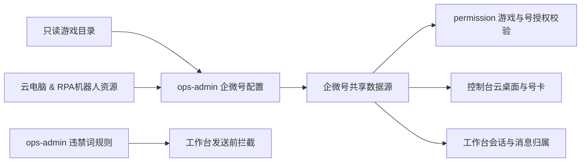
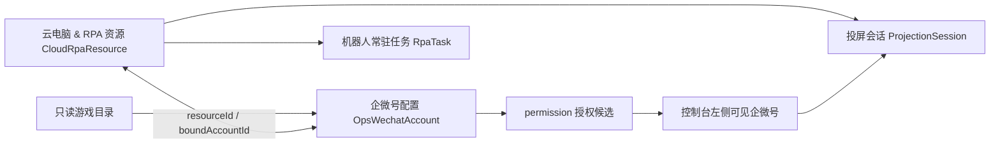
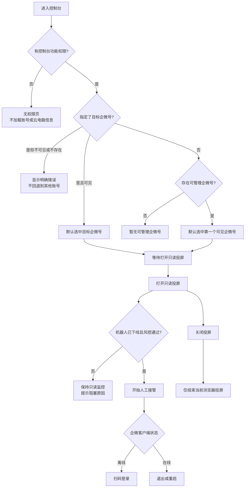
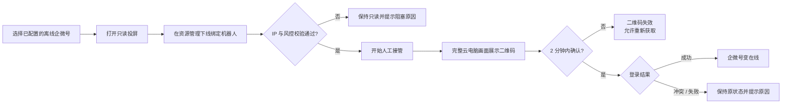

> **章节索引** — 本文只保留运营管理的当前稳定设计；V1 Mock 实现范围、历史取舍与外部待确认项见 [decisions.md](decisions.md)。
>
> - 需求业务背景：业务诉求、概念说明
> - 功能梳理：职责分层、数据关系、核心流程、范围
> - 功能详细描述：模块关系、权限、共享状态、企微号配置、资源管理、企微号控制台、违禁词、风控、审计与应急
> - 设计例外说明：项目级视觉规范的例外

# 需求业务背景

## 业务诉求

**一句话目标**：为 ChatFlow 提供企微号、云桌面、RPA、控制台与违禁词的一体化运营管理，让工作台和 permission 消费同一套受控配置与运行状态。

1. 系统管理员维护企微号基础信息、所属游戏和云桌面绑定；游戏目录本身仍为只读主数据，不在本领域建设 CRUD。
2. 系统管理员维护客服向玩家发送消息时使用的违禁词规则；玩家来消息不做拦截。
3. 系统管理员和运营主管通过控制台完成只读投屏、人工接管、企微登录 / 退出和重启，并与机器人运行状态互斥。
4. 将 RPA 风控红线固化为配置校验与运维状态：固定 IP、单号单桌面、发送频率、脱敏边界和应急回退。

## 概念说明

| 概念 | 定义 |
| --- | --- |
| 企微号 | ChatFlow 接入并用于接待的企业微信账号，拥有稳定 `accountId`、企业主体 `corpId`、显示名、启停状态、在线 / 离线 / 封禁状态和唯一所属游戏。 |
| 云电脑 & RPA 机器人 | 从阿里云采购的资源单元；一台云电脑对应一个机器人，可在同一时刻最多绑定一个企微号。 |
| RPA 执行状态 | `running`、`offline`、`fault`；下线只停止自动化，不关闭云电脑，也不改变企微登录状态。 |
| 投屏会话 | 一个云电脑最多投屏到一个浏览器；新浏览器连接时挤出旧会话。会话可为只读监控或人工接管。 |
| 机器人常驻任务 | 绑定 RPA 机器人资源的长生命周期“消息发送”执行单元；每个机器人最多一条，状态为运行中、已暂停、执行失败。工作台每次提交的“消息发送批次”不是常驻任务。 |
| 所属游戏 | 企微号的数据隔离归属，来自只读游戏目录；permission 只据此校验客服的游戏关联与号授权。 |
| 违禁词规则 | 每个游戏一条的客服出站文本校验规则；一条规则可维护多个词条，支持启用、停用；命中后使用统一发送失败样式，hover 失败图标查看原因，不处理玩家入站消息。 |
| 风控配置 | 固定 IP 地域、发送频率阈值、异常告警与应急回退等运行约束，不作为客服可编辑项。 |
| 风控告警 | 由账号、资源或任务的运行期风险触发的可处置事件；确认告警不等于解除硬性风控。 |
| 操作审计 | 对配置、资源、接管、规则和告警操作的只追加记录，以稳定 ID 和关联 ID 串联完整过程。 |

# 功能梳理

## 功能实现思路

采用“**ops-admin 配置基础对象，permission 配置访问关系，业务域只消费结果**”的分层：



- **唯一来源**：资源维护 `resourceId -> desktopId / robotId / RPA 状态 / assignedPublicIp / currentPublicIp`；企微配置维护 `accountId -> corpId / gameId / resourceId / enabled / 账号状态 / 风控状态`。阿里云分配 IP 是可信基准，当前探测 IP 不能反写为基准。
- **先配置后授权**：只有已配置、启用、已归属游戏且绑定资源的企微号才进入新增授权候选；停用或改游戏归属后 permission 重新计算有效业务范围，但保留历史授权引用。
- **控制台是投屏与接管入口，不是配置入口**：左侧仅展示已配置、启用且当前人有数据权限的企微号。系统管理员或运营主管在绑定机器人下线后才能接管并完成登录、退出或重启；撤回走独立业务请求。关闭投屏只结束浏览器会话。
- **单浏览器投屏**：同一云电脑只允许一个浏览器持有投屏会话；新会话创建时旧会话显示被挤出空态。
- **风控优先于便利**：IP 和频率等运行期违规默认阻止高风险动作并产生告警；唯一绑定冲突在配置保存时直接拒绝并写入审计。管理员只能处理配置和应急切换，不能跳过风控。

## 企微管理数据关系与关键流程

### 数据关系



| 对象 | 稳定主键与核心字段 | 归属 | 关系与边界 |
| --- | --- | --- | --- |
| 企微号配置 | `accountId`、`corpId`、`gameId`、`resourceId`、`enabled`、账号状态、风控状态、`configVersion` | ops-admin | 代表已接入企微号；只启停不物理删除，历史和资源绑定保留。 |
| 云电脑 & RPA 资源 | `resourceId`、`desktopId`、`robotId`、连接状态、RPA 状态、分配 / 当前公网 IP、`boundAccountId?`、版本 | ops-admin | 一台云电脑对应一个机器人，最多绑定一个企微号；分配 IP 是风控基准。 |
| 机器人常驻任务 | `taskId`、`resourceId`、任务状态、暂停原因 | ops-admin | 当前仅有“机器人常驻发送任务”，每个机器人最多一条；机器人下线或账号停用只暂停，不删除。 |
| 投屏会话 | `desktopId`、浏览器会话标识、模式、状态、开始时间 | 控制台运行态 | 临时会话，不是企微号配置。每台云电脑最多一个活跃浏览器会话；新会话仅挤出同一 `desktopId` 的旧会话。 |
| 权限授权 | 客服账号、`gameId`、`accountId` | permission | 只引用已配置企微号；停用时保留历史引用但业务授权暂不生效，改变游戏归属时重新计算有效范围。 |

账号启停、企微客户端状态、风控状态、RPA 执行状态和投屏会话彼此独立：机器人上下线只改变常驻任务是否可执行；打开、被挤出或关闭投屏只改变浏览器画面会话。

### 关键流程

1. **初始化配置**：先同步或登记云电脑 & RPA 资源 → 在企微号配置选择游戏和一个未绑定资源 → 保存唯一绑定 → 再由 permission 向客服授予该游戏内企微号的访问范围。
2. **只读监控**：用户从控制台左侧选择一个已授权企微号 → 系统解析其绑定资源 → 创建该 `desktopId` 的只读投屏。RPA 可继续运行，企微账号状态不变。
3. **人工接管与企微登录状态**：系统管理员先下线绑定机器人，常驻任务暂停 → 系统管理员或运营主管进入人工接管 → 登录 / 退出后更新账号状态。登录与退出不改变投屏、资源绑定或任务恢复意图，机器人不会自动恢复。
4. **关闭或抢占投屏**：系统管理员关闭投屏只结束当前浏览器 `ProjectionSession`，左侧列表、企微登录、RPA 与风控均不变；另一浏览器打开同一云电脑时，仅旧浏览器被挤出。
5. **停用 / 重新启用**：停用账号立即暂停常驻任务、移出新接待范围，但保留配置、历史、授权引用和资源绑定；重新启用后仍需管理员显式恢复机器人，不自动启动。

## 事项拆解

| 事项 | 模块 | 优先级 | 是否阻塞 |
| --- | --- | --- | --- |
| 企微号配置与唯一资源绑定 | 企微号配置页 / 配置抽屉 | V1 | 为 permission、控制台和工作台提供唯一号源 |
| 资源状态与任务状态管理 | 云电脑 & RPA 机器人管理页 | V1 | 为自动化运行和人工接管提供互斥控制 |
| 控制台投屏与人工接管 | 企微号控制台 | V1 | 承载 R018，并与工作台共同承载 R019 / R020 |
| 违禁词规则库 | 违禁词规则页 | V1 | 为客服出站文本提供按游戏隔离的同步校验 |
| 风控告警与应急处置 | 运行风控区 | 真实试运行前 | 用于封禁、IP 漂移、频率异常和运行故障的闭环处置 |
| 操作审计 | 审计记录 | 真实试运行前 | 追溯配置、人工接管、规则变更和自动化状态变化 |

# 功能详细描述

## 领域结构与模块关系

| 模块 / 页面 | 主要目标 | 入口 | 依赖对象 | 输出 / 关联 |
| --- | --- | --- | --- | --- |
| 企微号配置页 | 维护企微号、所属游戏、资源绑定，展示企微账号状态和风控摘要 | 顶栏“运营管理” | 只读游戏目录、共享号 Store | 供 permission / 控制台 / 工作台读取；本页不执行登录或投屏 |
| 企微号配置抽屉 | 新建或编辑单个企微号配置 | 页面主按钮、行编辑 | 游戏目录、未绑定资源候选 | 校验并写入共享配置；不提供任意桌面 ID 手输 |
| 云电脑 & RPA机器人管理页 | 管理阿里云资源、机器人执行状态与常驻任务摘要 | 企微号配置页 | 资源 Store、机器人常驻任务 Store | 为人工接管提供显式下线前置 |
| 企微号控制台 | 监控已授权企微号，打开只读投屏并在机器人下线后人工接管 | 顶栏一级“控制台”；工作台失败介入入口 | 企微号配置、资源绑定、机器人状态、permission 授权、风控状态 | 登录 / 退出 / 重启企微客户端；投屏、接管与操作结果进入审计 |
| 违禁词规则页 | 管理发送前拦截规则 | 运营管理二级导航 | 违禁词 Store | 工作台实时消费规则 |
| 运行风控与审计页 | 处置告警、查看应急进展和审计记录 | 运营管理二级导航 | 风控引擎、RPA、投屏、服务端审计 | 风险闭环与不可篡改操作追溯，不直接绕过限制 |

## 页面清单与权限

| 页面 / 模块 | 路径 | 主要角色 | 主要动作 | 权限边界 |
| --- | --- | --- | --- | --- |
| 企微号配置 | `/ops-admin/wechat-accounts` | 系统管理员 | 全平台查询、新建、编辑、启用、停用 | 运营主管与客服无入口，直访无权限；不提供删除 |
| 云电脑 & RPA机器人管理 | `/ops-admin/cloud-rpa-resources` | 系统管理员 | 查询、机器人上下线、任务详情 | 未绑定、企微未登录、封禁或资源故障时禁止上线机器人 |
| 企微号控制台 | `/control` | 系统管理员 / 运营主管 | 切换企微号、只读投屏、人工接管、登录 / 退出、重启、关闭投屏 | 保留顶栏一级快捷入口；管理员全平台，主管仅授权企微号范围，客服无入口 |
| 违禁词规则 | `/ops-admin/forbidden-words` | 系统管理员 | 按游戏查询、新建、编辑、启停、删除 | 仅影响对应游戏的客服出站消息 |
| 运行风控与审计 | `/ops-admin/operational-events` | 系统管理员 / 运营主管 | 查看、确认风险告警、发起回退、检索审计记录 | 系统管理员可处置和导出；运营主管在授权企微号范围内只读；硬性风控不可绕过 |
| 企微号配置抽屉 | 页内 Drawer | 系统管理员 | 配置基础字段与绑定 | 不配置客服授权，不编辑游戏目录 |

## 共享规则与状态边界

1. `accountId` 与 `corpId` 创建后不可变；显示名可编辑，`gameId` 可调整但必须触发受影响授权重新校验。外部联系人唯一键为 `corpId + external_userid`。
2. 一个已配置企微号必须且只能关联一个游戏；游戏目录只读，选项显示为 `游戏ID-游戏名称`。
3. 一个已配置企微号最多绑定一个云电脑 & RPA 机器人资源；一个资源同一时刻最多服务一个企微号，未绑定资源仍保留在资产列表。
4. 停用企微号前将机器人下线；停用后保留绑定、配置、授权引用和历史，但不进入新业务范围。重新启用不自动上线机器人。
5. 企微账号状态（在线 / 离线 / 封禁）、风控状态、RPA 执行状态和云桌面投屏会话是四类独立状态；投屏打开、挤出与退出不改变企微账号状态。
6. 违禁词只校验客服发往玩家的单条文本。命中为硬拒绝、不入待发队列并保留草稿；同一消息发送批次内附件独立评估，玩家入站消息不识别。
7. 对同一企微号的控制台人工操作和 RPA 不能并发争用客户端：RPA 运行中仅允许只读监控；管理员先在资源页下线机器人后，才可在当前投屏会话进入人工接管。
8. 配置保存、游戏归属调整、启停和资源变更必须具有单调递增版本；所有服务写操作同时校验认证身份、角色、平台级 / 授权范围和期望版本，成功、拒绝、失败都进入审计。
9. 风控告警、人工接管、配置变更和机器人状态变化都必须进入审计记录；管理员可确认、处置和查看证据，但不能覆盖 IP、频率、封禁等硬性拦截。

## 模块 1：企微号配置页

### 概述

- **目标**：为后续共享号源提供单一配置入口，并让管理员快速发现绑定、状态和风险问题。
- **入口**：顶栏“运营管理” → “企微号配置”。
- **出口**：进入配置抽屉、云电脑 & RPA 机器人管理页，或在同领域控制台查看已授权号的投屏与运行状态。
- **负责**：企微号基础资料、企业主体、所属游戏、资源绑定、生命周期与风控状态展示。
- **不负责**：游戏目录 CRUD、客服账号与号授权，以及在本配置页直接执行企微扫码登录或投屏；登录、投屏与人工接管由同领域控制台承担。

### 页面布局

```text
运营管理 / 企微号配置                 [云电脑 & RPA机器人管理] [新建企微号]
管理企微号所属游戏与云桌面绑定；客服访问范围在权限管理配置。

[搜索名称 / ID / corpId] [所属游戏] [启停状态] [企微账号状态] [风控状态] [重置]

共 N 个企微号
┌──────────────────────────────────────────────────────────────────────────┐
│ 企微号       所属游戏            云桌面    企微账号状态 风控状态   操作 │
│ 小琴号       20173-无尽冬日      desk_001  在线        正常       编辑 │
│ 小贝号       20174-星火行动      desk_002  离线        预警       编辑 │
└──────────────────────────────────────────────────────────────────────────┘
```

### 查询字段

| 字段 | `prop` | 控件 / 规则 |
| --- | --- | --- |
| 关键词 | `keyword` | 模糊匹配企微号名称或 `accountId` |
| 所属游戏 | `gameIds` | 多选，只读游戏目录，显示 `游戏ID-游戏名称` |
| 启停状态 | `enabled` | 全部 / 已启用 / 已停用；与企微客户端在线状态分离 |
| 企微账号状态 | `status` | 在线 / 离线 / 封禁；控制台也使用同一状态展示每个号的当前情况 |
| 风控状态 | `riskStatus` | 正常 / IP 待校验 / IP 异常 / 频率受限；账号已封禁时显示“—”，不重复表达账号封禁 |

### 列表与行操作

| 列 | 规则 |
| --- | --- |
| 企微号 | 展示名称、`accountId` 与 `corpId`；名称不可作为权限或外部身份主键 |
| 所属游戏 | `游戏ID-游戏名称`，缺失时显示配置异常 |
| 企微账号状态 | 在线绿、离线灰、封禁红；登录、退出或封禁状态同步后更新，不由投屏切换改变 |
| 云桌面 ID | 由绑定资源派生展示，不支持在此手填任意桌面 ID |
| 风控状态 | 展示明确限制原因：正常 / IP 待校验 / IP 异常 / 频率受限；IP 结果由“企微号合规要求 + 当前绑定云电脑出口 IP”计算；账号已封禁时显示“—” |
| 操作 | 编辑、停用 / 启用；停用需二次确认并明确不会删除历史、配置或绑定 |

### 关键交互

| 场景 | 触发 | 系统处理 | 成功结果 | 失败 / 异常 |
| --- | --- | --- | --- | --- |
| 新建企微号 | 点击主按钮 | 打开配置抽屉，选择游戏和未绑定资源 | 写入共享号源与唯一资源绑定 | ID 重复、游戏无效或资源已绑定时拒绝 |
| 改所属游戏 | 保存抽屉 | 标记原游戏授权待重算 | 新游戏成为唯一归属 | 有受影响客服时提示授权将失效 |
| 绑定资源 | 选择资源 | 校验资源未被其他企微号占用，且出口 IP 已检测并符合基准 | 形成唯一绑定 | 冲突或 IP 异常时拒绝保存并写审计；切换旧资源前需将旧机器人下线 |
| 停用账号 | 行操作确认 | 下线机器人并暂停常驻任务，保留绑定与历史 | 行保留并显示已停用，移出新业务范围 | 并发版本冲突时刷新后重试 |
| 重新启用 | 行操作确认 | 恢复业务资格但不自动上线机器人 | 行显示已启用，管理员按需显式上线 | 账号封禁或硬风控仍阻止自动化 |

## 模块 2：企微号配置抽屉

### 字段与校验

| 字段 | `prop` | 规则 |
| --- | --- | --- |
| 企微号 ID | `accountId` | 新建必填、全局唯一、保存后不可改；由受控接入流程生成或选择，不允许手工修改既有 ID |
| 企业主体 ID | `corpId` | 新建必填、保存后不可改；用于组成外部联系人外部唯一键 |
| 显示名称 | `shortName` | 必填，最长 32 字，仅用于展示 |
| 所属游戏 | `gameId` | 必填，只能从启用游戏目录选择 |
| 云电脑 & RPA 资源 | `resourceId` | 必填；仅可从未绑定或当前号已绑定资源中选择，同一资源不能绑定多个企微号 |
| 企微账号状态 | `status` | 只读；由企微登录、退出和封禁结果同步更新 |
| 风控状态 | `riskStatus` | 只读展示，由服务端根据企微号合规要求、当前绑定资源和频率策略计算 |

### 边界场景

- 停用正在使用的号时，先下线机器人；历史会话、授权引用和资源绑定仍保留。
- 封禁号可编辑备注与应急信息，但不可发起重新启用。
- 修改游戏归属前展示受影响的客服授权数量；真实环境必须由服务端事务完成“改归属 + 授权撤销 + 事件广播”。
- 资源连接异常或未绑定时不允许保存；真实环境的资源健康度由阿里云同步决定。

## 模块 3：云电脑 & RPA 机器人管理页

### 概述

- **目标**：让系统管理员识别资源健康度、机器人执行状态、绑定关系和任务影响，并以“先停自动化、再人工接管”为唯一切换路径。
- **入口 / 出口**：从企微号配置页进入；可返回企微号配置，或从绑定账号在控制台打开只读投屏。页面不创建云电脑、机器人或常驻任务，资源清单由外部资源同步。
- **页面状态**：无资源时说明“等待资源同步”；同步失败或数据超过新鲜度阈值时展示最近一次成功同步时间，并禁止用过期数据做上线、绑定或接管决策。

### 页面结构与查询

```text
运营管理 / 云电脑 & RPA机器人管理                       [企微号配置]
展示全部已登记资源；下线机器人只暂停自动化，不关闭云电脑。

[RPA 执行状态] [云电脑连接状态] [绑定企微号] [重置]

共 N 个资源
┌────────────────────────────────────────────────────────────────────────────────┐
│ 云电脑 / 资源ID  RPA机器人       连接状态  执行状态  绑定企微号 任务摘要 操作 │
│ desk_001        VIP 一号机器人   可连接    运行中    小琴号      常驻发送任务·运行中 下线 │
└────────────────────────────────────────────────────────────────────────────────┘
```

| 查询字段 | `prop` | 规则 |
| --- | --- | --- |
| RPA 执行状态 | `rpaStatuses` | 多选：运行中 / 已下线 / 故障；默认全部 |
| 云电脑连接状态 | `desktopStatuses` | 多选：可连接 / 已断开 / 连接异常；默认全部 |
| 绑定企微号 | `accountIds` | 可搜索单选，仅搜索已配置企微号；支持“未绑定” |

### 列表、任务详情与状态流转

| 内容 | 展示或操作规则 |
| --- | --- |
| 云电脑 | 展示云电脑 ID 与稳定 `resourceId`；云电脑 ID 不可在本页编辑。 |
| RPA 机器人 | 展示机器人名称与稳定 `robotId`；机器人状态与云电脑连接状态独立。 |
| 绑定企微号 | 展示名称与 `accountId`；未绑定资源保留在列表，可被企微号配置抽屉选择。 |
| 公网 IP | 同时展示阿里云分配 IP（基准）与当前探测 IP；是否合规仍归属绑定企微号的风控结果。 |
| 任务摘要 | 直接展示“机器人常驻发送任务 · 运行中 / 已暂停 / 执行失败”；未配置时显示“未配置”。任务详情展示暂停 / 失败原因和最近变更时间。 |
| 下线机器人 | 仅 `running` 可操作。二次确认后暂停该资源所有运行中任务，保留云电脑可连接状态，并写入审计。 |
| 上线机器人 | 仅 `offline` 可操作；必须同时满足云电脑可连接、出口 IP 已检测且符合基准、已绑定企微号、企微已在线且未封禁。恢复仅影响因“机器人下线”而暂停的任务，历史失败任务保持失败。 |
| 故障机器人 | `fault` 不提供直接上线或下线；管理员查看诊断引用和最近同步时间，待外部资源恢复后由同步事件更新。 |

| 当前状态 | 触发 | 下一个状态 | 系统效果 |
| --- | --- | --- | --- |
| 运行中 | 管理员下线 | 已下线 | 暂停运行中任务；允许系统管理员或运营主管在控制台申请人工接管。 |
| 已下线 | 管理员上线且满足全部前置 | 运行中 | 恢复可恢复任务；存在人工接管会话时拒绝上线。 |
| 任意 | 外部资源健康事件 | 故障 / 已下线 / 运行中 | 以外部状态为准；故障时停止自动发送并生成风险告警。 |

### 边界场景

- 切换或解除一个正在使用的资源绑定前，原资源机器人必须已下线；保存失败时保持旧绑定和旧配置版本不变。
- 云电脑同步阿里云分配公网 IP 作为基准，并上报当前出口 IP；资源页展示两者但不自行判定账号合规。服务端在启动、恢复、上线、接管前及运行中比较；基准缺失或漂移时硬拦截并告警。
- 云电脑断开、出口 IP 未检测或漂移、企微离线、账号封禁、存在人工接管会话或风控硬拦截时，机器人不能上线；界面明确指出最先需要处理的条件。
- 任务详情只显示任务运行证据和错误摘要，不直接展示玩家消息正文或敏感字段。

## 模块 4：企微号控制台

### 目标与领域边界

- **目标**：让系统管理员和运营主管监控已配置企微号的运行状态，通过云电脑只读投屏诊断问题，并在机器人下线且风控通过后人工接管企微客户端。
- **产品归属**：控制台、投屏、人工接管、企微登录 / 退出、重启和关闭投屏完整归属 `ops-admin`。
- **入口**：继续保留顶栏一级“控制台”快捷入口和 `/control` 路由；chat-workbench 的 RPA 异常详情可带企微号定位参数跳入。
- **出口**：通过顶栏返回工作台；控制台不另设重复的“返回工作台”按钮。
- **负责**：授权企微号选择、详细状态监控、只读投屏、投屏互斥、人工接管、登录 / 退出、重启和关闭投屏。
- **不负责**：企微号配置和资源改绑（模块 1 / 2）、机器人上下线（模块 3）、消息发送和撤回（chat-workbench）、客服授权（permission）。

### 页面流程



### 页面结构

```text
┌──────────────────────────────────────────────────────────────────┐
│ 顶栏：工作台  控制台  玩家管理  消息管理  运营管理  权限说明      │
├──────────┬───────────────────────────────────────────────────────┤
│ 企微号列表 │ 云电脑投屏区                                          │
│          │                                                       │
│ 在线账号  │              完整云电脑画面                           │
│ 离线账号  │                                                       │
│ 封禁账号  │                                                       │
│          ├───────────────────────────────────────────────────────┤
│          │ [打开投屏] [开始人工接管] [登录/退出] [重启] [关闭投屏] │
└──────────┴───────────────────────────────────────────────────────┘
```

- 左列只展示“已配置、已启用、具有资源绑定、当前用户可管理”的企微号，不承担新增、删除、授权或资源改绑。
- 主体先进入未打开投屏状态；用户显式打开后才创建当前浏览器投屏会话。
- 机器人运行期间仍可打开只读投屏，但不能升级为人工接管。
- 视频区允许使用深色背景，周围操作区保持低视觉密度；该视觉例外只适用于控制台视频主体。

### 企微号选择与状态监控

| 内容 | 展示与交互规则 |
| --- | --- |
| 企微号 | 展示头像、名称、账号 ID、在线 / 离线 / 封禁状态、未读数量和最近活跃时间 |
| 当前选择 | 点击号卡只切换当前监控目标，不修改账号、机器人或投屏状态 |
| 状态来源 | 账号状态与企微号配置页使用同一权威结果；状态变化在工作台和控制台同步 |
| 指定目标进入 | 目标存在且可见时直接选中；不可见或不存在时显示明确错误，不自动展示其他账号 |
| 无可管理账号 | 显示“暂无可管理企微号，请联系管理员配置授权”，不泄露其他企微号 |
| 权限变化 | 当前账号被撤权或停用时立即关闭投屏与内容区，提示权限已变化 |
| 关闭投屏 | 号卡继续留在左列；企微登录、机器人、风控和资源绑定保持不变 |

### 只读投屏与单投屏互斥

| 规则 | 说明 |
| --- | --- |
| 打开投屏 | 当前号必须具有有效资源绑定；RPA 运行中也允许只读监控 |
| 单投屏 | 同一云电脑同一时间最多一个活跃浏览器投屏 |
| 抢占 | 新浏览器打开同一云电脑时，旧浏览器立即失去画面与输入能力并显示“已在另一浏览器打开” |
| 投屏断开 | 主体保留当前账号和操作上下文，显示“投屏已断开”并自动尝试恢复 |
| 多次恢复失败 | 停止自动恢复并提示联系运维，不能把投屏故障误显示为企微离线 |
| 关闭投屏 | 只结束当前浏览器投屏和接管状态，不修改账号、RPA、风控、任务或资源绑定 |

### 人工接管、登录、退出与重启

| 操作 | 前置条件 | 成功结果 | 失败 / 阻塞 |
| --- | --- | --- | --- |
| 开始人工接管 | 系统管理员或运营主管；目标号在可管理范围；机器人已下线；资源可连接；IP 检测通过；无硬性风控 | 当前投屏从只读升级为可操作，记录接管开始 | 机器人运行、IP 异常、账号封禁、资源故障或权限不足时拒绝并显示首个阻塞原因 |
| 扫码登录 | 已人工接管；账号离线且未封禁 | 投屏展示二维码；2 分钟内确认后账号变在线 | 二维码超时可重新获取；登录冲突时保持离线并提示 |
| 退出账号 | 已人工接管；账号在线 | 二次确认后账号变离线 | 未接管或账号非在线时不展示入口 |
| 重启客户端 | 已人工接管 | 二次确认后重启当前企微客户端；账号最终状态以重启结果为准 | 重启失败时保留接管态并提示原因 |
| 结束 / 关闭投屏 | 当前浏览器持有投屏 | 结束投屏和人工接管 | 不自动恢复机器人，不改变资源绑定或风控 |

- 人工接管期间机器人不能上线；机器人恢复必须由系统管理员回到资源管理页显式执行。
- 登录、退出和重启只操作当前选中的既有企微号，不能创建、删除或替换企微号配置。
- 封禁账号允许只读监控和查看证据，但不能登录、退出、重启或进入人工接管。
- IP 待校验、IP 漂移及其他硬性风控均阻止人工接管；系统管理员也不能绕过。

### 扫码登录流程



### 审计与边界场景

- 打开 / 关闭投屏、投屏抢占、接管开始 / 结束、扫码登录、退出、重启以及所有拒绝和失败结果均写入操作审计。
- 审计记录使用稳定账号和资源标识串联过程，不直接复制玩家消息正文。
- 工作台人工介入入口只负责定位当前企微号；进入控制台后重新校验功能权限、账号范围、机器人状态和风控。
- 普通客服直接访问控制台进入无权限页，不加载企微号、资源或投屏信息。
- 切到工作台后再次返回，若投屏会话仍有效则恢复画面；会话已失效或被抢占时显示对应状态，不静默新建投屏。
- 删除企微号不属于 V1 生命周期；企微号停用后从控制台可管理列表移除，但历史审计和资源绑定保留。

## 模块 5：违禁词规则页

### 规则

| 字段 | 规则 |
| --- | --- |
| 适用游戏 | 必填，来自只读游戏目录，显示为 `游戏ID-游戏名称`；每个游戏只能保存一条规则，规则只对该游戏所属企微号的出站文本生效 |
| 词条 | 一条规则可维护多个词条；词条去首尾空格后去重，大小写和全半角按发送前标准化比较 |
| 状态 | 仅在列表通过开关维护；新建规则默认启用。启用规则实时参与客服出站文本拦截，停用规则不参与匹配 |
| 命中处理 | 服务层硬拒绝该文本，不创建待发消息并保留草稿；明确展示命中原因，不提供绕过、替换或自动改写 |
| 图文混发 | 文本和多个附件作为一个消息发送批次提交，逐条评估并记录结果；文本命中不影响合规附件继续执行 |
| 范围 | V1 仅支持按游戏配置，不支持按企微号或客服例外 |

### 页面交互

列表按游戏展示唯一规则，并支持游戏、关键词、状态筛选和新增 / 编辑 / 启停；状态只在列表开关维护，不进入新建 / 编辑抽屉。抽屉使用多行文本批量录入词条，一行一个，同时兼容换行、逗号、顿号和分号拆分，保存时自动去空和去重。发送时按当前企微号所属游戏校验其中全部词条；删除采用二次确认。历史命中通过运行风控与审计页查询，不在规则页建设独立详情。

## 模块 6：运行风控与应急处置

### 页面结构与权限

`/ops-admin/operational-events` 是运营管理的明确二级入口，默认打开“风险告警”，页面内使用三个局部标签页：

| 标签页 | 目标 | 系统管理员 | 运营主管 |
| --- | --- | --- | --- |
| 风险告警 | 查看告警级别、关联账号 / 资源、状态和处置进度 | 查看、确认、标记解决 | 仅查看自身授权企微号范围 |
| 风控策略 | 查看每个企微号的发送频率、连续失败率、硬上限和策略版本 | 在服务端硬上限内调整，填写原因并生成新版本 | 仅查看自身授权企微号范围 |
| 操作审计 | 查询配置、资源、接管、规则、策略和告警操作 | 查看并按受控流程导出脱敏记录 | 仅查看自身授权企微号的脱敏摘要 |

客服不显示运营管理入口，直接访问返回无权限。系统管理员从企微号配置、资源管理和违禁词规则页均可进入本页；运营主管点击顶栏“运营管理”直接进入本页，不经过无权限的配置页面。

### 风控事件与告警生命周期

风险状态是企微号的当前摘要；告警是可追溯、可处置的事件，两者不可互相替代。每条告警包含稳定 `alertId`、类型、严重级别、关联账号 / 资源 / 任务、触发时间、证据引用、当前状态和最后处理人。

| 告警类型 | 触发条件 | 默认严重级别 | 自动动作 |
| --- | --- | --- | --- |
| IP 漂移 | 资源启动 / 恢复连接、机器人上线或人工接管前，以及运行中复检时，当前出口公网 IP 与资源合规基准不一致 | 高 | 绑定阶段拒绝保存；运行期停止自动化，并阻止机器人上线和人工接管；告警展示当前 IP、基准 IP、检测时间和关联资源。 |
| 频率异常 | 服务端策略判定超出当前账号的发送频率或连续失败率阈值 | 高 | 暂停自动发送并提示人工核验；管理员不可在前端跳过。 |
| 企微封禁 / 掉线 | 外部状态同步为封禁，或在线状态连续异常 | 高 / 中 | 封禁时移出接待范围并停止自动化；掉线时暂停发送并提示重新登录。 |
| RPA / 云电脑故障 | 机器人常驻任务失败、云电脑不可连接或客户端识别失败 | 中 / 高 | 停止受影响自动化，保留失败原因与视频 / 日志引用。 |

告警状态只允许按 `open -> acknowledged -> resolved` 前进；恢复后由系统或管理员标记 `resolved` 并写明处置摘要。重复来源事件通过“类型 + 账号 / 资源 + 时间窗口”归并，但每次触发时间仍保留在证据记录中。确认告警只表示“已有人处理”，不解除任何硬性风控拦截。

告警列表默认只显示 `open` 和 `acknowledged`，避免已恢复事件干扰当前处置；`resolved` 作为历史告警保留，可通过状态筛选查看。告警页只承载风险事件的当前处置队列，配置、资源、机器人、接管和规则等普通运营操作统一在“操作审计”标签页追溯。

### 风控策略配置

| 字段 | 规则 |
| --- | --- |
| 适用企微号 | 每个已配置企微号一条策略；新增时创建保守默认策略，停用时停止执行但保留策略和历史审计。 |
| 每小时发送上限 | 系统管理员可在 `1..hardHourlyCap` 内调整；达到阈值后服务端限流并生成告警。 |
| 连续失败阈值 | 系统管理员可在 `1..hardFailureCap` 内调整；达到阈值后暂停自动发送。 |
| 服务端硬上限 | 只读，由安全 / 风控策略中心维护；系统管理员也不能在本页修改或关闭。 |
| 策略版本 | 每次保存单调递增；工作台和 RPA 编排只接受最新版本。 |
| 调整原因 | 必填，至少 4 个字；与 before / after、操作人和版本一起进入审计。 |

调整操作采用抽屉承载。提交前二次校验权限、硬上限和当前策略版本；成功后刷新列表并提示新版本，失败时保留草稿并展示具体原因。运营主管只展示只读策略表，不显示调整入口。

### 风控与处置规则

| 风险 | 默认策略 | 管理员动作 |
| --- | --- | --- |
| IP 漂移 | 阻止启用或桌面切换，生成高优先级告警 | 核验登录地，改用合规桌面 |
| 单号多桌面 | 在企微接入或改绑保存时拒绝，不生成风险告警；拒绝结果进入操作审计 | 解除旧绑定后重试 |
| 发送频率异常 | 服务端限流、记录告警 | 降速或暂停该号，不提供前端绕过 |
| 企微封禁 | 立即移出可用接待范围 | 启用应急回退，保留日志与录屏 |
| RPA / UI 改版故障 | 停止自动发送 | 回退企微官方后台，切换预留 1-2 台云服务器 |
| 敏感信息 | 玩家账号、联系方式、充值金额等按项目级脱敏策略处理 | 管理员只查看已脱敏摘要；原始证据按受控权限访问 |

### 应急回退流程

1. 系统生成高风险告警，或系统管理员发现影响发送 / 接收的运行故障。
2. 系统先停止受影响资源的自动化任务；管理员确认告警，并记录影响账号、影响会话范围和当前处置负责人。
3. 对企微封禁、IP 漂移和频率异常，管理员不得通过修改前端状态恢复机器人；必须按合规基线处理账号或资源。
4. 对 RPA / 客户端改版故障，运营负责人切换到企微官方后台或已批准的备用云资源继续服务，并将回退开始时间写入事件。
5. 外部依赖恢复后，先在隔离验证号完成资源健康、登录状态、基础发送和配置版本校验；验证通过后才恢复正式资源。整个过程保留审计和证据引用。

## 模块 7：操作审计

### 审计范围与字段

审计记录是只追加、不可由运营管理页面修改的事件流。风险告警、企微号与资源状态仅提供当前摘要；历史追溯以审计记录为准。

| 字段 | 说明 |
| --- | --- |
| `auditId` / `occurredAt` | 稳定事件标识与服务端发生时间。 |
| 操作人 | 人员 ID、角色、认证会话标识；系统和 RPA 事件记录服务身份。 |
| 动作与结果 | 新建 / 修改 / 启停账号配置、绑定变更、机器人上下线、接管开始 / 结束、登录状态变化、违禁词规则变更、告警确认与回退；结果为成功、拒绝或失败。页面列表仅展示发生时间、操作人、动作和结果。 |
| 目标与关联 | 账号、游戏、资源、任务、告警和配置版本；使用稳定 ID，不以显示名作审计主键。 |
| 变更摘要 | 脱敏后的 before / after 差异、失败原因、`correlationId` 和必要证据引用。 |
| 证据引用 | 失败录屏、RPA 日志或外部工单的受控引用；默认不复制玩家消息正文或敏感字段。 |

### 查询与访问边界

操作审计作为“运行风控与审计”页面的第三个局部标签页。页面表格删除目标、摘要和关联 ID 列，只保留发生时间、操作人、动作和结果，并支持按操作人、动作和结果筛选；目标与关联信息仍作为后台审计数据用于权限裁剪和故障追踪，不在运营页面展示。运营主管只读自身授权企微号范围，客服无入口。默认保留 180 天，录屏和原始日志只提供受控查看、不直接下载；如组织安全策略要求更长保留期，以项目级策略为准。

## 设计例外说明

无。页面继承项目级紧凑表格、Drawer、状态 Tag 和告警色规范；封禁、IP 漂移和频率受限仅提高语义色与告警优先级。
