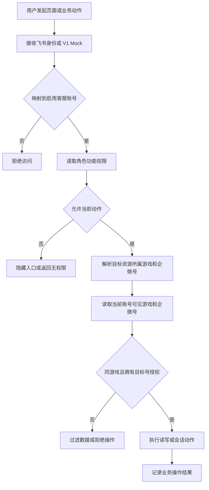
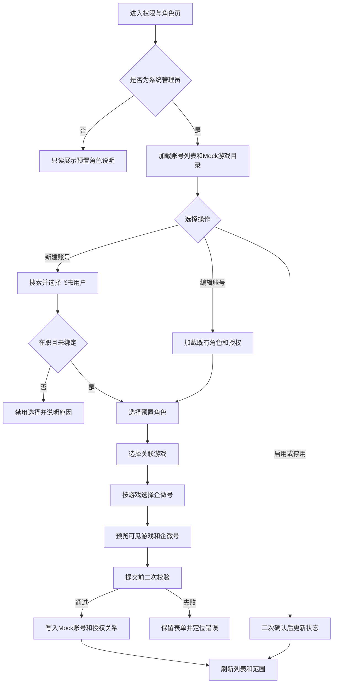
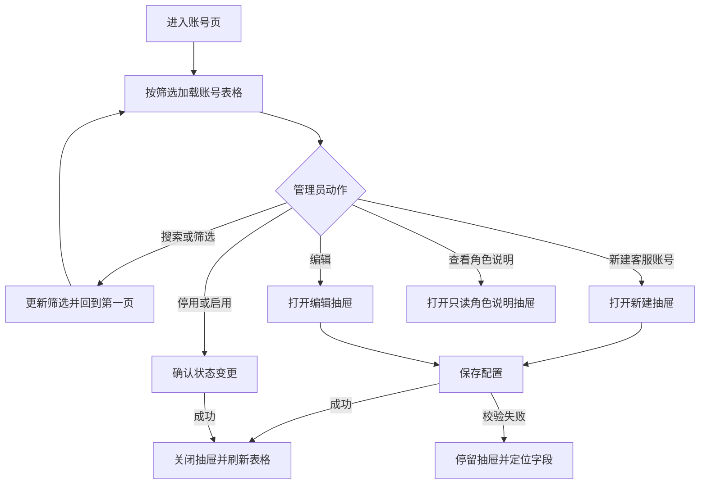
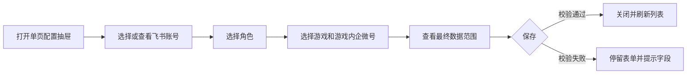

> **章节索引** — 本文只保留权限管理的当前稳定设计；V1 Mock 实现状态、历史取舍与生产待办见 [decisions.md](decisions.md)。
>
> - 需求业务背景:业务诉求、概念说明
> - 功能梳理:实现思路(权限模型 / 作用范围 / 核心链路)、事项拆解、跨领域约定
> - 功能详细描述:权限架构总览、功能权限、游戏与数据权限、统一判定链路、共享规则与状态边界
> - 页面详设:权限管理结构、页面 1「客服账号」(`/permission/agents`)、账号配置抽屉、角色说明抽屉

# 需求业务背景

## 业务诉求

**一句话目标**:为 ChatFlow V1 建立客服账号、角色、游戏归属和企微号授权,让每位客服只进入自己所属游戏内被授权的接待与玩家数据范围。

具体诉求:

1. 系统管理员可创建、停用与维护客服账号,并将账号关联到一个或多个游戏;账号认证由后续飞书扫码登录提供,不在本领域设计密码或登录实现。
2. 用预置角色区分系统配置和一线接待职责;V1 保持角色模型小而稳定,不引入自定义权限矩阵。
3. 以**游戏隔离 + 企微号细粒度授权**统一约束工作台、控制台、玩家管理与消息管理,避免跨游戏、跨号查看、指派或发送。

## 概念说明

| 概念 | 定义 |
| --- | --- |
| 客服账号 | 直接使用飞书账号名作为 ChatFlow 员工身份展示值,例如 `yan.pang`;不再额外维护中文姓名、头像或组织资料。内部稳定 `id` 仍用于会话指派、消息发送人和操作留痕。 |
| 飞书用户 | 飞书通讯录中的员工身份,是客服账号开通时的选择来源。V1 使用 Mock 目录模拟读取,真实通讯录接入不在本领域实现范围内。 |
| 角色 | V1 内置且不可新增、删除或改名的权限集合:系统管理员、运营主管、客服。 |
| 游戏 | 玩家、客服与企微号的数据隔离单元。一个企微号恰好归属一个游戏,一个客服可关联多个游戏。 |
| 客服游戏关联 | 客服账号与游戏之间的有效关系,是授予企微号权限的前置条件。 |
| 企微号授权 | 客服账号与企微号之间的细粒度授权关系;仅当双方已关联同一游戏时才可生效。 |
| 数据范围 | 当前客服在已关联游戏内,且被直接授权的企微号 ID 集合;所有跨域数据均先按此集合过滤。 |
| 登录态 | 飞书扫码认证后返回的外部身份映射到客服账号的当前会话。V1 不实现扫码,以本地 Mock 当前身份替代。 |
| 账号状态 | `启用` 可被飞书身份映射并参与接待;`停用` 不可作为有效会话或可指派客服,历史会话和发送记录保留。 |
| 可指派客服 | 当前在线、账号启用、与目标号同属一个游戏且拥有该企微号授权的客服账号。 |

# 功能梳理

## 功能实现思路

### V1 权限模型

采用「**预置 RBAC + 游戏隔离 + 企微号数据范围**」模型:

1. 角色决定能否管理账号与授权,以及能否执行跨客服的会话调度动作。
2. 游戏是数据权限的第一道隔离边界:客服账号与企微号必须先归属同一游戏。
3. 企微号授权是游戏内的第二道细粒度边界,决定能看见、打开或操作哪些会话、玩家关系、消息记录和控制台号卡。
4. 所有页面与接口先识别飞书身份或 V1 Mock 身份,再做功能和数据范围过滤;前端仅作体验层守卫,真实实现必须由服务端再次校验。

| 角色 | V1 定位 | 账号与授权管理 | 业务数据范围 | 会话动作 |
| --- | --- | --- | --- | --- |
| 系统管理员 | 平台级管理与运维负责人 | 可管理全平台客服账号及其授权 | 全部启用游戏及其相关已启用企微号 | 可查看、指派、转接和接待全平台会话 |
| 运营主管 | 负责日常接待协调 | 不可修改员工账号、角色、游戏关联或授权 | 自身关联游戏内被授权的企微号 | 可查看、指派、转接和接待范围内会话 |
| 客服 | 一线接待人员 | 不可管理账号、角色、游戏关联或授权 | 自身关联游戏内被授权的企微号 | 可查看和接待范围内会话;排队会话仅可指派给自己,已接待会话仅可转给同号可指派客服 |

V1 不支持自定义角色、按字段/玩家维度授权、客服组、接待上限和人工在岗状态;这些能力分别留给后续权限、玩家字段和自动化迭代。

### 授权作用范围

- 游戏是普通业务角色授权的第一筛选维度；系统管理员配置他人授权时仍按游戏组织表单，但其自身平台管理范围不受授权清单裁剪。
- 授权对象是**已关联游戏且启用的企微号**,一个客服可拥有多个号,一个号也可授权给多个同游戏客服。
- 客服被停用、客服游戏关联被移除、企微号被停用或授权被撤销后，该关系立即不再产生新业务可见性和可指派资格；历史会话、消息及授权引用不删除。
- 企微号在线/离线/封禁是 chat-workbench 的号运行状态,不等同于客服账号的启用/停用;在线客服由飞书会话或 V1 Mock 身份派生,不额外建设客服状态机。
- 跨号玩家列表只聚合当前账号可见关系；若存在其他不可见关系，只显示非精确提示，不暴露数量或明细。

### 核心链路

1. **账号开通**:系统管理员打开“新建客服账号” → 读取并选择一名在职且未绑定的飞书用户(Mock) → 选择预置角色 → 从 `mockGames` 选择所属游戏 → 在该游戏内选择可访问企微号 → 账号启用。开通过程不设置初始密码或手填飞书用户 ID。
2. **身份进入**:V1 直接使用本地 Mock 当前身份;未来由飞书扫码登录返回外部身份,映射到启用客服账号后参与权限判定。本领域不设计或实现扫码登录本身。
3. **数据访问**:进入业务页 → 读取当前身份的可见游戏和企微号集合 → 过滤号卡、会话、玩家关系及消息 → 无任何可见号时展示「暂无可见企微号,请联系管理员授权」。
4. **会话指派/转接**:操作人先拥有目标会话所属号的权限 → 候选人再同时满足在线、启用、关联同一游戏且拥有同一企微号授权 → 按角色限制允许的指派动作 → 写入既有 `assigneeHistory`。
5. **权限变更**:管理员调整游戏关联或企微号授权 → 当前账号下次读取数据范围时生效;若变更撤回当前会话所属号,该会话回到列表外并提示权限已变更。

### 跨领域约定

| 消费领域 | permission 提供的稳定输入 | 消费规则 |
| --- | --- | --- |
| chat-workbench | 当前客服、可见游戏与企微号集合、同游戏同号可指派客服集合 | 过滤工作台与控制台号卡/会话;指派和转接候选不再只看 `online`。 |
| player-center | 可见游戏与企微号集合 | 过滤玩家关系、会话索引和消息管理记录;保留其既定的不可见关系提示口径。 |
| ops-admin | 企微号清单、启用状态与云桌面信息 | ops-admin 负责企微号和云桌面初始化;V1 游戏目录与企微号 `gameId` 映射直接读取 Mock,不在 ops-admin 增加游戏管理。 |

## 事项拆解

| 事项 | 来源 | 说明 | 优先级 | 阻塞后续 |
| --- | --- | --- | --- | --- |
| 客服账号与飞书用户目录 | R047 / R082 | 账号创建、启用/停用、Mock 飞书用户目录读取与唯一绑定;不设置密码,不实现扫码登录;账号 id 复用为客服 id | P0 | 当前客服不再固定为 `agent_self` |
| 预置角色 | R082 | 固定系统管理员、运营主管、客服三种角色,定义其业务动作边界 | P0 | 账号管理、会话调度守卫 |
| 客服游戏关联 | 本领域追加 | 从只读 `mockGames` 为客服关联一个或多个游戏;是企微号授权和业务数据访问的前置条件,不提供游戏 CRUD | P0 | 跨游戏数据隔离 |
| 企微号授权 | R082 | 仅在同一游戏内为账号授予多个已配置企微号,支持新增、撤销与展示 | P0 | 所有跨域数据过滤 |
| 授权消费守卫 | 本领域追加 | 统一产出可见游戏、可见号与可指派客服;工作台、控制台、玩家和消息模块按此过滤 | P0 | V1 多人、多游戏、多号可用性与越权防护 |
| 权限变更反馈 | 本领域追加 | 撤销授权/停用账号后的当前页面降级、提示和会话候选刷新 | P1 | 安全闭环与异常体验 |

# 功能详细描述

## 领域结构与权限架构

### 设计思路

权限设计拆成彼此独立、按顺序叠加的两个问题:

| 层面 | 要回答的问题 | 稳定性 | V1 的承载方式 |
| --- | --- | --- | --- |
| 功能权限 | 当前身份**能做什么动作** | 稳定,随角色定义变化 | 预置角色映射到页面、按钮与业务动作 |
| 数据权限 | 当前动作**能作用于哪些数据** | 动态,随游戏归属、人和企微号分工变化 | 客服游戏关联 × 客服账号 × 企微号授权关系 |

两层必须同时通过。只拥有“发送消息”功能权限但没有该企微号授权,或客服与该号不属于同一游戏,仍不能向该号的玩家发送;反之,有企微号授权但没有“管理账号”功能权限,也不能修改任何人的角色或授权。这个拆分避免把“客服 A 可接小琴号”“客服 B 可接小贝号”编码为大量角色,也让调班、切换游戏或增减企微号只需调整数据关联。



**判定顺序不可颠倒**:飞书身份映射只解决“你是谁”,不直接授予业务权限。之后先做功能权限校验,可避免无管理权限的用户探测账号与授权数据;再依次校验游戏归属和企微号授权,保证列表、详情、深链和写操作使用同一份数据范围。真实实现由服务端执行完整判定,前端只根据结果控制入口、空态与提示,不能以“前端隐藏按钮”替代鉴权。

### 权限对象与归属

| 对象 | 所属领域 | permission 的职责 | 鉴权关键字段 |
| --- | --- | --- | --- |
| 客服账号 | permission | 身份、状态、角色、飞书身份映射与游戏关联 | `agentId`、`roleId`、`status`、`feishuUserId` |
| 游戏 | V1 shared Mock | 数据隔离根节点;读取只读 `mockGames`,permission 维护客服游戏关联,不提供游戏管理 | `gameId` |
| 企微号 | ops-admin | 作为被授权的数据范围对象，必须归属唯一游戏；当前通过 ops-admin 同步的 `mockWechatGameMap` 读取 `gameId`，资源绑定从 ops-admin 读取，不维护号或云桌面绑定 | `accountId`、`gameId`、`resourceId` |
| 会话 | chat-workbench | 经所属企微号反查游戏,判断读取、指派、转接和发送权限 | `conversation.accountId -> gameId` |
| 玩家关系 | player-center | 按每条玩家 × 企微号关系过滤,再决定玩家级聚合 | `relation.accountId -> gameId` |
| 消息 | chat-workbench / player-center | 经所属会话和企微号反查游戏后过滤 | `message.conversationId -> accountId -> gameId` |
| 权限配置 | permission | 仅系统管理员可读写客服账号、角色、游戏关联和授权关系 | 系统管理员管理全平台；所有写入仍校验目标版本与最后管理员约束 |

## 功能权限

### 设计原则

- **以业务动作授权,不以页面名授权**:例如“指派会话”是一项动作,无论入口在工作台、消息 Drawer 还是未来通知中心,都复用同一条规则。
- **角色只表达职责,不携带数据清单**:系统管理员、运营主管、客服的差异保持稳定;谁能接哪个号交给数据权限。
- **默认拒绝**:未被角色显式授予的管理操作、未来新页面和新接口默认不可用,避免新增功能时自动向所有角色开放。
- **前端和服务端同名**:V1 Mock 可用 action key 模拟,真实接口须以相同 key 复核;不将角色中文名称散落在各业务组件中判断。

### V1 功能权限矩阵

| 业务动作 | 系统管理员 | 运营主管 | 客服 | 说明 |
| --- | --- | --- | --- | --- |
| 经飞书身份进入和查看本人资料 | 允许 | 允许 | 允许 | 飞书认证不由 permission 实现;账号启用和身份映射是前置条件 |
| 查看工作台、玩家和消息 | 允许 | 允许 | 允许 | 仍受数据权限过滤 |
| 进入控制台和打开云桌面 | 允许 | 允许 | 不允许 | 控制台属于企微号运维入口,客服无顶栏入口、快捷键或直链访问权 |
| 在控制台开始人工接管 | 允许 | 允许 | 不允许 | 目标企微号必须位于 `visibleAccountIds`，绑定机器人已下线且当前浏览器已打开该号投屏 |
| 在控制台模拟登录、模拟退出、重启或直接操作企微 | 允许 | 允许 | 不允许 | 系统管理员与运营主管可操作；动作针对当前选中的既有企微号，模拟登录 / 退出只更新登录状态，不创建或删除号配置 |
| 关闭当前浏览器投屏 | 允许 | 允许 | 不允许 | 只结束当前浏览器会话，不改变企微号、RPA、风控或数据权限 |
| 接待已指派给自己的会话 | 允许 | 允许 | 允许 | 会话须在自身数据范围内 |
| 排队会话指派给自己 | 允许 | 允许 | 允许 | 沿用 chat-workbench 的显式接入规则 |
| 排队会话指派给其他客服 | 允许 | 允许 | 不允许 | 目标客服还必须有同号授权 |
| 转接进行中会话 | 允许 | 允许 | 仅本人负责的会话 | 目标客服还必须有同号授权 |
| 结束会话、发送消息 | 允许 | 允许 | 允许 | 仅能操作数据范围内且满足会话状态机的资源 |
| 撤回已送达消息 | 授权范围内团队消息 | 授权范围内团队消息 | 仅本人消息 | 仍需服务端校验时间窗、消息归属与幂等 |
| 编辑玩家备注、描述、标签等关系字段 | 允许 | 允许 | 允许 | 仅能编辑可见企微号下的关系字段 |
| 创建、停用与关联客服账号 | 允许 | 不允许 | 不允许 | 创建时从在职且未绑定的飞书用户列表选择;不设置初始密码;停用不删除历史记录 |
| 修改客服角色、游戏关联和企微号授权 | 允许 | 不允许 | 不允许 | 全平台管理；允许修改自己，但操作后必须仍有至少一名启用的系统管理员 |
| 查看或维护角色定义 | 允许 | 只读 | 只读 | V1 角色为预置项,不提供自定义角色编辑 |

功能权限控制**是否出现入口、是否可提交操作**。例如客服打开排队会话时可以看到“指派给自己”,但不会看到“指派给他人”;运营主管可以看到两种指派选择。客服不会看到“控制台”、云桌面或人工接管入口;直接访问 `/control` 时进入无权限页。飞书扫码仅是身份认证入口,不出现在本领域的功能权限页面。若用户绕过前端直接调用接口,服务端仍返回无权限结果。

## 数据权限

### 数据范围模型

数据权限由“客服游戏关联”与“游戏内企微号授权”共同构成。游戏是隔离根节点,企微号授权不能跨过游戏边界。

**游戏归属约束**:

- 一个企微号必须且只能关联一个 `gameId`;一个游戏可关联多个企微号。
- 一个客服账号可关联多个游戏;只有账号处于启用状态且游戏关联有效时,才能被授予该游戏内企微号。
- 客服、企微号和会话/玩家关系所属游戏不一致时一律拒绝,即使遗留的企微号授权记录仍显示 `active`。
- V1 的 `mockGames` 是只读种子游戏目录；`mockWechatGameMap` 是由 ops-admin 配置保存 / 启停时同步的兼容投影，仅服务当前授权校验。真实服务端需以版本化企微号配置事件替代前端镜像。

`AgentGameGrant` 表示客服可进入的游戏范围:

| 字段 | 含义 | 规则 |
| --- | --- | --- |
| `agentId` | 被关联的客服账号 | 必须是启用或保留历史的账号 ID |
| `gameId` | 所属游戏 | 必须是 `mockGames` 中存在且启用的游戏 ID |
| `status` | `active` 或 `revoked` | 仅 `active` 进入可见游戏范围;撤销保留记录 |
| `grantedBy` / `grantedAt` | 配置来源与时间 | 用于后续审计,不影响当前判定 |

`AgentWechatGrant` 表示游戏内的细粒度号授权:

| 字段 | 含义 | 规则 |
| --- | --- | --- |
| `agentId` | 被授权的客服账号 | 必须是启用或保留历史的账号 ID |
| `accountId` | 被授权的企微号 | 必须是 ops-admin 已配置且具备稳定游戏归属的企微号 ID；停用后历史授权记录保留但不产生业务范围 |
| `gameId` | 企微号所属游戏快照或派生值 | 当前必须与 `mockWechatGameMap[accountId]` 一致，并由 ops-admin 保存时同步；真实实现优先从企微号反查，避免重复字段漂移 |
| `grantedBy` | 授权的系统管理员 | 用于后续审计,不影响当前判定 |
| `grantedAt` | 授权时间 | 用于后续审计,不影响当前判定 |
| `status` | `active` 或 `revoked` | 仅 `active` 进入数据范围;撤销保留记录 |

当前账号的可见范围计算为:

```text
system admin visibleGameIds = all enabled mockGames
other roles visibleGameIds = active AgentGameGrant records for current agent
                            ∩ enabled mockGames

system admin visibleAccountIds = all enabled configured WeChat accounts
other roles visibleAccountIds = active AgentWechatGrant records for current agent
                              ∩ enabled configured WeChat accounts
                              ∩ accounts whose gameId is in visibleGameIds
```

`visibleAccountIds` 就是“当前用户最终获准访问的企微号 ID 清单”。它已经完成了账号启用、客服游戏关联、企微号游戏归属和直接号授权的计算;因此业务页面不需要重复判断游戏,只需判断资源所属的 `accountId` 是否在这个清单中。例如会话列表只展示 `conversation.accountId` 位于 `visibleAccountIds` 的会话。

运营主管和客服不会绕过游戏或企微号范围；系统管理员按平台职责拥有全部启用游戏和企微号。普通账号没有有效企微号时进入全局空态“暂无可见企微号，请联系管理员授权”，不是身份认证失败。

### 数据资源过滤规则

| 数据或操作 | 资源归属推导 | 数据权限规则 | 授权不足时 |
| --- | --- | --- | --- |
| 工作台会话列表 | `conversation.accountId` | 只展示所属企微号位于 `visibleAccountIds` 的会话 | 不出现在列表和搜索结果中 |
| 会话深链与消息 Drawer | `conversationId -> conversation.accountId -> gameId` | 先验证会话存在,再验证所属游戏和企微号均可见 | 显示“会话不存在或无权查看”,不回显消息摘要 |
| 控制台号卡与云桌面 | `WechatAccount.id -> resourceId -> desktopId` | 先校验控制台功能权限，再仅列出 `visibleAccountIds` 中已配置资源绑定的企微号；系统管理员或运营主管均可在机器人已下线后接管 | 客服直接进入无权限页;管理员或主管无可管理号时显示“暂无可管理企微号”空态,不回退到任何默认号 |
| 玩家管理列表 | `relation.accountId -> gameId` | 先过滤游戏和关系,再按 `playerId` 聚合 | 不可见关系不参与筛选、计数或字段聚合 |
| 玩家详情和消息管理 | 关系或会话所属 `accountId -> gameId` | 只返回可见游戏内的关系与会话 | 仅提示“存在其他不可见关系”，不暴露精确数量或明细 |
| 指派或转接候选 | 目标会话 `accountId -> gameId` | 操作人与候选人均关联该游戏且拥有该号授权,候选人还须在线且启用 | 候选不出现;并发撤权时提交失败并刷新候选 |
| 编辑玩家关系字段 | 被编辑关系 `accountId -> gameId` | 校验操作人关联该游戏且拥有该号授权 | 拒绝保存,本地编辑值回滚并提示权限已变更 |

玩家是跨号聚合实体,因此**不能只在玩家级记录上一处做权限判断**。必须先按关系级 `accountId` 过滤,再计算可见玩家、标签、备注、会话数和筛选结果;这与 player-center 现有的可见关系聚合口径保持一致。

### 写操作的双重校验

所有写操作都同时携带“功能动作”和“目标资源”两个上下文。服务端必须从资源自身反查 `accountId`,不能信任前端传入的 `accountId`。

| 操作 | 功能权限校验 | 数据权限校验 | 成功后的状态 |
| --- | --- | --- | --- |
| 指派会话 | 是否允许指派给本人或他人 | 操作人、目标客服均关联会话所属游戏且有该号授权 | 更新 `assigneeId` 与 `assigneeHistory` |
| 转接会话 | 是否允许转接该会话 | 操作人、目标客服均关联会话所属游戏且有该号授权 | 更新指派人,原负责人失去发送资格 |
| 发送消息 | 是否允许接待且会话为本人负责 | 当前客服关联会话所属游戏且有该号授权 | 调用既有发送链路并记录真实发送人 |
| 编辑玩家关系 | 是否允许编辑关系字段 | 当前客服关联该关系所属游戏且有该号授权 | 更新该条关系,刷新聚合视图 |
| 修改游戏或账号授权 | 是否拥有授权管理动作 | 管理员必须关联目标游戏;企微号授权还须校验客服与号同属目标游戏 | 失效相关缓存与当前受影响会话 |

### 授权变化与失效处理

| 场景 | 系统处理 | 用户反馈 |
| --- | --- | --- |
| 管理员撤销当前用户的企微号授权 | 下一次读写前重新计算数据范围;从列表、筛选项和候选中移除该号 | 当前打开该号会话或详情时关闭内容区,提示“权限已变更” |
| 管理员移除当前用户的游戏关联 | 立即撤销该游戏内全部有效企微号授权,并重新计算数据范围 | 关闭该游戏的当前内容区,提示“所属游戏权限已变更” |
| 管理员停用当前用户账号 | 使其后续飞书身份映射失效并移出在线候选 | 结束当前业务会话,提示“账号已停用,请联系管理员” |
| 企微号被 ops-admin 删除 | 删除全部有效授权的计算资格,历史授权标为 `revoked` | 相关业务页不再展示该号;历史会话只保留审计引用 |
| 指派候选在提交前下线或被撤权 | 服务端重新校验失败,不改变会话指派人 | 提示“目标客服当前不可接待,请刷新后重试” |

## 共享规则与状态边界

- permission 对其他领域只暴露三个稳定结果:飞书身份映射后的当前客服、功能动作判断、可见游戏与企微号及同游戏同号可指派客服集合。消费领域不再自行判断角色或遍历授权关系。
- `Agent.id` 是客服账号、会话 `assigneeId` 和消息 `senderId` 的共同标识,后续 `feishuUserId` 仅用于身份映射;账号停用后历史名称快照保留,不能因账号改名或飞书身份变更导致历史消息发送人丢失。
- 列表查询、详情深链、搜索、导出及写操作都必须使用同一数据范围;任何“先查全量再由前端隐藏”的实现均不符合本设计。
- V1 不提供字段级/玩家级例外授权。若以后引入敏感字段脱敏,应在游戏和企微号数据范围通过后,由独立字段策略进行第三层判定,不能覆盖或绕开本领域的基础授权。
- 操作审计在 V1 Mock 只保留业务现有的 `assigneeHistory` 与消息发送人;生产审计字段、留存期限和查询页面进入项目级技术设计,不阻塞当前 UI 原型。

## 安全实现边界

- 服务端负责飞书身份映射、账号 / 角色 / 游戏 / 企微号授权持久化，以及所有资源查询和写操作的权限校验；前端入口、按钮和数据过滤只提供体验层守卫，不能承担安全边界。
- 列表查询、详情深链、搜索、导出和写操作必须复用同一权限判定结果。权限变化后，服务端使旧会话或缓存结果失效，并记录授权变更与拒绝结果。

## 页面设计与交互

> 所有页面默认继承 [项目品牌规范](../../ui-brand.md)。

### 领域结构与模块关系

| 模块 / 页面 | 主要目标 | 入口 | 依赖对象 | 关联关系 | 备注 |
| --- | --- | --- | --- | --- | --- |
| 权限与角色页 | 系统管理员管理账号；其他角色只读查看预置角色说明 | 顶栏“权限管理 / 权限说明”；`/permission/agents` | `mockAgents`、`mockGames`、ops-admin 共享企微号源、Mock 飞书用户目录 | 管理模式可打开账号配置抽屉 | 三角色可进入；账号数据仅管理员加载 |
| 账号配置抽屉 | 新建账号或编辑既有账号的角色、游戏与企微号授权 | 客服账号页“新建客服账号”或行“编辑” | Mock 飞书用户目录、预置角色、游戏和 ops-admin 企微号配置 / 归属投影 | 保存后刷新列表和受影响用户的范围预览 | 新建不设密码;编辑时不可换绑飞书用户;状态仅在列表控制 |
| 数据范围配置区 | 先用搜索多选关联游戏,再在固定高度工作区按游戏选择企微号 | 账号配置抽屉的“数据权限”卡片 | `mockGames`、`mockWechatGameMap`、ops-admin 企微号基础信息 | 输出 `AgentGameGrant` 与 `AgentWechatGrant` | 面向大量游戏和企微号,不平铺全部选项 |
| 角色说明抽屉 | 解释预置角色能做什么,避免管理员把数据授权误解为角色授权 | 客服账号页“角色说明” | V1 功能权限矩阵 | 只读展示 | 不提供角色新建、编辑或删除 |

### 页面清单与导航

| 页面 / 模块 | 路径 | 主要角色 | 页面目标 | 主要功能区 | 备注 |
| --- | --- | --- | --- | --- | --- |
| 权限与角色页 | `/permission/agents` | 所有已认证角色 | 管理员开通 / 停用 / 配置账号；其他角色只读角色定义 | 管理模式含账号表格与配置抽屉；只读模式只含角色说明 | 当前领域唯一独立路由 |
| 账号配置抽屉 | `/permission/agents` 内触发 | 系统管理员 | 单页完成飞书账号绑定、角色与数据范围配置 | 飞书账号、角色、游戏内号授权、范围预览 | Drawer,不占独立 URL;账号状态由列表控制 |
| 角色说明 | `/permission/agents` 页面或管理员抽屉 | 所有已认证角色 | 只读查看预置角色的动作边界 | 角色切换、功能矩阵、数据权限说明 | 不提供角色编辑 |

- 顶栏三角色都可进入权限说明；系统管理员看到完整“权限管理”，运营主管 / 客服只看到角色说明，不请求或泄露账号、游戏和企微号授权数据。
- 页面无游戏目录、企微号生命周期或云桌面绑定入口:这些数据均只读消费;游戏目录不属于本领域,也不在 ops-admin 管理。企微号生命周期、所属游戏和云桌面绑定则由后续 ops-admin 维护。
- 账号配置使用右侧 Drawer,关闭后保留列表的搜索、筛选、分页和滚动位置;新建保存成功后回到第一页并高亮新账号。

### 图 2:账号开通与授权配置流程



### 共享页面规则与状态边界

1. **查看说明不等于管理账号**：所有已认证角色可进入 `/permission/agents`；仅系统管理员加载账号和授权数据并提交管理操作。系统管理员按平台职责拥有全部启用业务范围。
2. **飞书账号不可手输**:新建时必须从 `listMockFeishuUsers(keyword)` 返回的下拉候选中选择;页面只展示飞书账号名。创建成功后绑定关系不可更换,编辑时以禁用下拉框展示当前账号。
3. **游戏先于企微号**:未选择任何游戏时不展示企微号选择器;游戏通过支持 ID / 名称搜索的多选 Select 关联,只显示少量已选标签和总数。移除某个游戏会在本次保存中一并撤销该游戏下全部有效企微号授权。
4. **游戏关联不等于号授权**:新增游戏默认没有可见企微号。只有勾选该游戏下的已配置企微号后,才进入 `visibleAccountIds`。因此账号可以启用但没有可见号,业务侧显示全局空态,不表示登录失败。
5. **能力与范围同时校验**：系统管理员可操作全平台启用资源；运营主管只能操作自身 `visibleAccountIds`，客服无控制台能力。
6. **不删除账号历史**:账号仅可启用或停用;停用会移出登录映射和可指派候选,但不删除既有消息发送人、会话指派和授权历史。
7. **防止锁死管理能力**：管理员可以停用或降级自己，前提是提交后仍有另一名启用的系统管理员；只有最后一名有效管理员被保护，服务端必须在写入时原子复核。
8. **平台级管理范围**：系统管理员的 `manageableGameIds` 等于全部启用游戏，账号页可管理全平台账号；运营主管和客服不存在账号管理范围。

## 页面 1:`/permission/agents` 客服账号页

### 1.1 页面概述

- **页面目标**:让系统管理员在同一处开通 ChatFlow 客服身份、维护预置角色和状态,并精确配置“关联哪些游戏、可见哪些游戏内企微号”。
- **主要角色**：系统管理员；运营主管 / 客服进入同一路由时只读查看角色说明。
- **页面入口**:顶栏“权限管理”一级入口下的“客服账号”;直接访问 `/permission/agents`。
- **页面出口**:顶栏切换到其他业务页;账号配置与角色说明均以关闭 Drawer 回到当前列表状态。
- **本页负责**:账号开通、启用/停用、角色展示、客服游戏关联、游戏内企微号授权和范围预览。
- **本页不负责**:飞书扫码或密码登录、飞书通讯录真实接入、游戏 CRUD、企微号与云桌面的创建/绑定、角色自定义或任何业务数据的直接查看。

### 1.2 页面功能流程



### 1.3 数据流说明

- **输入**:
  - 当前 Mock 身份、“管理客服账号”功能动作判断和 `manageableGameIds`。
  - 仅限 `manageableGameIds` 内的客服账号列表及其 `roleId`、`status`、飞书身份绑定、游戏关联和有效企微号授权摘要。
  - 只读 `mockGames`、由 ops-admin 同步的 `mockWechatGameMap` 与可配置企微号基础信息。
  - 仅在新建抽屉中读取的飞书账号下拉候选 `listMockFeishuUsers(keyword)`。
- **处理**:
  - 先按 `manageableGameIds` 收敛账号范围,再按关键词、状态、角色和游戏筛选并按最近更新倒序;客户端 Mock 使用本地过滤,生产由服务端完成同等过滤。
  - 新建或编辑保存前重新计算每个游戏下可授权号,清除脱离游戏关联的授权,并生成 `visibleGameIds`、`visibleAccountIds` 预览。
  - 所有变更先做当前管理员资格保护和飞书用户“在职且未绑定”复核,通过后才更新 Mock store。
- **输出**:
  - 刷新账号表、各行“关联游戏 / 已授权企微号”摘要与受影响账号的范围缓存。
  - 停用或撤权影响当前业务会话时,消费领域在下一次数据读取前按既有“权限已变更”规则降级。

### 1.4 页面布局设计详情

```text
┌─────────────────────────────────────────────────────────────────────────────┐
│ TopBar: Logo | 工作台 | 玩家管理 | 消息管理 | 权限管理▼       通知 | 头像   │
├─────────────────────────────────────────────────────────────────────────────┤
│ 客服账号                                                   [角色说明] [新建客服账号] │
│ 管理 ChatFlow 业务身份、角色及其游戏内企微号数据范围                         │
├─────────────────────────────────────────────────────────────────────────────┤
│ [搜索客服账号] [角色 v] [账号状态 v] [关联游戏 v] [重置]                    │
├─────────────────────────────────────────────────────────────────────────────┤
│ 共 24 名账号                                                                    │
│ ┌─────────────────────────────────────────────────────────────────────────┐ │
│ │ 客服账号       角色       状态  关联游戏             授权企微号  操作       │ │
│ │ yan.pang       系统管理员 启用  20173-无尽冬日       2 个       编辑       │ │
│ │ lin.yue        客服       启用  20173-无尽冬日       1 个       编辑       │ │
│ └─────────────────────────────────────────────────────────────────────────┘ │
│ 分页 / 每页条数                                                                  │
└─────────────────────────────────────────────────────────────────────────────┘
```

| 页面区域 | 页面区域细分 | 作用 | 主要元素 | 备注 |
| --- | --- | --- | --- | --- |
| 顶部区域 | TopBar + 权限当前位置 | 显示当前模块 | 管理员显示“权限管理”，其他角色显示“权限说明” | 入口由查看 / 管理能力分别判断 |
| 页头 | 标题、说明、主次操作 | 表达本页边界并承载开通动作 | 标题、角色说明、新建客服账号 | “新建客服账号”是唯一主按钮 |
| 查询区 | 关键词与四类筛选 | 快速定位待维护账号 | 搜索框、角色、状态、游戏、重置 | 筛选改变时回到第一页 |
| 主体内容区 | 客服账号表格 | 扫读账号身份与范围摘要 | 表格、行操作 | 不展示完整企微号清单,避免列表过密 |
| 辅助区 | 计数、分页、加载/空错态 | 补充列表状态 | 总数、Pagination、Empty、Alert | 空筛选与空账号使用不同文案 |

### 1.5 功能区详情

#### 1.5.1 查询与筛选

| 字段 | `prop` | 控件 / 匹配方式 | 默认值 | 规则 |
| --- | --- | --- | --- | --- |
| 关键词 | `keyword` | Search Input,模糊匹配 | 空 | 仅匹配客服账号名;输入后更新列表 |
| 角色 | `roleIds` | 多选 Select | 全部 | 系统管理员、运营主管、客服;显示固定角色名 |
| 账号状态 | `status` | 单选 Select | 全部 | 启用 / 停用;停用账号保留在列表中 |
| 关联游戏 | `gameIds` | 多选 Select | 全部 | 只读 `mockGames` 来源;选项统一显示 `游戏ID-游戏名称`,命中任一游戏即保留该行 |
| 重置 | `reset` | 文字按钮 | — | 清空搜索与筛选,回到第一页;不影响每页条数 |

#### 1.5.2 页面级操作

| 操作 | 显示 / 启用条件 | 行为 | 反馈 |
| --- | --- | --- | --- |
| 新建客服账号 | 系统管理员始终显示 | 打开“新建客服账号”单页抽屉 | 飞书账号、角色、游戏和企微号在同一表单中配置 |
| 角色说明 | 所有已认证角色可用 | 管理员从页内打开说明；其他角色直接看到只读说明页 | 不改变账号数据 |
| 重置筛选 | 存在任意筛选条件 | 清空所有筛选并回到第一页 | 表格重新加载 |

#### 1.5.3 客服账号表格

| 列 | 展示内容 | 规则 / 交互 |
| --- | --- | --- |
| 客服账号 | 飞书账号名,例如 `yan.pang` | 不展示头像、中文姓名、组织或内部 `agentId`;点击账号或“编辑”打开编辑抽屉 |
| 角色 | 预置角色 Tag | 系统管理员 / 运营主管 / 客服;角色不是可点击的行内编辑控件 |
| 账号状态 | 启用 / 停用 Tag | 启用为成功色,停用为灰色;停用者不参与登录和指派 |
| 关联游戏 | `游戏ID-游戏名称` Tag,最多展示 2 个 | 例如 `20173-无尽冬日`;超出显示 `+N`,hover 展示全部 |
| 授权企微号 | 有效授权数 | 显示 `已授权 N 个`;点击打开同一编辑抽屉,不在表格展开具体号 |
| 最近更新 | 更新时间和更新人 | Mock 阶段由本地修改时刻模拟 |
| 操作 | 编辑 / 启用或停用 | 状态变更要确认;受管理员资格保护时显示禁用原因 |

#### 1.5.4 列表状态

| 场景 | 表现 |
| --- | --- |
| 初次加载 | 表格骨架,保留表头和页头操作 |
| 无任何客服账号 | `Empty` + “暂无客服账号”;保留“新建客服账号”主按钮 |
| 筛选无结果 | `Empty` + “没有符合条件的账号” + “重置筛选”按钮 |
| Mock 数据读取失败 | 表格区域 `Alert` + “重试”按钮;不清空现有筛选条件 |
| 非系统管理员直访 | 只读角色说明页；不请求账号、飞书用户、游戏或企微号列表 |

### 1.6 页面交互说明

| 场景 | 触发 | 系统处理 | 成功结果 | 失败 / 异常 |
| --- | --- | --- | --- | --- |
| 搜索账号 | 输入关键词 | 更新 `keyword`,分页归 1 | 列表按飞书账号名收敛 | 无结果显示筛选空态 |
| 按游戏筛选 | 选择一个或多个游戏 | 本地 Mock 按账号有效游戏关联过滤 | 表格与总数同步更新 | 游戏目录加载失败时禁用筛选并可重试 |
| 打开编辑 | 点击账号、编辑或授权企微号摘要 | 加载账号完整授权关系并打开单页抽屉 | 表单展示保存前快照 | 账号被并发停用/删除时提示并刷新列表 |
| 停用账号 | 点“停用” | 仅检查操作后是否仍有其他启用管理员，再二次确认 | 状态改为停用，移出候选与登录映射；若是当前人则立即注销 | 最后一名有效管理员不可停用 |
| 启用账号 | 点“启用” | 二次确认后恢复账号状态 | 下次 Mock 身份映射与候选计算可用 | 绑定飞书用户已离职时拒绝启用并说明原因 |
| 保存配置 | 抽屉点“保存” | 重新校验身份、角色、游戏、企微号关系与管理员保护规则 | 关闭抽屉,刷新表格和范围摘要 | 留在抽屉、定位错误字段,不丢已填内容 |

### 1.7 边界场景

| 场景 | 表现 |
| --- | --- |
| 当前管理员是唯一有效系统管理员 | 角色下拉中其他角色禁用;“停用”按钮禁用,hover 说明“请先配置另一名有效系统管理员” |
| 管理员编辑自己但并非最后管理员 | 可修改角色、游戏、号授权或停用自己；保存 / 停用后若失去当前身份则立即注销或按新角色重算能力 |
| 停用账号仍有历史会话 | 不删除历史;会话历史沿用发送人名称快照,该账号不再是可指派候选 |
| 游戏被移除 | 该游戏从左侧已选游戏导航移除,其企微号授权同步从保存草稿和汇总计数中移除 |
| 企微号在编辑期间被删除或游戏归属变化 | 保存时从选择结果剔除并在当前游戏授权区提示;无需阻塞其他有效授权保存 |
| 游戏已关联但未授予任何号 | 允许保存;列表显示“已授权 0 个”,业务端进入无可见号空态 |
| 浏览器宽度小于 1024px | 筛选区自动两行,表格横向滚动;主操作固定在页头右侧,不折叠进更多菜单 |

### 1.8 设计例外说明

无。页面使用项目级紧凑表格、Drawer、状态 Tag 与空错态规范。

## 模块 2:账号配置抽屉

### 2.1 概述

- **目标**:用一个单页抽屉完成飞书账号、角色、游戏和游戏内企微号配置,降低开通与编辑成本。
- **角色**:系统管理员。
- **入口**:客服账号页“新建客服账号”、行“编辑”或“查看范围”。
- **出口**:保存成功关闭;取消、关闭按钮或 Esc 可关闭。未保存修改时二次确认是否放弃。
- **本模块负责**:飞书账号唯一绑定、角色配置、游戏关联、游戏内企微号授权和最终范围预览。
- **本模块不负责账号状态**:启用和停用统一在账号列表行操作中控制。
- **本模块不负责**:密码设置、飞书扫码、真实通讯录同步、游戏或企微号的创建与绑定。

### 2.2 配置流程



### 2.3 布局

```text
┌──────────────────────────────────────────────────┐
│ 新建客服账号 / 编辑客服账号                   ×   │
├──────────────────────────────────────────────────┤
│ ① 账号与角色                                        │
│ [飞书账号下拉 v]              [角色下拉 v]           │
├──────────────────────────────────────────────────┤
│ ② 数据权限                                          │
│ 关联游戏 * [搜索游戏 ID / 名称，多选，最多显示 2 个标签] │
│ ┌──────────────┬────────────────────────────────┐ │
│ │ 已选游戏(可筛选)│ 当前游戏企微号 [搜索多选 v]       │ │
│ │ 20173-无尽冬日 │                     [全选][清空] │ │
│ │ 20174-星火行动 │                                │ │
│ └──────────────┴────────────────────────────────┘ │
│ 关联游戏 2 个 │ 授权企微号 3 个 │ 范围规则摘要         │
├──────────────────────────────────────────────────┤
│ [取消]                                      [保存配置] │
└──────────────────────────────────────────────────┘
```

抽屉宽度 760px,不使用步骤条。内容以“账号与角色”“数据权限”两张卡片组织。新建时飞书账号下拉可选;编辑时保留相同下拉外观但禁用更换。角色改用紧凑单选下拉。游戏和企微号均使用可搜索多选,已选项只展示少量标签与数量,避免资源规模扩大后撑高抽屉。

### 2.4 字段与联动规则

| 字段 | `prop` | 控件 | 必填 | 默认值 / 规则 |
| --- | --- | --- | --- | --- |
| 客服账号 | `feishuUserId` | 可搜索 Select | 是 | 新建仅列出有效且未绑定的飞书账号名;编辑禁用更换;不展示组织、头像或内部 ID |
| 角色 | `roleId` | 单选 Select | 是 | 无默认角色,必须显式选择;下方紧凑展示角色定位与客服禁用云桌面说明 |
| 控制台与撤回说明 | — | 动态说明 | — | 系统管理员可操作全平台控制台并撤回团队消息；运营主管在授权范围操作控制台并撤回团队消息；客服不可进控制台但可撤回本人消息 |
| 关联游戏 | `gameIds` | 可搜索多选 Select | 是 | 支持游戏 ID / 名称搜索,统一显示 `游戏ID-游戏名称`;虚拟滚动,最多显示 2 个已选标签和剩余数量 |
| 游戏内企微号 | `accountIdsByGame[gameId]` | 按当前游戏可搜索多选 Select | 否 | 左侧已选游戏导航固定高度滚动;右侧只编辑当前游戏的企微号,支持名称 / ID 搜索、全选和清空 |
| 最终范围预览 | `visibleGameIds` / `visibleAccountIds` | 只读 Summary | 只展示游戏与企微号总数和交集规则,不平铺完整名称清单 |

企微号下拉按“名称 + ID + 状态”展示,但配置抽屉不能修改这些基础属性。permission 只将 ops-admin 已配置、具有唯一游戏归属的企微号作为授权候选；资源绑定由 ops-admin 维护，控制台不会为授权自动分配云桌面。

### 2.5 关键交互说明

| 场景 | 触发 | 系统处理 | 成功结果 | 失败 / 异常 |
| --- | --- | --- | --- | --- |
| 搜索飞书账号 | 展开下拉或输入关键词 | 查询 Mock 目录并按账号名匹配 | 显示有效且未绑定账号 | 读取失败时不允许保存 |
| 选择飞书账号 | 选择下拉项 | 写入绑定 ID,页面继续保持在同一表单 | 账号名显示为客服账号 | 无效或已绑定项不出现在候选中 |
| 选择角色 | 从角色下拉选择 | 更新紧凑动作说明 | 角色被明确记录 | 当前唯一管理员降级时阻止并解释 |
| 新增关联游戏 | 搜索游戏 ID / 名称并多选 | 加入左侧已选游戏导航并切换到可编辑游戏 | 可继续搜索选择游戏内企微号 | 游戏目录读取失败时不允许保存范围 |
| 移除关联游戏 | 清除多选项中的已有游戏 | 同步移除该游戏及其企微号授权 | 汇总计数立即更新 | 取消抽屉时不写入任何撤销 |
| 授予企微号 | 在当前游戏的企微号下拉中搜索、多选或全选 | 更新当前游戏授权计数与底部汇总 | 企微号进入 `visibleAccountIds` 预览 | 已删除或归属变化的号不进入候选并在保存时复核 |
| 保存新账号 | 点“保存” | 再校验飞书账号、角色、游戏/号归属和管理员资格 | 创建启用账号并关闭 Drawer | 保留填写内容并提示缺失字段 |
| 保存编辑 | 点“保存” | 比较变更,撤销失效授权并更新有效范围 | 列表摘要刷新;当前受影响用户后续访问按新范围生效 | 并发变化时提示“配置已变化,请刷新后重试” |

### 2.6 边界场景

| 场景 | 表现 |
| --- | --- |
| 未选择飞书账号 | 保存时提示“请选择一个可用的飞书账号” |
| 飞书候选刚被其他管理员绑定 | 保存时提示“该飞书账号已开通账号”,刷新下拉候选 |
| 未选择角色 | 保存时提示“请选择预置角色” |
| 未关联游戏 | 保存前提示“至少关联一个游戏”;不创建无游戏账号 |
| 已关联游戏但号授权为 0 | 可保存;范围预览明确标记“暂无可见企微号” |
| 编辑停用账号 | 可调整角色和授权,账号状态仍由列表“启用/停用”操作控制 |
| 关闭时有未保存变更 | 二次确认“放弃本次配置?”;确认后恢复打开前数据 |
| 键盘操作 | Esc 触发关闭确认;Tab 按视觉顺序移动;空候选和校验错误通过可读文本提示 |

### 2.7 设计例外说明

无。单页 Drawer 使用项目级 Select、卡片和紧凑范围摘要组件,不再引入步骤条或全量平铺授权项。

## 模块 3:角色说明抽屉

### 3.1 概述

- **目标**：让所有已认证角色理解预置角色边界，明确“角色决定动作，授权决定普通业务角色的数据范围，系统管理员承担平台级管理”。
- **角色**：系统管理员、运营主管、客服。
- **入口**：`/permission/agents`；管理员还可从账号配置抽屉的角色字段旁打开说明。
- **出口**:关闭 Drawer,不更改任何配置。
- **本模块负责**:只读呈现角色职责、功能动作矩阵和数据权限判断方式。
- **本模块不负责**:创建、编辑、删除角色或修改单项权限。

### 3.2 布局与内容

```text
┌──────────────────────────────────────────┐
│ 角色与权限说明                        ×   │
├──────────────────────────────────────────┤
│ [系统管理员] [运营主管] [客服]             │
├──────────────────────────────────────────┤
│ 角色定位与适用场景                         │
│ ✓ 可执行的业务动作                         │
│ — 不可执行的业务动作                       │
│ 数据范围说明:关联游戏 × 游戏内企微号授权    │
├──────────────────────────────────────────┤
│             [关闭]                         │
└──────────────────────────────────────────┘
```

默认展示系统管理员。切换角色只更新 Drawer 内的动作清单,不修改任何账号草稿;功能矩阵复用本设计“V1 功能权限矩阵”的稳定定义。

### 3.3 角色说明内容

| 角色 | 定位 | 关键允许动作 | 明确不允许 |
| --- | --- | --- | --- |
| 系统管理员 | 平台级账号、授权与运维负责人 | 管理全平台客服账号、角色、游戏关联与企微号授权；操作全部启用资源；撤回团队消息 | 自定义角色或绕过硬风控 |
| 运营主管 | 日常接待协调与人工运维 | 指派 / 转接；在自身授权范围操作控制台、人工介入并撤回团队消息 | 开通或停用账号，修改角色、游戏关联或企微号授权 |
| 客服 | 一线玩家接待 | 查看和接待自身数据范围内会话;将排队会话指派给自己 | 进入控制台、打开云桌面、人工接管、管理账号或授权 |

抽屉底部始终展示提示:“勾选更多游戏或企微号只扩大数据范围,不会增加功能动作;选择更高角色也不会自动获得任何企微号。”

### 3.4 边界场景

| 场景 | 表现 |
| --- | --- |
| 从新建抽屉打开 | 在新抽屉上层打开;关闭后保留已选择的飞书用户、角色和授权草稿 |
| 当前角色切换 | 只更新说明,不改账号表或表单值 |
| 非管理员直访 | 正常展示只读角色说明；不加载账号、游戏或企微号授权数据 |
