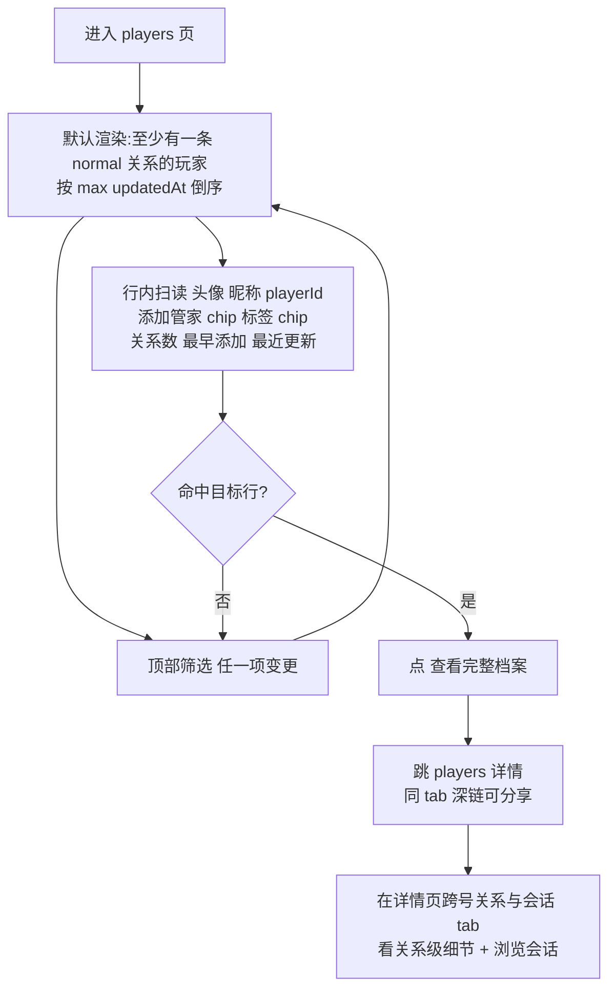
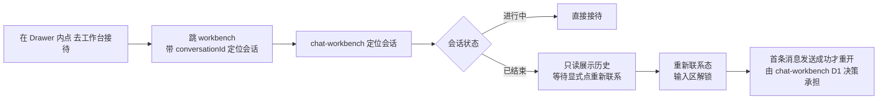
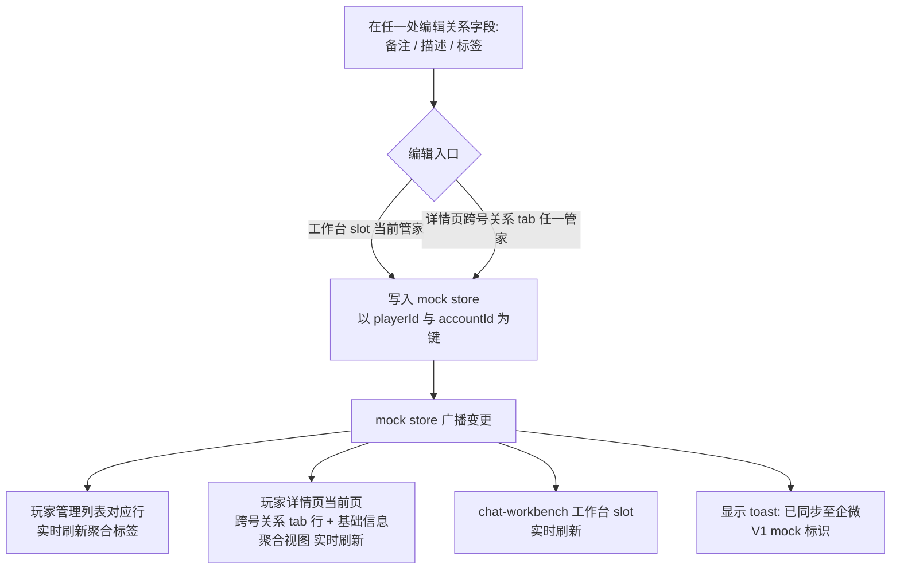
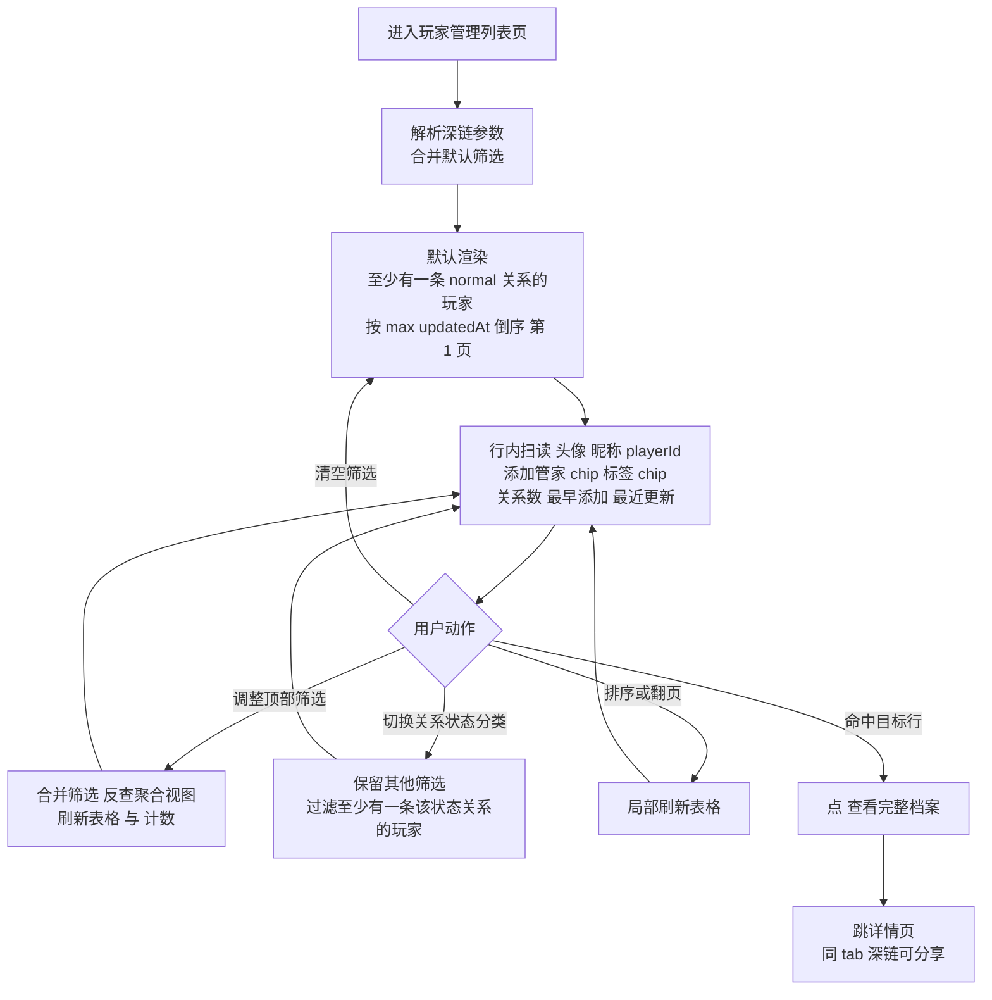
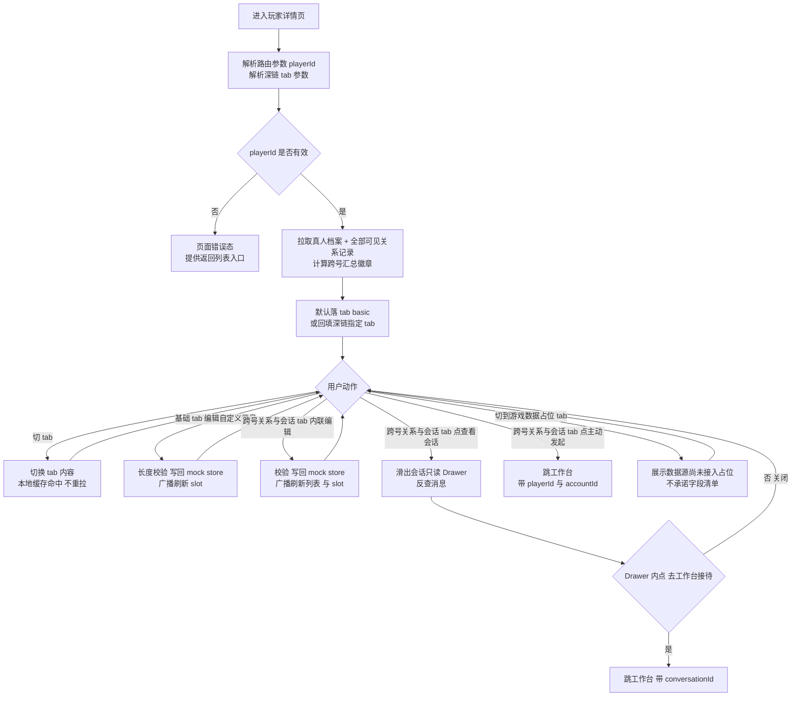
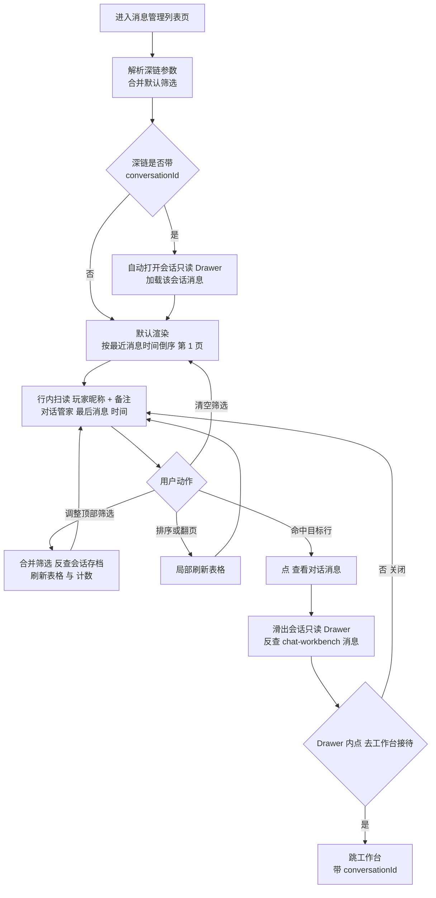
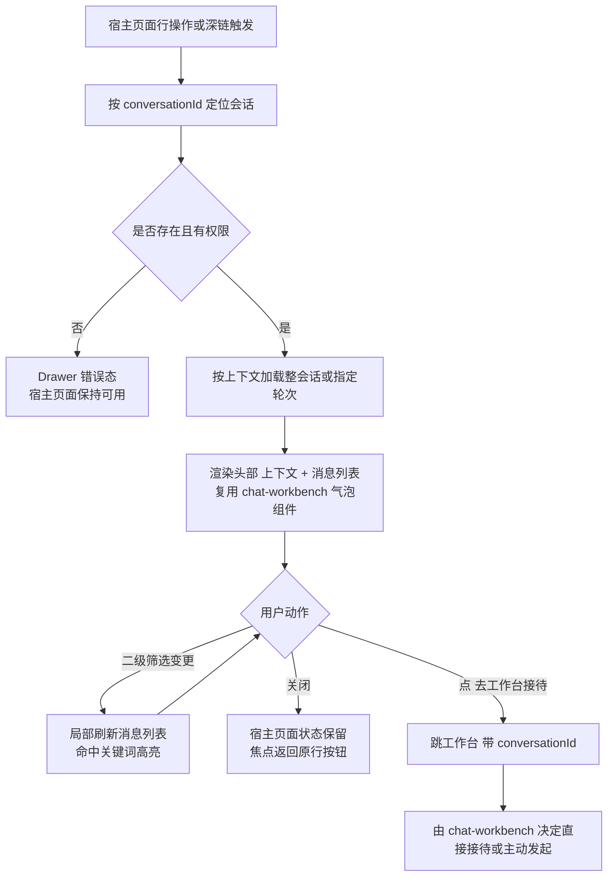
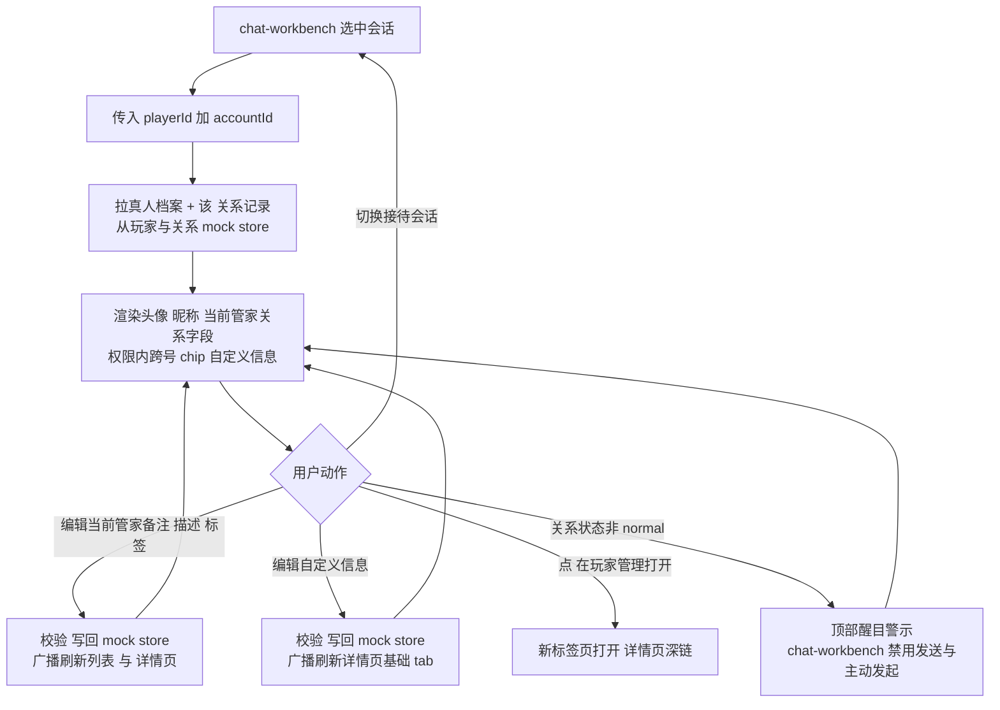

> **章节索引** — 先读这里定位,再按需跳读对应小节(用 grep `^#` 或 Read offset/limit,不必全文读)。决策/迭代史见 [decisions.md](decisions.md)。
>
> - 需求业务背景 / 业务诉求 / 概念说明
> - 功能现状:功能当前状态、数据当前状态(数据源 / V1 策略 / 字段总览 / 缺口)
> - 功能梳理:实现思路(页面分层 / 关键取舍 / 核心流程)、事项拆解(数据模型 / 标签 / 关系与状态 / 会话视图 / 页面承载与 slot)、跨领域接口约定
> - 功能详细描述:领域结构与模块关系、页面清单、业务流程图(图1 列表筛选扫读 / 图2 Drawer 去接待 / 图3 跨页字段同步)、共享规则与状态边界(关系状态 / 权限 / 数据同源 / 读写分离 / Drawer 协议 / slot 协议 / 空错态)、设计例外
> - 页面 1 `/players` 玩家管理列表页(§1.1–1.8)
> - 页面 2 `/players/:id` 玩家详情页(§2.1–2.8)
> - 页面 3 `/messages` 消息管理列表页(§3.1–3.8)
> - 模块 4 会话只读 Drawer(§4.x)
> - 模块 5 工作台 slot 精简档案(§5.x)

# 需求业务背景

## 业务诉求

**一句话目标**:把分散在各企微号、各会话里的玩家与消息集中沉淀成**两层结构** —— 上层是面向运营的两个检索台(`/players` 玩家管理 + `/messages` 消息管理),下层是真人级的玩家档案(`/players/:id` 详情页),并在客服工作台右列额外提供一份接待场景专用的精简档案。

具体诉求:

1. **玩家管理(检索 + 扫读)**:运营 / 客服能在 `/players` 列表里检索玩家(以 `playerId` 去重,一行一个真人),行内扫读跨号聚合字段(添加管家 chip / 玩家标签 chip / 关系数 / 最早添加 / 最近更新);**列表纯只读、不展开、点行不跳转**,命中目标行点"查看完整档案"跳详情页查看 / 编辑关系级细节(备注 / 描述 / 删除时间)与会话记录。关系级字段不在主表暴露,避免 chip 数量爆炸 + 与详情页跨号关系 tab 职责重叠。
2. **玩家详情(完整档案,可扩展容器)**:`/players/:id` 是真人级独立页面,以 `playerId` 为主键。**V1 双激活 tab(基础 / 跨号关系与会话)+ v1.1+ 游戏数据占位 tab**;每条(玩家×企微号)关系最多对应 1 个 `conversationId`(chat-workbench"会话 ID 跨轮次保持不变"决策),所以**关系字段编辑 + 会话索引并入同一行展示**,不再单独立"会话记录"tab。**为后续大量游戏侧数据(角色 / 充值 / 登录 / 客诉 / VIP 等级)预留 tab 容器**,v1.1+ 加"游戏数据" tab 不需重构。
3. **消息管理**:`/messages` 列表里检索"会话",**以会话轮次为维度**(同一会话多轮拆多行)。表格与只读 Drawer 统一使用复合标识 `roundId = conversationId#N`（如 `c_002#2`）：`#` 前为会话 ID，`#` 后为轮次；不额外追加总轮数。按对话管家(企微号)、玩家、最后消息内容 / 时间筛选；点某轮打开右侧 Drawer **只读浏览该轮消息**;"去工作台接待"仍按整会话跳转。
4. **跨页一致**:玩家管理列表行 / 玩家详情页 / 工作台 slot 三处共享同一份玩家与关系数据;备注 / 描述 / 标签可在详情页或 slot 编辑并跨页生效,自定义信息在详情页与 slot 同源。关系状态只读,由企微事件驱动更新;企微原生备注 / 描述 / 标签由企微 API 双向同步,**ChatFlow 端为权威源**。
5. **接待与检索分离**:玩家管理 / 消息管理 / 玩家详情页 / Drawer **均不渲染输入区**，需要发消息或继续接待 → 跳工作台。无历史会话时进入“主动发起”临时草稿；已有但已结束的会话先保持历史只读，客服显式点击“重新联系”后才解锁输入。两者都只有首条消息成功后才正式建会话 / 重开。
6. **工作台 slot ≠ 玩家详情页**:工作台右列 slot 是**接待场景专用的精简档案**(只装与本次接待最相关的字段:当前管家备注 / 描述 / 标签 / 关系状态 / 权限内跨号 chip / 单一自定义信息),内容比 `/players/:id` 少且聚焦,不复用同一组件;有"在玩家管理打开"链接(新标签页)跳详情页看完整档案。

## 概念说明


| 概念                   | 定义                                                                                                                                                                            |
| -------------------- | ----------------------------------------------------------------------------------------------------------------------------------------------------------------------------- |
| 玩家                   | ChatFlow 内由稳定 `playerId` 标识的玩家实体；不能把单个企业主体下的 `external_userid` 直接当跨主体自然人主键。一个玩家可关联多个企微关系。 |
| 企微号(管家)              | 接待玩家的企业微信账号，归属稳定 `corpId`；一个企微号可由多名客服轮班共用。`/players` 的“管家”列、`/messages` 的“对话管家”均展示企微号名。 |
| 客服(坐席)               | 真正登录 ChatFlow 操作消息的人(由 [permission](../permission/design.md) 维护);客服 ↔ 企微号是 N-N。本领域两个列表页**不直接展示客服**,只展示企微号(=管家)。                                                               |
| 玩家×企微号关系记录           | 每条记录承载独立备注、描述、标签、时间和关系状态，并保存 `corpId`、`externalUserId`；外部唯一键为 `corpId + external_userid`。`/players` 再按内部 `playerId` 聚合。 |
| 备注                   | 企微原生**备注**字段,绑定在(玩家,企微号)关系上;每个企微号给同一玩家的备注独立。展示时优先于微信昵称。                                                                                                                       |
| 描述                   | 企微原生**描述**字段,绑定在(玩家,企微号)关系上,可比备注更长(多行)。**与备注分别展示,不合并**。                                                                                                                       |
| 标签                   | 给玩家打的多选分类(如 "VIP-A" "高消费"),绑定在(玩家,企微号)关系上;**标签库**由本领域维护,可与企微原生标签双向互通。                                                                                                         |
| 标签组                  | 标签的分组(如 "等级" 组下含 VIP-A/B/C)。映射企微"客户标签组"。                                                                                                                                      |
| 关系状态                 | 枚举 `正常` / `被管家删除` / `被玩家删除`。历史始终保留；后两种都表示当前不是好友，均禁止发送或重新联系，必须先重新添加并恢复 `normal`。 |
| 自定义信息                | 玩家维度的运营自由备注(单一文本字段,200 字以内);**跨企微号统一**(归属真人 playerId,不挂在关系上)。**V1 不做"运营定义字段名"的灵活抽象**,2026-05-30 简化为单一字段。                                                                                        |
| 会话                   | 一个企微号 × 一个玩家的对话单元,由 chat-workbench 状态机维护,主键 `conversationId`(**跨轮次不变**,持久会话)。                                                                                                                 |
| 会话轮次(round)         | 同一 `conversationId` 内由 system「本次会话已结束」边界切出的一段(已结束→重开 = 新一轮)。**`/messages` 以轮次为最小展示单位**；`roundIndex` 从 1 起，UI 固定展示并复制 `roundId = conversationId#N`，例如 `c_002#2`；`#` 前为会话 ID，`#` 后为轮次，**不额外显示总轮数**。工作台 / 玩家详情页仍按整会话维度，轮次不影响其会话模型。 |
| 会话只读 Drawer          | 多处共用的右侧抽屉,展示消息历史,只读;有"去工作台接待"按钮跳 chat-workbench(按整会话 `conversationId` 跳)。**支持按轮过滤**:`/messages` 点某轮 → 只显示该轮消息;玩家详情页"查看会话" / 深链 → 整会话(所有轮 + 分隔条)。 |
| 玩家档案                 | 玩家在 ChatFlow 内的全部数据集合(基础信息 + 跨号关系记录 + 自定义字段 + 会话记录;v1.1+ 含游戏侧数据)。本领域分两种形态:**完整档案** = `/players/:id` 详情页(真人级容器,tab 化,可扩展);**精简档案** = chat-workbench 右列 slot(接待专用,内容精简且聚焦本次接待)。 |
| 完整档案(`/players/:id`) | 真人级玩家详情页,以 `playerId` 为主键、跨号聚合;V1 双激活 tab(基础 / 跨号关系与会话)+ v1.1+ 游戏数据占位 tab。**跨号关系与会话合并**:每条关系最多 1 个 `conversationId`,合并后一行展示关系字段(可编辑)+ 会话索引(消息数 / 最近消息 / 操作 查看会话 或 主动发起)。 |
| 精简档案(slot)           | chat-workbench 右列组件,以(playerId, accountId)为上下文;只装当前接待最相关的字段,不复用完整档案组件。                                                                                                        |


# 功能现状

## 功能当前状态

**全新领域,无历史页面。**

线下现状:运营和客服只能从企微原生客户端的"客户详情"看到玩家备注 / 标签 / 描述,无法跨号汇聚一个玩家;批量打标签依赖企微后台,操作分散;"按消息内容/玩家备注查会话"等检索动作只能逐号在企微 PC 端翻聊天记录。

业务部门已提供一份 SCRM 会员库截图参考(成员管理列表 + 私聊对话消息列表 + 对话消息明细),用于校准本领域 V1 的功能边界与字段范围;具体形态由 ChatFlow 自身架构(工作台联动 / 客服 ↔ 企微号 N-N / 主动发起会话语义)决定,不强行 1:1 复刻。

## 数据当前状态

### 数据源(真实链路)


| 类型           | 来源                               | 用途                                                 |
| ------------ | -------------------------------- | -------------------------------------------------- |
| 玩家身份         | 企业微信"外部联系人" API                  | 拉取所有添加进任一企微号的好友                                    |
| 玩家×企微号关系     | 企业微信 API                         | 每条关系上的备注 / 描述 / 标签 / 添加时间 / 删除时间 / 关系状态            |
| 备注 / 描述 / 标签 | 企业微信 API + ChatFlow 自维护          | 与企微原生双向同步;ChatFlow 端为权威源                           |
| 自定义信息        | ChatFlow 自维护                     | 企微无原生支持;V1 单一文本字段,跨企微号统一;v1.1+ 接游戏数据时再考虑结构化 |
| 会话与消息        | chat-workbench 的会话存档(企微会话存档 API) | 玩家管理/消息管理两个页面按 playerId 或 conversationId 反向查询,不重复存 |


### V1 数据策略

- Mock 为主,真实链路留接入契约(写到 `project/tech/` 后续版本)。
- Mock 玩家规模:8-12 人,覆盖单号 / 多号关系、含 1-2 例"被管家删除""被玩家删除"以验证关系状态分类切换。
- Mock 关系记录:每个真人有 1-3 个企微号关系;`/players` 聚合为一人一行,详情页"跨号关系与会话"tab 再按企微号展开关系行。
- 自定义信息:V1 单一文本字段(200 字以内),不做"字段定义"抽象;运营在玩家详情页基础 tab 自由填写。
- 不做活跃度统计字段(近 N 天发言天数 / 总发言天数等):后端聚合成本高、对 V1 接待价值有限;只保留 `addedAt` / `updatedAt` 作为列表排序字段。

### V1 字段总览

> 字段命名以 ChatFlow 自身语义为主,SCRM 等价术语供运营对照。


| 实体  | 字段                                                 | 类型 / 取值                                             | 说明                                                            |
| --- | -------------------------------------------------- | --------------------------------------------------- | ------------------------------------------------------------- |
| 玩家  | `playerId`                                         | string                                              | ChatFlow 内部稳定主键；UI 支持复制，不等同于外部身份键 |
| 玩家  | `nickname`                                         | string                                              | 微信昵称,从企微 API 拉                                                |
| 玩家  | `avatarUrl`                                        | string                                              | 微信头像                                                          |
| 玩家  | `customNote`                                       | string                                              | 自定义信息(单一文本,200 字以内);跨企微号统一(归属 playerId)                |
| 关系  | `(playerId, accountId)`                            | 复合主键                                                | 一段(玩家,企微号)关系记录,玩家管理列表的最小颗粒                                    |
| 关系  | `accountId` / `corpId` / `externalUserId`          | string                                              | 内部企微号键 + 企业主体 + 外部联系人 ID；外部唯一键为 `corpId + external_userid` |
| 关系  | `remark`                                           | string                                              | 企微原生备注,关系级独立                                                  |
| 关系  | `description`                                      | string(多行)                                          | 企微原生描述,关系级独立                                                  |
| 关系  | `tags[]`                                           | string[]                                            | 企微原生标签,关系级独立                                                  |
| 关系  | `relationStatus`                                   | `normal` / `removed_by_agent` / `removed_by_player` | 关系状态;`/players` 顶部分类切换,默认 `normal`                            |
| 关系  | `addedAt` / `updatedAt` / `syncVersion`            | datetime / number                                   | 添加 / 更新时间及乐观锁版本；列表默认按 `updatedAt` 倒序 |
| 关系  | `deletedAt`                                        | datetime / null                                     | 仅 `relationStatus != normal` 时有值                              |
| 会话  | `conversationId`                                   | string                                              | 一个(企微号 × 玩家)的对话单元,主键由 chat-workbench 维护(跨轮次不变)                       |
| 会话轮次 | `roundId` / `roundIndex` / `roundCount`          | string / number / number                            | **派生字段(非持久化)**:`roundId = conversationId#N`;`/messages` 的最小展示单位与 rowKey;按 system「本次会话已结束」切分计算 |
| 会话  | `accountId` / `playerId`                           | string                                              | 该会话的企微号(对话管家)与玩家                                              |
| 会话  | `lastMessage.{senderType, senderId, sentAt, contentPreview}` | object                                    | 最后一条消息的发送方类型(`player` / `agent`)/ **发送方 id(`senderId`,agent 时用于反查实际回复客服姓名)** / 时间 / 文本预览;由 chat-workbench 反查 |


### 已知数据缺口

- 企微原生备注 / 描述 / 标签的同步频率与冲突解决策略未定 — 以 ChatFlow 为权威源,**真同步实现留 `project/tech/` 跟进**,V1 仅 mock"已互通"提示。
- 玩家"游戏侧"信息(UID / 区服 / 充值额) — V1 chat-workbench 已明确不做(R010-R012 留 v1.1+),本领域只在自定义字段里放 mock 占位。
- SCRM 历史数据是否要导入 ChatFlow(老备注 / 老标签是否要做一次性迁移)— 待业务部门确认。

# 功能梳理

## 功能实现思路

### 页面分层

V1 共 **3 个独立路由 + 1 个共用 Drawer + 1 个 slot**:

1. `**/players` 玩家管理列表页**(顶栏 tab"玩家管理")
  - 顶部筛选条:playerId / 微信昵称(模糊)/ 管家(企微号下拉,多选)/ 玩家备注(模糊)/ 玩家标签 / 玩家描述(模糊)— **每条筛选命中"该玩家任一可见关系"即纳入**(玩家级 OR 语义)
  - 分类切换条(单行 chip):**关系状态**(正常 / 被管家删除 / 被玩家删除),默认 `正常`;过滤语义 = "**该玩家至少有一条**该状态关系"
  - 主体:**玩家维度表格**(一行一个真人,以 `playerId` 去重),字段:微信昵称(头像 + 昵称 + playerId 副标题)/ 添加管家(去重 chip,多管家折叠 +N)/ 玩家标签(去重 chip,**全部展示不折叠**)/ 关系数 / 最早添加 / 最近更新(默认 desc) / 操作("查看完整档案"单按钮)
  - **列表纯只读、不可展开**:点行只做行高亮(选中),不展开内容、不跳转;**关系级细节(备注 / 描述 / 删除时间)不在主表暴露**,去详情页跨号关系 tab 看完整版
  - 行操作(单按钮):**"查看完整档案" → 跳 `/players/:id`**(同 tab,深链可分享);完整字段查看 / 编辑 / 会话浏览统一在详情页完成
  - **不再触发会话只读 Drawer**:运营想看会话历史 → 详情页"跨号关系与会话" tab → 选关系行查看会话
2. `**/players/:id` 玩家详情页**(独立路由,V1 引入)
  - **职责**:真人级容器,以 `playerId` 为主键,跨号聚合;为后续大量游戏侧数据预留 tab 容器
  - **页头**：玩家头像 / 微信昵称 / playerId / 可见关系汇总；若还有不可见关系只提示其存在，不显示精确数量
  - **tab 切换**(V1 双激活 tab + v1.1+ 占位 tab):
    - **基础**:真人级自定义信息(单一文本字段,可编辑)/ 备注 + 描述聚合视图(每个企微号一段,只读;详细编辑去"跨号关系与会话" tab)
    - **跨号关系与会话**：每个 `(playerId, accountId)` 关系一行，备注 / 描述 / 标签可编辑；有会话可查看，无会话且关系正常可主动发起，两种删除状态均禁用
    - **(v1.1+) 游戏数据**：V1 只显示“数据源尚未接入”的中性占位，不预先承诺字段清单
  - **页底操作**:无;主操作均在 tab 内完成
  - 支持 `/players/:id` 直接深链(可分享、可收藏);从工作台 slot 跳过来时新标签页打开,避免打断接待
3. `**/messages` 消息管理列表页**(顶栏 tab"消息管理")
  - **维度 = 会话轮次**(`roundId = conversationId#N`,同一会话多轮拆多行;单轮也带 `#1`)
  - 顶部筛选条:对话管家(企微号下拉,多选)/ 消息时间(范围)/ 消息内容(模糊,**按该轮**)/ 玩家备注(模糊)/ 玩家标签 / **会话标识**(精确,支持 conversationId 或 roundId)
  - 主体:**会话轮次表格**,字段:会话轮次(`roundId` 等宽字符串 + 复制图标)/ 玩家(昵称 + 备注)/ 对话管家(企微号 = 回复的企微号名称)/ 最后消息(**该轮实际发送方:agent 显示实际回复客服姓名、player 显示"玩家"** / **完整日期时间 `YYYY-MM-DD HH:MM`** / 内容预览)/ 消息总数(该轮)/ 操作(查看对话消息)
  - 消息总数与最后消息均包含发送中 / 发送失败记录(只排除 system 事件);失败尝试属于历史审计的一部分,不能从统计与排序中消失
  - 展示口径对齐 chat-workbench design「[消息记录展示口径](../chat-workbench/design.md#消息记录展示口径共享-messagebubble)」:企微号(对话管家列)+ 实际回复客服 + 日期时间三要素在行内齐备
  - 行操作"查看对话消息" → 打开**会话只读 Drawer 并按轮过滤**(只显示该轮);"去工作台接待"仍按整会话 `conversationId` 跳
4. **会话只读 Drawer**(玩家详情页"跨号关系与会话" tab / 消息管理列表两处共用)
  - 从右侧滑入 720~880px,头部:玩家昵称 + 企微号徽标 + conversationId(等宽 + 复制图标) + 关闭
  - 二级筛选条:消息时间(范围)/ 消息内容(模糊)/ 发送方(全部 / 玩家 / 客服)
  - 主体:消息列表(发送方 / 消息类型 / 消息内容 / 发送时间;**只读**,不渲染输入区)。复用共享 `MessageBubble` + `MessageStream`,继承 chat-workbench「消息记录展示口径」:**实际回复客服姓名 + 按自然日插入日期分割线 + 气泡时间悬停原地展开为完整日期时间**;企微号为会话级固定值,展示于 Drawer 头部而非逐条气泡
  - 底部按钮:"去工作台接待 →" → 跳 `/workbench?conversationId=<id>`；若会话已结束，工作台先展示只读历史，客服必须显式点击“重新联系”，首条成功后才重开
5. **chat-workbench 右列 slot — 接待专用精简档案**(由本领域提供独立 React 组件,**不复用 `/players/:id`**)
  - 上下文:chat-workbench 传 `playerId + accountId`(当前接待的企微号)
  - 内容范围**只装与本次接待强相关的字段**:
    - 头像 / 微信昵称
    - **当前管家上的**备注(可编辑)/ 描述(可编辑)/ 标签(可增删)
    - 关系状态徽标(`被玩家删除` 时醒目警示,直接决定能否主动发起)
    - 跨号关系 chip 列表(只显示其他企微号名,**不展开**;想看完整跨号关系跳 `/players/:id`)
    - 自定义信息(`customNote`,单一文本字段,可编辑)
  - 底部"在玩家管理打开 →"链接 → 新标签页打开 `/players/:id`,看完整档案
  - **不展示**:全量自定义字段、跨号关系完整字段、会话记录列表、游戏数据 tab(这些都在 `/players/:id` 里)

### 关键取舍

- **三层职责划分**(本领域核心架构决策):
  - `**/players` 列表 = 玩家维度检索台**:粒度 `playerId`(一行一个真人),跨号字段以去重 chip 在主表聚合(添加管家 / 玩家标签 / 关系数 / 时间区间);**列表纯只读、不展开、点行不跳转**,行尾仅一个操作"查看完整档案";关系级细节(备注 / 描述 / 删除时间 / 编辑)统一去 `/players/:id`。
  - `**/players/:id` 详情页 = 真人级容器**:粒度 playerId,跨号聚合,以 tab 组织;V1 双激活 tab(基础 / 跨号关系与会话)+ v1.1+ 游戏数据占位 tab。**关系级字段编辑主入口 + 会话浏览主入口同在「跨号关系与会话」tab**(每条关系最多 1 个 conversationId,合并到同一行展示;一行包含 备注 / 描述 / 标签 内联编辑 + 会话索引列 + 行操作 查看会话 / 主动发起)。
  - **chat-workbench slot = 接待专用精简档案**:粒度(playerId, accountId),只装当前接待最相关的字段;不复用详情页组件,内容更少更聚焦,有"在玩家管理打开"链接跳详情页。
- **列表粒度 = 玩家(playerId)**(2026-05-30 反思后回退):同一玩家被 N 个企微号添加 → 主表只出 1 行,跨号字段以**去重 chip 聚合**(添加管家 / 标签 / 关系数 / 时间区间)。备注 / 描述 / 删除时间这些跨号不一致的关系级字段**不在主表展示**(避免 chip 数量爆炸 / 视觉混乱 / 与详情页跨号关系 tab 重叠);看完整版去详情页跨号关系 tab。**原"按(玩家×企微号)关系记录粒度"决策**(2026-05-22 / 2026-05-25)经反思后判定与"玩家管理"语义不符且与详情页职责重叠,本轮回退。
- **列表无行内展开**:`/players/:id` 详情页跨号关系 tab 已经按企微号一行展示完整字段且支持内联编辑;列表展开区会与之高度重叠 → 不引入展开。`/players` 仅承担"找玩家 + 跳详情";关系级编辑入口收敛到详情页跨号关系 tab + 工作台 slot 当前管家两处。
- **slot ≠ 详情页**:工作台 slot 是接待专用精简版,内容范围由"对当前接待是否相关"决定,内容比 `/players/:id` 少;不复用同一组件,避免相互掣肘。两者数据同源,任一处编辑跨页生效。
- **不引入"成员类型"维度**:玩家管理列表的实体本身就是"玩家(外部好友)",企微号在 [permission](../permission/design.md) 领域里管理,本领域不混合"官方 / 玩家"分类切换。`/messages` 的"对话管家"已经显式标出企微号一侧。
- **备注与描述分别展示,且都是企微原生**:不再合并为单一"备注";UI 上备注一行短文,描述支持多行长文;两者都参与企微双向同步。
- **playerId 是稳定主键**:跨企微号统一,真实链路用 `external_userid` 直接做 playerId(短期内单租户够用),V1 mock 字符串。UI 上直接用"playerId"展示,不引入业务别名。
- **会话与消息只反查不重存**:本领域不存消息,只按 `playerId` / `conversationId` 反查 chat-workbench 数据;消息渲染组件优先复用 chat-workbench 的样式以保持视觉一致。
- **本领域所有页面只读、发消息必跳工作台**:玩家管理列表 / 玩家详情页 / 消息管理列表 / Drawer 四处都不渲染输入区；进行中的会话直接进入接待，无历史会话进入“主动发起”临时草稿，已结束会话先只读并等待显式“重新联系”。**首条消息发送成功才正式建会话 / 重开**，本领域不重复实现发送状态机。
- **关系状态 V1 落地**:玩家管理顶部分类切换提供"正常 / 被管家删除 / 被玩家删除"三态,默认 `正常`。在玩家维度下,分类过滤条件 = "**该玩家至少有一条**该状态的关系";切到非默认分类时主表只显示这些玩家。**主表不为非正常分类追加"删除时间"列**(关系级字段),想看具体哪个关系被删除及删除时间 → 跳详情页跨号关系 tab。`被玩家删除` 状态在工作台 slot 精简档案里也要醒目展示(直接决定能否主动发起)。
- **自定义信息 V1 简化**(2026-05-30 进一步简化):取消"字段定义 + 字段值"双层抽象,改为 PlayerProfile 上**单一文本字段** `customNote`(200 字以内,跨企微号统一)。运营在详情页基础 tab 自由填写;v1.1+ 接游戏数据时再考虑结构化。
- **企微原生同步 V1 mock**:备注 / 描述 / 标签的双向同步只展示"已同步"标识,真实链路留 `project/tech/` 跟进,本领域不阻塞。
- **游戏侧数据 V1 不做、但容器要预留**:V1 chat-workbench 已明确不做游戏数据(R010-R012 留 v1.1+);本领域 `/players/:id` 的"游戏数据" tab 留占位,确保 v1.1+ 加 tab 不需重构整体页面结构。

### 核心流程

- **玩家管理筛选 + 扫读**:进入 `/players` → 默认"关系状态=至少有一条 normal + 按 `max(updatedAt)` 倒序" → 顶部筛选项任一变更即时刷新表格(筛选语义对**该玩家任一可见关系**命中即纳入)→ **行内扫读**:头像 + 昵称 + playerId / 添加管家 chip(去重)/ 玩家标签 chip(去重)/ 关系数 / 最早添加 / 最近更新(只读,不展开、不跳转)→ 命中目标行点"查看完整档案"跳详情页。
- **改关系级字段**(V1 mock):去 `/players/:id` 跨号关系 tab(任意管家)或工作台 slot(当前接待管家)任一处内联编辑 → 写入 mock store → toast"已同步至企微";多处实时一致,`/players` 列表行的聚合 chip 同步刷新展示。
- **看玩家完整档案**:行操作"查看完整档案" → 跳 `/players/:id` → 三 tab(基础 / 跨号关系与会话 / 游戏数据占位)。**关系级细节(备注 / 描述 / 删除时间)与会话浏览均在详情页内完成**。
- **从详情页打开会话历史**:`/players/:id` "跨号关系与会话" tab → 在关系行点"查看会话" → 会话只读 Drawer 从右侧滑出;关闭后留在详情页。**`/players` 列表不触发 Drawer**。
- **消息管理筛选 + 浏览**:进入 `/messages` → 顶部筛选(对话管家 / 消息时间范围 / 消息内容 等) → 命中会话表格 → 点行打开 Drawer 浏览消息。
- **跨页跳转**:`/players/:id` "跨号关系与会话" tab 与 `/messages` 打开的 Drawer 复用**同一个组件**;关闭 Drawer 不会丢宿主页面的筛选 / tab 状态。
- **跳工作台接待**：Drawer 底部“去工作台接待”定位既有会话；已结束会话仍保持只读，客服需显式点“重新联系”。无历史会话只在 Workbench 创建临时草稿，首条成功后才进入 `/messages`。
- **工作台 slot 流程**:chat-workbench 选中会话 → 右列加载本领域**精简档案组件**(独立组件,非详情页) → 渲染当前管家上的关系字段 + 权限内跨号 chip + 单一自定义信息 → 客服在 slot 内直接改备注 / 描述 / 标签 / 自定义信息;若需看完整档案点"在玩家管理打开" → **新标签页**打开 `/players/:id`(避免打断接待)。

## 事项拆解

按"能独立落地的最小颗粒"拆,共 **12 条**(6 条沿用 roadmap V1 覆盖条目 + 6 条围绕本领域 V1 落地形态追加)。
`来源 R`* 标 roadmap 行号;追加项标"追加"。

### 玩家档案数据模型(2 条)


| 事项          | 来源 R*     | 说明                                                     | 阻塞                       |
| ----------- | --------- | ------------------------------------------------------ | ------------------------ |
| 玩家备注 + 玩家描述 | R015 / 追加 | 两个企微原生字段,(玩家×企微号)关系级,**分别展示与编辑**;V1 mock 双向同步标识        | 影响玩家管理列表、Drawer、工作台 slot |
| 自定义字段       | R013      | 字段值展示与编辑;字段定义 V1 用 mock seed,UI 不做;跨企微号统一(归属 playerId) | 影响 slot 与列表行内展开"自定义字段"区  |


### 标签体系(2 条)


| 事项        | 来源 R* | 说明                             | 阻塞              |
| --------- | ----- | ------------------------------ | --------------- |
| 玩家标签展示与设置 | R014  | (玩家×企微号)关系上添加 / 移除标签;标签库由本领域维护 | 阻塞列表筛选、行内展开标签编辑 |
| 标签组互通     | R056  | 拉企微原生标签组 + 改动后回写企微(V1 mock 双向) | 与 R014 配套       |


### 关系与状态(2 条)


| 事项       | 来源 R* | 说明                                                         | 阻塞                         |
| -------- | ----- | ---------------------------------------------------------- | -------------------------- |
| 企微关系记录展示 | R017  | 列表粒度=(玩家×企微号);行内展开看完整字段;工作台 slot 内跨号关系 chip 列表             | 阻塞玩家管理列表与 slot 精简档案        |
| 关系状态分类切换 | 追加    | 玩家管理顶部分类切换("正常 / 被管家删除 / 被玩家删除");删除时间字段;影响工作台"主动发起会话"按钮可用性 | 阻塞玩家管理列表二级筛选与工作台 slot 状态提示 |


### 会话视图(2 条)


| 事项             | 来源 R* | 说明                                                                 | 阻塞                       |
| -------------- | ----- | ------------------------------------------------------------------ | ------------------------ |
| 会话只读 Drawer    | 追加    | 玩家详情页"跨号关系与会话" tab + 消息管理列表共用的右侧抽屉;消息时间 / 内容 / 发送方筛选;"去工作台接待"按钮                    | 阻塞详情页关系行与 `/messages` 行操作"查看对话消息";`/players` 列表不触发 Drawer |
| 会话记录(按玩家与会话反查) | R016  | 按 `playerId` 或 `conversationId` 反查 chat-workbench 数据,不存消息;消息渲染组件复用 | 阻塞 Drawer 内容、slot 最近会话区  |


### 页面承载与 slot(4 条,追加)


| 事项                        | 来源  | 说明                                                                                                                                                           | 阻塞                                       |
| ------------------------- | --- | ------------------------------------------------------------------------------------------------------------------------------------------------------------ | ---------------------------------------- |
| 玩家管理列表页(`/players`)       | 追加  | 顶栏 tab"玩家管理";筛选条 + 关系状态分类 + **玩家维度表格**(纯只读、不展开,跨号字段 chip 聚合)+ 行操作仅"查看完整档案";关系级编辑与会话浏览入口落在详情页与工作台 slot                                                                   | 顶级页面入口,玩家级检索 + 扫读的承载                     |
| **玩家详情页(`/players/:id`)** | 追加  | 真人级容器,以 `playerId` 为主键,跨号聚合;V1 三 tab(基础 / 跨号关系与会话 / 游戏数据占位);消息只读 Drawer 在关系行右侧滑出;支持深链分享,工作台 slot 跳转走新标签页                                  | 顶级页面入口,**为后续游戏数据预留 tab 容器**,与 slot 不复用组件 |
| 消息管理列表页(`/messages`)      | 追加  | 顶栏 tab"消息管理";筛选条 + 会话轮次表格 + 行操作"查看对话消息";支持 `?conversationId=<id>&round=<n>` 深链                                                                                           | 顶级页面入口,会话轮次检索的承载                          |
| 工作台 slot 接待专用精简档案         | 追加  | chat-workbench 右列独立组件(**不复用详情页**);只装与本次接待强相关字段:头像 / 昵称 / 当前管家备注 + 描述 + 标签(可编辑)/ 关系状态徽标 / 权限内跨号 chip(只显示不展开) / 单一自定义信息 / "在玩家管理打开"链接(新标签页跳 `/players/:id`) | 阻塞 chat-workbench 右列升级;边界要清晰             |


## 跨领域接口约定(初稿)

- **接 chat-workbench(slot)**:本领域提供 `<PlayerSlotPanel playerId accountId />` 组件(**slot 专用、独立于 `/players/:id` 详情页**),挂载在工作台右列;"在玩家管理打开"按钮 → 新标签页打开 `/players/:id`(看完整档案,不打断接待)。
- **接 chat-workbench(反向查询)**:本领域查消息时,从 chat-workbench 的 mock store(后续真实链路是会话存档 API)按 `playerId` 或 `conversationId` 拉取;不重复存消息。**会话只读 Drawer 内的消息渲染优先复用 chat-workbench 的消息气泡组件**(气泡圆角 8px、行高 1.55、状态图标等沿用其 [设计例外](../chat-workbench/design.md#设计例外说明领域级))以保持视觉一致。
- **接 chat-workbench(接待 / 主动发起)**:
  - Drawer 只承接已有会话，底部“去工作台接待”跳 `/workbench?conversationId=<id>`；进行中会话直接接待，已结束会话先只读并由客服显式点击“重新联系”。
  - 详情页无会话的正常关系可跳 Workbench 创建临时草稿；首条消息成功才正式落库并进入外部索引。
- **接 ops-admin**:不直接耦合;运营在玩家管理列表里改备注 / 描述 / 标签,标签库由本领域自管。`ops-admin` 维护的违禁词与本领域无关(本领域两个页面均只读不发消息)。
- **接 permission**:client 端要拿"当前客服可见玩家集合";V1 简化为"我可见的企微号关联的(玩家,企微号)关系记录集合",由 permission 提供企微号授权列表后衍生。`/players` 与 `/messages` 列表都按该集合自动过滤,超权限关系不出现。
- **接企业微信 API**(真实链路):备注 / 描述 / 标签 / 标签组 双向同步;具体 API 与冲突策略由 `project/tech/` 的版本设计定义,V1 mock"已同步"提示不阻塞。

# 功能详细描述

> D1 领域骨架、D2 三个页面与 D3 两个共享模块的稳定设计均已落定；实现状态以 `project/TASKS.md` 和自动化测试为准。

## 领域结构与模块关系

### 模块职责表

| 模块 / 页面 | 主要目标 | 入口 | 依赖对象 | 关联关系 | 备注 |
| --- | --- | --- | --- | --- | --- |
| 玩家管理列表页 | 玩家维度检索 + 扫读(以 playerId 去重,跨号字段 chip 聚合) | 顶栏"玩家管理" tab | 企微"外部联系人" API / permission 授权企微号 | 行操作仅"查看完整档案"跳详情页;不再触发 Drawer | 路由 `/players`,纯只读、不展开 |
| 玩家详情页 | 真人级容器,跨号聚合,可扩展 tab | 玩家管理行操作"查看完整档案" / 工作台 slot "在玩家管理打开"(新标签页) | 本领域玩家 + 关系 mock store / chat-workbench 会话反查 | 内嵌"基础 / 跨号关系与会话 / 游戏数据占位"三 tab;关系行内打开会话只读 Drawer | 路由 `/players/:id`,支持深链 |
| 消息管理列表页 | 会话轮次检索 | 顶栏"消息管理" tab | chat-workbench 工作台运行态 / permission 授权企微号 | 行操作"查看对话消息"打开按轮过滤的会话只读 Drawer | 路由 `/messages`,支持 `?conversationId=<id>&round=<n>` 深链 |
| 会话只读 Drawer | 在不打断当前页面的前提下浏览某会话的全部消息或指定轮次 | 玩家详情跨号关系与会话 tab / 消息管理两处行操作 | chat-workbench 工作台运行态 + 消息气泡组件复用 | 底部"去工作台接待"按宿主上下文跳 chat-workbench | 两处宿主共用同一组件,720~880px |
| 工作台 slot 精简档案 | 接待场景专用的玩家档案,聚焦本次接待 | chat-workbench 选中会话时右列自动挂载 | 本领域玩家 + 关系 mock store(以 `playerId + accountId` 为上下文) | 不复用 `/players/:id`;底部"在玩家管理打开"链接新标签页跳详情页 | 独立 React 组件 `<PlayerSlotPanel />` |
| 玩家与关系 mock store | 本领域唯一权威源,跨页面同步备注 / 描述 / 标签 / 自定义信息,并承载只读关系状态 | 列表 / 详情 / slot 三处共同读取;详情 / slot 写可编辑字段 | mock seed(8-12 真人 + 1-3 关系) | 写入后即时广播,所有视图刷新 | V1 不接企微 API,只展示"已同步"标识 |

### 依赖关系(文字版)

- **数据依赖**:
  - 玩家身份 + 关系记录 → 真实链路来自企微"外部联系人" API,V1 全部 mock。
  - 备注 / 描述 / 标签 / 标签组 → 与企微原生双向同步,**ChatFlow 端为权威源**;V1 仅 mock 同步标识。
  - 自定义字段 → 完全本领域定义,跨企微号统一(归属 `playerId`)。
  - 会话与消息 → 反查 chat-workbench 会话存档,本领域不重复存储。
- **跨领域依赖**:
  - chat-workbench:slot 挂载 / 反查会话与消息 / Drawer 底部"去工作台接待"按 query 跳 `/workbench`;消息渲染优先复用其消息气泡组件(沿用气泡 8px / 行高 1.55 例外)。
  - permission:client 端取"当前客服可见企微号集合",衍生"可见(玩家×企微号)关系集合",`/players` 与 `/messages` 自动按此过滤。
  - ops-admin:本领域两个列表页均只读不发消息,与违禁词库无关;不直接耦合。
- **内部依赖**:玩家管理列表 / 玩家详情 / 工作台 slot 三处共用同一份 mock store;备注 / 描述 / 标签与自定义信息编辑后跨页面实时一致,关系状态作为只读事件结果同步展示。

## 页面清单

### 页面清单表

| 页面 / 模块 | 路径 | 主要角色 | 页面目标 | 主要功能区 | 备注 |
| --- | --- | --- | --- | --- | --- |
| 玩家管理列表页 | `/players` | 运营 / 客服 | 玩家维度检索 + 扫读 | 顶部筛选条 / 关系状态分类 chip / **玩家维度表格(跨号字段 chip 聚合)** / 行操作"查看完整档案" | 列表纯只读、不展开、点行不跳转 |
| 玩家详情页 | `/players/:id` | 运营 / 客服 | 真人级完整档案查看与编辑 | 页头(头像 / 昵称 / playerId / 跨号汇总)/ tab 容器 | V1 三 tab:基础 / 跨号关系与会话 / 游戏数据占位 |
| 消息管理列表页 | `/messages` | 运营 / 客服 | 会话轮次检索 + 浏览 | 顶部筛选条 / 会话轮次表格 / 行操作"查看对话消息" | 支持 `?conversationId=<id>&round=<n>` 深链 |
| 会话只读 Drawer | 在 `/players/:id` / `/messages` 内触发 | 运营 / 客服 | 浏览某会话的全部消息或指定轮次 | 头部 / 二级筛选条 / 消息列表 / 底部"去工作台接待"按钮 | 两处宿主共用同一组件,不占独立 URL |
| 工作台 slot 精简档案 | 在 `/workbench` 内右列挂载 | 客服 | 接待场景下的玩家精简档案 | 头像 + 昵称 / 当前管家关系字段 / 权限内跨号 chip / 单一自定义信息 / "在玩家管理打开"链接 | 独立组件,不复用 `/players/:id` |

### 路由与导航

- 顶栏一级 tab 在 player-center 启用时追加两项:**玩家管理 → `/players`** 与 **消息管理 → `/messages`**(顺序排在 chat-workbench 的"工作台 / 控制台"之后)。
- `/players/:id` 不占用顶栏 tab,而是作为玩家管理的子路由(由列表行操作或 slot 链接进入);从工作台 slot 跳转一律新标签页打开,避免打断接待。
- `/players` / `/players/:id` / `/messages` 三个路由均支持深链分享与收藏。
- 路由切换会卸载页面组件；列表筛选、排序、分页和详情 tab 写入 URL，可在返回 / 刷新时还原。页内 Drawer 关闭时保留宿主当前状态。
- 会话只读 Drawer / 工作台 slot 精简档案均通过宿主页面状态切换控制,不占独立 URL。
- 工作台 slot 跳详情页:**新标签页**(`target=_blank` 等价语义),原 chat-workbench 标签页继续接待。

## 业务流程图

### 图 1:玩家管理列表的筛选 + 扫读 + 行操作分支



### 图 2:会话只读 Drawer 的"去工作台接待"分支



### 图 3:跨页字段同步(列表 / 详情 / slot)



## 共享规则与状态边界

### 1. 关系状态规则

- 关系状态枚举:`normal` / `removed_by_agent`(被管家删除)/ `removed_by_player`(被玩家删除)。
- `/players` 顶部分类切换条单选三态,**默认 `normal`**;所有分类沿用玩家维度固定列,删除时间属于关系级字段,仅在详情页关系行展示。
- 被删除关系**保留历史数据**,关系记录、备注 / 描述 / 标签、历史会话与消息均可只读浏览。
- `removed_by_player` 与 `removed_by_agent` 都表示非好友，工作台和详情页均禁用主动发起 / 重新联系；提示文案区分删除方向，但都要求先重新添加。
- 企微号停用或封禁时禁用主动发起；仅客户端 / RPA 暂时离线时允许进入 Workbench，消息提交后进入可见待发队列。
- 关系状态切换由企微 API 驱动,V1 mock seed 直接给出三态样本,不在前端提供"删除关系"按钮。

### 2. 权限边界

- 客服可见的企微号集合 = 该客服在 [`permission`](../permission/design.md) 领域被授权的企微号集合。
- 客服可见的(玩家×企微号)关系集合 = 由可见企微号衍生的关系子集;`/players` 列表自动按此过滤,超权限关系不出现。
- 客服可见的会话集合 = 由可见企微号衍生的会话子集;`/messages` 列表与 Drawer 内消息均按此过滤。
- 玩家详情页 `/players/:id` 只展示**可见关系**；存在不可见关系时页头显示非精确提示，不展示真实总数、账号名或可推导字段。
- 权限决策由后端(permission 接口)负责,本领域前端只做展示层守卫,假定后端已过滤。

### 3. 数据同源与跨页同步

- **三处视图共用同一份玩家与关系 mock store**:`/players` 列表行 / `/players/:id` 跨号关系 tab + 基础信息聚合视图 / 工作台 slot 精简档案。
- 任一处编辑备注 / 描述 / 标签 / 自定义信息 → 写入 mock store → 广播变更 → 所有视图实时刷新,无需手动刷新页面;关系状态不提供前端编辑入口。
- 真实链路:企微原生备注 / 描述 / 标签 / 标签组**双向同步**,以 ChatFlow 端为权威源;V1 仅在编辑后 toast "已同步至企微",真同步实现留 `project/tech/`。
- 自定义信息(`customNote: string`)以 `playerId` 为键,跨企微号统一,所有视图(详情页基础 tab / slot)展示同一份值;V1 仅详情页 + slot 可编辑,列表页不暴露。
- **V1 单一文本字段简化**:取消"字段定义"抽象,直接 PlayerProfile 上挂 `customNote`(200 字以内);v1.1+ 接游戏数据时再考虑结构化字段。
- 会话与消息**只反查不重存**:本领域按 `playerId` 或 `conversationId` 查 chat-workbench 会话存档,不在本领域 store 内复制消息。
- **会话反查源 = 工作台同一运行态**(2026-07-22):player-center 通过 `workbenchRuntimeMock` 直接读取工作台当前的 conversations / messages 集合。该集合已合并静态 seed、`proactiveStore` 中已落库的主动发起会话，以及当前 SPA 会话中新收 / 新发 / 撤回后的消息状态；`/players/:id` 总会话、关系行、`/messages` 轮次列表和会话只读 Drawer 因此与工作台保持一致。真实链路对应会话存档 API 的全量查询与实时增量更新。

### 4. 读写分离(本领域所有页面只读 + 发消息必跳工作台)

- `/players` / `/players/:id` / `/messages` / 会话只读 Drawer 四处**均不渲染输入区**,不能发消息、不能结束会话、不能撤回。
- 关系字段中备注 / 描述 / 标签的编辑入口仅在两处:`/players/:id` 跨号关系与会话 tab(对应任一管家)+ 工作台 slot 精简档案(对应当前接待管家);关系状态只读且由企微事件驱动,`/players` 列表行不暴露编辑入口。
- 自定义信息编辑入口:`/players/:id` 基础 tab + 工作台 slot(同一个 `customNote` 文本字段);`/players` 列表不暴露。
- 发消息 / 接待 → 一律跳 `/workbench`;**首条消息发送成功才落库**的语义由 chat-workbench D1 决策承担,本领域不重复实现。
- 已存在会话 → `/workbench?conversationId=<id>`;新会话或已结束会话 → `/workbench?playerId=<pid>&accountId=<aid>`。

### 5. 会话只读 Drawer 协议

- 两处宿主(玩家详情跨号关系与会话 tab / 消息管理列表)**共用同一个 React 组件**,确保交互行为、筛选条、消息渲染完全一致。
- Drawer 从右侧滑入,宽度 720~880px(在 `ui-brand.md` 默认 480~640 之上扩宽,适配消息流);滑入 / 关闭不影响宿主页面的筛选 / tab / 滚动状态。
- 头部:玩家昵称 + 企微号徽标 + `conversationId`(等宽字体 + 复制图标)+ 关闭按钮。
- 二级筛选条:消息时间(范围)/ 消息内容(模糊)/ 发送方(玩家 / 客服 二选一,默认"全部")。
- 主体消息列表**复用 chat-workbench 消息气泡组件**(继承气泡 8px / 行高 1.55 视觉例外),保证两处视觉一致。
- 底部按钮:"去工作台接待 →",携带当前 `conversationId` 跳工作台(见图 2)。
- 不渲染输入区、不显示发送按钮、不显示撤回按钮。
- 不存在 / 超权限会话进入错误态并隐藏底部按钮;新会话的主动发起入口位于详情页关系行,不经过 Drawer。

### 6. 工作台 slot 协议

- 由本领域提供独立 React 组件 `<PlayerSlotPanel playerId accountId />`,挂载在 chat-workbench 右列;**不复用 `/players/:id`**。
- 上下文:chat-workbench 传入 `playerId + accountId`(当前接待企微号),slot 据此渲染"当前管家关系字段 + 权限内跨号 chip + 单一自定义信息"。
- 字段范围(只装与本次接待强相关):头像 / 昵称 / 当前管家备注(可编辑)/ 描述(可编辑)/ 标签(可增删)/ 关系状态徽标 / **权限范围内**跨号关系 chip(只显示其他企微号名,不展开)/ 单一自定义信息 `customNote`(可编辑)。
- **不展示**:全量自定义字段、跨号关系完整字段、会话记录列表、游戏数据 tab — 这些由 `/players/:id` 承担。
- 底部"在玩家管理打开 →"链接 → **新标签页**打开 `/players/:id`,避免打断当前接待。
- 编辑动作通过 mock store 同步到 `/players` 列表行 + `/players/:id` 跨号关系 tab,实时一致。

### 7. 空态 / 加载 / 错误态

- **从未产生会话**：无会话关系显示“暂无会话”；只有 `normal` 关系可主动发起，两种删除状态都禁用。整列无会话时仍渲染关系行。
- **跨号关系空**:`/players/:id` 跨号关系 tab 仅 1 个企微号关系 → 仍按列表渲染单行,不切换为单条卡片样式,保持视觉一致。
- **筛选无结果**:`/players` / `/messages` 顶部筛选命中 0 行 → 表格区显示 `Empty` + "清空筛选"快捷按钮。
- **加载态**:列表骨架屏 3s 超时降级为 spinner;Drawer 首次拉取消息 loading 盖整个 Drawer 主体;详情页 tab 切换不重复 loading(数据已经在 store 中)。
- **错误态**:顶部横幅 + "刷新"按钮;不清空已加载数据;失败原因(如 mock 接口异常)以 toast 二级补充。
- **权限受限**:不展示"无权限"空页,直接从列表 / 详情跨号关系 tab / 消息列表过滤掉。
- **企微同步失败(V1 mock 不会触发,留接口)**:编辑后 toast 改为"已保存,同步至企微失败,稍后重试"+ 企微同步标识切换为告警态。

## 设计例外说明(领域级)

本领域以表单 / 列表 / Drawer / 详情 tab 为主,基本继承 `project/ui-brand.md` 默认规范,**无领域级新增视觉例外**。需要明确的延用关系如下:

- **会话只读 Drawer 内的消息气泡**:延用 chat-workbench 已声明的"消息气泡圆角 8px / 消息正文行高 1.55"例外口径(见 `project/domains/chat-workbench/design.md` 设计例外说明),通过复用 chat-workbench 消息气泡组件天然继承,本领域不另外维护。
- **Drawer 宽度**:在 `ui-brand.md` 默认 Drawer 宽度 480~640px 基础上,会话只读 Drawer 扩宽至 **720~880px**,以容纳消息流布局(头像 + 气泡 + 时间戳 + 状态)。这是局部宽度调整,不属于品牌规则改动,记录在此供 D2 引用。
- **关系状态强提示**(被玩家删除)在工作台 slot 顶部使用 chat-workbench 已声明的"风控告警大色块"例外口径,而不另起新例外。

后续 D2 / D3 推进过程中如发现新的领域级视觉例外,统一回写到本节,不分散到具体页面章节。

## 页面详细设计与模块展开

> 三个独立路由与两个共享模块的稳定设计均已展开。

### 待展开清单

- [x] D2 玩家管理列表页(`/players`)
- [x] D2 玩家详情页(`/players/:id`)
- [x] D2 消息管理列表页(`/messages`)
- [x] D3 会话只读 Drawer
- [x] D3 工作台 slot 精简档案

---

## 页面 1:`/players` 玩家管理列表页

### 1.1 页面概述

- **页面目标**:把分散在多个企微号上的玩家集中成一张可筛选的扫读表(以 `playerId` 去重,**一行一个真人**),运营 / 客服在一个屏幕里完成玩家级检索 + 跨号字段聚合扫读;**纯只读检索台**,关系级细节(备注 / 描述 / 删除时间)与字段编辑统一交给 `/players/:id` 详情页与工作台 slot,本页不暴露任何编辑入口。
- **主要角色**:运营、客服(只读 + 跳转,**不发消息、不改字段**)。
- **页面入口**:顶栏一级 tab "玩家管理"(顺序排在 chat-workbench 的"工作台 / 控制台"之后);也支持深链参数(关系状态 / 管家 / playerId 等)直接落定筛选状态。
- **页面出口**:
  - 行操作"查看完整档案" → 同 tab 跳玩家详情页(深链可分享、可收藏)。
  - **不再触发会话只读 Drawer**:想浏览会话历史 → 详情页"跨号关系与会话" tab。
- **本页负责**:筛选条件管理、关系状态分类切换、玩家维度表格渲染(跨号字段 chip 聚合)、行操作分发(跳详情页)、超权限关系前端守卫(假定后端已过滤)。
- **本页不负责**:渲染输入区、暴露字段编辑入口(备注 / 描述 / 标签 / 关系状态 / 自定义字段)、行内展开、暴露关系级细节字段(备注 / 描述 / 删除时间)、混入"成员类型"维度、维护标签库 / 自定义字段定义、统计活跃度、触发会话 Drawer。

### 1.2 页面功能流程



### 1.3 数据流说明

- **输入**
  - 用户筛选项:playerId / 微信昵称 / 管家(多选)/ 玩家备注 / 玩家标签(多选)/ 玩家添加时间(范围)/ 玩家描述。**所有筛选条件命中"该玩家任一可见关系"即纳入**(玩家级 OR 语义)。
  - URL query:支持深链参数(关系状态 / 管家 / playerId 等)与默认筛选合并(query 优先级高);深链不携带的字段回落默认。
  - 当前客服可见企微号集合:来自 `permission` 接口,前端只做展示层守卫,假定后端已过滤超权限关系。
  - 关系状态分类 chip:三态(正常 / 被管家删除 / 被玩家删除),默认 `normal`;过滤条件 = "**该玩家至少有一条**该状态的关系"。
  - 排序态:默认 `max(updatedAt) desc`(该玩家所有可见关系的最近更新),允许切换到 `min(addedAt)`(双向)/ `relationCount`(双向)。
  - 分页态:默认 page size 20,可切 10 / 20 / 50 / 100。

- **处理**
  - **聚合视图计算**:按 `playerId` 在 mock store 分组所有可见关系 → 得到每位玩家的 `PlayerAggregatedView`(关系列表 + 去重管家 + 去重标签 + 关系数 + 最早添加 + 最近更新 + `hasRelationStatus(status)`)。
  - 筛选合并:URL query + 顶部筛选条 → 对每个 view 施加"任一可见关系命中"判定。
  - 关系状态分类切换:保留非状态筛选,再按 `view.hasRelationStatus(status)` 二次过滤。
  - permission 过滤:超权限关系在聚合阶段已剔除,聚合后所有关系都是可见的。
  - 排序 + 切片:按当前排序字段排序,然后按 page / pageSize 切片。
  - 计数:总条数 = 过滤后玩家数;分类 chip 计数 = 各状态对应的玩家数(与当前非状态筛选联动)。

- **输出**
  - 表格行数据(玩家维度)+ 总条数 + 当前分页范围。
  - 行操作分发:跳路由(同 tab,详情页)。
  - 筛选 / 分类 / 排序 / 分页态实时**回写到 URL query**(`replaceState`),供分享 / 刷新 / 收藏复现视图。
  - **不写回 mock store**:列表只读;关系字段编辑入口在详情页跨号关系 tab 与工作台 slot,改动通过广播反向刷新本页聚合 chip。

### 1.4 页面布局设计详情

```text
┌──────────────────────────────────────────────────────────────────────────┐
│ TopBar (48px)                                                             │
│  Logo  | 工作台  控制台  玩家管理▼  消息管理 | (spacer)  🔔  ⌘K  👤客服  │
├──────────────────────────────────────────────────────────────────────────┤
│ 筛选条 (单行,继承 ui-brand 紧凑表单密度,水平排布,溢出折行)              │
│ [playerId____] [微信昵称____] [管家▼] [玩家备注____]                     │
│ [玩家标签▼] [玩家描述____]                            [清空筛选]          │
├──────────────────────────────────────────────────────────────────────────┤
│ 分类 chip (单行,与表格之间 12px gap)                                     │
│ [● 正常 (8)]  [被管家删除 (2)]  [被玩家删除 (1)]                          │
├──────────────────────────────────────────────────────────────────────────┤
│ 表格区 (玩家维度;一行一个真人;继承 ui-brand 表格行高,无竖向网格线)        │
│ ┌──────────────┬───────────────┬───────────┬─────┬────────┬────────┬────┐ │
│ │ 微信昵称     │ 添加管家      │ 玩家标签  │关系│最早添加│最近更新│操作│ │
│ │              │               │           │ 数 │        │   ▼    │    │ │
│ ├──────────────┼───────────────┼───────────┼─────┼────────┼────────┼────┤ │
│ │ 🟢 头像 昵称 │[小琴号][小贝] │[VIP-A]    │ 3   │  YYYY  │MM-DD HH│ ··· │ │
│ │   playerId   │[小娟号]       │[高消费+1] │ 个号│  -MM-DD│        │    │ │
│ └──────────────┴───────────────┴───────────┴─────┴────────┴────────┴────┘ │
├──────────────────────────────────────────────────────────────────────────┤
│ 分页 :  共 11 位玩家 · 1-11   [< 1 >]   [20 条/页 ▼]                       │
└──────────────────────────────────────────────────────────────────────────┘
```

| 页面区域 | 区域细分 | 作用 | 主要元素 | 备注 |
| --- | --- | --- | --- | --- |
| 顶部区域 | TopBar | 跨页面导航 + 全局入口 | Logo / Tab / 搜索 / 通知 / 客服头像 | 复用 chat-workbench 顶栏组件 |
| 查询区 | 顶部筛选条 | 玩家级 + 关系级 OR 命中 | 文本框 / 下拉多选 / 清空按钮 | 6 字段；当前明确不含“玩家添加时间范围” |
| 分类区 | 关系状态 chip | 三态切换 + 计数 | 单行 chip 三个,默认 `normal` | 与表格 12px gap;**主表不再因分类切换追加"删除时间"列** |
| 主体内容区 | 玩家维度表 | 扫读 + 行操作分发 | 表格行(真人级)/ chip 列(管家 / 标签去重)/ 行操作按钮 | 继承 ui-brand 表格行高 + 无竖向网格线 + 表头浅灰底;选中行使用主色浅阶背景高亮 |
| 辅助区 | 分页 + 计数 | 翻页 + 上下文反馈 | Pagination / 总条数 / 范围 / 页大小切换 | page size 默认 20,可切 10 / 20 / 50 / 100;计数文案"共 N **位玩家**" |

**1440 基线下列宽分配建议**(总宽 ≈ 1392,扣两侧 16px padding):

| 列 | 列宽 (px) | 备注 |
| --- | --- | --- |
| 微信昵称(头像 + 昵称 + playerId 副标题) | 240 | 含头像 32 + 两行文字;playerId 等宽字体次文本色 |
| 添加管家(去重 chip) | 220 | 最多 3 chip + "+N";chip 颜色按企微号状态(在线/离线/封禁)区分 |
| 玩家标签(去重 chip) | 220 | **全部展示、不折叠**(wrap 换行);已废弃标签灰显 |
| 关系数 | 90 | 数字 + "个号" 后缀;辅助识别多管家玩家 |
| 最早添加 | 110 | `YYYY-MM-DD`(min `addedAt`) |
| 最近更新(默认排序) | 130 | `MM-DD HH:mm`(max `updatedAt`);列头默认带降序箭头 |
| 操作 | 130 | 行尾仅一个按钮"查看完整档案",按钮 32px(继承 ui-brand) |
| **合计** | **1140** | 落在 1392 内,左右留白宽松,窄屏触发横向滚动 |

### 1.5 功能区详情

#### 1.5.1 顶部筛选条字段表

| 字段 | prop | 控件类型 | 命中语义(玩家级 OR) | 默认值 | 选项来源 | 是否在表格中展示 | 备注 |
| --- | --- | --- | --- | --- | --- | --- | --- |
| playerId | `playerId` | Input(等宽字体) | 精确(玩家级) | 空 | — | 否,精确匹配后由微信昵称列副标题定位 | 支持粘贴 + 复制图标;前后 trim |
| 微信昵称 | `nickname` | Input | 模糊(玩家级,大小写不敏感) | 空 | — | 是(微信昵称列) | — |
| 管家 | `accountIds` | Select(多选) | **该玩家任一可见关系的 accountId 在选中集合内** | 空(= 我可见的全部企微号) | permission 提供"我可见的企微号集合" | 是(添加管家 chip 列;全管家展示,不只展示命中的) | 可搜索;选项展示企微号名 + 离线 / 封禁徽标 |
| 玩家备注 | `remark` | Input | **该玩家任一可见关系的 `remark` 模糊命中** | 空 | — | 否(关系级,主表不展示;详情页跨号关系 tab 看完整版) | 大小写不敏感 |
| 玩家标签 | `tagIds` | Select(多选) | **该玩家任一可见关系的 `tagIds` 命中至少一个选中标签** | 空 | 标签库(本领域自维护) | 是(玩家标签列;去重 chip) | 已废弃标签虚态展示,见 1.7 |
| 玩家描述 | `description` | Input | **该玩家任一可见关系的 `description` 模糊命中** | 空 | — | 否(同备注理由) | 跨行匹配 |

筛选条交互细节:

- 任一字段变更 → 自动 debounce 300ms 后刷新表格,**不需要点"搜索"按钮**(纯检索台,鼓励即时反馈)。
- "清空筛选"按钮:一键重置所有顶部字段,但**不重置分类 chip 与排序**(分类是页面态,不是检索条件)。
- 当前不提供“玩家添加时间范围”筛选；如未来新增，需先明确玩家维度下的跨关系匹配语义。

#### 1.5.2 关系状态分类切换条

| 项 | 值 | 说明 |
| --- | --- | --- |
| 控件 | 单行 chip(三态单选) | chip 间距 8px;选中态主色浅阶背景 + 主色文字(继承 ui-brand) |
| 选项 | 正常 / 被管家删除 / 被玩家删除 | 对应 `relationStatus = normal / removed_by_agent / removed_by_player` |
| 默认 | 正常 | 与领域 D1 共享规则 §1 一致 |
| **过滤语义** | **"该玩家至少有一条该状态关系"** | 玩家维度下,玩家可能在多个号上有不同状态;只要任一关系符合即纳入 |
| 计数 | 每个 chip 右侧带括号计数(如 `正常 (8)`)| 计数 = 满足该分类的玩家数;与当前其他筛选联动(不切分类即时刷新) |
| 切换行为 | 保留其他筛选条件 + 排序态 + page size,**重置 page 到 1** | **主表不因分类切换追加"删除时间"列**(关系级字段);具体哪条关系被删 / 删除时间 → 详情页跨号关系 tab |

#### 1.5.3 表格列字段表(玩家维度)

| 列字段 | 数据来源 | 截断 / 格式 | 排序 | 列宽建议 | 备注 |
| --- | --- | --- | --- | --- | --- |
| 微信昵称 | `view.profile.{avatarUrl, nickname}` + `view.playerId` | 头像(继承 ui-brand 圆形头像)+ 昵称(单行省略)+ playerId(次文本色 + 等宽字体,缩进至昵称对齐,1 行省略) | 否 | 240 | playerId 副标题代替原"备注预览";想看每个关系的备注 → 详情页 |
| 添加管家 | `view.accountIds.map(findAccount)` | 去重 chip(继承 ui-brand 徽章);最多 3 个,超 3 折叠为"+N",hover 弹出全量;chip 颜色按企微号状态(在线 = 信息蓝 / 离线 = 警告橙 / 封禁 = 错误红) | 否 | 220 | — |
| 玩家标签 | `view.tagIds.map(getTagById)` | 去重 chip;**全部展示、不折叠**(wrap 换行) | 否 | 220 | 已废弃标签灰显 |
| 关系数 | `view.relations.length` | 数字 + " 个号" 后缀(次文本色) | 升 / 降 | 90 | 辅助识别多管家玩家;1 个号显示"1 个号",10+ 显示"10 个号" |
| 最早添加 | `view.earliestAddedAt`(`min(relations.addedAt)`) | `YYYY-MM-DD` | 升 / 降 | 110 | — |
| 最近更新(默认排序) | `view.latestUpdatedAt`(`max(relations.updatedAt)`) | `MM-DD HH:mm` | 升 / 降(默认 desc) | 130 | 列头默认带降序箭头 |
| 操作 | — | 一个按钮:`查看完整档案`(默认型),按钮高度继承 ui-brand 默认 | 否 | 130 | 行尾固定列;hover 行不放大按钮 |

通用规则:

- 行高继承 ui-brand 默认表格行高;无竖向网格线;表头浅灰底。
- 选中行(点击行体非按钮区)→ 使用 ui-brand 主色浅阶背景高亮,**不跳转、不展开**。
- **不展示**:关系级字段(备注 / 描述 / 删除时间)— 想看 → 详情页跨号关系 tab。
- **可排序字段白名单 = `latestUpdatedAt`(默认 desc)/ `earliestAddedAt` / `relationCount`**;其他字段(昵称 / 管家 chip 列 / 标签 chip 列)列头不显示排序图标、不响应点击。
- **本页字段集合为固定集**,不受"玩家级自定义字段"配置影响;自定义字段的查看与编辑在详情页基础 tab + 工作台 slot 提供。

#### 1.5.4 行操作区

| 按钮名 | 显示条件 | 触发行为 | 反馈 |
| --- | --- | --- | --- |
| 查看完整档案 | 始终显示 | 同 tab 跳玩家详情页(`/players/:id`,以 `playerId` 为参数);深链可分享、可收藏 | 路由切换;详情页加载完成前显示骨架屏 |

约束:

- 行操作不弹二次确认(只读跳转,无副作用)。
- **本页不再触发会话只读 Drawer**;运营想看会话历史 → 详情页"跨号关系与会话" tab → 关系行点"查看会话"。

#### 1.5.5 分页 / 计数区

| 元素 | 行为 |
| --- | --- |
| Pagination | 前后箭头 + 页码,溢出折"...";键盘左右切页 |
| 总条数 | 文案"共 N **位玩家**",次文本色(注意单位从"条"改为"位玩家",对齐玩家维度) |
| 当前页范围 | "M-N",次文本色 |
| 页大小切换 | 下拉:10 / 20 / 50 / 100,默认 20;切换后保留当前页号(若超出最大页 → 落到末页) |

### 1.6 关键交互说明

| 场景 | 触发 | 系统处理 | 成功结果 | 失败 / 异常 |
| --- | --- | --- | --- | --- |
| 筛选变更刷新表格 | 任一筛选字段变更 | debounce 300ms → 玩家级 OR 命中判定 → 刷新表格 + 分类 chip 计数 | 表格局部刷新;page 重置为 1 | mock 读取异常 → 顶部横幅 + "刷新"按钮,不清空已加载数据 |
| 关系状态分类切换 | 点击 chip | 保留其他筛选 + 排序 + page size,page 重置为 1;按 `hasRelationStatus(status)` 过滤 | 表格刷新;chip 计数同步更新 | — |
| 行选中高亮 | 点击行体非按钮区 | 切换该行选中态;**不跳转、不展开** | 行使用 ui-brand 主色浅阶背景高亮 | — |
| 点击查看完整档案 | 点击行尾按钮 | 同 tab 跳详情页,带 `playerId` 参数 | 路由切换 | 详情页加载失败 → 详情页内部容错(本页不感知) |
| 表头排序切换 | 点击可排序列头(`latestUpdatedAt` / `earliestAddedAt` / `relationCount`)| 切换该列升 / 降序;清除其他列排序态;默认 `latestUpdatedAt desc`;白名单外列不响应 | 表格刷新;page 保留当前页 | 未索引字段不响应点击 |
| 分页跳转 | 点页码或前后箭头 | 翻页 + 滚动到表格顶部 | 表格刷新 | — |
| 切换页大小 | 下拉选择 | 用新 pageSize 重新切片;若当前 page 超出最大页 → 落到末页 | 表格刷新 | — |
| 清空筛选 | 点击"清空筛选"按钮 | 重置所有顶部筛选字段,**不重置分类 chip 和排序** | 表格刷新到分类下全部数据 | — |
| 深链进入 | 直接访问带 query 的 URL | 解析 query → 合并默认筛选 → 首屏渲染 | 表格按 query 状态渲染;筛选条与 chip 同步回填 | query 不合法 → 静默忽略该字段,落默认 |
| 筛选变更回写 URL | 任一筛选 / 分类 / 排序 / 分页变更 | `replaceState` 更新 URL query(不入栈、不打断 back/forward) | 当前 URL 可被分享 / 收藏 / 刷新还原视图 | replaceState 失败 → 不阻塞表格交互 |
| 关系字段广播刷新 | 详情页 / slot 编辑后广播到达 | 重新计算受影响玩家的聚合视图 → 列表对应行 chip 实时刷新 | 标签 / 管家 chip 同步更新;无需用户操作 | — |

### 1.7 边界场景

| 场景 | 表现 |
| --- | --- |
| 空态 - 筛选无结果 | 表格区显示 `Empty` 插图 + 文案"未找到匹配的玩家" + "清空筛选"快捷按钮(只清筛选,不切分类) |
| 空态 - 当前分类下无玩家 | 切到非默认分类后命中 0 行 → `Empty` + 文案"当前分类下暂无玩家,试试切换到「正常」" |
| 空态 - 完全无可见关系 | 当前客服无任何可见企微号关联的玩家 → `Empty` + 文案"暂无可见的玩家,联系管理员授权企微号" |
| 加载态 | 列表骨架屏(行级 skeleton)显示 3s;超时降级 spinner;分页 / 排序切换时仅表格 body 骨架 |
| 错误态 | 顶部 `Alert` 横幅 + "刷新"按钮;不清空已加载数据;失败原因以 toast 二级补充 |
| 权限受限 | 超权限关系直接由后端过滤掉,前端聚合阶段已剔除;**该玩家所有关系都不可见** → 不出现在列表 |
| 该玩家所有关系都同状态 | 切到非该状态分类时该玩家不出现(等价于"hasRelationStatus 不命中") |
| 该玩家关系跨多个状态 | 切到不同分类该玩家都会出现(只要至少有一条);列表不暴露具体哪条命中,想看 → 详情页跨号关系 tab |
| 极端数据 | 玩家数 10000+ 时生产实现必须服务端分页与聚合；前端全量聚合只适用于当前 Mock 规模 |
| 标签库变更未刷新 | 筛选下拉中已选标签若被运营在标签库里删除 → 该标签在筛选条与表格胶囊里以"已废弃"虚态(灰底斜体)展示,**不阻塞筛选**(仍按原 ID 命中);hover 提示"该标签已删除,可在玩家详情页移除" |
| 管家筛选与可见集合的关系 | "管家"下拉选项始终来自当前客服可见企微号集合;若选了某管家,则只显示"任一关系在该管家上"的玩家;chip 列**全量展示该玩家所有可见管家**(不只展示命中筛选的)— 让运营看到"这个玩家在哪些号上"全貌 |

### 1.8 设计例外说明(本页面级)

无,完全继承 `project/ui-brand.md` 默认规范 + 本领域 D1 设计例外说明(领域级)。

---

## 页面 2:`/players/:id` 玩家详情页

### 2.1 页面概述

- **页面目标**:以 `playerId` 为主键、跨号聚合的**真人级容器**;在一个独立路由里完整呈现该玩家的真人级字段(基础 / 自定义)+ 全部可见的(玩家×企微号)关系记录 + 全部可见会话索引。**关系级可编辑字段主入口**(备注 / 描述 / 标签;关系状态只读);也是 v1.1+ 游戏数据接入的容器。
- **主要角色**:运营、客服(只读 + 编辑关系字段 + 编辑自定义字段;**不发消息**)。
- **页面入口**:
  - 玩家管理列表行操作"查看完整档案" → 同 tab 跳本页(默认 tab `basic`)。
  - 工作台 slot "在玩家管理打开"链接 → **新标签页**打开本页(避免打断接待)。
  - 直接深链 `/players/:id`(可分享、可收藏);URL query `?tab=basic|relations|game` 支持深链落定 tab;旧 `?tab=sessions` 兼容映射到 `relations`。
- **页面出口**:
  - 浏览器返回 → 回到上一个路由(从列表跳来则回列表;新标签页打开则关闭即可)。
  - "跨号关系与会话" tab 的关系行点"查看会话" → 在右侧滑出会话只读 Drawer;Drawer 关闭后回到本 tab 同一行。
  - Drawer 底部"去工作台接待 →" → 以当前 `conversationId` 跳工作台;无会话关系行的"主动发起"直接以 `playerId + accountId` 跳转。
- **本页负责**:真人级聚合、关系级字段编辑、自定义字段编辑、Tab 容器化预留 v1.1+ 游戏数据、跨号汇总徽章计数、深链落定与 tab 状态回写。
- **本页不负责**:渲染输入区(发消息)、承载接待动作、维护标签库 / 自定义字段定义、对玩家管理列表的扫读结果产生反向依赖、统计活跃度。

### 2.2 页面功能流程



### 2.3 数据流说明

- **输入**
  - URL params:`playerId`(必填;无效时进错误态)。
  - URL query:`?tab=basic|relations|game`(深链优先于默认 `basic`);**`?tab=sessions` 兼容重定向到 `relations`**(2026-05-30 合并后)。
  - 当前客服可见企微号集合:来自 `permission` 接口,前端只做展示层守卫。
  - tab 内子状态:基础 tab `customNote` 编辑值 / 跨号关系与会话 tab 单元格编辑值 + 选中行(打开 Drawer 时记录)。

- **处理**
  - 真人档案拉取:按 `playerId` 在玩家与关系 mock store 拉真人级字段(头像 / 昵称 / `customNote`)。
  - 跨号关系拉取:拉所有 `(playerId, *)` 关系记录;permission 过滤后得 `visibleRelations`。
  - 会话索引拉取:按 `playerId` 反查 chat-workbench 会话存档,得到所有 `(playerId, accountId)` 对应的 `ConversationIndexEntry`(用于跨号关系与会话 tab 的"会话"列)。
  - 跨号汇总计算:
    - `N_visible` = `visibleRelations.length`(我可见的关系数)。
    - `hasInvisibleRelations` = 权限服务仅返回的布尔提示；前端不接收、缓存或推导不可见关系的精确总数。
    - 总会话数:仅统计 `visibleRelations` 衍生的会话集合,不暴露不可见会话。
    - 最早添加时间:取 `visibleRelations.addedAt` 最小值。
  - Tab 内容懒加载:首次切到某 tab 才组装该 tab 的视图模型;切回已访问的 tab 命中本地缓存,**不重拉数据**。
  - 内联编辑:基础 tab `customNote` / 跨号关系与会话 tab 单元格 → 校验 → 写回 mock store → 广播变更。
  - 同表合并展示:在跨号关系与会话 tab 的视图模型构造阶段,以 `accountId` 为键把 `relation` 与对应 `ConversationIndexEntry` 合并到同一行(每条关系最多 1 个 conversationId);消息本体仍由 Drawer 加载,不在表格中展开。

- **输出**
  - 页头数据(头像 / 昵称 / playerId / 跨号汇总徽章)。
  - 当前激活 tab 的内容视图。
  - 编辑动作广播:广播至 `/players` 列表对应行 + 工作台 slot + 本页其他 tab 的同字段视图(基础 tab 备注/描述聚合视图同步刷新)。
  - URL query 实时回写 `?tab=...`(`replaceState` 不入栈),供分享 / 刷新还原 tab 落点。
  - **不写回**:消息体(由 chat-workbench 承担);**不允许**:发送消息 / 结束会话(本页不渲染输入区)。

### 2.4 页面布局设计详情

```text
┌──────────────────────────────────────────────────────────────────────────┐
│ TopBar (48px)                                                             │
│  Logo  | 工作台  控制台  玩家管理▼  消息管理 | (spacer)  🔔  ⌘K  👤客服  │
├──────────────────────────────────────────────────────────────────────────┤
│ [← 返回玩家管理]  面包屑 :  玩家管理  >  玩家详情  >  {昵称}              │
├──────────────────────────────────────────────────────────────────────────┤
│ 页头 (96px,扩展性卡片)                                                   │
│ ┌──────┐  {昵称}                     [被 5 个企微号添加] [存在其他不可见关系]│
│ │ 头像 │  playerId: ext_abc123  [📋 复制]    [总会话 12]  [最早添加 04-08]│
│ │ 64×64│                                                                  │
│ └──────┘                                                                  │
├──────────────────────────────────────────────────────────────────────────┤
│ Tab 头 (Tab line 风格,继承 ui-brand)                                     │
│ [ 基础 ]  [ 跨号关系与会话 (5) ]  [ 游戏数据 · v1.1+ ]                    │
├──────────────────────────────────────────────────────────────────────────┤
│ Tab 内容区 (主内容卡片,内边距 16px,外层 16px gutter)                     │
│ ┌──────────────────────────────────────────────────────────────────┐     │
│ │ {当前 tab 渲染内容,不同 tab 不同布局}                            │     │
│ └──────────────────────────────────────────────────────────────────┘     │
└──────────────────────────────────────────────────────────────────────────┘
```

| 页面区域 | 区域细分 | 作用 | 主要元素 | 备注 |
| --- | --- | --- | --- | --- |
| 顶部区域 | TopBar + 返回按钮 + 面包屑 | 跨页面导航 + 返回主页 + 路径定位 | Logo / Tab / 通知 / 客服头像 / **`← 返回玩家管理` 按钮**(text 型 + 左箭头图标)/ 面包屑 | TopBar 复用 chat-workbench 顶栏组件;返回按钮 + 面包屑同行,高 32px;**点击返回按钮 = navigate('/players')**(浏览器后退也走同一目标) |
| 页头 | 真人级身份卡 | 一眼看到这是谁 + 跨号汇总 | 头像 64×64 / 昵称 / playerId(等宽 + 复制)/ 三个汇总徽章 | 高 96px;页头不含 tab 头,避免页头随 tab 切换闪烁 |
| Tab 头 | 内容容器切换器 | 切换 3 个 tab | Tab(`type=line`,继承 ui-brand)+ 后置计数(`跨号关系与会话 (N)`)+ 游戏数据占位 tab 加 `v1.1+` 角标 | Tab 高继承 ui-brand 默认 |
| Tab 内容区 | 主内容卡片 | 承载当前 tab 视图 | 卡片包裹(内边距 16px)+ tab 内子模块 | 切换 tab 不重拉数据;懒加载 + 本地缓存 |

**页面整体宽度**:1440 基线下主内容区限宽 1280px 居中,左右各留 80px 留白(继承 ui-brand 弱化卡片 + 间距风格);窄屏(<1280px)时主内容区跟随视口收紧。

### 2.5 功能区详情

#### 2.5.1 页头字段表

| 字段 | 数据来源 | 展示形态 | 是否可复制 | 备注 |
| --- | --- | --- | --- | --- |
| 头像 | `player.avatarUrl` | 64×64 圆形(继承 ui-brand 头像样式) | 否 | 加载失败降级为昵称首字底色块 |
| 微信昵称 | `player.nickname` | 主标题字号(继承 ui-brand 主标题) | 否 | 单行省略,过长 hover Tooltip |
| playerId | `player.playerId` | 等宽字体次文本色 + 后置 📋 复制图标 | **是** | 点复制图标 → toast"已复制 playerId" |
| 跨号汇总徽章 - 关系数 | `N_visible` + `hasInvisibleRelations` | 主徽章只显示可见关系数；布尔值为真时附加“存在其他不可见关系” | 否 | 不展示不可见数量、账号名或详情 |
| 跨号汇总徽章 - 总会话数 | 仅 `visibleRelations` 衍生 | "总会话 N" 徽章 | 否 | 计数来自当前可见关系关联的会话集合 |
| 跨号汇总徽章 - 最早添加时间 | `min(visibleRelations.addedAt)` | "最早添加 YYYY-MM-DD" 徽章 | 否 | 全部不可见关系时显示"-" |

**N 总数策略落地**(收敛 D1 §2 留下的冲突):

- 默认按 `N_visible`(我可见的关系数)展示主徽章数字 → 避免对运营产生"看到了不能编辑"的误导。
- 当 `hasInvisibleRelations` 为真 → 额外显示“存在其他不可见关系”，不暴露数量。
- 跨号关系 tab 仅展示 `visibleRelations`；不可见关系不出现在 tab，也不参与精确计数。

#### 2.5.2 Tab 容器说明

| 项 | 值 | 说明 |
| --- | --- | --- |
| Tab 类型 | `type=line` | 继承 ui-brand 默认 Tab 风格;不使用胶囊 Tab |
| Tab 列表(顺序) | 基础 / 跨号关系与会话 / 游戏数据 | 对应 key:`basic` / `relations` / `game`(2026-05-30 合并:原 `sessions` tab 已并入 `relations`,深链兼容 `?tab=sessions` → 重定向到 `relations`) |
| 默认落点 | `basic` | URL query `?tab=...` 携带合法 key 时优先;`?tab=sessions` 兼容重定向 |
| 切换语义 | 切换局部内容(Tab 内容区);**不切路由**;Tab 头与页头不重绘 | 与 chat-workbench `/workbench` 内部 tab 行为一致 |
| 数据共享 | 页头数据全 tab 共享;基础 tab `customNote` ↔ slot 同源;跨号关系与会话 tab 关系字段编辑后广播至列表 + slot + 本页基础 tab 备注/描述聚合视图;会话索引列实时反查 chat-workbench | 编辑后广播路径见 D1 §3 |
| Tab 后置计数 | 跨号关系与会话 tab 后置 `(N_visible)`(关系数 = 会话索引行数;每条关系最多 1 个 conversationId)| loading 期间显示 `(--)` |
| URL query 回写 | 切 tab 时 `replaceState` 写入 `?tab=...`;不入栈,不打断 back/forward | 与页面 1 筛选回写 URL 同款做法 |
| 默认返回策略 | 浏览器返回直接退出本页(不在 tab 之间循环) | tab 切换不进 history |
| v1.1+ 占位 tab 表现 | **可点击 + 占位卡片** | 只说明数据源尚未接入，不列未来字段，避免形成未确认承诺 |

#### 2.5.3 基础 tab(`basic`)

**职责**:展示真人级字段(头像 / 昵称 / playerId 已在页头,本 tab 不重复)+ **自定义信息(单一文本,可编辑)** + 备注/描述聚合视图(只读)。

**自定义信息**(2026-05-30 简化:从"字段定义 + 字段值"双层抽象简化为单一文本字段):

| 字段名 | 数据类型 | 控件 | 校验 | 备注 |
| --- | --- | --- | --- | --- |
| 自定义信息 | `customNote: string` | `Input.TextArea`(自动 2-6 行) | 长度 ≤ 200 | 跨企微号统一(归属 `playerId`);失焦保存 + toast"已保存" + 广播刷新 slot |

- 编辑控件:`Input.TextArea`(autoSize 2~6 行,showCount 显示字符数)。
- 编辑交互:点击进入编辑态 → 失焦保存(不需要"保存"按钮);成功 → toast + 写回 mock store + 广播刷新 slot;失败 → toast 报错 + 回滚。
- **跨企微号统一**:`customNote` 以 `playerId` 为键,详情页基础 tab 与 slot 显示同一份值,任一处改动另一处实时一致(D1 §3)。
- **不再存在"字段名定制"**:本字段名称固定为"自定义信息",运营自由填写内容(不预先定义字段含义);v1.1+ 接游戏数据时再考虑结构化拆分。

**备注 / 描述聚合视图**(只读):

- 按企微号顺序排列(`accountId` 字典序),每段一卡片:管家名 + 备注 + 描述 + 添加时间。
- 卡片高度自适应内容;描述不截断,完整展示多行。
- 卡片底部小字提示"详细编辑去『跨号关系』tab 或工作台 slot",降低用户在本视图试图编辑的预期。

#### 2.5.4 跨号关系 tab(`relations`)— 关系级字段编辑主入口

**职责**:列出该真人在所有可见企微号上的(玩家,企微号)关系记录,**支持内联编辑**备注 / 描述 / 标签;关系状态、时间、会话索引只读展示;**行操作直接打开会话或主动发起**。

**为什么合并会话索引**(2026-05-30 决策):基于 chat-workbench D1 决策"会话 ID 跨轮次保持不变",**每条(玩家×企微号)关系最多对应 1 个 `conversationId`**;原"会话记录"tab 与"跨号关系"tab 实际是同一维度的不同列,合并到同一表既能减少 tab 切换开销,又能让运营在同一行看到"这个号上的关系字段 + 这个号上的会话"完整信息。

**关系与会话列字段表**:

| 列字段 | 数据来源 | 展示形态 | 是否可编辑 | 编辑控件 | 备注 |
| --- | --- | --- | --- | --- | --- |
| 管家(企微号名) | `relation.accountId → account.name` | 单行省略 + 离线 / 封禁徽标 | 否(关系主键不可改) | — | 行首固定列;`fixed: 'left'` |
| 备注 | `relation.remark` | 1 行省略,溢出 hover Tooltip;编辑态切到 Input | **是** | Input(继承 ui-brand 表单密度) | 失焦 / Enter 提交;Esc 取消;成功 toast"已同步至企微" |
| 描述 | `relation.description` | 多行展示(限高 3 行);编辑态切到 Textarea | **是** | Textarea(自适应高度) | 同上 |
| 标签 | `relation.tags[]` | 胶囊(继承 ui-brand 徽章);编辑态切到 Select 多选 | **是** | Select 多选(选项 = 标签库) | 同上;已废弃标签灰显 |
| 关系状态 | `relation.relationStatus` | 徽标(正常 / 被管家删除 / 被玩家删除),三态语义色继承 ui-brand 中性/警告 | 否(由企微 API 驱动) | — | — |
| 添加 / 删除时间 | `relation.addedAt` + `relation.deletedAt` | 双行紧凑展示:"添加 YYYY-MM-DD" + (`deletedAt` 非空时)"删除 YYYY-MM-DD" | 否 | — | 紧凑节省横向空间 |
| **会话** | `conversation.{messageCount, lastMessage}`(按 `accountId` 在 sessions 索引中查找) | 双行紧凑:第一行"共 N 条 · 最近 MM-DD HH:mm";第二行"客服:/玩家:消息预览";无会话时显示"暂无会话" | 否 | — | 一条关系最多对应 1 个 conversationId,直接展示其索引 |
| 操作 | — | 有会话 → 查看；无会话且关系正常、账号启用且未封禁 → 主动发起。两种删除状态、账号停用或封禁时禁用；仅 RPA / 客户端离线允许跳 Workbench 后排队 | 否 | — | 行尾固定列 |

**内联编辑交互**:

- 单元格点击进入编辑态(可编辑列才有点击 affordance:hover 显示边框);非编辑列不响应。
- 提交触发:失焦或 Enter(Textarea 内 Enter 换行,Ctrl+Enter 提交);取消触发:Esc。
- 提交流程:本地校验(长度 / 标签合法性)→ 写回 mock store → toast"已同步至企微" → 广播至 `/players` 列表对应行 + 工作台 slot + 基础 tab 备注/描述聚合视图。
- 编辑提交携带 `expectedVersion`；版本冲突时不覆盖对方修改，保留当前输入并提示刷新最新值后重试。

**行操作语义**:

- **有会话** → 点"查看会话":在该 tab 右侧滑出会话只读 Drawer(同一组件实例,与 `/messages` 复用);Drawer 关闭后回到本 tab 同一行,滚动位与选中态保留。
- **无会话（关系正常）** → 跳 Workbench 创建临时草稿；首条消息成功后才正式建会话并进入其他索引。
- **无会话（任一删除状态）** → 按钮灰显，提示先重新添加好友。
- **无会话(被管家删除)** → "主动发起"按钮可点(管家可重新加回);跳工作台后语义由 chat-workbench 自身决策。
- **无会话（企微号停用 / 封禁）** → 按钮灰显；仅执行依赖暂时离线不禁用，进入 Workbench 后由待发队列承接。

**可见性与排序**:

- 仅展示 `visibleRelations`；不可见关系不出现在 tab，也不参与页头精确计数。
- V1 不提供 tab 内排序 / 筛选(单玩家关系数通常 ≤10,直接渲染);若关系数 > 20(防御性场景)→ 启用 tab 内分页 page size 10。
- 默认按"添加时间"升序排列(管家加入顺序),让运营看到关系演化时间线。

#### 2.5.5 游戏数据 tab(`game`,v1.1+ 占位)

**职责**:容器化预留 v1.1+ 游戏数据;V1 显式占位,让运营感知未来扩展点。

| 项 | 值 |
| --- | --- |
| Tab 头标识 | "游戏数据" + 后置小字"v1.1+" 角标 |
| 是否可点击 | **可点击**(不灰显) |
| 切入后内容 | 占位卡片:标题"游戏数据 · 待 v1.1+ 接入" + 一句提示;**不列待接入字段清单**(2026-06-03 精简,避免未定字段误导) |
| 显式提示 | "V1 阶段如需手动备注玩家信息,可在『基础』tab 的『自定义信息』文本域记录。" |
| 操作按钮 | 无 |
| 占位卡片样式 | `Alert`(type=info)轻量占位(继承 ui-brand)|

### 2.6 关键交互说明

| 场景 | 触发 | 系统处理 | 成功结果 | 失败 / 异常 |
| --- | --- | --- | --- | --- |
| 深链进入 | 直接访问 `/players/:id` 或 `/players/:id?tab=...` | 解析 playerId → 拉真人档案 + 可见关系 → 计算汇总 → 落 tab(query 优先,其次默认 `basic`) | 页头 + tab 内容渲染;URL query 回写完成态 | playerId 无效 → 错误态卡片(2.7);拉取失败 → 顶部 Alert 横幅 + 重试 |
| 浏览器返回 | 浏览器后退键 | 直接回到上一个路由(列表 / 工作台);**不在 tab 之间循环** | 路由切换 | — |
| 切 tab | 点击 Tab 头 | 切换 Tab 内容区;首次切到目标 tab 才组装视图模型;命中本地缓存不重拉 | Tab 内容渲染;`replaceState` 更新 URL `?tab=...` | 反查失败 → tab 内容区错误态 + 重试 |
| Tab 深链回写 | 任意 tab 切换 | `replaceState` 写 `?tab=...`,不入栈、不打断 back/forward | URL 可分享 / 收藏 / 刷新还原 tab 落点 | replaceState 失败 → 不阻塞 tab 交互(降级为不回写) |
| 基础 tab 编辑自定义信息 | 在 TextArea 中改 → 失焦保存 | 长度校验(≤200)→ 写回 mock store → 广播刷新 slot | toast"已保存";`customNote` 刷新;slot 实时一致 | 校验失败 → 内联错误;写回失败 → toast + 回滚到原值 |
| 跨号关系与会话 tab 内联编辑 | 点击单元格(备注 / 描述 / 标签)→ 改 → 失焦 / Enter / Ctrl+Enter | 校验 → 写回 mock store → 广播至列表 + slot + 基础 tab 聚合视图 | toast"已同步至企微";三处实时一致 | 同上 + 编辑冲突场景见 2.7 |
| 行操作 - 查看会话 | 点行尾"查看会话"按钮(行有会话索引时) | 滑出会话只读 Drawer + 反查 chat-workbench 消息 | Drawer 渲染消息流(只读) | 反查失败 → Drawer 内部错误态 + 重试 |
| 行操作 - 主动发起 | 行无会话、关系为 `normal`、账号启用且未封禁 | 跳工作台 `/workbench?playerId=<pid>&accountId=<aid>` | 创建 Workbench 临时草稿；首条成功后才正式建会话 | 路由失败则保留详情页 |
| 行操作 - 主动发起(被玩家删除)| hover 灰显的"主动发起"按钮 | 显示 Tooltip"该玩家已删好友,无法主动发起会话" | Tooltip 显示 | 按钮点击不响应 |
| 行操作 - 主动发起(企微号不可用)| hover 灰显的"主动发起"按钮 | 按账号状态显示"该企微号当前离线 / 已封禁,无法主动发起会话" | Tooltip 显示 | 按钮点击不响应 |
| Drawer 关闭返回 tab | 点击 Drawer 关闭按钮 / Esc / 点遮罩 | 关闭 Drawer;焦点返回原行"查看会话"按钮;tab 滚动位与选中态保留 | 回到 tab 同一行 | — |
| Drawer 内"去工作台接待" | 点击 Drawer 底部按钮 | 按已存在会话 query 跳工作台 | 工作台定位会话 | 路由失败 → toast 提示,Drawer 保留 |
| 切到游戏数据占位 tab | 点击 Tab 头 | 渲染“数据源尚未接入”占位，不列字段 | 占位卡片显示 | — |
| 复制 playerId | 点击页头 📋 复制图标 | navigator.clipboard 写入;失败降级 execCommand | toast"已复制 playerId" | 复制失败 → toast"复制失败,请手动选择" |
| 跨号汇总 hover 不可见提示 | hover“存在其他不可见关系” | 显示授权说明 | 不展示数量或账号明细 | — |

### 2.7 边界场景

| 场景 | 表现 |
| --- | --- |
| playerId 不存在 | 页面级错误态(`Empty` + 文案"玩家不存在或已被清理")+ "返回玩家管理"按钮跳 `/players` |
| 该真人无可见关系但存在不可见关系 | 页头只显示“存在其他不可见关系”；跨号关系与会话 tab 显示无权限空态，不泄露数量 |
| 后端确认玩家不存在，且没有任何可见或受限关系提示 | 走“玩家不存在或已被清理”错误态；前端不以关系精确总数判断 |
| 该真人有可见关系但部分关系无会话 | 正常渲染可见关系；无会话行在关系为 `normal` 时可主动发起，否则禁用 |
| `customNote` 字段缺失或损坏(mock seed 异常)| 字段降级为空字符串 + 灰色 placeholder 提示"数据异常";不阻塞跨号关系 tab 编辑 |
| 跨号关系 tab 内联编辑冲突 | 期望版本不匹配时拒绝覆盖；保留本地输入并提示刷新后重试 |
| 加载态 - 页头 | 页头骨架屏(头像圆 + 两行文字 + 三个徽章)显示 3s;超时降级 spinner |
| 加载态 - tab 内容 | 首次切到 tab 时 tab 内容区骨架屏(行级);切回已访问的 tab **不再 loading**(本地缓存) |
| 错误态 - 页头拉取失败 | 顶部 Alert 横幅 + "刷新"按钮;tab 头与 tab 内容均不渲染 |
| 错误态 - 单 tab 拉取失败 | 仅该 tab 内容区显示 `Alert` + 重试,其他 tab 不受影响 |
| 权限受限 | 仅渲染可见关系；只提示存在其他不可见关系，不显示精确计数 |
| URL query `?tab=...` 不合法 | 静默忽略,落默认 `basic`;不报错 |
| URL query `?tab=sessions`(旧深链)| 兼容重定向到 `relations`(2026-05-30 合并后的等价 tab)|
| v1.1+ 占位 tab 切入 | 渲染占位卡片(2.5.5);不报错、不空态 |
| Drawer 打开期间编辑同一行关系字段 | 编辑入口在同一 tab 同一行,Drawer 滑出不影响表格主体;关闭 Drawer 后单元格仍可编辑 |
| 复制 playerId 在不安全上下文(非 HTTPS / iframe)| navigator.clipboard 不可用 → 降级 execCommand;再失败 → 选中文本 + toast"请手动复制" |

### 2.8 设计例外说明(本页面级)

无,完全继承 `project/ui-brand.md` 默认规范 + 本领域 D1 设计例外说明(领域级)。

---

## 页面 3:`/messages` 消息管理列表页

### 3.1 页面概述

- **页面目标**:把所有可见(玩家×企微号)关系衍生的会话按**轮次**集中成一张可筛选的扫读表;运营 / 客服在一个屏幕里按"对话管家 / 最后发送方 / 玩家备注 / 标签 / 消息时间 / 消息内容"等条件检索目标轮次,行操作"查看对话消息"在右侧滑出会话只读 Drawer 浏览该轮消息。**纯只读检索台**,不渲染输入区。
- **主要角色**:运营、客服(只读 + 跳转,**不发消息**)。
- **页面入口**:顶栏一级 tab "消息管理"(顺序排在"玩家管理"之后);也支持 `?conversationId=<id>` 深链打开整会话,以及 `?conversationId=<id>&round=<n>` 深链打开指定轮次。
- **页面出口**:
  - 行操作"查看对话消息" → 在右侧滑出会话只读 Drawer(与玩家详情复用同一组件;宿主表格状态保留)。
  - Drawer 底部"去工作台接待 →" → 以 `conversationId` 跳工作台。
- **本页负责**:筛选条件管理、会话轮次表渲染、行操作分发(开 Drawer)、`conversationId + round` 深链直达 Drawer、超权限会话前端守卫(假定后端已过滤)。
- **本页不负责**:渲染输入区、暴露字段编辑入口(备注 / 描述 / 标签)、跨真人聚合。列表粒度是**会话轮次**:同一玩家可因不同企微号或同一会话多轮出现多行,与 `/players` 的一人一行粒度不同;本页也不维护标签库 / 自定义字段定义。

### 3.2 页面功能流程



### 3.3 数据流说明

- **输入**
  - 用户筛选项:对话管家(企微号下拉,多选)/ 最后消息发送方(玩家 / 客服 二选一)/ 消息时间(范围)/ 消息内容(模糊)/ 玩家备注(模糊)/ 玩家标签(多选)/ conversationId(精确)。
  - URL query:支持深链参数(对话管家 / 时间范围 / `conversationId` 等),与默认筛选合并;**`conversationId` 是本页的特殊深链**,进入即自动打开 Drawer,且不阻塞表格筛选。
  - 当前客服可见企微号集合:来自 `permission` 接口,前端只做展示层守卫。
  - 排序态:默认 `lastMessage.sentAt desc`(按最近消息时间倒序),允许切换到"消息总数 / 最早消息时间"。
  - 分页态:默认 page size 20,可切 10 / 20 / 50 / 100。

- **处理**
  - 筛选合并:URL query + 顶部筛选条 → `filters`。
  - 反查:按 `filters` 在 chat-workbench 会话存档中反查 `conversation` 记录(本领域不重存消息,见 D1 §3);**消息内容模糊匹配:V1 在前端遍历该会话全部消息(text + mediaName 任一命中即纳入),不只是 `lastMessage.contentPreview`**;v1.1+ 真实链路改走会话存档全文索引 API。
  - permission 过滤:剔除超权限的(玩家,企微号)对应会话。
  - 排序 + 切片:按当前排序字段排序,然后切片。
  - `conversationId` 深链处理:进入页面解析到 `conversationId` 时,**异步并行**:① 表格按其余筛选项渲染;② 立即打开 Drawer 加载该会话(不依赖表格命中);若该 `conversationId` 不在可见集合 → Drawer 进入"会话不可见或不存在"错误态。

- **输出**
  - 表格行数据 + 总条数 + 当前分页范围。
  - Drawer 状态(开 / 关 + 当前 conversationId)。
  - 筛选 / 排序 / 分页态实时回写到 URL query(`replaceState`,不入栈)。
  - **不写回**:消息体 / 会话状态;**不允许**:发送 / 结束 / 撤回(本页不渲染输入区)。

### 3.4 页面布局设计详情

```text
┌──────────────────────────────────────────────────────────────────────────┐
│ TopBar (48px)                                                             │
│  Logo  | 工作台  控制台  玩家管理  消息管理▼ | (spacer)  🔔  ⌘K  👤客服   │
├──────────────────────────────────────────────────────────────────────────┤
│ 筛选条 (单行,继承 ui-brand 紧凑表单密度,水平排布,溢出折行)              │
│ [conversationId____] [对话管家▼] [发送方▼] [消息时间 范围]               │
│ [消息内容____] [玩家备注____] [玩家标签▼]   [清空筛选] [展开更多]         │
├──────────────────────────────────────────────────────────────────────────┤
│ 表格区 (继承 ui-brand 默认表格行高,无竖向网格线,表头浅灰底)             │
│ ┌────────────┬──────────────┬────────┬─────────────────────────┬─────┐   │
│ │conversation│ 玩家         │ 对话   │ 最后消息                │操作 │   │
│ │     Id     │              │ 管家   │                         │     │   │
│ ├────────────┼──────────────┼────────┼─────────────────────────┼─────┤   │
│ │conv_xx [📋]│ 🟢 头像 昵称 │ 玲奈   │ 玩家·05-25 14:32        │ ··· │   │
│ │            │   备注预览   │        │ 您好,请问活动什么时候…│     │   │
│ └────────────┴──────────────┴────────┴─────────────────────────┴─────┘   │
├──────────────────────────────────────────────────────────────────────────┤
│ 分页 :  共 86 条  · 1-20  · [< 1 2 3 ... >]   [20 条/页 ▼]                │
└──────────────────────────────────────────────────────────────────────────┘

   会话只读 Drawer (从右侧滑入,绑定 conversationId,见 D3 模块章节)
```

| 页面区域 | 区域细分 | 作用 | 主要元素 | 备注 |
| --- | --- | --- | --- | --- |
| 顶部区域 | TopBar | 跨页面导航 + 全局入口 | Logo / Tab / 搜索 / 通知 / 客服头像 | 与"玩家管理" tab 复用同一 TopBar 组件 |
| 查询区 | 顶部筛选条 | 缩小会话范围 | 等宽输入(conversationId)/ 下拉多选 / 二选一 / 日期范围 / 文本模糊 / 清空按钮 | 继承 ui-brand 紧凑表单密度;溢出自动折行 |
| 主体内容区 | 会话索引表 | 扫读 + 行操作分发 | 表格行 / conversationId 复制图标 / 行操作按钮 | 行高继承 ui-brand;无竖向网格线;表头浅灰底;选中行使用主色浅阶背景高亮 |
| 辅助区 | 分页 + 计数 | 翻页 + 上下文反馈 | Pagination / 总条数 / 范围 / 页大小切换 | page size 默认 20,可切 10 / 20 / 50 / 100 |
| 浮层区 | 会话只读 Drawer | 浏览选中会话轮次的消息历史 | 见 D3 模块章节 | 与玩家详情共用同一组件;宿主表格状态保留 |

**1440 基线下列宽分配建议**(总宽 ≈ 1392,扣两侧 16px padding):

| 列 | 比例 | 建议宽 (px) | 备注 |
| --- | --- | --- | --- |
| 会话轮次 | 13% | 180 | 等宽复合标识 `c_NNN#N` + 复制图标 |
| 玩家(头像 + 昵称 + 备注预览) | 17% | 235 | 含头像 + 两行文字 |
| 对话管家 | 10% | 140 | 单行省略 |
| 玩家标签 | 11% | 155 | 胶囊 + "+N" 折叠 |
| 最后消息(发送方 / 时间 / 内容预览) | 30% | 420 | 多元素堆叠 |
| 消息总数 | 6% | 85 | 数字 |
| 操作 | 12% | 165 | 行尾按钮"查看对话消息" |
| **合计** | **99%** | **1380** | 落在 1392 内 |

### 3.5 功能区详情

#### 3.5.1 顶部筛选条字段表

| 字段 | prop | 控件类型 | 匹配方式 | 默认值 | 选项来源 | 是否在表格中展示 | 备注 |
| --- | --- | --- | --- | --- | --- | --- | --- |
| 会话标识 | `conversationId` | Input(等宽字体) | 精确 | 空 | — | 是(会话轮次列) | 支持粘 `conversationId`（命中其全部轮次行）或复合 `roundId`（命中单轮行） |
| 对话管家 | `accountIds` | Select(多选) | IN | 空(= 我可见的全部企微号) | permission 提供"我可见的企微号集合" | 是(对话管家列) | 可搜索;选项展示企微号名 + 离线 / 封禁徽标 |
| 最后消息发送方 | `lastSenderType` | Select(单选 含"全部") | 精确(该轮 lastMessage) | 全部 | 枚举:全部 / 玩家 / 客服 | 否(由"最后消息"列体现) | 用于筛"玩家发出最后消息(待回)"等场景 |
| 消息时间 | `messageTimeRange` | DateRangePicker | 范围(命中任一消息时间) | 空 | — | 否(由"最后消息"列时间体现) | 精度到分;选择后即时刷新 |
| 消息内容 | `content` | Input | 模糊(扫**该轮消息** text + mediaName,任一命中即纳入) | 空 | — | 否(命中后高亮在 Drawer 内呈现) | 用 `getRoundMessages(conversationId, roundIndex)` 在该轮内搜;debounce 500ms;v1.1+ 改走会话存档全文索引 API |
| 玩家备注 | `playerRemark` | Input | 模糊(包含) | 空 | — | 是(玩家列内备注预览) | 仅匹配关系级备注 |
| 玩家标签 | `playerTagIds` | Select(多选) | 命中任一 | 空 | 标签库(本领域自维护) | 是(玩家标签列) | 已废弃标签虚态;沿用 `/players` 同款规则 |

筛选条交互细节:

- 任一字段变更 → 自动 debounce 300ms(消息内容字段 500ms,因为是全文索引)→ 反查刷新表格,**不需要点"搜索"按钮**。
- "清空筛选"按钮:一键重置所有顶部字段;**不重置排序**;**不关闭 Drawer**(若已打开)。
- "展开更多":1440 基线下默认全部可见;窄屏溢出时把"消息内容"折进展开区。

> **维度 = 会话轮次**:dataSource 取 `getConversationRounds()`,`rowKey = roundId`。同一 `conversationId` 多轮(已结束→重开)拆成多行;`lastMessage` / `messageCount` 等口径限定在**该轮**。

#### 3.5.2 表格列字段表

| 列字段 | 数据来源 | 截断 / 格式 | 排序 | 列宽建议 | 备注 |
| --- | --- | --- | --- | --- | --- |
| 会话轮次 | `roundId`(= `conversationId#roundIndex`) | 等宽复合字符串，如 `c_002#2`；`#` 前为会话 ID，`#` 后为轮次，单轮也带 `#1` | 否 | 200 | 点复制 → toast“已复制会话轮次”（复制 `roundId`）；不追加 `/roundCount` |
| 玩家 | `player.avatarUrl` + `player.nickname` + `relation.remark`(以该会话的 `(playerId, accountId)` 为键) | 头像(继承 ui-brand)+ 昵称(单行省略)+ 备注预览(次文本色 + 辅助字号,1 行省略) | 否 | 235 | 与 `/players` 列表"微信昵称"列同款样式,便于运营心智迁移 |
| 对话管家 | `conversation.accountId → account.name` | 单行省略 | 否 | 140 | 文案统一称"对话管家";离线 / 封禁追加灰色徽标 |
| 玩家标签 | `relation.tags[]`(关系级) | 胶囊(继承 ui-brand 徽章),最多 3 个;超 3 个折叠为"+N",hover 弹出全量 | 否 | 155 | 已废弃标签灰显 |
| 最后消息 | `conversation.lastMessage.{senderType, sentAt, contentPreview}` | 第一行:实际发送方(玩家 / 客服姓名)+ 完整时间(`YYYY-MM-DD HH:mm`);第二行:内容预览(单行省略,~30 字) | 升 / 降(默认 desc) | 420 | 包含发送中 / 失败消息;列头默认带降序箭头 |
| 消息总数 | 反查统计 | 数字(对齐右) | 升 / 降 | 85 | 统计该轮全部非 system 消息,包含发送中 / 失败记录 |
| 操作 | — | 一个按钮:`查看对话消息`(主色幽灵型,继承 ui-brand 按钮高度) | 否 | 165 | 行尾固定列 |

通用规则:

- 行高继承 ui-brand 默认表格行高;**"最后消息"列因双行布局,行高自动放宽至 ~1.2 倍**(全表统一)。
- 选中行(点击行体非按钮区)→ 使用 ui-brand 主色浅阶背景高亮;**不跳转、不展开**;Drawer 打开后选中行保留高亮。
- 可排序字段白名单 = `lastMessage.sentAt`(默认 desc)/ `messageCount` / `firstMessageAt`(若开放);其他字段(会话轮次 / 玩家 / 对话管家 / 标签)列头不显示排序图标、不响应点击。
- **本页字段集合为固定集**,不受"玩家级自定义字段"配置影响;自定义字段查看与编辑在玩家详情页 / 工作台 slot 提供。

#### 3.5.3 行操作区

| 按钮名 | 显示条件 | 触发行为 | 反馈 |
| --- | --- | --- | --- |
| 查看对话消息 | 始终显示 | 在右侧滑出会话只读 Drawer:绑定该轮 `(conversationId, roundIndex)`,**只加载该轮消息**(含该轮自带 system 分隔条);若 Drawer 已开则切换(不重复滑入动画) | 滑入 ~250ms;Drawer 主体 loading 盖层；头部展示玩家昵称 + 对话管家 + 复合会话轮次 `c_NNN#N`（可复制） |

约束:

- 行操作不弹二次确认(只读跳转,无副作用)。
- Drawer 滑入 / 关闭不影响宿主表格筛选 / 滚动 / 选中行。
- 同一时间只允许一个 Drawer 打开;切换轮次行时旧 Drawer 内容直接被新 `(conversationId, roundIndex)` 替换(不闪烁、不重新滑入)。
- **Drawer 内"去工作台接待"不按轮、按整会话**:跳工作台带 `?conversationId=<id>`(工作台是持久会话,定位整条)。
- **URL 用 `?conversationId=<cid>&round=<n>` 两个参数**(`round` 为数字 roundIndex;不把含 `#` 的 `roundId` 整串塞进 query,避免与 HashRouter 冲突)。

#### 3.5.4 分页 / 计数区

| 元素 | 行为 |
| --- | --- |
| Pagination | 前后箭头 + 页码,溢出折"...";键盘左右切页 |
| 总条数 | 文案"共 N 条",次文本色 |
| 当前页范围 | "M-N"(如 `1-20`),次文本色 |
| 页大小切换 | 下拉:10 / 20 / 50 / 100,默认 20;切换后保留当前页号(若超出最大页 → 自动落到末页) |

#### 3.5.5 conversationId 深链支持(本页特性)

**场景**:外部系统(通知中心 / 工单 / 邮件)需要直达某条会话的消息历史时,生成形如 `/messages?conversationId=<id>` 的链接。

**进入流程**:

1. 解析 URL query 拿到 `conversationId`。
2. 异步**并行**两件事:
   - 表格按其余筛选(若有)正常反查渲染。
   - 立即打开会话只读 Drawer 加载该 `conversationId` 的消息(**不等表格反查完成**)。
3. 若 `conversationId` 在可见集合 → Drawer 正常加载消息;表格命中其他筛选时仍正常切片(用户可在不关 Drawer 的情况下浏览其他会话索引)。
4. 若 `conversationId` 超权限或不存在 → Drawer 进入错误态:`Empty` 插图 + 文案"会话不可见或不存在,请确认链接或联系管理员授权"+ "关闭"按钮;表格仍正常渲染。
5. 关闭 Drawer 后 URL `?conversationId=` 移除(`replaceState`),其他筛选 query 保留。

**与表格筛选的关系**:深链 `?conversationId=...` 不强制把表格筛选成"只剩这一条"(否则关闭 Drawer 后用户看不到表格);深链只负责"自动打开 Drawer",表格按其余 query 正常渲染。

**深链与轮次**:外部深链通常只带 `?conversationId=`(无 `round`)→ Drawer 按**整会话**打开(所有轮 + 分隔条);页面内点某轮"查看对话消息"才带 `&round=<n>` → Drawer 只显示该轮。

### 3.6 关键交互说明

| 场景 | 触发 | 系统处理 | 成功结果 | 失败 / 异常 |
| --- | --- | --- | --- | --- |
| 筛选变更刷新表格 | 任一筛选字段变更 | debounce 300ms(消息内容 500ms)→ 合并筛选 → 反查会话存档 → 刷新表格 + 计数 | 表格局部刷新;page 重置为 1;选中行清空(若 Drawer 打开则保留 Drawer) | 反查异常 → 顶部 Alert 横幅 + 重试,不清空已加载数据 |
| 行选中高亮 | 点击行体非按钮区 | 切换该行选中态;**不跳转、不展开** | 行使用 ui-brand 主色浅阶背景高亮 | — |
| 点击查看对话消息 | 点击行尾按钮 | 滑出 / 切换 Drawer 到该 `conversationId`;反查消息 | Drawer 渲染消息流(只读) | 反查失败 → Drawer 内部错误态 + 重试 |
| Drawer 切换会话 | 已打开 Drawer 时点其他行的"查看对话消息" | 直接替换 Drawer 内容(同一组件实例);不重新滑入 | Drawer 顶部 conversationId 切换;消息流刷新 | — |
| Drawer 关闭 | 点关闭 / Esc / 点遮罩 | 关闭 Drawer;焦点返回原行按钮;`replaceState` 移除 `?conversationId=` query | 回到表格;选中行高亮保留 | — |
| Drawer 内"去工作台接待" | 点击 Drawer 底部按钮 | 按已存在会话 query 跳工作台,带 `?conversationId=<id>` | 工作台定位会话 | 路由失败 → toast,Drawer 保留 |
| 表头排序切换 | 点击可排序列头(`lastMessage.sentAt` / `messageCount`) | 切换该列升 / 降序;清除其他列排序态;默认 `lastMessage.sentAt desc`;白名单外列不响应 | 表格刷新;page 保留当前页 | 未索引字段不响应点击 |
| 分页跳转 | 点页码或前后箭头 | 翻页 + 滚动到表格顶部 | 表格刷新;选中行清空(Drawer 不关) | — |
| 切换页大小 | 下拉选择 | 用新 pageSize 重新切片;若当前 page 超出最大页 → 落到末页 | 表格刷新 | — |
| 清空筛选 | 点击"清空筛选"按钮 | 重置所有顶部筛选字段;**不重置排序、不关 Drawer** | 表格刷新到全部数据 | — |
| 深链进入(无 conversationId) | 直接访问 `/messages?对话管家=...&时间=...` | 解析 query → 合并默认筛选 → 首屏渲染 | 表格按 query 状态渲染;筛选条同步回填 | query 不合法 → 静默忽略该字段 |
| 深链进入(带 conversationId) | 直接访问 `/messages?conversationId=<id>` | 异步并行渲染表格 + 自动打开 Drawer 加载该会话 | 表格 + Drawer 同时呈现 | conversationId 不存在 / 超权限 → Drawer 错误态(见 3.5.5) |
| 复制 conversationId | 点击列内或 Drawer 头部复制图标 | navigator.clipboard 写入 | toast"已复制 conversationId" | 失败降级 execCommand;再失败 → 选中文本 + toast"请手动复制" |
| 筛选变更回写 URL | 任一筛选 / 排序 / 分页变更 | `replaceState` 更新 URL query;**保留 conversationId(若 Drawer 打开)** | URL 可分享 / 收藏 / 刷新还原视图 + Drawer 状态 | replaceState 失败 → 不阻塞表格交互 |

### 3.7 边界场景

| 场景 | 表现 |
| --- | --- |
| 空态 - 筛选无结果 | 表格区 `Empty` + 文案"未找到匹配的会话" + "清空筛选"快捷按钮 |
| 空态 - 完全无可见会话 | 当前客服无任何可见企微号衍生的会话 → `Empty` + 文案"暂无可见的会话记录,联系管理员授权企微号" |
| 空态 - 全文索引未命中 | "消息内容"模糊匹配命中 0 行 → `Empty` + 提示"换个关键词试试,或扩大消息时间范围" |
| 加载态 | 列表骨架屏(行级)显示 3s;超时降级 spinner;消息内容全文索引慢时表格 body 持续 loading,顶栏 / 筛选条不重绘 |
| 错误态 | 顶部 Alert 横幅(继承 ui-brand 错误色)+ "刷新"按钮;不清空已加载数据;失败原因以 toast 二级补充 |
| 权限受限 | 超权限会话由后端过滤掉,前端不展示"无权限"占位 |
| 极端数据 | 会话数 100000+ → 仍能正常分页(后端切片);消息内容全文索引超时(>10s)→ 表格降级为"按其余筛选项命中" + 顶部告警"消息内容索引暂不可用" |
| 标签库变更未刷新 | 同 `/players` 列表口径:已废弃标签虚态展示,不阻塞筛选 |
| 深链 conversationId 超权限 / 不存在 | Drawer 错误态 + 表格正常渲染(见 3.5.5) |
| 深链 conversationId 已存在但表格被其他筛选剔除 | 深链照常打开 Drawer;表格按其余筛选渲染(可能不含该会话);用户可清空筛选后让表格也展示该会话 |
| Drawer 打开期间表格刷新 | 表格筛选 / 分页变更不会主动关闭 Drawer;Drawer 仍绑定原 conversationId,不受表格变更影响 |
| 复制 conversationId 在不安全上下文 | 同 `/players/:id` playerId 复制兜底链:execCommand → 选中文本 → toast"请手动复制" |

### 3.8 设计例外说明(本页面级)

无,完全继承 `project/ui-brand.md` 默认规范 + 本领域 D1 设计例外说明(领域级)。

---

## 模块 4:会话只读 Drawer(D3-1)

### 4.1 模块概述

- **模块目标**:在不打断宿主页面的前提下,提供一个"右侧滑入的只读消息浏览器",让运营 / 客服查看某一(玩家×企微号)对应会话的全部消息历史;并以"去工作台接待"按钮承接"想发消息 / 想继续接待"的下钻意图。
- **两处宿主共用同一组件**:
  - `/players/:id` "跨号关系与会话" tab 行操作"查看会话"(入口上下文 = `conversationId`,浏览整条会话)。
  - `/messages` 行操作"查看对话消息" + `?conversationId=<id>&round=<n>` 深链(入口上下文 = `conversationId + roundIndex`,只浏览指定轮次)。
- **主要角色**:运营、客服(只读浏览,**不发消息、不结束会话、不撤回**)。
- **不渲染输入区、不显示发送按钮、不显示撤回按钮**:这是本领域 D1 §4 读写分离硬性约束,与两个宿主页面完全一致。
- **本模块负责**:头部上下文展示、二级筛选条、消息列表渲染(复用 chat-workbench 气泡组件)、空态 / 错误态、"去工作台接待"按钮携带当前 `conversationId` 跳转。
- **本模块不负责**:消息持久化(由 chat-workbench 会话存档承担)、会话状态机变更(由 chat-workbench D1 决策承担)、玩家档案展示(由 `/players/:id` 与 slot 承担)。

### 4.2 模块功能流程



### 4.3 数据流说明

- **输入**
  - 宿主上下文:
    - `{ conversationId }`(来自 `/players/:id` 跨号关系与会话 tab,浏览整会话)。
    - `{ conversationId, roundIndex }`(来自 `/messages` 行操作或深链,浏览指定轮次)。
  - 二级筛选:消息时间(范围)/ 消息内容(模糊)/ 发送方(玩家 / 客服 / 全部,默认全部)。
  - 当前客服可见企微号集合:来自 `permission` 接口;Drawer 内部假定后端已过滤,自身不再守卫。
  - 滚动位:首次打开默认滚动到最新消息(底部);输入内容关键词后滚到首个命中区域。

- **处理**
  - 入口上下文解析:`{ conversationId, roundIndex? }` → 直接定位该会话;若超权限 / 不存在 → 进入"会话不可见或不存在"错误态;带 `roundIndex` 时只取对应轮次。
  - 消息加载:V1 mock 从工作台运行态读取当前范围内的全部消息;**本领域不重存**。生产链路改为首次 50 条、向上按需加载,不改变组件交互。
  - 二级筛选合并:筛选项 + 消息列表 → 客户端过滤(若全文索引失败,可降级为"按其余条件命中" + 顶部告警)。
  - 跨轮次会话渲染:同一 `conversationId` 跨"已结束 → 排队 → 会话中"多轮次累积消息,在同一时间轴展示;轮次分割由 chat-workbench 提供的"会话开始 / 结束"事件渲染为时间线分隔条。

- **输出**
  - Drawer 头部上下文(玩家昵称 + 当前管家 + conversationId + 复制图标 + 关闭按钮)。
  - 消息列表(气泡组件复用 chat-workbench)。
  - 跳工作台 query:`?conversationId=<id>`；进行中会话直接接待，已结束会话保持只读，等待客服显式点击“重新联系”。
  - **不写回**:任何消息 / 会话状态变更;**不允许**:发送 / 结束 / 撤回。

### 4.4 模块布局设计详情

```text
┌──────────────── 会话只读 Drawer ────────────────┐
│ 宽度 720~880px,从右滑入(继承领域 D1 设计例外)│
├─────────────────────────────────────────────────┤
│ 头部 (56px)                                      │
│ ┌─┐ {昵称}/{备注}  ·  📱 {对话管家}        ✕    │
│ │📷│ conversationId: conv_xx  [📋]               │
│ └─┘                                              │
├─────────────────────────────────────────────────┤
│ 二级筛选条 (继承 ui-brand 紧凑表单密度)          │
│ [消息时间 范围] [消息内容____] [发送方 ▼ 全部]   │
│                                       [清空筛选]│
├─────────────────────────────────────────────────┤
│ 消息列表 (主体,垂直滚动)                        │
│   · 2026-05-25 周一(时间分隔条)                │
│                                                 │
│   ┌────────────────────┐                        │
│   │ 玩家气泡(左对齐)│ 14:32                  │
│   │ 您好…              │                        │
│   └────────────────────┘                        │
│                                                 │
│                       ┌────────────────────┐   │
│                14:35  │ 客服气泡(右对齐)│✓ │
│                       │ 您好,本次活动…   │   │
│                       └────────────────────┘   │
│                                                 │
│   --- 会话已结束 (2026-05-26 10:00) ---          │
│   --- 会话重新开启 (2026-05-27 11:30) ---        │
│   ...                                           │
├─────────────────────────────────────────────────┤
│ 底部按钮区 (48px)                                │
│                          [ 去工作台接待 → ]     │
└─────────────────────────────────────────────────┘
```

| 区域 | 区域细分 | 作用 | 主要元素 | 备注 |
| --- | --- | --- | --- | --- |
| 头部 | 上下文条 | 让用户一眼确认正在看哪个玩家在哪个企微号上的哪条会话 | 头像 / 昵称+备注 / 对话管家 / conversationId(等宽+复制)/ 关闭按钮 | 高 56px;关闭按钮 32px;复用 ui-brand 头像样式 |
| 筛选区 | 二级筛选条 | 在当前会话内进一步定位消息 | 日期范围 / 文本模糊 / 发送方下拉 / 清空按钮 | 继承 ui-brand 紧凑表单密度;与消息列表 12px gap |
| 主体内容区 | 消息列表 | 浏览消息历史 | 时间分隔条 / 玩家气泡(左)/ 客服气泡(右)/ 轮次分隔条 / 消息状态图标 | **复用 chat-workbench 消息气泡组件**(继承气泡 8px / 行高 1.55 例外);默认底部对齐;内容筛选命中词高亮 |
| 底部 | 行动按钮区 | 把"想接待"意图下钻到工作台 | "去工作台接待 →" 按钮(主色填充,继承 ui-brand 按钮高度) | 高 48px;跳转携带 `conversationId`(见 4.5.4) |

**Drawer 滑入位置**:从右侧滑入(top=0, right=0, height=100vh);滑入动画 ~250ms,关闭 ~200ms;遮罩为半透明灰色(继承 ui-brand 遮罩),点遮罩 / Esc / 关闭按钮三种方式都可关闭。

### 4.5 字段详情

#### 4.5.1 头部字段表

| 字段 | 数据来源 | 展示形态 | 是否可复制 | 备注 |
| --- | --- | --- | --- | --- |
| 头像 | `player.avatarUrl` | 圆形(继承 ui-brand 头像) | 否 | 加载失败降级为昵称首字底色块 |
| 玩家昵称 + 备注 | `player.nickname` + `relation.remark`(以本会话的 `(playerId, accountId)` 取关系级备注) | "{昵称} / {备注}";无备注时仅展示昵称 | 否 | 单行省略,过长 hover Tooltip |
| 对话管家 | `relation.accountId → account.name` | "📱 {企微号名}" | 否 | 离线 / 封禁追加灰色徽标 |
| conversationId | `conversation.conversationId` | 等宽字体次文本色 + 后置 📋 复制图标 | **是** | 点复制 → toast"已复制 conversationId";降级链同 `/messages` |
| 关闭按钮 | — | ✕ 图标按钮(继承 ui-brand 默认按钮) | 否 | 位于头部右上;点击 / Esc / 点遮罩 三种关闭方式 |

#### 4.5.2 二级筛选条字段表

| 字段 | prop | 控件类型 | 匹配方式 | 默认值 | 备注 |
| --- | --- | --- | --- | --- | --- |
| 消息时间 | `messageTimeRange` | DateRangePicker | 范围(闭区间) | 空(= 全部历史)| 精度到分;选择后即时刷新消息列表 |
| 消息内容 | `content` | Input | 模糊(包含) | 空 | 命中后在消息气泡内高亮关键词;debounce 300ms |
| 发送方 | `senderType` | Select(单选) | 精确 | 全部 | 选项:全部 / 玩家 / 客服;选玩家 → 仅显示玩家气泡(左);选客服 → 仅显示客服气泡(右) |
| — | — | "清空筛选" 按钮 | — | — | 一键重置三个字段;不影响 Drawer 上下文 |

#### 4.5.3 消息渲染规则(复用 chat-workbench 气泡组件)

| 元素 | 行为 |
| --- | --- |
| 气泡组件 | **直接复用 chat-workbench 消息气泡组件**,继承 chat-workbench 设计例外:气泡圆角 8px / 消息正文行高 1.55 / 状态图标(已送达 ✓ / 失败 ❗ 等) |
| 玩家气泡 | 左对齐,头像在左,气泡背景为 ui-brand 中性浅色 |
| 客服气泡 | 右对齐,无头像,气泡背景为 ui-brand 主色浅阶 |
| 时间分隔条 | 同一日内不重复显示日期;跨日时插入"YYYY-MM-DD 周X" |
| 轮次分隔条 | 跨"已结束 / 重开"边界时插入"--- 会话已结束(时间)---" / "--- 会话重新开启(时间)---" |
| 消息类型支持 | 文本 / 图片 / 视频 / 文件 / 链接 / Emoji / 公众号卡片(展示)/ 语音(占位) — 与 chat-workbench D1 §5 消息类型清单一致 |
| 消息内容关键词高亮 | 命中"消息内容"筛选时,匹配文字用 ui-brand 主色加粗包裹;不改变气泡布局 |
| 加载更多 | 滚动到顶部 100px 内 → 自动加载更早的 50 条;loading 时顶部显示行级 Spin |

**只读语义的视觉细微差别**(继承 chat-workbench 但不重复维护):

- 不渲染输入框(底部仅一个"去工作台接待"按钮)。
- 失败气泡(发送失败 ❗)hover 显示原因 Tooltip,但**不响应点击**(不打开失败详情抽屉,不跳工作台)— 想介入失败请点底部"去工作台接待",在工作台内处理。
- 撤回消息以"客服 撤回了一条消息"占位条展示,不展开内容。

#### 4.5.4 底部按钮("去工作台接待")

| 项 | 行为 |
| --- | --- |
| 按钮文案 | 正常加载会话时显示"去工作台接待 →";错误态隐藏 |
| 按钮样式 | 主色填充按钮(继承 ui-brand);宽度自适应或居中,与 Drawer 主体 16px gap |
| 跳转语义(已存在会话)| Drawer 当前绑定 `conversationId` → 跳 `/workbench?conversationId=<id>`；chat-workbench 拿到 query 后定位会话（进行中 → 直接接待；已结束 → 只读历史，显式点“重新联系”后才解锁，见 chat-workbench D1） |
| 落库语义 | 已结束会话进入“重新联系”态后，首条消息发送成功才重开；由 chat-workbench D1 决策承担，本模块不重复实现 |
| 失败处理 | 路由失败 → toast 提示;Drawer 状态保留 |

### 4.6 关键交互说明

| 场景 | 触发 | 系统处理 | 成功结果 | 失败 / 异常 |
| --- | --- | --- | --- | --- |
| 滑入打开 | 宿主页面行操作或深链触发 | 按 `conversationId` 定位会话,按可选 `roundIndex` 决定整会话 / 指定轮次;V1 mock 读取当前范围全部消息 | Drawer 滑入 + 头部 + 消息列表 + 底部按钮渲染;默认滚动到底部(最新消息) | `conversationId` 不存在 / 超权限 → 错误态(4.7) |
| 二级筛选 - 消息时间 | DateRangePicker 选择 | 客户端过滤消息列表 | 列表局部刷新;时间分隔条按筛选后重新分组 | — |
| 二级筛选 - 消息内容 | Input debounce 300ms | 客户端模糊匹配 → 命中消息高亮关键词 + 滚动到首个命中 | 命中消息加亮;次文本色提示"共 N 条命中" | 全文索引失败 → 仅按时间 + 发送方筛选,顶部告警 |
| 二级筛选 - 发送方 | Select 单选 | 客户端过滤(玩家 / 客服 / 全部) | 列表只剩对应方向气泡 | — |
| 清空筛选 | 点击"清空筛选"按钮 | 重置三个字段 | 列表恢复全部消息 | — |
| 历史加载 | V1 mock 打开 Drawer | 一次性读取当前范围全部消息 | 可直接浏览完整 Mock 历史 | 生产接入时改为顶部按 50 条增量加载 |
| 切换会话(`/messages` 已开 Drawer 时点其他行)| 宿主点其他行行操作 | 直接替换头部 + 消息列表内容(不重新滑入)| 头部 / 消息流刷新 | 同滑入打开的失败处理 |
| 关闭 Drawer | 点 ✕ / Esc / 点遮罩 | 关闭 Drawer;**宿主页面筛选 / 排序 / 分页 / 选中行高亮全部保留**;焦点返回原行操作按钮 | 回到宿主页面 | — |
| 点击底部"去工作台接待" | 点击按钮 | 携带 `conversationId` 跳工作台(4.5.4) | 跳工作台 | 路由失败 → toast,Drawer 保留 |
| 复制 conversationId | 点击头部 📋 复制图标 | navigator.clipboard 写入(三级降级链) | toast"已复制 conversationId" | 不安全上下文 → execCommand → 选中文本 + toast"请手动复制" |
| 点击失败气泡的 ❗ | hover 失败气泡 | 显示原因 Tooltip(继承 chat-workbench 失败原因文案) | Tooltip 显示原因 | **不打开失败详情抽屉、不跳工作台**(本模块只读语义) |

### 4.7 边界场景

| 场景 | 表现 |
| --- | --- |
| 错误态 - conversationId 不存在 / 超权限 | 入口上下文 = `conversationId` 但反查失败或超权限 → Drawer 主体显示 `Empty` 错误插图 + 文案"会话不可见或不存在,请确认链接或联系管理员授权" + "关闭"按钮;**底部按钮隐藏** |
| 加载态 - 首次打开 | 头部即时渲染(已有上下文)+ 消息列表区显示居中 `Spin`;~3s 超时降级为顶部 Alert + "重试" |
| 错误态 - 消息反查失败 | 主体顶部 `Alert` 横幅 + "重试"按钮;不清空已加载数据 |
| 跨轮次会话 | 同一 conversationId 跨多次"已结束 / 重开" → 在消息流中按时间顺序展示,轮次分隔条划开;不分裂为多个会话 |
| 消息类型不支持(语音 / 红包 / 位置 / 名片) | 占位条显示"[语音消息,V1 暂不支持解析]" / "[红包,V1 不支持]" 等;不阻塞其他消息渲染 |
| 撤回消息 | 占位条"{发送方} 撤回了一条消息(时间)";不展开内容 |
| 失败气泡 | 显示红色 ❗ 图标;hover 原因 Tooltip;**不响应点击** |
| 极端数据 - 单会话消息 10000+ | V1 mock 不覆盖该量级;生产接入必须改为服务端分页 + 前端虚拟滚动,每批 50 条 |
| 全文索引失败 | "消息内容"模糊筛选不可用 → 顶部告警"消息内容索引暂不可用,请使用时间 / 发送方筛选";其他筛选正常 |
| Drawer 打开期间宿主页面变更 | 宿主筛选 / 排序 / 分页变更不主动关闭 Drawer;Drawer 仍绑定原 conversationId / roundIndex 继续浏览;关闭后回到宿主当前状态 |
| Drawer 关闭后焦点 | 焦点返回原行操作按钮(可访问性);键盘用户可继续浏览同一行的其他按钮 |

### 4.8 设计例外说明(本模块级)

本模块的视觉例外**全部继承自领域 D1 设计例外说明 + chat-workbench 已声明的设计例外**,本模块不另起新例外:

- **气泡圆角 8px / 消息正文行高 1.55**:由复用 chat-workbench 消息气泡组件天然继承,不在本模块重复声明。
- **Drawer 宽度 720~880px**:在 ui-brand 默认 480~640px 之上扩宽,见领域 D1 设计例外说明。
- **状态图标(✓ / ❗ 等)**:继承 chat-workbench 已定义的语义图标。

后续稳定规则变化直接回写本节，并在 `decisions.md` 记录覆盖关系。

---

## 模块 5:工作台 slot 精简档案(D3-2)

### 5.1 模块概述

- **模块目标**:在 chat-workbench 工作台右列提供一份**接待场景专用的玩家精简档案**,只装与本次接待最相关的字段,让客服在不离开工作台的前提下完成"看玩家身份 → 改备注 / 描述 / 标签 → 判断关系状态是否允许主动发起或重新联系"的关键动作。
- **挂载位置**:chat-workbench 选中会话时右列自动挂载;未选会话时右列空(由 chat-workbench 决策)。
- **组件契约**:由本领域提供独立 React 组件 `<PlayerSlotPanel playerId={...} accountId={...} />`,接受两个 props:
  - `playerId`(必填,string)— 当前接待会话的玩家。
  - `accountId`(必填,string)— 当前接待会话的企微号(决定 slot 显示哪个管家的关系字段)。
- **不复用 `/players/:id` 详情页**:这是本领域 D1 §6 slot 协议硬性约束。slot 内容比详情页少且聚焦本次接待;两个组件独立维护,数据通过 mock store 同源。
- **主要角色**:客服(在 slot 内编辑当前管家关系字段;不发消息,发消息走主输入区由 chat-workbench 承担)。
- **本模块负责**:渲染当前管家上的关系字段(可编辑)+ 权限内跨号 chip(只显示不展开)+ 单一自定义信息 `customNote`(可编辑)+ 关系状态徽标 + "在玩家管理打开"链接。
- **本模块不负责**:渲染输入区 / 发消息;展示全量自定义字段、跨号关系完整字段、会话记录列表、游戏数据 tab(均由 `/players/:id` 承担);决策"主动发起会话"按钮的开关逻辑(由 chat-workbench D1 决策承担,但 slot 提供"关系状态" 信号给 chat-workbench)。

### 5.2 模块功能流程



### 5.3 数据流说明

- **输入**
  - `playerId`(props,必填)。
  - `accountId`(props,必填)。
  - 当前客服可见企微号集合:来自 `permission`,但 slot 信任 chat-workbench 已验证 `accountId` 在可见集合内,自身不再守卫。
  - mock store 订阅:监听该 `playerId` 上任一字段变更,实时刷新 slot。

- **处理**
  - 数据拉取:按 `(playerId, accountId)` 在玩家与关系 mock store 取关系记录;按 `playerId` 取真人档案 + 自定义字段值。
  - 跨号 chip 计算:取该玩家所有可见关系的 `accountId → account.name` 列表,**剔除当前 `accountId`**(当前管家在头部已展示);按字典序排列。
  - 自定义信息:取 `profile.customNote`(单一文本字段;2026-05-30 简化,见 5.5.4)。
  - 编辑动作:与 `/players/:id` 跨号关系 tab 同款流程(校验 → 写回 mock store → 广播刷新)。
  - 关系状态信号：将 `relation.relationStatus` 广播给 chat-workbench。任一删除状态都锁定输入；恢复 `normal` 后解除关系限制，并由工作台按其他条件重新判定。

- **输出**
  - slot 视图(头像 / 昵称 / 关系字段 / 跨号 chip / 自定义字段 / 关系状态徽标)。
  - 编辑广播:广播至 `/players` 列表对应行 + `/players/:id` 跨号关系 tab 对应行 + `/players/:id` 基础 tab 备注/描述聚合视图。
  - 关系状态信号(给 chat-workbench)。
  - "在玩家管理打开"链接 → 新标签页打开 `/players/:id`。
  - **不写回**:消息;**不允许**:发送消息(由 chat-workbench 主输入区承担)。

### 5.4 模块布局设计详情

```text
┌──────────── 工作台右列 slot ────────────┐
│ 上下文条 (32px)                          │
│ 当前接待:📱 玲奈(企微号)              │
├──────────────────────────────────────────┤
│ 玩家身份卡 (含警示横幅)                  │
│ ⚠ 当前不是好友，请先重新添加             │  (两种删除状态均显示)
│ ┌─┐ {昵称}  / {备注}                     │
│ │📷│ playerId: ext_xx [📋]               │
│ └─┘                                      │
├──────────────────────────────────────────┤
│ 当前管家关系字段(可编辑)               │
│  备注    [编辑]  小妞,VIP 重点客户       │
│  描述    [编辑]  常玩三国题材,周末活跃… │
│  标签    [编辑]  [VIP-A] [高消费] [+1]    │
│  关系状态        [● 正常]                │
├──────────────────────────────────────────┤
│ 跨号关系 chip (只显示其他企微号,不展开) │
│  其他管家:[小李] [阿伟] [+2]              │
├──────────────────────────────────────────┤
│ 自定义信息 (单一文本,可编辑;同详情页)  │
│  [游戏 UID 10086;S128 烽火;钻石档 …]    │
├──────────────────────────────────────────┤
│ 底部链接                                 │
│ [ 在玩家管理打开 → ](新标签页跳详情页) │
└──────────────────────────────────────────┘
```

| 区域 | 区域细分 | 作用 | 主要元素 | 备注 |
| --- | --- | --- | --- | --- |
| 上下文条 | 当前管家提示 | 让客服一眼看到 slot 在哪个管家上下文下显示 | 企微号名 + 离线 / 封禁徽标 | 高 32px;次文本色 |
| 玩家身份卡 | 头像 + 昵称 / 备注 + playerId + (按需)警示横幅 | 一眼确认接待对象 + 关系状态强提示 | 头像 / 昵称 / playerId(等宽+复制)/ 警示横幅(被玩家删除时) | 警示横幅延用 chat-workbench 风控告警大色块例外 |
| 当前管家关系字段 | 备注 / 描述 / 标签 / 关系状态 | 前三项为接待中的高频编辑字段;关系状态只读 | Input / Textarea / Select 多选 / 状态徽标 | 与 `/players/:id` 跨号关系与会话 tab 同口径 |
| 跨号 chip | 其他企微号名 chip | 让客服感知"这个玩家还被谁加了" | chip 列表(仅展示企微号名,**不展开关系字段**) | 超 3 个折叠为"+N";hover 弹出全量名;点击 chip **不跳转**(详情页才看完整跨号关系) |
| 自定义信息 | `profile.customNote`(单一文本,≤200) | 接待中常参考的玩家维度备注 | `Input.TextArea`(失焦保存) | **2026-05-30 简化**:取消"结构化关键字段(游戏 UID / 所属服 / 充值档位 + `isSlotKey`)",与详情页基础 tab 同源(同 §3);游戏侧结构化字段留 v1.1+「游戏数据」tab |
| 底部链接 | "在玩家管理打开" | 想看完整档案时下钻 | 链接(继承 ui-brand 强调色)+ → 图标 | 点击 → **新标签页**打开 `/players/:id`(`target=_blank`,避免打断接待) |

**slot 整体宽度**:由 chat-workbench 右列宽度决定(参考 chat-workbench `/workbench` D2 布局,约 320~360px);本模块控件宽度自适应,文字溢出省略 + Tooltip。

### 5.5 字段详情

#### 5.5.1 玩家身份卡字段表

| 字段 | 数据来源 | 展示形态 | 是否可复制 | 备注 |
| --- | --- | --- | --- | --- |
| 头像 | `player.avatarUrl` | 圆形(继承 ui-brand) | 否 | 加载失败降级首字底色块 |
| 玩家昵称 + 备注 | `player.nickname` + `relation.remark`(以 `accountId` 取关系级备注) | "{昵称} / {备注}";无备注时仅展示昵称 | 否 | 单行省略 + Tooltip |
| playerId | `player.playerId` | 等宽字体次文本色 + 后置 📋 复制图标 | 是 | 三级降级链与 `/players/:id` playerId 复制一致 |
| 非好友警示横幅 | `relation.relationStatus != normal` | 按删除方向提示“请先重新添加好友”，并说明当前不可发送 / 主动发起 | 否 | 两种删除状态均阻断发送；`normal` 不显示 |

#### 5.5.2 当前管家关系字段表

| 字段 | 数据来源 | 展示形态 | 编辑控件 | 提交触发 | 反馈 |
| --- | --- | --- | --- | --- | --- |
| 备注 | `relation.remark` | 文本(单行省略;hover Tooltip);编辑态切到 Input | Input(继承 ui-brand 表单密度) | 失焦或 Enter | toast"已同步至企微" + 广播刷新 |
| 描述 | `relation.description` | 多行(限高 3 行,超出"展开/收起");编辑态切到 Textarea | Textarea(自适应高度) | 失焦或 Ctrl+Enter | 同上 |
| 标签 | `relation.tags[]` | 胶囊(继承 ui-brand 徽章);最多 3 个,超 3 个折叠为"+N";编辑态切到 Select 多选 | Select 多选(选项 = 标签库) | 失焦或 Enter | 同上;已废弃标签灰显 |
| 关系状态 | `relation.relationStatus` | 徽标:正常(主色)/ 被管家删除(中性灰)/ 被玩家删除(错误色) | 否(由企微 API 驱动) | — | — |

**编辑冲突策略**：提交 `expectedVersion`；版本冲突时拒绝覆盖，保留本地输入并提示刷新后重试。

#### 5.5.3 跨号 chip 列表

| 项 | 行为 |
| --- | --- |
| 显示范围 | 该玩家所有可见关系中,**剔除当前 `accountId`** 的其他企微号名 |
| 排序 | 按企微号名字典序 |
| 展示形态 | chip(继承 ui-brand 徽章高度);最多展示 3 个,超 3 个折叠为"+N",hover 弹出全量列表 |
| 点击行为 | **不跳转、不展开关系字段**;若客服想看其他管家上的备注 / 描述 / 标签 → 走"在玩家管理打开 →"跳详情页 |
| 不可见关系 | 对应企微号 chip 不出现(与 D1 §2 权限边界一致);若全部其他管家都不可见 → 整块隐藏 |

#### 5.5.4 自定义信息(单一 customNote)

| 字段 | 类型 | 编辑控件 | 提交触发 | 备注 |
| --- | --- | --- | --- | --- |
| 自定义信息 | `profile.customNote: string`(≤200) | `Input.TextArea`(autoSize 2~6,showCount) | 失焦保存 → `updateCustomNote` → toast"已保存" | 跨企微号统一(归属 `playerId`),与详情页基础 tab 同源 |

- **2026-05-30 简化**:取消"结构化关键字段(游戏 UID / 所属服 / 充值档位 + `isSlotKey: true`)"双层抽象,改为与详情页一致的**单一 `customNote` 文本字段**(数据模型 `PlayerProfile` 上只有 `customNote`,见 §3 数据同源)。
- **跨企微号统一**:`customNote` 以 `playerId` 为键,值在 slot / `/players/:id` 基础 tab 之间同源同步;任一处改动另一处实时一致。
- **游戏侧结构化字段留 v1.1+**:接入后在「游戏数据」tab 结构化展示,不在 slot 维护。

#### 5.5.5 "在玩家管理打开"链接

| 项 | 行为 |
| --- | --- |
| 文案 | "在玩家管理打开 →" |
| 样式 | 链接(继承 ui-brand 强调色 + 后置 → 图标) |
| 跳转目标 | `/players/:id`(以当前 `playerId` 为参数);**新标签页**打开(`target=_blank` 等价) |
| 跳转目的 | 看全量自定义字段、完整跨号关系、会话记录、游戏数据占位 tab — 这些是 slot 不展示但详情页承载的内容 |
| 接待保护 | 永远新标签页;原 chat-workbench 标签页继续接待,不被路由切换打断 |

### 5.6 关键交互说明

| 场景 | 触发 | 系统处理 | 成功结果 | 失败 / 异常 |
| --- | --- | --- | --- | --- |
| 选中会话挂载 slot | chat-workbench 选中某会话 | 传入 `playerId + accountId` → 拉真人档案 + 关系记录 | slot 渲染身份卡 + 关系字段 + 跨号 chip + 自定义字段 | 拉取失败 → slot 内 Alert + 重试;chat-workbench 不感知失败 |
| 切换会话(同一玩家不同管家)| chat-workbench 切换到该玩家在其他管家上的会话 | `accountId` 变更 → 重新计算关系记录 + 跨号 chip(剔除新 accountId) | slot 内容刷新 | — |
| 切换会话(不同玩家)| chat-workbench 切换到其他玩家的会话 | `playerId + accountId` 都变更 → 重新拉数据 | slot 完整刷新 | — |
| 编辑备注 / 描述 | 点击字段值 → 改 → 失焦 / Enter / Ctrl+Enter | 校验 → 写回 mock store → 广播 | toast"已同步至企微" + 列表 / 详情页跨号关系 tab / 详情页基础 tab 聚合视图 实时刷新 | 校验失败 → 字段红框 + 内联错误;写回失败 → toast + 回滚 |
| 编辑标签 | 点击标签胶囊区 → Select 多选 → 失焦 / Enter | 同上 | 同上 | 同上 |
| 编辑自定义字段 | 点击字段值 → 改 → 失焦 / Enter / 选中 | 校验 → 写回 mock store → 广播刷新详情页基础 tab | toast"已保存" + 详情页基础 tab 实时一致 | 同上 |
| 关系状态变为任一删除状态 | mock store 推送状态 → slot 与 chat-workbench 监听 | slot 显示对应警示；工作台清草稿、锁输入并取消未发送的主动发起 / 重新联系临时态 | 警示显示 + 工作台不可继续发送 | — |
| 关系状态恢复 `normal` | 企微侧好友重新添加事件 → mock store 推送 | slot 移除删好友警示；chat-workbench 清除删好友限制后按会话归属、会话状态与企微号状态重新计算可操作性 | 不再因删好友而锁定；不会自动重开或指派 | 其他限制仍按各自规则生效 |
| 编辑冲突(slot 与详情页同时改) | 保存时服务端发现版本变化 | 拒绝覆盖，保留输入并提示刷新 | 用户确认最新值后重试 | — |
| 复制 playerId | 点击 📋 图标 | navigator.clipboard 三级降级链 | toast"已复制 playerId" | 不安全上下文 → execCommand → 选中文本 + toast |
| 跨号 chip hover 折叠 | hover "+N" chip | 弹出全量企微号名列表 Tooltip | Tooltip 显示 | — |
| 点击"在玩家管理打开" | 点击底部链接 | `window.open('/players/' + playerId, '_blank')`(等价语义)| 新标签页打开详情页;原工作台继续接待 | popup blocker 阻挡 → toast"请允许在新标签页打开" |
| chat-workbench 取消选中会话 | 关闭会话 / 切到无会话视图 | slot 卸载或显示空提示("选中会话以查看玩家档案",由 chat-workbench 决策) | slot 区域空白 | — |

### 5.7 边界场景

| 场景 | 表现 |
| --- | --- |
| `playerId` / `accountId` 任一缺失 | slot 显示空提示"上下文缺失,请联系管理员"(防御性,正常情况由 chat-workbench 保证) |
| 该 `(playerId, accountId)` 关系记录不存在 | slot 仅显示玩家身份卡(头像 + 昵称 + playerId)+ 错误条"未找到该(玩家,企微号)的关系记录,可能已被清理";关系字段编辑入口隐藏;跨号 chip 仍正常显示(基于 `playerId`)|
| 该玩家无任何其他可见关系 | 跨号 chip 区整块隐藏(不显示空提示,避免视觉噪音)|
| 自定义字段 mock 数据损坏 | 该字段降级为只读 + 灰色"数据异常";其他字段正常 |
| 关系状态 = `removed_by_player` | 顶部红色警示；关系字段仍可编辑用于复盘，但发送 / 主动发起禁用 |
| 关系状态 = `removed_by_agent` | 顶部橙色警示；关系字段仍可编辑，但发送 / 主动发起同样禁用 |
| 加载态 - 首次挂载 | 身份卡骨架屏(头像圆 + 两行文字)+ 字段区行级骨架屏;~3s 超时降级 spinner |
| 错误态 - 拉数据失败 | slot 内顶部 `Alert` + "重试"按钮;不阻塞 chat-workbench 主接待区 |
| 编辑保存失败 | 字段回滚到原值 + toast"保存失败,请重试";不阻塞其他字段 |
| popup blocker 阻挡新标签页 | toast"请允许在新标签页打开 / 或长按右键复制详情页链接" |
| 跨企微号编辑同步延迟 | 保存前后按版本复核；冲突时不自动覆盖任一端，提示刷新后重试 |
| `permission` 撤销当前 `accountId` | chat-workbench 应主动卸载 slot(不在本模块决策);若仍挂载 → 显示"该企微号权限已撤销"错误条 + 隐藏编辑入口 |

### 5.8 设计例外说明(本模块级)

本模块的视觉例外**全部继承自领域 D1 设计例外说明 + chat-workbench 已声明的设计例外**,本模块不另起新例外:

- **关系状态 `removed_by_player` 警示横幅**:延用 chat-workbench 已声明的"风控告警大色块"例外口径(错误色浅背景 + 醒目横幅)。
- **关系状态 `removed_by_agent` 提示横幅**:延用同款例外口径,使用警告色浅背景。
- **跨号 chip 高度**:继承 ui-brand 默认徽章高度,与 `/players` 列表标签胶囊一致。
- **slot 整体宽度由 chat-workbench 右列承担**,本模块不在此声明例外。

后续稳定规则变化直接回写本节，并在 `decisions.md` 记录覆盖关系。
