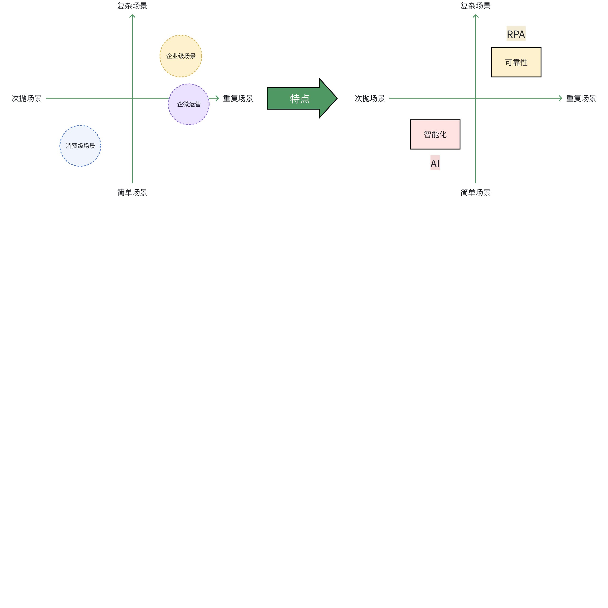
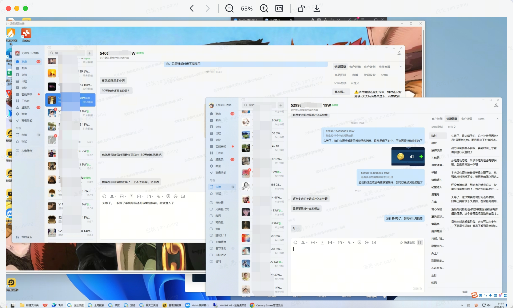

# 企业微信 RPA 方案调研(原文存档)

> 来源:飞书知识库文档 https://centurygames.feishu.cn/wiki/AY4hwiflWiAhKFkIyAHcMnhVnoh
> 标题:《企业微信RPA方案调研》
> 原文最后更新时间:2025-08-09
> 本地归档时间:2026-05-08
>
> 本文件保留飞书原文的正文结构,表格、嵌入资源按 markdown 规范手工还原。
> 原文中嵌入的图片/视频/附件/画板无法直接导出,使用 `[飞书附件]` 标注并保留文件名,
> 需要浏览原始素材请回到飞书链接查看。

---

# 需求背景

## 现状

> 引用:企微官方 API 调研结果 — 飞书文档《企业微信客服调研》

国内游戏会通过企业微信做 VIP 用户运营,主要场景是和 VIP 玩家建联,帮助玩家快速解决游戏内问题,以及主动做一些活动营销。目前运营使用企微官方后台去处理工作,存在活跃玩家账号分布不均匀,导致运营工作分配不合理,解决问题的效率以及玩家的归属感较低。

因此游戏侧期望能自建一个后台,将所有企微账号下的消息聚合管理与回复。经过初步调研,企微只提供消息回调的 API,无法通过 API 去给玩家发送消息。

## 数据参考

- 飞书表格:《【无尽冬日】企微聚合消息业务量评估_202508》

## 解决办法

目前调研到有两家竞品(乐变、七鱼)这部分业务采用 RPA 技术实现,这个方向有两个实现的思路:

1. **完全自研**:开发成本高、不确定性大、业务契合度较低。
2. **部分自研**:和私域运营业务相关的部分自研,企微通信相关的部分通过接入三方 RPA 产品实现。通过成熟的三方产品,减少大部分不确定性。

因此,以下文档以 **"业务自研 + 阿里云 RPA 通信"** 的这种模式详细介绍 VIP 运营的解决方案,目的是针对调研结果形成决策,评审项目是否启动。

---

# RPA 产品介绍

## 概念

RPA 全称是机器人流程自动化(Robotic Process Automation),是一种模拟人工操作界面的软件机器人,可在 Windows 客户端运行,通过鼠标和键盘操作软件,实现自动化流程。

- **Robotic**:形态,软件机器人、软件产品。
- **Process**:目标,解决跨系统、跨平台重复有规律的工作流问题。
- **Automation**:方式,模拟人的操作,从而辅助人去完成工作,提升人的工作效率。

## 系统协作原理

> 原始资源:image token `G3ZNb9geNo6PVYxcZAAcfUxen1c`

## 特性

- **无侵入性**:不修改目标软件,仅模拟点击,相比外挂、注入等技术,暴露特征更少,封号概率更低。
- **风控合规**:企微不提供官方 API 的情况下,利用补充的手段,没有绝对安全的方案,但 RPA + 云桌面是当前较稳妥的选择。
- **三方依赖性**:对第三方系统依赖难以平衡,产品稳定性体验可能会被拉低。

## 能力边界

> 原始资源:飞书画板缩略图,whiteboard token `RBUNwJlQ4hMhkbb5YpacDOEinPg`(如需可编辑版请回到飞书原文)

## 技术成熟度

### 发展过程

| 阶段 | 辅助性 RPA(2018-2019) | 🌟 自主性 RPA(2020-2021) | 智能化 RPA(2022-至今) |
| --- | --- | --- | --- |
| 能力 | 基于固定规则,处理有限的重复性、辅助性工作。 | 按照使用需求,自主进行端到端的自动化 / 半自动化设定应用于长链条、跨系统、跨部门的业务相关场景。 | 具备非结构数据处理、智能化报表分析、文本要素识别、灵活开发 / 应用等高级能力。 |
| 应用场景 | 发展初期,大部分供应商仅完成了 RPA 核心组件的初版的研发。供应商处于摸索阶段,只能提供短链条、简单的应用场景的赋能。 | 随着 RPA 核心组件的成熟,头部 RPA 供应商通过自研或者与技术生态伙伴合作的方式,将 RPA 与各类 AI 技术(如计算机视觉、机器学习等)、低代码、对话机器人等技术进行结合。 | 现阶段,RPA 从自主性向智能化发展,结合 AI、NLP 等技术,已经可以在少量需要智能分析、理解的场景进行落地。 |

### 行业研报

- [飞书附件]《艾瑞咨询-腾挪:2023 年中国 RPA 行业研究报告-230620.pdf》(file token: `N9NkbDFXsoZUi0x1t0scpGljnmf`)

---

# 需求分析

## 需求优先级

### 用户侧

| 选择项 | 选择标准 | 结果 | 详细说明 |
| --- | --- | --- | --- |
| 用户痛苦:低、中、高 | **低**:由于产品设计缺陷导致部分低频操作无法由用户自主完成,或者完成的成本较高。 **中**:由于产品设计缺陷导致 1 个或者 1 个团队以上的工作流程复杂度提升,进而导致难以进行规模化操作,或者规模化操作成本较高,基于服务可以解决。 **高**:由于产品设计缺陷或者过高的学习成本,实质性地阻断 1 个或者 1 个团队以上的工作主流程,且无法基于服务解决。 | 中 | 用户痛苦图示见本节末,image token `V0otbfe8GoQSCyxVMD6ccr95nvh`。 1. 当前内部协作上,因为企微号是 7 天无休的,需要 1+1 搭档轮班,2 个搭档中会各有一个人一周需要有 3~4 天双开 2 个号的情况(远程操控搭档的电脑回复),这时候号上的压力情况是不确定不均的,协作成本也有一定增加。 2. 负责企微维护的这部分同学的实际工作量考核、绩效考核也是只能比较笼统去通过维护人数、质检情况、回复数粗略看,不能很精准。 |
| 需求价值模型 | 业务价值:支持业务开展,对业务目标有一定的贡献度。 技术价值:提升系统的可扩展性、可靠性、安全性等方面。 内部提效:提升团队的工作效率。 体验升级:减少用户学习成本,优化操作流程,提升用户满意度。 合规:基于某些法律要求进行设计的产品机制。 | 业务价值 内部提效 体验升级 | 1. 运营工作效率提升(如时间分配、绩效核算等)。 2. 玩家满意度提升(减少等待时间)、品牌口碑优化(增强归属感),间接影响留存率,增加长期收入。 |

**用户痛苦图示**

### 内部侧

| 选择项 | 选择标准 | 结果 | 详细说明 |
| --- | --- | --- | --- |
| 交付难度:大、中、小 | **大**:涉及到线下的流程,比如培训或者重新埋点 **中**:用户会产生问题,需要在初次使用的时候给出详细解释,但是不需要产生文档以外的材料 **小**:不需要交付,是基于过往模块的升级,用户基本不会产生问题 | 中 | - |
| 开发成本:大、中、小 | **大**:前后端超过 30 PD **中**:前后端超过 10 PD,小于等于 30 PD **小**:前后端小于等于 10 PD | 大 | 需要细化 |
| 是否存在潜在技术瓶颈:是、否 | **是,企微 API 变化可能导致方案不可行(例如不再提供企微消息回调,聊天记录清洗导致流程更加复杂和不可控)** | — | 原文用红字高亮 |

### 最终结论

| 选择项 | 选择标准 | 结果 | 详细说明 |
| --- | --- | --- | --- |
| 优先级 | P0:重要且紧急且有明确的上线时间 P1:重要且紧急 P2:重要但不紧急 P3:不重要 | P2 | 需与其他项目(例如客服 CS)协调资源分配 |
| 是否要长期迭代:是、否 | 是 | — | — |
| 建议 | 该项目的核心价值在于通过技术手段解决企微 API 限制下的运营效率问题,但需严格把控企微风控规则与 RPA 合规性。如果具备启动条件,建议 MVP 版本优先验证技术可行性与小范围效果(例如用 2 个企微号 + 公有云部署 + 后台 Demo 跑 2-3 周),再通过数据驱动迭代方案,最终实现 VIP 玩家服务体验的全面提升。 | — | — |

## 成本与风险评估

### 接入方式

对于目前的需求,三种方式都可以给玩家发送消息,消息包括文本、图片、视频、文件等。Demo 使用消息单发时采用昵称搜索的方式,改为 userid 搜索后准确性和速度还会有一定提升(**【补充调研中】**)。

| 方式 | 说明 | Demo |
| --- | --- | --- |
| 可视化组件编辑 | 文档:[可视化组件使用说明_机器人流程自动化(RPA)-阿里云帮助中心](https://help.aliyun.com/zh/rpa/user-guide/instruction-to-visualization-commands/) 描述:可视化组件主要用于完成诸如鼠标点击、键盘输入等简单操作,虽然功能较为固定、执行效率有限,但其上手门槛低,适合快速搭建基础的 RPA 流程。 【PM 需了解,便于需求流程挖掘】 | 消息发送:[飞书视频] `20250722-201435.mp4`(file token: `BOlXb1616oO5dSxgFTmc2Z9GnKb`) |
| 代码开发 | 文档:[SDK 使用说明_机器人流程自动化(RPA)-阿里云帮助中心](https://help.aliyun.com/zh/rpa/user-guide/sdk-instructions/) 描述:相较于可视化组件,通过代码编写的 RPA 机器人具备更强的灵活性,**能够执行复杂操作,并在运行效率上表现更优,适用于对性能和流程控制要求较高的场景。🌟🌟🌟** | 消息发送:[飞书视频] `20250725-223556.mp4`(file token: `J5GFbRKtMovfAgxHaxYcUnBHnpb`) 消息群发:[飞书视频] `飞书20250731-191724.mp4`(file token: `K2fXbj8h7o5nmRxF8mTcMz3anbc`) |
| 接入三方 | 百胜软件为阿里云稳定合作的三方,支持使用三方后台发送或调用 API 发送,软件能力如下: 1. 一机多开:支持一个用户同时管理多个企业微信账号,可在不同账号间切换。 &nbsp;&nbsp;&nbsp;- 每个企业微信账号背后对应一台无影云电脑。 &nbsp;&nbsp;&nbsp;- 每台无影上预装了企业微信和机器人镜像,左侧界面可查看账号状态(如在线、离线、未读消息等)。 2. 消息触达:极速群发、个性推送、群发助手。 3. 群管理:批量建群、改群名、获取群码、发送群码、发送群公告、设置群管、群主转让、解散群、群成员管理。 4. 引流获客:加好友相关,需要登录测试环境详细看一下。 5. 任务管理:支持任务查询、补发、日志查看等功能。 | 录屏:https://shanji.dingtalk.com/app/transcribes/76327569643134363635333636335f313738323336313434305f30 数据参考:发送速度约在 1.6s/条。 |

### 明细表

| 类 | 说明 |
| --- | --- |
| 工具成本 | 部署方式支持:公有云 / 私有化,私有化支持部署在阿里云账号或本地机房。 **阿里云企微成功案例因涉及客户隐私,对方仅能通过线上交流的方式提供。** [飞书块引用 `B2EGdro0vo1Q4IxrIhxc3AU5nNd`] [飞书附件]《阿里云 RPA 报价-国内版.xlsx》(file token: `NF4cbZLS5otzFuxfXdGcfEYnnci`) |
| 开发成本 | 人力成本。 |
| 维护成本 | 系统维护、服务器费用。 |
| 风险成本 | 1. 系统稳定性(如消息聚合后是否出现延迟或遗漏,业务产生的数据与测试数据有差异、三方系统故障等)。 2. 企微封号导致的运营中断。 &nbsp;&nbsp;&nbsp;- 七鱼:曾经被封过,对方给的结论是技术方案升级后比较稳定,具体原因不详。 &nbsp;&nbsp;&nbsp;- 乐变:曾经被封过,猜测是营销属性较强导致,和大 R 维护场景区别较大。 3. 敏感信息泄露问题。 4. RPA 封装后黑盒化风险。 |

## 合规与风控建议

- **IP 一致性**:建议云桌面与移动端企业微信登录地一致(如福州)。
- **账号管理**:
  - 长期固定登录一个云桌面。
  - 避免频繁切换设备或账号。
- **行为控制**:
  - 控制发送频率,如每小时几千条上限(目前 GOF 单小时,单个企微号,近一个月平均发送消息数大概是 50 条)。
  - 设置操作间隔,避免高频操作(目前需求不涉及)。
- **敏感信息隐藏**:企微里隐藏玩家敏感信息,例如玩家账号、联系方式、充值金额等,降低泄露给三方的风险。
- **异常捕获**:通过数据监控、报警、以及可视化日志/操作视频回放等,出现问题时保证人工能及时干预。
  - 企微掉线 / 封禁。
  - 消息发送失败(例如企业微信发生卡顿、掉线等原因会导致操作失败)。
  - 消息发送速度过慢。
- **制定应急预案**:
  - UI 改版或 API 变动:
    - 运营使用企微后台回复消息。
    - 开发人员确保 RPA 运行环境与企微版本兼容,定期更新脚本。
  - 预留 1-2 台云服务器资源:三方系统故障时能及时切换设备。
